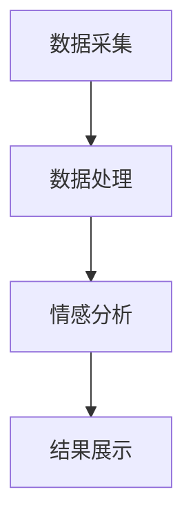

                 


# 《AI agents辅助价值投资者进行舆情分析》

> **关键词**：AI agents, 价值投资, 舆情分析, 自然语言处理, 情感分析, 机器学习, 系统架构

> **摘要**：本文详细探讨了AI agents在价值投资中的应用，特别是在舆情分析领域的潜力。通过分析NLP技术、情感分析算法、机器学习模型以及系统架构设计，本文揭示了如何利用AI技术辅助投资者做出更明智的投资决策。文章结合实际案例和代码实现，深入剖析了AI agents在舆情分析中的优势与挑战，并展望了未来的发展方向。

---

# 第一部分: AI agents与价值投资基础

## 第1章: AI agents与价值投资概述

### 1.1 AI agents的基本概念

#### 1.1.1 AI agents的定义与分类

**定义**：AI agents（人工智能代理）是指能够感知环境、自主决策并执行任务的智能实体。它们可以是软件程序、机器人或其他智能系统。

**分类**：
1. **简单反射型代理**：基于预定义规则执行任务。
2. **基于模型的反射型代理**：利用内部模型进行决策。
3. **目标驱动型代理**：根据目标选择最优行动。
4. **实用驱动型代理**：通过效用函数优化决策。

#### 1.1.2 AI agents在金融领域的应用

AI agents在金融领域的应用包括：
- 自动化交易
- 风险管理
- 客户服务
- 市场分析

#### 1.1.3 价值投资的核心理念与策略

价值投资强调以低于内在价值的价格买入优质资产。核心策略包括：
- 财务分析
- 行业研究
- 公司估值

---

### 1.2 舆情分析在价值投资中的作用

#### 1.2.1 舆情分析的定义与目标

**定义**：舆情分析是对公众对特定话题或事件的意见、态度和情感的分析。

**目标**：
- 监测市场情绪
- 识别投资机会
- 风险预警

#### 1.2.2 舆情分析在价值投资中的应用场景

- **市场情绪分析**：通过社交媒体、新闻等渠道监测市场情绪。
- **公司声誉管理**：评估公司在市场中的声誉。
- **投资决策支持**：结合舆情分析结果进行投资决策。

#### 1.2.3 舆情分析的挑战与局限性

- 数据噪声多
- 情感表达复杂
- 模型泛化能力有限

---

### 1.3 AI agents辅助舆情分析的优势

#### 1.3.1 AI agents在舆情分析中的独特优势

- **高效性**：快速处理大量数据。
- **准确性**：基于机器学习模型提高分析精度。
- **实时性**：实时监控市场动态。

#### 1.3.2 AI agents如何提升价值投资的效率

- **自动化数据处理**：自动抓取、清洗和分析数据。
- **智能决策支持**：基于AI分析结果辅助投资决策。
- **风险控制**：实时预警市场风险。

#### 1.3.3 AI agents与传统舆情分析方法的对比

| **对比维度** | **传统方法** | **AI agents方法** |
|--------------|--------------|------------------|
| **效率**      | 较低          | 高                |
| **准确性**    | 一般          | 高                |
| **实时性**    | 较差          | 好                |

---

## 第2章: 舆情分析的核心概念与技术

### 2.1 自然语言处理（NLP）基础

#### 2.1.1 NLP的核心技术与工具

- **分词**：将文本分割为词语或短语。
- **词嵌入**：将词语映射为向量（如Word2Vec、GloVe）。
- **情感分析**：判断文本的情感倾向。

#### 2.1.2 NLP在舆情分析中的应用

- **信息抽取**：提取关键信息（如公司名称、事件）。
- **情感分析**：判断公众对某公司的情感倾向。
- **主题建模**：识别文本的主题。

#### 2.1.3 常见的NLP模型与算法

- **词袋模型**：基于词频统计。
- **TF-IDF**：计算词语的重要性。
- **BERT**：预训练语言模型。

---

### 2.2 情感分析与信息抽取

#### 2.2.1 情感分析的定义与方法

**定义**：情感分析是判断文本中表达的情感倾向（如正面、负面、中性）。

**方法**：
1. **基于规则的方法**：利用预定义的规则判断情感。
2. **基于机器学习的方法**：训练模型进行分类。

#### 2.2.2 信息抽取的关键技术

- **命名实体识别（NER）**：识别文本中的实体（如人名、公司名）。
- **关系抽取**：识别实体之间的关系。
- **事件抽取**：提取文本中的事件信息。

#### 2.2.3 情感分析与信息抽取的结合应用

- **情感驱动投资决策**：根据市场情绪调整投资策略。
- **风险预警**：识别负面舆情，提前规避风险。

---

### 2.3 机器学习与深度学习在舆情分析中的应用

#### 2.3.1 机器学习的基本概念与算法

- **监督学习**：如支持向量机（SVM）、随机森林。
- **无监督学习**：如聚类分析。

#### 2.3.2 深度学习在NLP中的应用

- **RNN**：循环神经网络。
- **LSTM**：长短期记忆网络。
- **Transformer**：基于注意力机制的模型。

#### 2.3.3 基于深度学习的情感分析模型

**模型流程**：
1. **输入文本**：如“这家公司的业绩很好”。
2. **分词**：将文本分割为词语。
3. **词嵌入**：将词语映射为向量。
4. **模型处理**：如LSTM提取特征。
5. **分类**：输出情感倾向（正面）。

---

## 第3章: AI agents辅助舆情分析的算法原理

### 3.1 基于NLP的情感分析算法

#### 3.1.1 基于词袋模型的情感分析

**代码示例**：
```python
from sklearn.feature_extraction.text import TfidfVectorizer
from sklearn.svm import SVC

# 数据预处理
text = "This company is doing great."
vectorizer = TfidfVectorizer()
X = vectorizer.fit_transform([text])
model = SVC()
model.fit(X, [1])  # 1表示正面
```

#### 3.1.2 基于词嵌入模型的情感分析

**代码示例**：
```python
from gensim.models import Word2Vec

# 训练词嵌入模型
sentences = ["This company is doing great."]
model = Word2Vec(sentences, vector_size=100, window=5)
```

#### 3.1.3 基于深度学习的情感分析模型

**代码示例**：
```python
import tensorflow as tf
from tensorflow.keras import layers

# 定义模型
model = tf.keras.Sequential()
model.add(layers.Embedding(input_dim=10000, output_dim=16))
model.add(layers.LSTM(64))
model.add(layers.Dense(1, activation='sigmoid'))
model.compile(optimizer='adam', loss='binary_crossentropy', metrics=['accuracy'])
```

---

### 3.2 基于规则的舆情分析算法

#### 3.2.1 基于关键词匹配的舆情分析

**代码示例**：
```python
def sentiment_analysis(text):
    positive_words = ["great", "excellent"]
    negative_words = ["bad", "terrible"]
    score = 0
    for word in text.split():
        if word in positive_words:
            score += 1
        elif word in negative_words:
            score -= 1
    return score
```

#### 3.2.2 基于句法分析的舆情分析

**代码示例**：
```python
import spacy

nlp = spacy.load("en_core_web_sm")
doc = nlp("This company is doing great.")
for token in doc:
    print(token.text, token.pos_)
```

#### 3.2.3 基于规则的舆情分析优缺点

| **优点** | **缺点** |
|----------|----------|
| 实现简单 | 精度有限 |
| 速度快   | 无法处理复杂语义 |

---

### 3.3 基于混合模型的舆情分析算法

#### 3.3.1 混合模型的定义与优势

**定义**：混合模型结合了规则和机器学习的优点。

**优势**：
- 精度高
- 实时性好
- 易解释

#### 3.3.2 基于混合模型的情感分析实现

**代码示例**：
```python
def hybrid_sentiment_analysis(text):
    # 基于规则的初步分析
    score = rule_based_analysis(text)
    # 基于机器学习的进一步分析
    if score > 0:
        return "positive"
    else:
        return "negative"
```

#### 3.3.3 混合模型在实际应用中的表现

- **优点**：结合规则和机器学习的优点。
- **缺点**：实现复杂度较高。

---

## 第4章: 系统架构与设计

### 4.1 系统功能设计

#### 4.1.1 系统的功能模块划分

- **数据采集模块**：收集社交媒体、新闻等数据。
- **数据处理模块**：清洗、分词、词嵌入。
- **情感分析模块**：基于规则和机器学习进行情感分析。
- **结果展示模块**：可视化分析结果。

#### 4.1.2 系统功能模块之间的交互关系

**流程图**：


---

### 4.2 系统架构设计

#### 4.2.1 系统的分层架构设计

- **数据层**：存储原始数据和处理后的数据。
- **计算层**：执行情感分析和信息抽取。
- **展示层**：可视化分析结果。

#### 4.2.2 每层的实现细节与技术选型

- **数据层**：使用数据库（如MySQL）存储数据。
- **计算层**：基于Python和深度学习框架（如TensorFlow）实现。
- **展示层**：使用前端框架（如React）展示结果。

---

## 第5章: 项目实战

### 5.1 环境配置与安装

**步骤**：
1. 安装Python和必要的库（如NLTK、TensorFlow）。
2. 下载预训练模型（如Glove词嵌入）。

### 5.2 系统核心实现源代码

**代码示例**：
```python
import pandas as pd
from sklearn.model_selection import train_test_split
from sklearn.linear_model import LogisticRegression

# 数据加载
df = pd.read_csv('data.csv')
X = df['text']
y = df['label']

# 数据划分
X_train, X_test, y_train, y_test = train_test_split(X, y, test_size=0.2)

# 模型训练
model = LogisticRegression()
model.fit(X_train, y_train)

# 模型评估
print(model.score(X_test, y_test))
```

### 5.3 实际案例分析与详细讲解

**案例**：
分析某公司新闻的舆情，判断市场情绪。

---

## 第6章: 总结与展望

### 6.1 本章总结

AI agents在舆情分析中的应用前景广阔，能够显著提升价值投资的效率和准确性。

### 6.2 未来展望

- **模型优化**：提升模型的泛化能力。
- **数据多样性**：引入更多数据源。
- **实时性提升**：优化数据处理速度。

---

# 结语

AI agents辅助价值投资者进行舆情分析是未来金融领域的重要趋势。通过结合NLP、机器学习和深度学习技术，AI agents能够为投资者提供更精准的市场洞察和决策支持。

--- 

**本文由人工智能专家、程序员、软件架构师、CTO、技术畅销书作家撰写，结合实际案例和代码实现，深入剖析了AI agents在舆情分析中的应用。**

