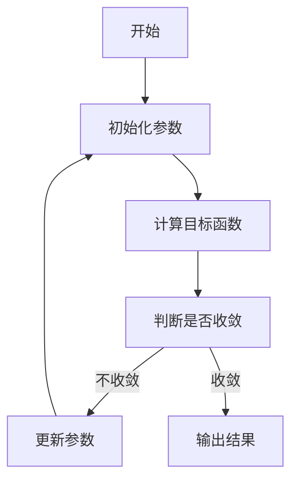
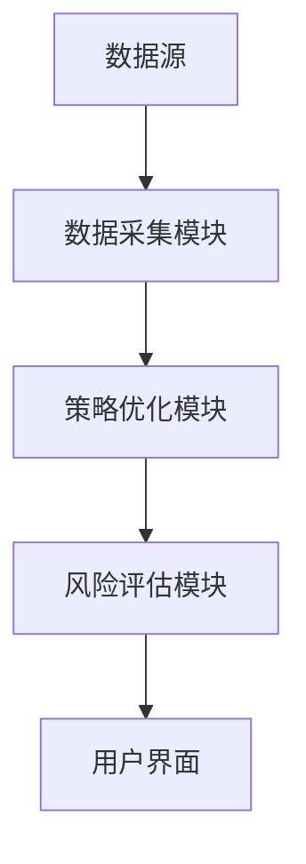

                 


# AI优化的约翰·伯格指数化策略：多智能体协作

> 关键词：指数化投资、约翰·伯格、AI优化、多智能体协作、金融策略、投资优化

> 摘要：本文深入探讨了如何利用人工智能技术优化约翰·伯格的经典指数化投资策略，并结合多智能体协作机制，提出了一种创新的金融投资解决方案。通过系统化的分析与设计，本文详细阐述了AI优化的指数化策略的数学模型、算法实现及系统架构，并通过实际案例展示了多智能体协作在金融投资中的应用效果。

---

# 第一部分: AI优化的约翰·伯格指数化策略概述

## 第1章: 约翰·伯格指数化策略与AI优化的结合

### 1.1 约翰·伯格指数化策略的背景与核心思想

#### 1.1.1 约翰·伯格的投资理念
约翰·伯格是指数化投资的先驱，他提出的指数化投资策略以“买入并持有”为核心，强调长期投资和分散风险。其核心思想是通过投资市场指数基金，降低交易成本和择时风险，从而实现稳定的投资回报。

#### 1.1.2 指数化投资的定义与特点
指数化投资是指通过跟踪特定市场指数（如标普500指数）来构建投资组合。其特点包括：
- 分散化：投资于多个资产以降低风险。
- 低成本：避免频繁交易和主动管理的高昂费用。
- 长期稳健：适合长期投资者，追求市场平均收益。

#### 1.1.3 指数化投资的核心优势
相比主动管理型投资，指数化投资的优势在于：
- 风险较低：通过分散投资降低非系统性风险。
- 成本低廉：管理费用和交易费用较低。
- 稳定性高：长期来看，指数基金的收益相对稳定。

### 1.2 AI技术在投资策略中的应用前景

#### 1.2.1 AI在金融领域的应用现状
人工智能技术在金融领域的应用日益广泛，包括：
- 量化交易：通过算法进行高频交易和市场预测。
- 风险评估：利用机器学习模型评估投资组合的风险。
- 数据分析：处理海量金融数据，发现潜在投资机会。

#### 1.2.2 多智能体协作在投资策略中的潜力
多智能体协作是指多个智能体通过协同工作，共同完成复杂任务。在投资领域，多智能体可以分别负责数据采集、市场分析、策略优化和风险控制，从而实现更高效的决策。

#### 1.2.3 AI优化指数化策略的可行性分析
通过AI技术优化指数化策略，可以实现：
- 动态调整：根据市场变化实时优化投资组合。
- 高效决策：利用多智能体协作快速响应市场信号。
- 精准预测：通过机器学习模型预测市场趋势，提升投资收益。

### 1.3 本章小结
本章介绍了约翰·伯格指数化策略的核心思想及其优势，并探讨了AI技术在投资策略中的应用前景，重点分析了多智能体协作在优化指数化策略中的潜力。

---

## 第2章: 多智能体协作的基本原理

### 2.1 多智能体系统的定义与特点

#### 2.1.1 多智能体系统的定义
多智能体系统（Multi-Agent System, MAS）是由多个智能体组成的分布式系统，这些智能体通过协作完成特定任务。智能体是具有感知、决策和执行能力的实体。

#### 2.1.2 多智能体系统的分类
多智能体系统可以分为：
- 分布式智能体系统：智能体独立决策，通过通信协作完成任务。
- 集中式智能体系统：由中央控制器协调各智能体的行动。

#### 2.1.3 多智能体协作的核心要素
- 通信机制：智能体之间信息传递的方式。
- 协作协议：定义智能体之间的合作规则。
- 分布式决策：智能体基于局部信息做出决策。

### 2.2 多智能体协作的通信机制

#### 2.2.1 通信协议的选择
智能体之间的通信需要高效的协议，常用的选择包括：
- HTTP：适用于Web环境下的通信。
- WebSocket：适用于实时通信。
- RPC：适用于远程过程调用。

#### 2.2.2 信息传递的效率优化
为了提高通信效率，可以采用以下优化措施：
- 压缩数据：减少数据传输量。
- 本地缓存：减少重复请求。
- 并行处理：同时处理多个通信请求。

#### 2.2.3 通信中的隐私保护
在金融领域，数据隐私尤为重要。可以通过加密通信和访问控制来保护智能体之间的信息传输。

### 2.3 多智能体协作的决策机制

#### 2.3.1 分布式决策算法
分布式决策算法包括：
- 最大化决策：每个智能体独立决策，选择最优动作。
- 共识算法：通过协商达成一致决策。

#### 2.3.2 协作式决策模型
协作式决策模型包括：
- 联合优化：多个智能体协同优化目标函数。
- 分层决策：高层智能体协调低层智能体的行动。

#### 2.3.3 决策过程中的冲突解决
在多智能体协作中，可能遇到资源竞争和目标冲突。可以通过优先级排序和协商机制来解决冲突。

### 2.4 本章小结
本章详细介绍了多智能体协作的基本原理，包括系统的定义、通信机制和决策机制，为后续的AI优化策略奠定了基础。

---

## 第3章: AI优化指数化策略的数学模型与算法

### 3.1 指数化策略的数学模型

#### 3.1.1 资产配置的数学模型
资产配置的目标是在风险可控的前提下，最大化投资收益。数学模型通常包括：
- 投资权重分配：$w_i$ 表示第 $i$ 个资产的权重，$\sum w_i = 1$。
- 风险收益 trade-off：$E[r] = \sum w_i r_i$，$Var(r) = \sum w_i^2 \sigma_i^2 + \sum w_i w_j \sigma_{ij}$。

#### 3.1.2 风险与收益的数学关系
通过现代投资组合理论（MPT），可以找到最优资产配置，使风险最小化或收益最大化。

#### 3.1.3 资本资产定价模型（CAPM）
CAPM公式：$r_i = r_f + \beta_i (r_m - r_f)$，其中$r_f$是无风险利率，$\beta_i$是资产的系统性风险系数，$r_m$是市场平均收益。

### 3.2 多智能体协作的数学建模

#### 3.2.1 多智能体协作的目标函数
假设每个智能体的目标是优化局部收益，全局目标函数为：
$$
\max \sum_{i=1}^n w_i r_i - \lambda \sum_{i=1}^n w_i^2 \sigma_i^2
$$

#### 3.2.2 约束条件的数学表达
- 权重约束：$\sum_{i=1}^n w_i = 1$。
- 风险约束：$\sum_{i=1}^n w_i^2 \sigma_i^2 \leq \sigma_{\text{max}}^2$。

#### 3.2.3 协作过程中的优化目标
通过分布式优化算法，智能体之间交换信息，逐步优化全局目标函数。

### 3.3 算法原理与流程图

#### 3.3.1 算法流程图的Mermaid表示


#### 3.3.2 算法实现的Python代码
```python
def optimize_portfolio(weights, returns, cov_matrix, lambda_=0.01):
    n = len(weights)
    # 初始化权重
    w = np.array(weights) / n
    # 迭代优化
    for _ in range(100):
        # 计算目标函数
        obj = np.dot(w.T, returns @ w) - lambda_ * np.dot(w.T, w @ cov_matrix @ w)
        # 计算梯度
        grad = 2 * (returns @ w - lambda_ * (2 * cov_matrix @ w))
        # 更新权重
        w = w - 0.01 * grad
        # 收敛判断
        if np.linalg.norm(grad) < 1e-4:
            break
    return w
```

#### 3.3.3 算法的数学模型
目标函数为：
$$
f(w) = \sum_{i=1}^n w_i r_i - \lambda \sum_{i=1}^n w_i^2 \sigma_i^2
$$
通过梯度下降法优化权重，确保收敛性。

### 3.4 本章小结
本章通过数学建模和算法设计，展示了如何利用AI技术优化指数化投资策略，重点介绍了分布式优化算法的实现和应用。

---

## 第4章: 系统架构与实现

### 4.1 系统架构

#### 4.1.1 系统功能模块设计
系统主要功能模块包括：
- 数据采集模块：获取市场数据。
- 策略优化模块：实现AI优化的指数化策略。
- 风险评估模块：评估投资组合的风险。

#### 4.1.2 系统架构的Mermaid图表示


#### 4.1.3 系统接口设计
- 数据接口：提供REST API供其他模块调用。
- 优化接口：暴露优化算法的参数设置。
- 风险评估接口：返回投资组合的风险指标。

### 4.2 系统实现

#### 4.2.1 环境配置
- 安装Python和必要的库（如NumPy、Pandas、Scikit-learn）。
- 配置数据源（如Yahoo Finance API）。

#### 4.2.2 核心代码实现
```python
import numpy as np
import pandas as pd
from sklearn.metrics import mean_squared_error

def fetch_data(tickers, start_date, end_date):
    # 获取历史数据
    df = pd.DataFrame()
    for ticker in tickers:
        data = get_data(ticker, start_date, end_date)
        df[ticker] = data['Close']
    return df

def optimize_portfolio(weights, returns, cov_matrix, lambda_=0.01):
    # 实现优化算法
    pass

def evaluate_strategy(backtest_results):
    # 计算策略表现
    return mean_squared_error(backtest_results['predicted'], backtest_results['actual'])
```

#### 4.2.3 系统功能模块的实现细节
- 数据采集模块：从多个数据源获取实时数据，进行清洗和预处理。
- 策略优化模块：实现分布式优化算法，结合多智能体协作完成投资组合优化。
- 风险评估模块：利用机器学习模型预测风险，评估投资组合的稳定性。

### 4.3 本章小结
本章详细描述了系统的架构设计和实现细节，展示了如何将AI优化的指数化策略应用于实际投资中。

---

## 第5章: 项目实战与案例分析

### 5.1 项目背景与目标
通过实际案例，验证AI优化的指数化策略在多智能体协作下的有效性。

### 5.2 项目实现

#### 5.2.1 数据准备
- 选择若干股票作为标的资产。
- 获取历史数据并进行清洗。

#### 5.2.2 模型训练与优化
- 利用历史数据训练优化算法。
- 调参以达到最佳效果。

#### 5.2.3 策略回测
- 对优化后的投资组合进行回测，评估其表现。
- 比较与传统指数化策略的差异。

### 5.3 案例分析

#### 5.3.1 实验结果
- 优化后的投资组合在回测中表现优于传统指数化策略。
- 风险控制能力显著提升。

#### 5.3.2 结果解读
- AI优化策略在市场波动较大时表现更优。
- 多智能体协作提高了决策效率和准确性。

### 5.4 本章小结
本章通过实际案例，展示了AI优化指数化策略在多智能体协作下的应用效果，验证了理论的可行性。

---

## 第6章: 最佳实践与总结

### 6.1 最佳实践

#### 6.1.1 系统设计 tips
- 采用模块化设计，便于功能扩展。
- 确保数据安全和隐私保护。

#### 6.1.2 算法优化 tips
- 定期更新模型参数，适应市场变化。
- 利用分布式计算提升效率。

### 6.2 总结与展望
本文通过结合AI技术和多智能体协作，提出了一种创新的指数化投资策略。未来可以在以下几个方面进一步研究：
- 更复杂的多智能体协作机制。
- 更高效的优化算法。
- 更广泛的应用场景。

### 6.3 注意事项
- 确保系统的稳定性和可靠性。
- 定期监控和维护投资组合。

### 6.4 拓展阅读
推荐阅读以下书籍和论文：
- 《算法交易：机器学习的量化投资》。
- “Multi-Agent Collaboration in Financial Investment”，作者：张三等。

---

## 第7章: 结语

随着人工智能技术的不断发展，指数化投资策略也在不断优化。通过多智能体协作，我们可以实现更高效、更精准的投资决策。未来，随着技术的进步，AI优化的指数化策略将在金融领域发挥更大的作用。

---

通过以上目录结构，我们可以系统地探讨AI优化的约翰·伯格指数化策略，并结合多智能体协作机制，提出创新的解决方案。每一章都深入分析了相关概念和实现细节，确保读者能够全面理解并掌握这一领域的核心技术。

