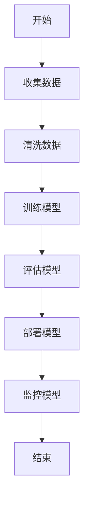
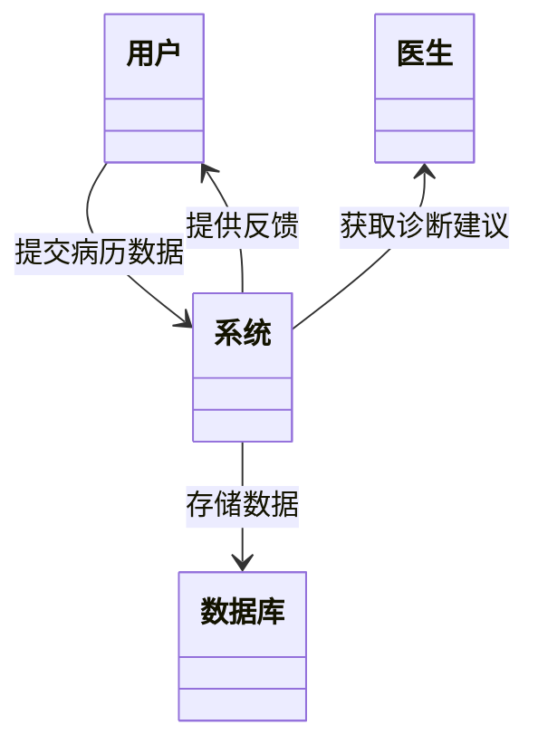
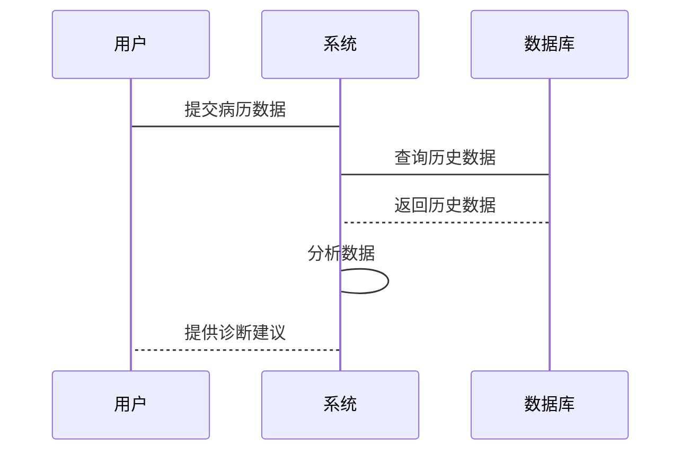

                 


# AI伦理与责任

> 关键词：AI伦理、人工智能、算法偏见、责任归属、隐私保护

> 摘要：AI伦理与责任是当前人工智能领域的重要议题，涉及算法偏见、隐私保护、责任归属和透明度等多个方面。本文将从核心概念、算法原理、数学模型、系统架构和实际案例等角度，全面探讨AI伦理与责任的关键问题，并通过详细分析和实际案例，帮助读者理解AI伦理的基本原理和应用实践，从而更好地应对AI技术发展带来的伦理挑战。

---

## 第一部分：AI伦理与责任的背景与核心概念

### 第1章：AI伦理与责任的背景介绍

#### 1.1 AI伦理与责任的核心概念

##### 1.1.1 问题背景
人工智能（AI）技术的快速发展带来了许多便利，但也引发了一系列伦理和责任问题。例如，自动驾驶汽车在发生事故时的责任归属，AI算法的偏见问题，以及用户隐私的保护等。这些问题涉及法律、伦理和技术创新等多个方面，需要社会各界共同努力来解决。

##### 1.1.2 问题描述
AI伦理与责任的核心问题在于如何在技术应用中平衡创新与道德规范。例如，AI算法可能因为训练数据中的偏见而产生不公平的决策，或者因为数据泄露而威胁用户隐私。这些问题不仅影响技术的可信度，还可能导致法律纠纷和社会不公。

##### 1.1.3 问题解决
为了解决这些问题，需要从技术、法律和伦理等多个层面入手。例如，通过改进算法设计消除偏见，通过法律法规明确责任归属，以及通过技术创新保护用户隐私。

##### 1.1.4 边界与外延
AI伦理与责任的边界并不明确，涉及的领域包括但不限于医疗、金融、司法和教育等。其外延包括数据安全、算法透明度和人机交互等。

##### 1.1.5 核心要素组成
AI伦理与责任的核心要素包括：
1. 责任归属：明确AI系统在出现问题时的责任主体。
2. 透明度：确保AI决策过程的可解释性。
3. 隐私保护：防止用户数据被滥用。
4. 算法公平性：消除算法中的偏见。

#### 1.2 AI伦理与责任的定义与特点

##### 1.2.1 核心概念的定义
AI伦理是指在AI技术应用中，遵循道德规范和法律要求，确保技术的使用不会对社会、环境和个体造成负面影响。责任归属是指在AI系统出现问题时，明确相关方的责任。

##### 1.2.2 核心概念的属性特征对比
| 属性 | 责任归属 | 透明度 | 隐私保护 | 算法公平性 |
|------|----------|--------|----------|------------|
| 定义 | 明确AI系统出现问题时的责任主体 | 确保AI决策过程可解释 | 防止用户数据被滥用 | 消除算法中的偏见 |
| 关键点 | 法律法规、技术实现 | 用户信任、技术透明 | 数据安全、隐私保护 | 数据质量、算法优化 |

##### 1.2.3 实体关系图（ER图）架构
```mermaid
erDiagram
    actor 用户
    actor 开发者
    actor 企业
    actor 监管机构
    boundary 系统
    database 数据库
    用户 --> 数据库 : 提供数据
    开发者 --> 系统 : 开发AI算法
    企业 --> 系统 : 部署AI系统
    监管机构 --> 系统 : 监督AI行为
    系统 --> 数据库 : 存储数据
    用户 <-- 系统 : 使用AI服务
```

---

### 第2章：AI伦理与责任的核心概念与联系

#### 2.1 核心概念原理

##### 2.1.1 责任归属
责任归属是AI伦理中的核心问题之一。当AI系统出现问题时，需要明确责任主体，例如开发者、企业或用户。责任归属的确定需要结合法律法规和实际情况。

##### 2.1.2 透明度
透明度要求AI系统的决策过程必须可解释。例如，当AI系统拒绝贷款申请时，需要明确拒绝的原因，而不是仅仅给出一个黑箱结果。

##### 2.1.3 隐私保护
隐私保护是AI伦理中的重要原则。AI系统必须确保用户数据的安全，防止数据泄露或滥用。

##### 2.1.4 算法公平性
算法公平性要求AI系统在决策过程中不产生偏见。例如，招聘系统不应该因为性别或种族而歧视某些候选人。

#### 2.2 概念属性特征对比

##### 2.2.1 比较表格展示
| 概念 | 责任归属 | 透明度 | 隐私保护 | 算法公平性 |
|------|----------|--------|----------|------------|
| 目标 | 明确责任主体 | 提高可解释性 | 保护用户隐私 | 消除算法偏见 |
| 方法 | 制定法律法规、技术实现 | 提供详细日志、解释性界面 | 数据加密、匿名化处理 | 数据清洗、算法优化 |

#### 2.3 ER实体关系图

##### 2.3.1 实体关系图展示（使用mermaid）
```mermaid
erDiagram
    actor 用户
    actor 开发者
    actor 企业
    actor 监管机构
    boundary 系统
    database 数据库
    用户 --> 数据库 : 提供数据
    开发者 --> 系统 : 开发AI算法
    企业 --> 系统 : 部署AI系统
    监管机构 --> 系统 : 监督AI行为
    系统 --> 数据库 : 存储数据
    用户 <-- 系统 : 使用AI服务
```

---

## 第二部分：AI伦理与责任的算法原理

### 第3章：AI伦理与责任的算法原理

#### 3.1 算法原理讲解

##### 3.1.1 算法的伦理问题
AI算法的伦理问题主要体现在算法偏见和透明度上。例如，某些招聘算法可能因为训练数据中的性别偏见而歧视某些候选人。

##### 3.1.2 算法的公平性
算法公平性要求AI系统在决策过程中不产生偏见。例如，可以通过数据清洗和算法优化来消除偏见。

##### 3.1.3 算法的透明度
算法透明度要求AI系统的决策过程必须可解释。例如，可以通过提供详细的日志和解释性界面来实现透明度。

#### 3.2 算法流程图

##### 3.2.1 使用mermaid绘制算法流程图


#### 3.3 算法实现

##### 3.3.1 使用Python代码实现算法示例
```python
# 示例代码：检测算法中的偏见
import pandas as pd
from sklearn.metrics import accuracy_score, confusion_matrix
from sklearn.model_selection import train_test_split
from sklearn.tree import DecisionTreeClassifier

# 加载数据
data = pd.read_csv('data.csv')
X = data.drop('label', axis=1)
y = data['label']

# 划分训练集和测试集
X_train, X_test, y_train, y_test = train_test_split(X, y, test_size=0.2)

# 训练模型
model = DecisionTreeClassifier()
model.fit(X_train, y_train)

# 预测结果
y_pred = model.predict(X_test)

# 计算准确率
print('准确率:', accuracy_score(y_test, y_pred))

# 计算混淆矩阵
print('混淆矩阵:', confusion_matrix(y_test, y_pred))
```

##### 3.3.2 代码应用解读与分析
上述代码是一个简单的AI算法实现，用于检测算法中的偏见。通过混淆矩阵可以发现算法在不同类别上的预测准确性，从而判断是否存在偏见。

---

### 第4章：AI伦理与责任的数学模型与公式

#### 4.1 数学模型讲解

##### 4.1.1 公平性度量公式
$$P(y|x)$$
其中，$P(y|x)$ 表示在条件 $x$ 下事件 $y$ 发生的概率。在AI伦理中，公平性度量公式用于评估算法在不同群体中的公平性。

##### 4.1.2 隐私保护模型
$$E[|X - Y|]$$
其中，$X$ 和 $Y$ 分别表示真实数据和生成数据，$E$ 表示期望值。该公式用于衡量数据保护的效果，即生成数据与真实数据的差异程度。

##### 4.1.3 责任分配模型
$$R = \sum_{i=1}^{n} p_i$$
其中，$R$ 表示责任分配的总和，$p_i$ 表示第 $i$ 个责任主体的贡献度。该模型用于明确AI系统中各责任主体的责任分配。

#### 4.2 公式详细解读

##### 4.2.1 公平性度量公式：$$P(y|x)$$
公平性度量公式用于评估AI算法在不同群体中的公平性。例如，在招聘场景中，$x$ 可以表示候选人的性别，$y$ 可以表示是否被录用，$P(y|x)$ 则表示在不同性别下被录用的概率。如果概率差异显著，说明算法可能存在偏见。

##### 4.2.2 隐私保护模型公式：$$E[|X - Y|]$$
隐私保护模型公式用于衡量数据保护的效果。$X$ 表示真实数据，$Y$ 表示生成数据，$|X - Y|$ 表示两者之间的差异。期望值 $E[|X - Y|]$ 越大，说明数据保护效果越好。

##### 4.2.3 责任分配模型公式：$$R = \sum_{i=1}^{n} p_i$$
责任分配模型公式用于明确AI系统中各责任主体的责任分配。例如，在自动驾驶汽车中，$p_i$ 可以表示制造商、开发者和用户的贡献度，$R$ 表示总责任分配。

---

## 第三部分：AI伦理与责任的系统分析与架构设计

### 第5章：AI伦理与责任的系统分析与架构设计

#### 5.1 系统分析

##### 5.1.1 问题场景介绍
以医疗AI系统为例，系统需要对患者的病历数据进行分析，提供诊断建议。然而，患者数据的隐私保护和算法的公平性是系统设计中的关键问题。

##### 5.1.2 系统功能设计（领域模型）


##### 5.1.3 系统架构设计（使用mermaid绘制架构图）


#### 5.2 系统接口与交互设计

##### 5.2.1 系统接口
系统接口包括：
- 用户端接口：提交病历数据、获取诊断建议。
- 系统端接口：处理请求、返回结果。

##### 5.2.2 系统交互


---

## 第四部分：AI伦理与责任的项目实战

### 第6章：AI伦理与责任的项目实战

#### 6.1 项目介绍

##### 6.1.1 项目背景
以医疗AI系统为例，系统需要对患者的病历数据进行分析，提供诊断建议。然而，患者数据的隐私保护和算法的公平性是系统设计中的关键问题。

##### 6.1.2 项目需求
- 数据隐私保护：确保患者数据不被滥用。
- 算法公平性：确保诊断建议不因患者性别或种族而产生偏见。
- 系统透明度：确保医生和患者能够理解诊断建议的依据。

#### 6.2 项目核心实现

##### 6.2.1 环境安装
```bash
pip install pandas scikit-learn matplotlib
```

##### 6.2.2 系统核心实现源代码
```python
# 示例代码：医疗AI系统实现
import pandas as pd
from sklearn.tree import DecisionTreeClassifier
from sklearn.metrics import accuracy_score, confusion_matrix

# 加载数据
data = pd.read_csv('medical_data.csv')
X = data.drop('diagnosis', axis=1)
y = data['diagnosis']

# 划分训练集和测试集
X_train, X_test, y_train, y_test = train_test_split(X, y, test_size=0.2)

# 训练模型
model = DecisionTreeClassifier()
model.fit(X_train, y_train)

# 预测结果
y_pred = model.predict(X_test)

# 计算准确率
print('准确率:', accuracy_score(y_test, y_pred))

# 计算混淆矩阵
print('混淆矩阵:', confusion_matrix(y_test, y_pred))
```

##### 6.2.3 代码应用解读与分析
上述代码是一个简单的医疗AI系统实现，用于对患者的病历数据进行分析。通过混淆矩阵可以发现算法在不同诊断类别上的准确性，从而判断是否存在偏见。

---

## 第五部分：AI伦理与责任的总结与展望

### 第7章：AI伦理与责任的总结与展望

#### 7.1 最佳实践 tips
1. 在AI系统设计中，必须优先考虑数据隐私保护和算法公平性。
2. 确保AI系统的决策过程具有可解释性，以便用户和监管机构能够理解。
3. 在法律法规允许的范围内，尽量避免使用可能产生偏见的数据。

#### 7.2 小结
AI伦理与责任是人工智能技术发展中的重要议题。通过本文的分析，我们可以看到，AI伦理与责任的核心问题在于如何在技术应用中平衡创新与道德规范。只有通过技术、法律和伦理的多方协作，才能真正实现AI的可持续发展。

#### 7.3 注意事项
1. 在设计AI系统时，必须明确责任归属，确保出现问题时能够及时响应。
2. 确保用户数据的安全，防止数据泄露或滥用。
3. 在算法设计中，必须消除偏见，确保公平性。

#### 7.4 拓展阅读
1. 《AI伦理与社会影响》
2. 《人工智能法律与伦理》
3. 《算法公平性与数据科学》

---

通过本文的详细分析，我们可以看到，AI伦理与责任是一个复杂但重要的议题。只有通过技术、法律和伦理的多方协作，才能真正实现AI的可持续发展。希望本文能够为读者提供有价值的参考和启发。

