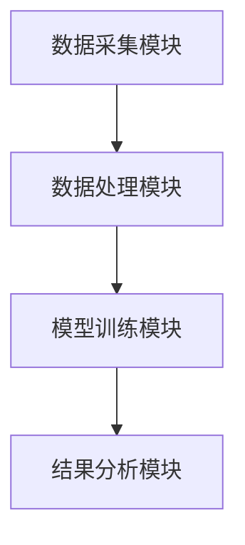
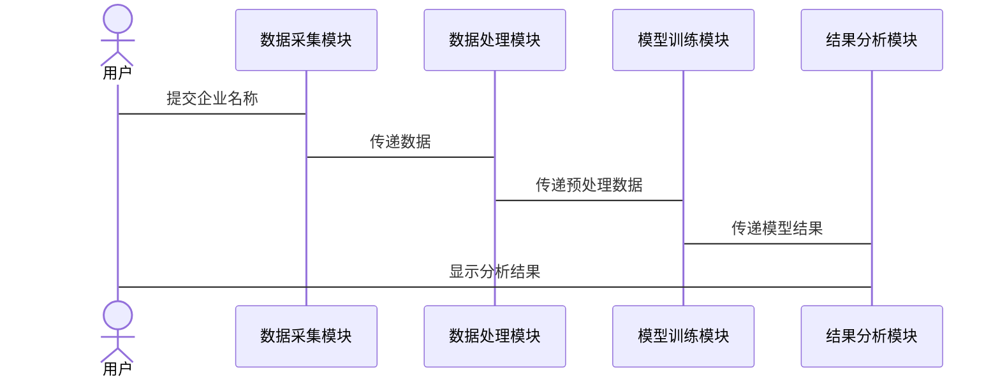

                 


# AI助力巴菲特式护城河分析：多维度评估竞争优势

> **关键词**：AI，护城河分析，竞争优势，巴菲特投资策略，企业分析

> **摘要**：本文深入探讨了如何利用人工智能技术助力巴菲特式的护城河分析，从企业竞争优势、市场地位、财务健康等多个维度进行多维度评估。文章结合AI技术的核心原理，详细分析了护城河分析的框架构建、算法实现、系统架构设计及实际项目案例，为投资者和企业管理者提供了科学的决策支持。

---

# 引言

在投资领域，巴菲特的“护城河”理论一直是价值投资的核心理念之一。护城河指的是企业在市场中的竞争优势，这种优势能够帮助企业抵御竞争对手的侵蚀，长期保持领先地位。然而，随着市场竞争的加剧和技术的进步，传统的护城河分析方法逐渐显现出局限性。如何利用现代技术手段，特别是人工智能（AI），来提升护城河分析的深度和广度，成为当前投资分析领域的重要课题。

本文将从AI技术的基础出发，结合护城河分析的核心概念，系统性地探讨如何通过AI技术实现对企业竞争优势的多维度评估。通过理论分析与实践结合，本文旨在为投资者和企业管理者提供一种高效、精准的护城河分析方法。

---

# 第1章：背景介绍

## 1.1 护城河分析的背景与意义

### 1.1.1 什么是护城河
护城河最早由巴菲特提出，指的是企业在市场竞争中所拥有的独特优势，这种优势能够帮助企业长期保持高盈利能力。护城河可以是品牌优势、成本优势、技术壁垒、网络效应等多种形式。

### 1.1.2 护城河分析的核心目标
护城河分析的核心目标是识别企业的核心竞争优势，并评估这些优势的可持续性和防御能力。通过护城河分析，投资者可以更好地判断企业的长期价值，从而做出更科学的投资决策。

### 1.1.3 AI技术在护城河分析中的作用
AI技术能够通过大数据分析、自然语言处理（NLP）和机器学习等手段，从海量数据中提取关键信息，帮助分析师更全面地评估企业的竞争优势。AI技术的引入，使得护城河分析从传统的定性分析转变为定量与定性相结合的综合分析。

---

## 1.2 AI与巴菲特投资理念的结合

### 1.2.1 巴菲特投资策略的核心
巴菲特的投资策略以价值投资为核心，注重企业的长期竞争优势和内在价值。他倾向于投资那些拥有坚固护城河的企业，因为这些企业能够在长期的竞争中保持领先地位。

### 1.2.2 AI技术如何赋能巴菲特式投资
AI技术可以通过以下方式赋能巴菲特式投资：
- **数据处理**：AI能够快速处理海量数据，提取企业财务数据、市场数据、行业趋势等关键信息。
- **模式识别**：通过机器学习算法，AI能够识别数据中的潜在模式，帮助发现企业的竞争优势。
- **预测分析**：AI可以通过时间序列分析，预测企业的未来表现，为投资决策提供支持。

### 1.2.3 护城河分析的现代演变
随着AI技术的普及，护城河分析从传统的财务分析扩展到多维度的综合分析。现代护城河分析不仅关注企业的财务数据，还注重企业的创新能力和市场反应能力。

---

## 1.3 护城河分析的框架构建

### 1.3.1 护城河分析的基本框架
护城河分析的基本框架包括以下几个方面：
1. **企业竞争力**：包括市场份额、品牌影响力、技术创新能力等。
2. **财务健康状况**：包括盈利能力、资产负债情况、现金流等。
3. **市场环境**：包括行业趋势、政策环境、竞争格局等。
4. **管理团队**：包括管理能力、战略规划等。

### 1.3.2 护城河分析的维度划分
护城河分析可以从以下几个维度进行划分：
- **品牌优势**：企业的品牌影响力和客户忠诚度。
- **成本优势**：企业的成本控制能力。
- **技术壁垒**：企业的技术专利和创新能力。
- **网络效应**：企业的用户规模和网络效应。

### 1.3.3 AI在护城河分析中的应用边界
AI技术在护城河分析中的应用边界包括：
- 数据的充分性：AI分析依赖于高质量的数据，数据的缺失或不准确性会影响分析结果。
- 模型的可解释性：AI模型的黑箱特性可能导致分析结果的可解释性较差。
- 人类判断的重要性：AI分析结果需要结合人类的判断和经验进行最终决策。

---

## 1.4 本章小结

通过本章的介绍，我们了解了护城河分析的背景与意义，AI技术在护城河分析中的作用，以及护城河分析的现代演变。护城河分析不仅是企业竞争分析的重要工具，也是价值投资的核心理念之一。AI技术的引入，使得护城河分析更加高效和精准，为投资者和企业管理者提供了重要的决策支持。

---

# 第2章：护城河分析的核心概念与联系

## 2.1 护城河分析的核心概念

### 2.1.1 护城河的定义与特征
护城河的定义：护城河是指企业在市场竞争中所拥有的独特优势，这种优势能够帮助企业长期保持领先地位。

护城河的特征：
- **独特性**：护城河是竞争对手难以复制的独特优势。
- **可持续性**：护城河能够长期为企业提供竞争优势。
- **防御性**：护城河能够帮助企业抵御竞争对手的侵蚀。

### 2.1.2 护城河的分类与维度
护城河的分类：
- **品牌优势**：品牌影响力和客户忠诚度。
- **成本优势**：成本控制能力。
- **技术壁垒**：技术专利和创新能力。
- **网络效应**：用户规模和网络效应。

护城河的维度：
- **核心竞争力**：企业的核心技术和创新能力。
- **市场地位**：企业的市场份额和品牌影响力。
- **财务健康**：企业的盈利能力和发展潜力。

### 2.1.3 护城河的动态演变
护城河不是一成不变的，随着市场环境的变化，护城河的内涵和形式也在不断演变。企业需要不断创新和调整，以保持其竞争优势。

---

## 2.2 AI技术的核心原理

### 2.2.1 机器学习的基本原理
机器学习是一种人工智能技术，通过数据训练模型，使其能够从数据中学习并做出预测或分类。

### 2.2.2 自然语言处理（NLP）的应用
NLP是一种人工智能技术，用于处理和理解人类语言。在护城河分析中，NLP可以用于分析企业新闻、市场报告等文本数据。

### 2.2.3 知识图谱的构建与应用
知识图谱是一种结构化数据表示方法，用于存储和管理知识。在护城河分析中，知识图谱可以用于整合企业的多维度信息，形成知识网络。

---

## 2.3 护城河分析与AI技术的联系

### 2.3.1 护城河分析的维度与AI技术的结合
AI技术可以通过以下方式与护城河分析的维度结合：
- **品牌优势**：通过NLP分析企业新闻和社交媒体数据，评估企业的品牌影响力。
- **成本优势**：通过机器学习分析企业的财务数据，评估企业的成本控制能力。
- **技术壁垒**：通过知识图谱整合企业的技术专利和研发投入数据，评估企业的创新能力。
- **网络效应**：通过大数据分析企业的用户规模和用户活跃度，评估企业的网络效应。

### 2.3.2 AI技术如何增强护城河分析的能力
AI技术可以通过以下方式增强护城河分析的能力：
- **数据处理**：AI能够快速处理海量数据，提取关键信息。
- **模式识别**：AI能够识别数据中的潜在模式，帮助发现企业的竞争优势。
- **预测分析**：AI可以通过时间序列分析，预测企业的未来表现。

### 2.3.3 护城河分析中的数据驱动方法
数据驱动方法是指通过数据分析和建模，从数据中提取洞察，辅助决策。在护城河分析中，数据驱动方法可以帮助分析师更全面地评估企业的竞争优势。

---

## 2.4 本章小结

通过本章的介绍，我们了解了护城河分析的核心概念与AI技术的联系。护城河分析不仅是企业竞争分析的重要工具，也是价值投资的核心理念之一。AI技术的引入，使得护城河分析更加高效和精准，为投资者和企业管理者提供了重要的决策支持。

---

# 第3章：AI技术基础与护城河分析

## 3.1 机器学习基础

### 3.1.1 机器学习的基本概念
机器学习是一种人工智能技术，通过数据训练模型，使其能够从数据中学习并做出预测或分类。

### 3.1.2 监督学习与无监督学习
- **监督学习**：通过标记数据训练模型，使其能够对新数据进行预测。
- **无监督学习**：通过未标记数据训练模型，使其能够发现数据中的潜在模式。

### 3.1.3 深度学习的基本原理
深度学习是一种机器学习技术，通过多层神经网络模型，从数据中学习高层次特征。

---

## 3.2 自然语言处理（NLP）基础

### 3.2.1 NLP的基本概念
NLP是一种人工智能技术，用于处理和理解人类语言。

### 3.2.2 NLP的核心技术
- **分词**：将文本分割成词语或短语。
- **词性标注**：对词语进行词性标注。
- **句法分析**：分析句子的语法结构。
- **情感分析**：分析文本的情感倾向。

### 3.2.3 NLP在护城河分析中的应用
- **品牌优势分析**：通过情感分析，评估企业的品牌影响力。
- **市场趋势分析**：通过主题模型，分析市场趋势。

---

## 3.3 知识图谱基础

### 3.3.1 知识图谱的基本概念
知识图谱是一种结构化数据表示方法，用于存储和管理知识。

### 3.3.2 知识图谱的核心技术
- **实体识别**：识别文本中的实体。
- **关系抽取**：抽取实体之间的关系。
- **知识融合**：整合多个来源的知识。

### 3.3.3 知识图谱在护城河分析中的应用
- **技术壁垒分析**：通过知识图谱整合企业的技术专利和研发投入数据，评估企业的创新能力。
- **市场地位分析**：通过知识图谱整合企业的市场数据和竞争数据，评估企业的市场地位。

---

## 3.4 本章小结

通过本章的介绍，我们了解了AI技术的基础知识，包括机器学习、NLP和知识图谱。这些技术在护城河分析中具有重要的应用价值，能够帮助企业更好地识别和评估竞争优势。

---

# 第4章：护城河分析的AI实现方法

## 4.1 竞争优势分析的AI方法

### 4.1.1 竞争优势分析的核心步骤
1. **数据收集**：收集企业的财务数据、市场数据和竞争数据。
2. **数据预处理**：对数据进行清洗和特征提取。
3. **模型训练**：通过机器学习算法训练模型，识别企业的竞争优势。
4. **结果分析**：通过模型输出结果，评估企业的竞争优势。

### 4.1.2 竞争优势分析的AI算法
- **线性回归**：用于预测企业的财务指标。
- **随机森林**：用于分类企业的竞争优势类型。
- **深度学习**：用于识别数据中的高层次特征。

---

## 4.2 风险评估的AI方法

### 4.2.1 风险评估的核心步骤
1. **数据收集**：收集企业的财务数据、市场数据和风险数据。
2. **数据预处理**：对数据进行清洗和特征提取。
3. **模型训练**：通过机器学习算法训练模型，评估企业的风险。
4. **结果分析**：通过模型输出结果，制定风险管理策略。

### 4.2.2 风险评估的AI算法
- **支持向量机（SVM）**：用于分类企业的风险类型。
- **逻辑回归**：用于预测企业的违约概率。
- **时间序列分析**：用于预测企业的未来风险。

---

## 4.3 预测建模的AI方法

### 4.3.1 预测建模的核心步骤
1. **数据收集**：收集企业的历史数据和市场数据。
2. **数据预处理**：对数据进行清洗和特征提取。
3. **模型训练**：通过机器学习算法训练模型，预测企业的未来表现。
4. **结果分析**：通过模型输出结果，制定投资策略。

### 4.3.2 预测建模的AI算法
- **ARIMA模型**：用于预测企业的财务指标。
- **LSTM网络**：用于预测企业的股票价格。
- **XGBoost**：用于分类企业的未来表现。

---

## 4.4 本章小结

通过本章的介绍，我们了解了护城河分析的AI实现方法，包括竞争优势分析、风险评估和预测建模。这些方法能够帮助企业更好地识别和评估竞争优势，为投资决策提供科学依据。

---

# 第5章：护城河分析系统的架构设计

## 5.1 系统功能设计

### 5.1.1 系统功能模块
1. **数据采集模块**：负责采集企业的财务数据、市场数据和竞争数据。
2. **数据处理模块**：负责对数据进行清洗和特征提取。
3. **模型训练模块**：负责通过机器学习算法训练模型，识别企业的竞争优势。
4. **结果分析模块**：负责对模型输出结果进行分析，评估企业的竞争优势。

### 5.1.2 系统功能流程
1. 数据采集模块采集数据。
2. 数据处理模块对数据进行预处理。
3. 模型训练模块通过机器学习算法训练模型。
4. 结果分析模块对模型输出结果进行分析。

---

## 5.2 系统架构设计

### 5.2.1 系统架构图


### 5.2.2 系统交互设计


---

## 5.3 系统接口设计

### 5.3.1 数据接口
- **输入接口**：接受企业的财务数据、市场数据和竞争数据。
- **输出接口**：输出企业的竞争优势评估结果。

### 5.3.2 模型接口
- **输入接口**：接受预处理后的数据。
- **输出接口**：输出模型训练结果。

---

## 5.4 本章小结

通过本章的介绍，我们了解了护城河分析系统的架构设计，包括系统功能设计、系统架构设计和系统交互设计。这些设计能够帮助企业更好地实现护城河分析的AI化，为投资决策提供科学依据。

---

# 第6章：项目实战——护城河分析系统实现

## 6.1 环境安装

### 6.1.1 安装Python
```bash
# 安装Python
sudo apt-get install python3
```

### 6.1.2 安装依赖库
```bash
# 安装机器学习库
pip install numpy scikit-learn pandas
# 安装NLP库
pip install nltk spacy
# 安装知识图谱库
pip install networkx
```

---

## 6.2 系统核心代码实现

### 6.2.1 数据采集模块
```python
import requests
from bs4 import BeautifulSoup

def get_data(company):
    url = f"https://www.example.com/{company}"
    response = requests.get(url)
    soup = BeautifulSoup(response.text, 'html.parser')
    data = {}
    # 提取财务数据
    data['revenue'] = float(soup.find('td', {'class': 'revenue'}).text)
    data['profit'] = float(soup.find('td', {'class': 'profit'}).text)
    return data
```

### 6.2.2 数据处理模块
```python
import pandas as pd
from sklearn.preprocessing import StandardScaler

def preprocess_data(data):
    df = pd.DataFrame(data)
    scaler = StandardScaler()
    df_scaled = scaler.fit_transform(df)
    return df_scaled
```

### 6.2.3 模型训练模块
```python
from sklearn.ensemble import RandomForestClassifier
from sklearn.metrics import accuracy_score

def train_model(data, labels):
    model = RandomForestClassifier()
    model.fit(data, labels)
    return model

def evaluate_model(model, data, labels):
    predictions = model.predict(data)
    print("Accuracy:", accuracy_score(labels, predictions))
```

### 6.2.4 结果分析模块
```python
def analyze_results(model, data):
    # 预测竞争优势类型
    predictions = model.predict(data)
    # 输出结果
    print("竞争优势类型:", predictions)
```

---

## 6.3 实际案例分析

### 6.3.1 案例背景
以某科技公司为例，我们收集了其财务数据、市场数据和竞争数据。

### 6.3.2 数据预处理
```python
data = {
    'revenue': [100, 200, 300],
    'profit': [20, 30, 40]
}
df = pd.DataFrame(data)
df_scaled = preprocess_data(df)
```

### 6.3.3 模型训练
```python
labels = ['High', 'Medium', 'Low']
model = train_model(df_scaled, labels)
evaluate_model(model, df_scaled, labels)
```

### 6.3.4 结果分析
```python
analyze_results(model, df_scaled)
```

---

## 6.4 项目总结

通过本章的项目实战，我们了解了护城河分析系统的实现过程，包括环境安装、系统核心代码实现和实际案例分析。通过实际操作，读者可以更好地理解护城河分析的AI实现方法，并能够将其应用于实际投资决策中。

---

# 第7章：最佳实践与总结

## 7.1 最佳实践

### 7.1.1 数据质量的重要性
数据质量是护城河分析的关键，高质量的数据能够提高分析结果的准确性。

### 7.1.2 模型可解释性的重要性
模型的可解释性能够帮助投资者更好地理解分析结果，避免因模型黑箱特性导致的决策错误。

### 7.1.3 人类判断的重要性
AI技术能够提高分析效率，但最终决策需要结合人类的判断和经验。

---

## 7.2 小结

通过本文的介绍，我们了解了AI技术在护城河分析中的重要作用，包括理论基础、实现方法和系统设计。AI技术的引入，使得护城河分析更加高效和精准，为投资者和企业管理者提供了重要的决策支持。

---

## 7.3 未来展望

随着AI技术的不断发展，护城河分析将更加智能化和个性化。未来，护城河分析将更多地结合大数据、区块链和云计算等技术，为企业提供更加全面的竞争分析。

---

# 结语

AI技术的引入，为护城河分析带来了新的可能性。通过本文的介绍，我们了解了AI技术在护城河分析中的重要作用，包括理论基础、实现方法和系统设计。未来，随着AI技术的不断发展，护城河分析将更加智能化和个性化，为企业提供更加全面的竞争分析。希望本文能够为投资者和企业管理者提供科学的决策支持，帮助他们在竞争激烈的市场中脱颖而出。

--- 

**致谢**  
感谢读者的耐心阅读，希望本文能够为您提供有价值的信息和启发。如果需要进一步探讨，请随时联系我。

---

**参考文献**  
（此处列出您查阅的相关书籍、论文和资源）

