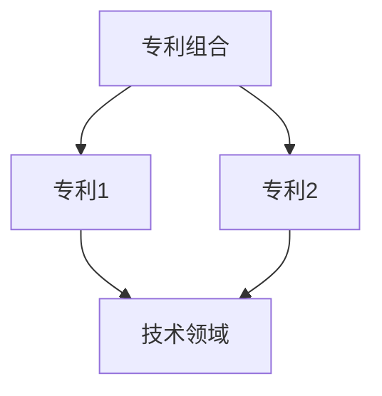
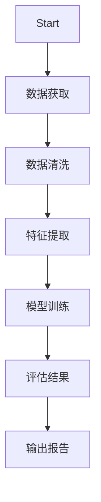
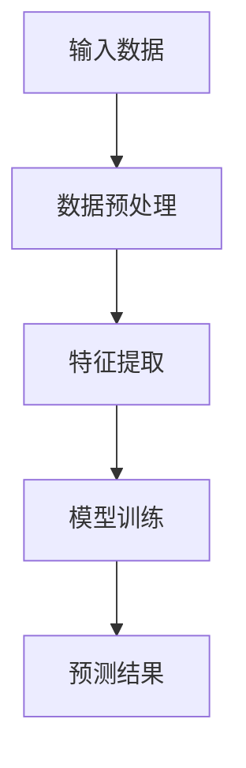
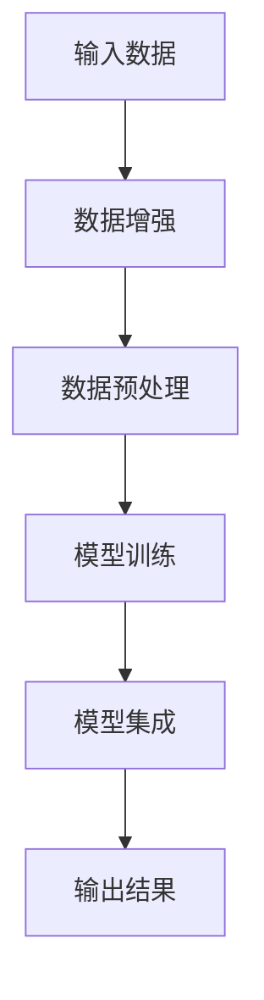
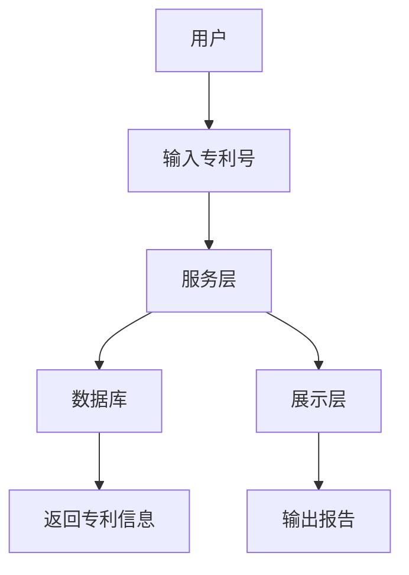

                 


# AI协作分析专利组合：评估技术驱动型公司的未来价值

> 关键词：AI协作分析，专利组合，技术驱动型公司，知识产权评估，专利分析

> 摘要：随着人工智能技术的快速发展，专利组合评估在技术驱动型公司的未来价值中的作用日益重要。本文通过系统分析AI协作如何助力专利组合评估，探讨其在知识产权管理和商业决策中的应用，为企业提供基于AI的专利组合分析策略。

---

# 第一部分: AI协作分析专利组合的背景与重要性

## 第1章: AI协作分析专利组合概述

### 1.1 AI协作分析的背景

#### 1.1.1 人工智能在知识产权领域的应用
- **AI在专利检索中的作用**：AI能够快速从海量专利数据库中提取关键信息，帮助研发团队避免重复劳动。
- **AI在专利分析中的优势**：通过自然语言处理和机器学习，AI能够识别专利之间的关联性，发现潜在的技术趋势。

#### 1.1.2 专利组合的概念与特点
- **专利组合的定义**：一组相互关联的专利，共同保护公司的核心技术或产品。
- **专利组合的特点**：覆盖全面、协同防御、灵活调整。

#### 1.1.3 技术驱动型公司的定义与特征
- **技术驱动型公司**：以技术创新为核心竞争力的企业，如科技初创公司、独角兽企业等。
- **特征**：高度依赖研发、注重知识产权保护、快速迭代产品。

### 1.2 专利组合评估的重要性

#### 1.2.1 专利组合对技术驱动型公司的价值
- **防御性价值**：防止竞争对手侵犯知识产权。
- **进攻性价值**：通过专利组合打击竞争对手，扩大市场占有率。

#### 1.2.2 专利组合评估的挑战与机遇
- **挑战**：专利数据复杂多样，评估需要专业技能和工具。
- **机遇**：AI技术的应用极大地提高了专利评估的效率和准确性。

#### 1.2.3 专利组合评估的边界与外延
- **边界**：仅考虑专利的法律保护范围。
- **外延**：包括技术趋势、市场动态等外部因素。

---

# 第二部分: AI协作分析专利组合的核心概念

## 第2章: AI协作分析的核心概念

### 2.1 AI协作分析的基本原理

#### 2.1.1 数据源的获取与处理
- **数据源**：专利数据库、公司内部文档、行业报告等。
- **数据处理**：清洗、转换、标注，确保数据质量。

#### 2.1.2 分析模型的构建与优化
- **模型选择**：根据任务选择合适的算法，如分类、聚类、主题建模。
- **模型优化**：通过交叉验证、超参数调优提升模型性能。

#### 2.1.3 评估指标的设计与应用
- **指标选择**：如准确率、召回率、F1分数等。
- **指标应用**：用于评估模型在专利分类、关联分析中的表现。

### 2.2 核心概念的属性特征对比

#### 2.2.1 专利组合与单一专利的对比分析
| 特性         | 单一专利                | 专利组合             |
|--------------|-------------------------|----------------------|
| 保护范围     | 独特技术点               | 多项相关技术          |
| 战略价值     | 防御特定技术攻击         | 提供全面防御          |
| 管理复杂度   | 较低                     | 较高                 |

#### 2.2.2 技术驱动型公司与其他类型公司的对比
| 特性         | 技术驱动型公司           | 传统公司             |
|--------------|-------------------------|----------------------|
| 核心竞争力   | 技术创新                 | 产品制造             |
| 知识产权     | 高度依赖专利保护         | 较少依赖             |
| 创新速度     | 快速迭代                 | 较慢                 |

#### 2.2.3 不同评估指标的优缺点分析
| 指标         | 优点                     | 缺点                   |
|--------------|-------------------------|-----------------------|
| 准确率       | 直接反映分类正确性       | 忽略了未分类样本       |
| 召回率       | 关注模型的查全能力       | 不关注分类的精确性     |
| F1分数       | 综合准确率和召回率       | 无法反映具体问题       |

### 2.3 实体关系图与流程图

#### 2.3.1 专利组合分析的ER实体关系图


#### 2.3.2 AI协作分析的流程图


---

# 第三部分: AI协作分析专利组合的算法原理

## 第3章: AI协作分析的基本算法

### 3.1 机器学习算法

#### 3.1.1 分类算法
- **逻辑回归**：用于二分类问题，如判断专利是否有效。
  $$ P(y=1|x) = \frac{e^{w^T x + b}}{1 + e^{w^T x + b}} $$
- **支持向量机（SVM）**：用于区分不同类别的专利。

#### 3.1.2 聚类算法
- **K-means**：用于将专利按照技术领域分组。

### 3.2 自然语言处理算法

#### 3.2.1 词袋模型与TF-IDF
- **词袋模型**：将文本表示为词汇的集合。
- **TF-IDF**：计算词的重要性。

#### 3.2.2 主题建模（LDA）
- **LDA模型**：识别专利文本中的主题分布。

### 3.3 算法流程图


### 3.4 Python代码示例

```python
from sklearn.feature_extraction.text import TfidfVectorizer
from sklearn.decomposition import LatentDirichletAllocation

vectorizer = TfidfVectorizer()
tfidf = vectorizer.fit_transform(patents_text)

lda = LatentDirichletAllocation(n_components=5)
lda.fit(tfidf)
```

---

## 第4章: 高级算法与优化

### 4.1 深度学习模型

#### 4.1.1 卷积神经网络（CNN）
- **应用**：用于专利文本的情感分析，如判断专利是否具有创新性。

#### 4.1.2 循环神经网络（RNN）
- **应用**：用于专利文本的序列建模，如时间序列分析。

### 4.2 算法优化策略

#### 4.2.1 超参数调优
- **网格搜索**：找到最佳模型参数。

#### 4.2.2 集成学习
- **袋装法**：通过多次训练不同的模型，提高整体准确率。

### 4.3 算法流程图


---

# 第四部分: 系统分析与架构设计

## 第5章: 系统分析与架构设计方案

### 5.1 系统架构设计

#### 5.1.1 分层架构
- **数据层**：存储专利数据。
- **业务逻辑层**：处理专利分析任务。
- **用户界面层**：展示分析结果。

#### 5.1.2 微服务架构
- **服务划分**：数据获取、模型训练、结果展示。

### 5.2 系统交互设计

#### 5.2.1 序列图


---

# 第五部分: 项目实战

## 第6章: 项目实战与案例分析

### 6.1 环境安装

#### 6.1.1 安装Python环境
```bash
pip install python
pip install scikit-learn
pip install nltk
```

### 6.2 核心代码实现

#### 6.2.1 数据预处理代码
```python
import pandas as pd

data = pd.read_csv('patents.csv')
data['clean_text'] = data['text'].apply(lambda x: x.lower())
```

#### 6.2.2 模型训练代码
```python
from sklearn.model import LinearSVC

model = LinearSVC()
model.fit(X_train, y_train)
```

### 6.3 案例分析与解读

#### 6.3.1 技术趋势分析
- **关键词提取**：识别专利中的关键技术，如“人工智能”、“区块链”等。
- **趋势预测**：基于关键词的变化趋势，预测未来的技术发展方向。

#### 6.3.2 竞争对手分析
- **专利对比**：分析竞争对手的专利布局，找出技术空白点。

---

# 第六部分: 总结与展望

## 第7章: 总结与展望

### 7.1 核心要点回顾
- **AI在专利分析中的应用**：提升效率和准确性。
- **专利组合评估的重要性**：为企业制定有效的知识产权策略。

### 7.2 未来展望
- **技术发展**：深度学习模型的优化与应用。
- **行业趋势**：AI技术在更多领域的应用扩展。

### 7.3 最佳实践 tips
- **数据质量**：确保数据清洗和标注的准确性。
- **模型选择**：根据具体任务选择合适的算法。
- **持续优化**：定期更新模型，适应技术发展。

---

# 结语

通过本文的系统分析，我们了解了AI协作分析专利组合在技术驱动型公司中的重要性。希望本文能为企业的知识产权管理和商业决策提供有价值的参考。未来，随着AI技术的不断发展，专利分析将更加智能化和精准化，为企业创造更大的价值。

