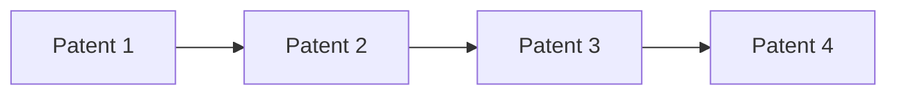
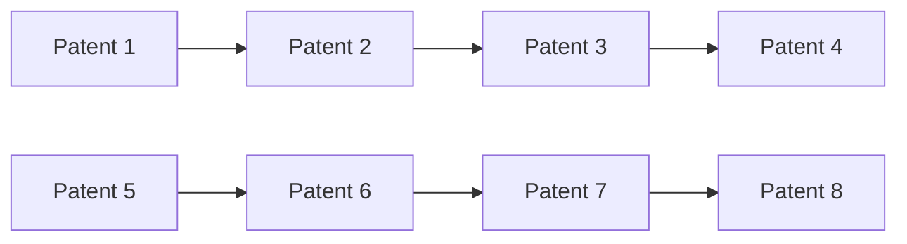
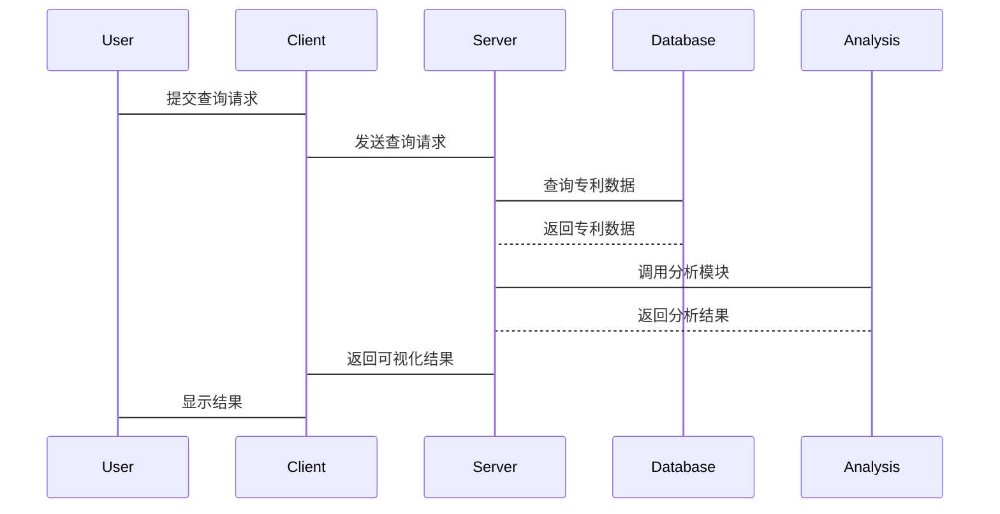

                 


# AI协作分析公司专利引用网络：评估技术领先地位

> 关键词：AI协作分析，专利引用网络，技术领先地位，图论分析，机器学习，文本挖掘

> 摘要：本文探讨了如何利用AI协作分析公司专利引用网络，以评估技术领先地位。通过分析专利引用网络的结构和属性，结合AI技术如文本挖掘、图论分析和机器学习，能够更高效地识别技术趋势和竞争对手。本文详细介绍了专利引用网络的核心概念、算法原理、系统设计及实际案例，为读者提供全面的分析框架。

---

# 第1章：专利引用网络与AI协作分析概述

## 1.1 专利引用网络的定义与特点

### 1.1.1 专利引用网络的定义

专利引用网络是指一组专利之间的引用关系形成的网络，其中每个节点代表一个专利，边代表专利之间的引用关系。这种网络能够揭示技术领域中的知识流动、技术关联和创新路径。

$$
\text{专利引用网络} = \{ (\text{专利}, \text{引用关系}) \}
$$

### 1.1.2 专利引用网络的结构与特点

专利引用网络具有以下特点：
1. **有向性**：引用关系是有向的，即专利A引用专利B并不意味着专利B也引用专利A。
2. **可扩展性**：随着技术的发展，专利引用网络会不断扩展。
3. **复杂性**：网络中可能存在多个社区和技术分支。

### 1.1.3 专利引用网络的分析意义

通过对专利引用网络的分析，可以识别技术领域的核心专利、技术趋势和潜在的技术空白。此外，还能评估公司或技术领域的创新能力和竞争力。

## 1.2 AI协作分析的必要性

### 1.2.1 传统专利分析的局限性

传统的专利分析方法依赖于人工审查和手动分析，效率低下且容易遗漏重要信息。此外，手动分析难以处理海量专利数据。

### 1.2.2 AI协作分析的优势

AI协作分析可以高效处理海量专利数据，提取关键信息，并发现潜在的技术关联。AI技术能够自动识别专利之间的相似性和引用关系，从而提供更深入的分析结果。

### 1.2.3 专利引用网络分析的目标与价值

目标包括：
1. **识别技术趋势**：通过分析专利引用网络，可以识别技术领域的热门方向。
2. **评估技术地位**：评估公司或技术领域的创新能力和竞争力。
3. **发现技术空白**：识别技术领域中的潜在空白点。

---

# 第2章：专利引用网络的核心概念与联系

## 2.1 专利引用网络的实体关系分析

### 2.1.1 专利引用网络的ER实体关系图

以下是一个简单的ER图，展示了专利引用网络的核心实体及其关系：

```mermaid
er
actor: Patent
   + patent_id: ID
   + title: 标题
   + publication_date: 发布日期
   + inventor: 发明人
   + assignee: 申请人
   + claims: 权利要求
   + abstract: 摘要
   + description: 描述
   + references: 参考文献
```

### 2.1.2 实体关系的属性特征对比

以下表格展示了专利引用网络中各实体的属性特征对比：

| 实体 | 属性 | 类型 |
|------|------|------|
| 专利 | patent_id | 唯一标识符 |
| 专利 | title | 文本 |
| 专利 | publication_date | 日期 |
| 发明人 | inventor | 文本 |
| 申请人 | assignee | 文本 |
| 权利要求 | claims | 文本 |
| 摘要 | abstract | 文本 |
| 描述 | description | 文本 |
| 参考文献 | references | 文本 |

### 2.1.3 专利引用网络的网络结构分析

以下是一个简单的专利引用网络的网络结构图：



---

## 2.2 专利引用网络的图论分析

### 2.2.1 图论在专利引用网络中的应用

图论在专利引用网络中的应用包括：
1. **度数分析**：计算每个节点的度数，识别核心专利。
2. **社区发现**：识别技术领域的社区结构，发现技术分支。

### 2.2.2 专利引用网络的度数分布

以下是一个简单的度数分布图：


### 2.2.3 专利引用网络的社区发现

以下是一个简单的社区发现图：



---

## 2.3 AI协作分析的核心算法原理

### 2.3.1 文本挖掘在专利分析中的应用

文本挖掘在专利分析中的应用包括：
1. **关键词提取**：提取专利中的关键词，识别技术领域。
2. **主题建模**：通过主题建模技术，识别专利中的主要主题。

### 2.3.2 图论算法在引用网络中的应用

图论算法在引用网络中的应用包括：
1. **PageRank算法**：用于计算节点的重要性，识别核心专利。
2. **社区发现算法**：用于识别技术领域的社区结构。

### 2.3.3 机器学习在专利分析中的应用

机器学习在专利分析中的应用包括：
1. **分类**：将专利分为不同的类别，识别技术趋势。
2. **聚类**：将相似的专利聚类，识别技术分支。

---

# 第3章：专利引用网络分析的算法原理

## 3.1 文本挖掘算法

### 3.1.1 专利文本预处理

专利文本预处理包括：
1. **分词**：将专利文本分解为词语或短语。
2. **去停用词**：去除常见的停用词，如“的”、“了”等。
3. **向量表示**：将词语表示为向量，如使用TF-IDF或Word2Vec。

### 3.1.2 专利文本相似度计算

专利文本相似度计算可以使用余弦相似度：

$$
\text{相似度} = \frac{\sum_{i=1}^{n} w_i \cdot w'_i}{\sqrt{\sum_{i=1}^{n} w_i^2} \cdot \sqrt{\sum_{i=1}^{n} w'_i^2}}
$$

### 3.1.3 专利文本聚类

专利文本聚类可以使用K-means算法：

$$
\text{目标} = \min \sum_{i=1}^{k} \sum_{j=1}^{n} (c_{ij})^2
$$

其中，$c_{ij}$表示聚类中心到样本点的距离。

---

## 3.2 图论算法

### 3.2.1 专利引用网络的构建

专利引用网络的构建可以使用图数据库，如Neo4j。

### 3.2.2 专利引用网络的度数分析

度数分析可以使用以下公式：

$$
\text{度数} = \sum_{i=1}^{n} a_{ij}
$$

其中，$a_{ij}$表示边的存在性。

### 3.2.3 专利引用网络的社区发现

社区发现可以使用Louvain算法：

$$
\text{模块度} = \sum_{i,j} (a_{ij} - p_{ij}) \cdot \delta(c_i, c_j)
$$

其中，$p_{ij}$是随机网络中的边概率，$\delta(c_i, c_j)$是1如果$i$和$j$属于同一个社区，否则为0。

---

## 3.3 机器学习算法

### 3.3.1 专利引用网络的特征提取

特征提取可以使用主成分分析（PCA）：

$$
\text{主成分} = \arg \max_{w} \sum_{i=1}^{n} w_i^2
$$

### 3.3.2 专利引用网络的分类与预测

分类与预测可以使用支持向量机（SVM）：

$$
\text{目标} = \max \sum_{i=1}^{n} y_i (w \cdot x_i + b) + \sum_{i=1}^{n} \xi_i
$$

其中，$\xi_i$是松弛变量。

### 3.3.3 专利引用网络的深度学习模型

深度学习模型可以使用图卷积网络（GCN）：

$$
h^{(l+1)} = \text{ReLU}(A h^{(l)} W^{(l)} + b^{(l)})
$$

其中，$A$是邻接矩阵，$h^{(l)}$是第$l$层的隐藏层输出。

---

# 第4章：专利引用网络分析的系统架构设计

## 4.1 系统分析与设计

### 4.1.1 系统功能需求分析

系统功能需求包括：
1. **数据采集**：从专利数据库中采集专利数据。
2. **数据预处理**：对专利数据进行清洗和转换。
3. **网络构建**：构建专利引用网络。
4. **分析与挖掘**：使用AI算法进行分析和挖掘。
5. **结果可视化**：将分析结果可视化。

### 4.1.2 系统功能模块划分

系统功能模块包括：
1. **数据采集模块**
2. **数据预处理模块**
3. **网络构建模块**
4. **分析与挖掘模块**
5. **结果可视化模块**

### 4.1.3 系统功能模块划分

以下是一个简单的系统功能模块划分图：


---

## 4.2 系统架构设计

### 4.2.1 系统架构设计

以下是一个简单的系统架构设计图：


其中：
- **Client**：用户界面，接收用户的输入。
- **Server**：处理用户的请求，调用分析模块。
- **Database**：存储专利数据。
- **Analysis**：进行专利引用网络的分析和挖掘。
- **Visualization**：将分析结果可视化。

### 4.2.2 系统接口设计

系统接口设计包括：
1. **数据接口**：从专利数据库中获取专利数据。
2. **分析接口**：调用分析模块进行分析。
3. **可视化接口**：将分析结果返回给用户。

### 4.2.3 系统交互流程

以下是一个简单的系统交互流程图：



---

## 4.3 系统实现与优化

### 4.3.1 系统实现

系统实现包括：
1. **数据采集**：使用爬虫从专利数据库中采集专利数据。
2. **数据预处理**：清洗和转换专利数据。
3. **网络构建**：使用图数据库构建专利引用网络。
4. **分析与挖掘**：使用AI算法进行分析和挖掘。
5. **结果可视化**：将分析结果可视化。

### 4.3.2 系统优化

系统优化包括：
1. **性能优化**：优化算法的计算效率。
2. **存储优化**：优化专利数据的存储方式。
3. **扩展性优化**：优化系统的可扩展性。

---

# 第5章：项目实战与案例分析

## 5.1 环境安装与配置

### 5.1.1 环境安装

以下是安装所需的依赖：

```bash
pip install neo4j sklearn networkx matplotlib
```

### 5.1.2 环境配置

以下是环境配置示例：

```python
import neo4j
from sklearn import metrics
import networkx as nx
import matplotlib.pyplot as plt
```

---

## 5.2 系统核心实现源代码

### 5.2.1 数据采集模块

以下是数据采集模块的代码：

```python
import requests

def fetch_patents(query):
    url = f"https://api.patents.com/patents?q={query}"
    response = requests.get(url)
    return response.json()
```

### 5.2.2 数据预处理模块

以下是数据预处理模块的代码：

```python
def preprocess_patents(patents):
    processed_patents = []
    for patent in patents:
        processed_patents.append({
            'title': patent['title'],
            'abstract': patent['abstract'],
            'inventor': patent['inventor'],
            'assignee': patent['assignee'],
            'publication_date': patent['publication_date']
        })
    return processed_patents
```

### 5.2.3 网络构建模块

以下是网络构建模块的代码：

```python
import neo4j

def build_graph(patents):
    graph = neo4j.Graph('http://localhost:7687', 'neo4j', 'password')
    for patent in patents:
        node1 = graph.nodes.create('Patent', title=patent['title'])
        for ref_patent in patent['references']:
            node2 = graph.nodes.create('Patent', title=ref_patent['title'])
            node1 relate_to node2 with 'REFERENCES'
    return graph
```

### 5.2.4 分析与挖掘模块

以下是分析与挖掘模块的代码：

```python
from sklearn import metrics
import networkx as nx

def analyze_graph(graph):
    nodes = list(graph.nodes())
    edges = [(u, v) for u in nodes for v in graph.neighbors(u)]
    G = nx.DiGraph()
    G.add_edges_from(edges)
    # 计算度数
    degrees = nx.degree(G)
    # 计算社区
    communities = nx.community.girvan_newman(G)
    return degrees, communities
```

### 5.2.5 结果可视化模块

以下是结果可视化模块的代码：

```python
import matplotlib.pyplot as plt

def visualize_graph(degrees, communities):
    plt.figure(figsize=(10, 10))
    nx.draw(G, with_labels=True, node_color='blue', edge_color='red')
    plt.show()
```

---

## 5.3 实际案例分析与解读

### 5.3.1 案例背景

以某公司为例，分析其专利引用网络，评估其技术地位。

### 5.3.2 数据采集与预处理

使用上述代码从专利数据库中采集该公司的专利数据，并进行预处理。

### 5.3.3 网络构建与分析

构建该公司的专利引用网络，并使用图论算法进行分析。

### 5.3.4 可视化与解读

将分析结果可视化，并进行解读，识别核心专利和社区结构。

---

## 5.4 项目小结

通过实际案例分析，我们可以看到AI协作分析在专利引用网络中的应用效果。通过分析专利引用网络，可以识别技术趋势和核心专利，评估公司的技术地位。

---

# 第6章：总结与展望

## 6.1 总结

本文详细介绍了AI协作分析在专利引用网络中的应用，包括专利引用网络的核心概念、算法原理、系统设计及实际案例。通过AI技术，我们可以高效地分析专利引用网络，识别技术趋势和核心专利。

## 6.2 未来展望

未来，随着AI技术的不断发展，专利引用网络分析将更加智能化和自动化。同时，结合区块链等技术，可以进一步提升专利引用网络分析的准确性和安全性。

---

## 6.3 最佳实践 Tips

1. 在进行专利引用网络分析时，建议先进行数据预处理，确保数据的准确性和完整性。
2. 在选择AI算法时，应根据具体需求选择合适的算法，如文本挖掘、图论分析和机器学习模型。
3. 在系统设计时，应注重系统的可扩展性和可维护性。

---

## 6.4 问题解答与注意事项

### 6.4.1 常见问题解答

1. **Q: 什么是专利引用网络？**
   - A: 专利引用网络是指专利之间的引用关系形成的网络，其中每个节点代表一个专利，边代表专利之间的引用关系。

2. **Q: 为什么要使用AI协作分析？**
   - A: AI协作分析可以高效处理海量专利数据，提取关键信息，并发现潜在的技术关联。

### 6.4.2 注意事项

- 在进行专利引用网络分析时，应遵守相关法律法规，确保数据的合法性和合规性。
- 在选择AI算法时，应根据具体需求选择合适的算法，避免盲目使用。

---

## 6.5 拓展阅读

以下是一些拓展阅读的资料：

1. 图论与网络科学
2. 机器学习与深度学习
3. 文本挖掘与自然语言处理

---

通过本文的详细介绍，读者可以全面了解AI协作分析在专利引用网络中的应用，掌握相关的算法和系统设计方法，并能够在实际项目中进行应用和实践。

