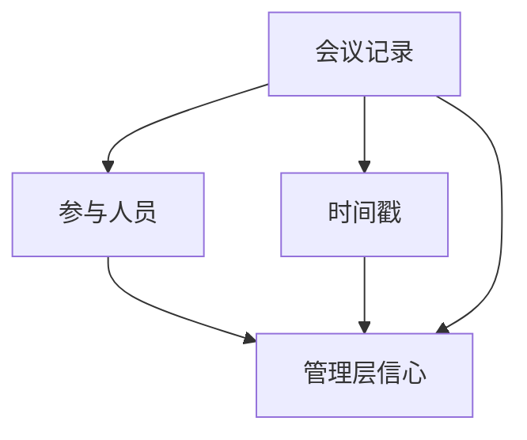
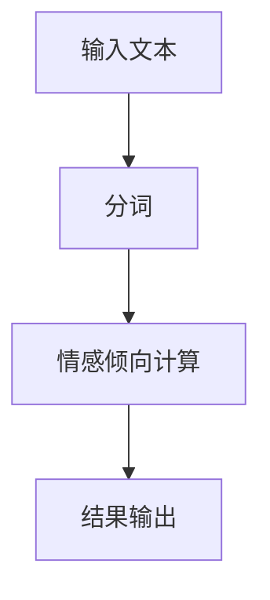
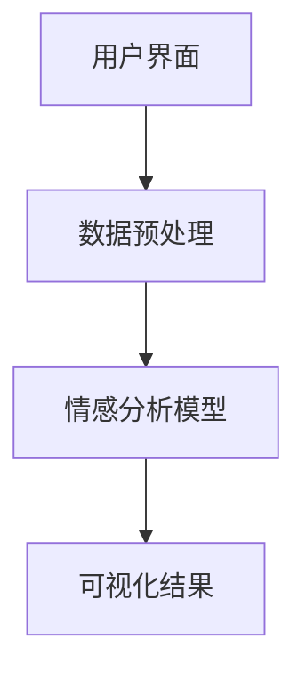
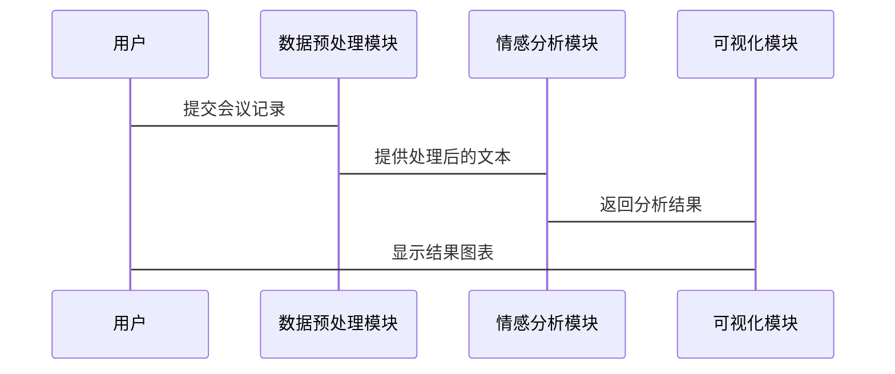

                 


# 第一部分：背景介绍

## 第1章：问题背景与描述

### 1.1 问题背景
#### 1.1.1 企业会议记录分析的现状
目前，企业会议记录主要依赖人工整理和分析，这种方式效率低下，且容易受到主观因素的影响。随着AI技术的发展，利用机器自动分析会议记录的语气和内容，已经成为可能。

#### 1.1.2 传统会议记录分析的局限性
传统方法依赖于人工阅读和分析会议记录，存在效率低、成本高、容易出错的问题。此外，人的主观因素也可能影响分析结果。

#### 1.1.3 AI技术在会议记录分析中的潜力
AI技术可以通过自然语言处理和机器学习，快速分析大量的会议记录，提取关键信息和情感倾向，为管理层提供更精准的决策支持。

### 1.2 问题描述
#### 1.2.1 会议记录语气分析的核心问题
如何准确识别和分析会议记录中的语气和情感，尤其是管理层的信心和决策倾向。

#### 1.2.2 管理层信心与会议记录语气的关系
管理层的信心可以通过会议记录中的语气、用词、重复率等指标来分析。例如，积极的语气可能表示信心较高，而犹豫或否定的语气可能表示信心不足。

#### 1.2.3 企业决策中的潜在需求
企业希望通过分析会议记录，了解管理层的决策倾向，优化决策过程，提升企业效率和竞争力。

### 1.3 问题解决方法
#### 1.3.1 AI协作分析的基本思路
利用自然语言处理和机器学习技术，对会议记录进行文本挖掘，提取关键信息和情感倾向。

#### 1.3.2 机器学习在语气分析中的应用
通过训练情感分析模型，识别文本中的情感倾向，进而分析管理层的信心。

#### 1.3.3 自然语言处理技术的核心作用
自然语言处理技术可以对会议记录进行分词、句法分析、实体识别等处理，提取有用的信息。

### 1.4 问题的边界与外延
#### 1.4.1 会议记录分析的适用范围
适用于公司内部会议、团队讨论、项目汇报等场景。

#### 1.4.2 语气分析的边界条件
包括会议记录的长度、语言种类、参与人员等。

#### 1.4.3 与管理层信心相关的其他因素
包括会议的议题、参与人员的背景、外部环境等。

### 1.5 核心要素与组成
#### 1.5.1 数据来源与处理
会议记录的数据来源、清洗、预处理等步骤。

#### 1.5.2 情感分析模型
用于分析会议记录中情感倾向的模型和算法。

#### 1.5.3 结果解读与应用
如何将分析结果应用于企业管理决策。

---

# 第二部分：核心概念与联系

## 第2章：AI协作分析的核心概念

### 2.1 核心概念原理
#### 2.1.1 自然语言处理（NLP）的基础
自然语言处理技术用于理解和生成人类语言，包括分词、句法分析、情感分析等。

#### 2.1.2 情感分析的基本原理
情感分析是识别文本中的情感倾向，通常分为正面、负面和中性三种。

#### 2.1.3 机器学习在语气分析中的应用
机器学习算法可以训练模型，识别和分类文本中的情感倾向。

### 2.2 核心概念对比表
| 概念 | 特性 |
|------|------|
| 会议记录 | 文本数据、时间戳、参与人员 |
| 语气分析 | 情感倾向、强度、情绪类型 |
| 管理层信心 | 自信心、决策稳定性、团队凝聚力 |

### 2.3 ER实体关系图



---

# 第三部分：算法原理讲解

## 第3章：情感分析算法原理

### 3.1 情感分析算法流程



### 3.2 代码实现

```python
import nltk
from nltk.sentiment import SentimentIntensityAnalyzer

nltk.download('vader_lexicon')

def analyze_sentiment(text):
    analyzer = SentimentIntensityAnalyzer()
    sentiment = analyzer.polarity_scores(text)
    return sentiment['compound']

text = "今天的会议非常顺利，我们成功达成了共识。"
print(analyze_sentiment(text))  # 输出一个数值，值越高表示情感越积极
```

### 3.3 数学模型与公式

情感倾向的计算公式：

$$ \text{sentiment\_score} = \frac{\text{positive\_words} - \text{negative\_words}}{\text{total\_words}} $$

其中，$\text{positive\_words}$ 表示积极词汇的数量，$\text{negative\_words}$ 表示消极词汇的数量，$\text{total\_words}$ 表示总词汇数量。

---

# 第四部分：系统分析与架构设计

## 第4章：系统架构设计

### 4.1 项目场景介绍
开发一个AI协作分析系统，用于分析公司会议记录，识别管理层的信心和决策倾向。

### 4.2 系统功能设计
#### 4.2.1 数据预处理模块
对会议记录进行清洗、分词、去停用词等处理。

#### 4.2.2 情感分析模块
使用机器学习模型分析会议记录中的情感倾向。

#### 4.2.3 可视化模块
将分析结果以图表形式展示，方便管理层查看。

### 4.3 系统架构图



### 4.4 系统接口设计
提供API接口，供其他系统调用分析结果。

### 4.5 系统交互流程



---

# 第五部分：项目实战

## 第5章：项目实战

### 5.1 环境安装
安装必要的库和工具，例如Python的NLTK库、Scikit-learn库等。

### 5.2 核心代码实现
实现会议记录分析的核心功能，包括数据预处理、情感分析、结果可视化等。

```python
from sklearn.feature_extraction.text import TfidfVectorizer
from sklearn.svm import SVC
from sklearn.pipeline import Pipeline

# 数据预处理
text = "今天的会议非常顺利，我们成功达成了共识。"
vectorizer = TfidfVectorizer()
X = vectorizer.fit_transform([text])

# 情感分析模型训练
model = SVC()
model.fit(X, ['positive'])

# 模型预测
new_text = "我们需要重新考虑这个方案。"
X_new = vectorizer.transform([new_text])
print(model.predict(X_new))  # 输出 'positive' 或 'negative'
```

### 5.3 代码功能解读
解释代码的功能，包括数据预处理、模型训练和预测。

### 5.4 实际案例分析
通过具体案例分析，展示如何从会议记录中提取情感倾向，洞察管理层的信心。

### 5.5 项目总结
总结项目成果，分析可能遇到的问题和改进建议。

---

# 第六部分：最佳实践

## 第6章：总结与建议

### 6.1 小结
总结全文内容，强调AI协作分析在会议记录中的重要性。

### 6.2 注意事项
在实际应用中，需要注意数据质量和模型调优，避免误判。

### 6.3 拓展阅读
推荐相关领域的书籍和论文，供读者进一步学习。

---

通过以上目录结构，文章将从背景介绍、核心概念、算法原理、系统架构、项目实战到总结，全面而系统地探讨AI协作分析公司会议记录语气的方法和应用，帮助读者深入理解并掌握相关技术。

