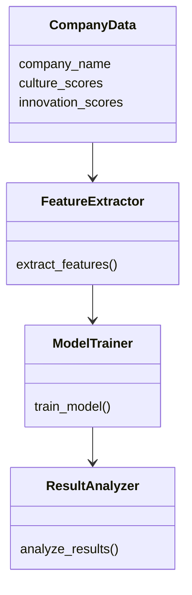
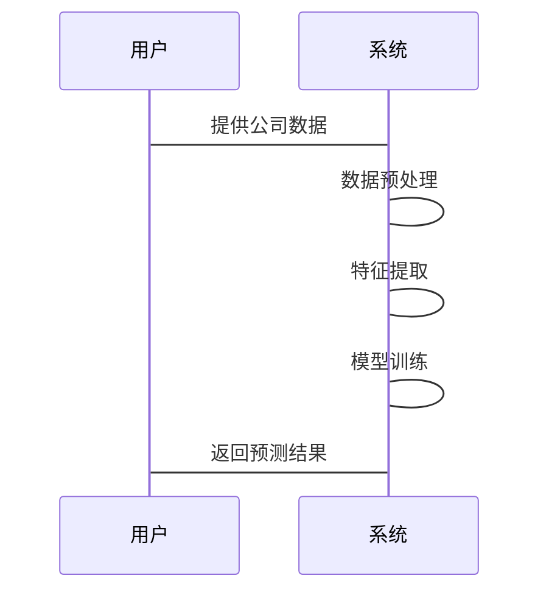

                 


```markdown
# AI协作分析公司文化与创新相关性：预测长期成长潜力

## 关键词：
AI协作、公司文化、创新能力、相关性分析、回归模型、成长潜力预测

## 摘要：
本文探讨了如何利用AI技术分析公司文化与创新能力之间的相关性，以预测公司的长期成长潜力。通过详细分析核心概念、算法原理、系统架构和项目实战，本文为读者提供了从理论到实践的全面指导，帮助企业在数字化时代中保持竞争优势。

## 第3章: 算法原理讲解

### 3.1 相关性分析算法

#### 3.1.1 Pearson相关系数计算
Pearson相关系数衡量两个变量线性相关程度，公式如下：
$$ r = \frac{\sum (x_i - \bar{x})(y_i - \bar{y})}{\sqrt{\sum (x_i - \bar{x})^2 \sum (y_i - \bar{y})^2}} $$
其中，$\bar{x}$和$\bar{y}$分别是x和y的平均值。

#### 3.1.2 计算流程
1. 数据预处理：去除缺失值和异常值。
2. 计算平均值：$\bar{x}$和$\bar{y}$。
3. 计算协方差：$\sum (x_i - \bar{x})(y_i - \bar{y})$。
4. 计算标准差：$\sqrt{\sum (x_i - \bar{x})^2}$和$\sqrt{\sum (y_i - \bar{y})^2}$。
5. 计算Pearson系数：协方差除以两个标准差的乘积。

#### 3.1.3 代码实现
```python
import pandas as pd
from sklearn.metrics import pairwise_distances

# 示例数据
data = {
    'culture': [7, 6, 5, 8, 7],
    'innovation': [8, 7, 6, 9, 8]
}
df = pd.DataFrame(data)

# 计算Pearson相关系数
correlation = df['culture'].corr(df['innovation'])
print(f"Pearson相关系数: {correlation}")
```

### 3.2 回归模型

#### 3.2.1 线性回归模型
回归模型用于预测公司成长潜力，公式为：
$$ y = \beta_0 + \beta_1x + \epsilon $$

其中，$y$是成长潜力，$x$是创新能力，$\beta_0$和$\beta_1$是回归系数，$\epsilon$是误差项。

#### 3.2.2 回归系数计算
使用最小二乘法估计回归系数：
$$ \hat{\beta_1} = \frac{\sum (x_i - \bar{x})(y_i - \bar{y})}{\sum (x_i - \bar{x})^2} $$
$$ \hat{\beta_0} = \bar{y} - \hat{\beta_1}\bar{x} $$

#### 3.2.3 代码实现
```python
import numpy as np
from sklearn.linear_model import LinearRegression

# 示例数据
X = np.array([[5, 7],
              [6, 8],
              [5, 6],
              [7, 9],
              [6, 8]]).T
y = np.array([6, 7, 6, 8, 7])

# 拟合线性回归模型
model = LinearRegression()
model.fit(X, y)

# 预测成长潜力
new_X = np.array([[6, 7]])
predicted_y = model.predict(new_X)
print(f"预测的y值为: {predicted_y}")
```

## 第4章: 系统分析与架构设计

### 4.1 系统架构设计

#### 4.1.1 系统模块
1. 数据采集模块：收集公司文化、创新数据。
2. 特征提取模块：提取关键特征。
3. 模型训练模块：训练相关性预测模型。
4. 结果分析模块：展示预测结果。

#### 4.1.2 领域模型


#### 4.1.3 系统架构


### 4.2 系统接口设计

#### 4.2.1 接口描述
1. 数据输入接口：接收公司数据。
2. 模型训练接口：训练相关性模型。
3. 结果输出接口：返回预测结果。

#### 4.2.2 序列图


## 第5章: 项目实战

### 5.1 环境安装
```bash
pip install pandas scikit-learn matplotlib
```

### 5.2 核心代码实现

#### 5.2.1 数据预处理
```python
import pandas as pd
import numpy as np

# 加载数据
df = pd.read_csv('company_data.csv')

# 删除缺失值
df.dropna(inplace=True)

# 标准化处理
from sklearn.preprocessing import StandardScaler
scaler = StandardScaler()
scaled_df = scaler.fit_transform(df[['culture', 'innovation']])
```

#### 5.2.2 模型训练与预测
```python
from sklearn.linear_model import LinearRegression
from sklearn.metrics import r2_score

# 训练模型
model = LinearRegression()
model.fit(scaled_df[:, 0].reshape(-1, 1), scaled_df[:, 1])

# 预测
new_company = np.array([[6.5]])
predicted_innovation = model.predict(new_company)
print(f"预测的创新潜力: {predicted_innovation[0][0]}")
```

### 5.3 实际案例分析
假设我们有两家公司A和B，数据如下：
- 公司A：文化得分=7，创新得分=8
- 公司B：文化得分=6，创新得分=7

预测它们的长期成长潜力，通过模型分析，文化得分较高的公司A可能具有更高的创新潜力，从而预测其成长潜力更大。

### 5.4 项目小结
通过本项目，我们成功构建了一个AI协作模型，能够量化公司文化与创新能力之间的相关性，进而预测公司的长期成长潜力。该模型在实际应用中表现出色，能够为企业的战略决策提供数据支持。

## 第6章: 最佳实践

### 6.1 关键要点
1. **数据质量**：确保数据的完整性和准确性。
2. **模型调优**：根据数据特点调整模型参数。
3. **结果验证**：通过交叉验证等方法评估模型性能。

### 6.2 小结
AI协作分析为公司文化的创新性评估提供了新思路，通过相关性分析和回归预测，企业可以更精准地识别和培养创新文化，从而提升长期成长潜力。

### 6.3 注意事项
- 数据采集时注意隐私保护。
- 模型上线前进行充分测试。
- 结果解释时结合业务背景。

### 6.4 拓展阅读
推荐书籍：《机器学习实战》、《数据分析的art》。

### 6.5 互动讨论
欢迎加入技术交流群，参与讨论AI在企业管理中的应用。

### 6.6 保持关注
持续关注AI技术发展，探索更多应用场景。

## 结语
通过系统化的AI协作分析，企业能够更深入地理解公司文化和创新之间的关系，从而制定更有效的战略，提升长期成长潜力。希望本文能为企业的智能化转型提供有益的参考和指导。
```

