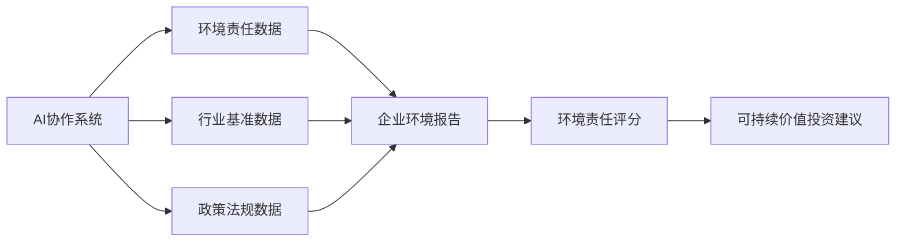
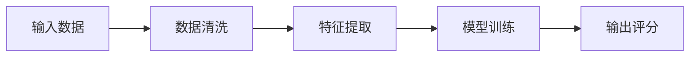
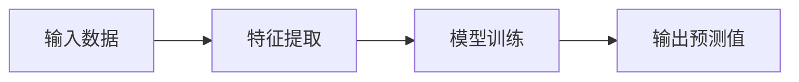
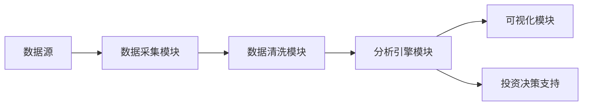
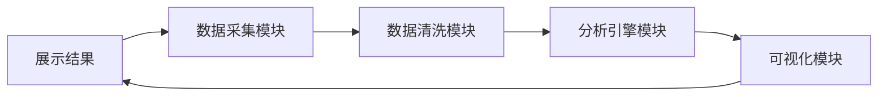

                 


# AI协作分析公司环境责任：可持续价值投资新维度

## 关键词
AI协作分析、环境责任、可持续价值投资、公司治理、风险管理、绿色金融

## 摘要
随着全球可持续发展和绿色金融的兴起，企业环境责任的重要性日益凸显。传统的环境责任分析依赖于人工数据收集和评估，耗时且容易出错。AI协作分析作为一种创新的方法，通过机器学习和自然语言处理等技术，能够高效、准确地评估企业的环境责任，并为可持续价值投资提供数据支持。本文将详细探讨AI协作分析的背景、核心概念、算法原理、系统架构、项目实战及最佳实践，揭示其在可持续价值投资中的新维度。

---

## 第一部分: AI协作分析的背景与概念

### 第1章: AI协作分析的背景与问题背景

#### 1.1 问题背景

##### 1.1.1 环境责任与可持续发展的重要性
在全球气候变化和环境保护的背景下，企业的环境责任已成为社会关注的焦点。企业通过减少碳排放、节约资源和减少污染，不仅能够降低运营成本，还能提升品牌形象和市场竞争力。环境责任的履行已成为企业可持续发展的重要组成部分。

##### 1.1.2 传统环境责任分析的局限性
传统的环境责任分析依赖于人工数据收集和评估，存在以下问题：
- **数据来源单一**：主要依赖企业的公开报告，数据范围有限。
- **分析效率低**：人工分析耗时长，难以及时响应市场变化。
- **主观性较强**：不同分析师可能得出不同的结论，缺乏客观性。

##### 1.1.3 AI协作分析在环境责任中的潜力
AI技术的应用能够显著提升环境责任分析的效率和准确性。通过自然语言处理（NLP）技术，AI可以自动提取企业公开报告中的环境信息；通过机器学习模型，AI能够预测企业的环境风险和可持续发展潜力。

#### 1.2 问题描述

##### 1.2.1 环境责任分析的核心问题
- 如何高效、准确地评估企业的环境责任？
- 如何利用AI技术构建智能化的环境责任分析系统？

##### 1.2.2 可持续价值投资的定义与目标
可持续价值投资是指将环境、社会和治理（ESG）因素纳入投资决策的过程，旨在实现长期的经济回报和社会价值。AI协作分析能够为投资者提供实时的环境数据和评估结果，帮助其做出更明智的投资决策。

##### 1.2.3 AI协作分析在环境责任中的具体应用
- 数据收集与清洗：利用AI技术自动收集和整理企业的环境数据。
- 风险评估：通过机器学习模型预测企业的环境风险。
- 投资决策支持：为投资者提供基于环境数据的投资建议。

#### 1.3 问题解决与边界

##### 1.3.1 AI协作分析的解决方案
- 数据驱动的环境责任评估系统。
- 基于机器学习的环境风险预测模型。
- 实时的环境数据监控与分析。

##### 1.3.2 解决方案的边界与限制
- 数据隐私和合规性问题：在处理企业数据时，需遵守相关法律法规。
- 模型的准确性和稳定性：AI模型需要不断优化以提高预测精度。
- 系统的可扩展性：需支持大规模数据处理和实时分析。

##### 1.3.3 解决方案的外延与扩展
- 支持多语言环境数据的分析。
- 与其他企业数据（如财务数据）进行关联分析。
- 提供个性化定制的环境责任评估报告。

#### 1.4 概念结构与核心要素

##### 1.4.1 AI协作分析的基本概念
AI协作分析是指通过人工智能技术，将企业环境数据与外部数据（如行业基准、政策法规）结合，进行智能化的环境责任评估和分析。

##### 1.4.2 环境责任分析的核心要素
- **环境数据**：企业的碳排放、资源消耗等数据。
- **行业基准**：行业内的环境表现标准。
- **政策法规**：相关环保政策和法规。

##### 1.4.3 可持续价值投资的维度与框架
- **环境因素**：企业的碳排放、能源使用情况。
- **社会因素**：员工权益、社区贡献。
- **治理因素**：企业治理结构、透明度。

---

## 第二部分: AI协作分析的核心概念与联系

### 第2章: 核心概念与联系

#### 2.1 AI协作分析的核心概念

##### 2.1.1 AI协作的基本原理
AI协作分析通过自然语言处理（NLP）和机器学习技术，自动提取和分析企业环境数据。例如，AI可以从企业的社会责任报告中提取碳排放数据，并与行业基准进行对比。

##### 2.1.2 环境责任分析的关键要素
- 数据来源：企业公开报告、政府数据、第三方机构数据。
- 数据清洗：对数据进行去噪和标准化处理。
- 数据分析：利用机器学习模型对数据进行建模和预测。

##### 2.1.3 可持续价值投资的评估标准
- 环境表现：企业的碳排放、能源使用效率。
- 社会责任：员工福利、社区贡献。
- 治理结构：董事会构成、企业透明度。

#### 2.2 核心概念的对比分析

##### 2.2.1 AI协作与传统协作的对比
| 对比维度 | AI协作 | 传统协作 |
|----------|--------|----------|
| 效率     | 高     | 低       |
| 准确性   | 高     | 中       |
| 可扩展性 | 高     | 低       |

##### 2.2.2 环境责任与社会责任的对比
| 对比维度 | 环境责任 | 社会责任 |
|----------|----------|----------|
| 范围     | 环境     | 社会     |
| 关注点   | 碳排放   | 员工权益 |

##### 2.2.3 可持续价值与传统价值的对比
| 对比维度 | 可持续价值 | 传统价值 |
|----------|------------|----------|
| 关注点   | ESG因素    | 财务表现  |
| 时间跨度 | 长期       | 短期      |

#### 2.3 实体关系图



---

## 第三部分: AI协作分析的算法原理

### 第3章: 算法原理与实现

#### 3.1 算法原理

##### 3.1.1 环境责任评分模型
环境责任评分模型通过对企业环境数据的分析，生成环境责任评分。模型基于以下因素：
- 碳排放强度
- 能源使用效率
- 废弃物处理情况

##### 3.1.2 可持续价值预测模型
可持续价值预测模型通过机器学习算法，预测企业的可持续价值。模型基于以下因素：
- 环境表现
- 社会责任
- 治理结构

##### 3.1.3 AI协作分析的算法选择
- 数据清洗与预处理：使用Python的pandas库。
- 特征提取：使用自然语言处理技术（如TF-IDF）。
- 模型训练：使用随机森林或支持向量机（SVM）进行分类或回归。

#### 3.2 算法实现

##### 3.2.1 环境责任评分模型的实现



代码示例：
```python
import pandas as pd
from sklearn.ensemble import RandomForestClassifier
from sklearn.metrics import accuracy_score

# 数据清洗
data = pd.read_csv('environment_data.csv')
data.dropna(inplace=True)

# 特征提取
features = data[['carbon_emissions', 'energy_usage', 'waste_generated']]
labels = data['environment_score']

# 模型训练
model = RandomForestClassifier(n_estimators=100)
model.fit(features, labels)

# 预测与评估
test_data = pd.read_csv('test_environment_data.csv')
test_features = test_data[['carbon_emissions', 'energy_usage', 'waste_generated']]
test_labels = test_data['environment_score']

predictions = model.predict(test_features)
print("准确率:", accuracy_score(test_labels, predictions))
```

##### 3.2.2 可持续价值预测模型的实现



代码示例：
```python
import pandas as pd
from sklearn.svm import SVC
from sklearn.metrics import accuracy_score

# 数据清洗
data = pd.read_csv('sustainable_value_data.csv')
data.dropna(inplace=True)

# 特征提取
features = data[['esg_score', 'financial_performance', 'risk_level']]
labels = data['sustainable_value']

# 模型训练
model = SVC(kernel='rbf', gamma=0.1, C=1)
model.fit(features, labels)

# 预测与评估
test_data = pd.read_csv('test_sustainable_value_data.csv')
test_features = test_data[['esg_score', 'financial_performance', 'risk_level']]
test_labels = test_data['sustainable_value']

predictions = model.predict(test_features)
print("准确率:", accuracy_score(test_labels, predictions))
```

#### 3.3 数学模型与公式

##### 3.3.1 环境责任评分模型
环境责任评分模型可以基于线性回归或随机森林模型。以下是线性回归的公式：
$$
\text{environment\_score} = \beta_0 + \beta_1 \times \text{carbon\_emissions} + \beta_2 \times \text{energy\_usage} + \beta_3 \times \text{waste\_generated} + \epsilon
$$

##### 3.3.2 可持续价值预测模型
可持续价值预测模型可以基于支持向量机（SVM）或随机森林模型。以下是随机森林模型的公式：
$$
\text{predicted\_value} = \text{ RandomForest}(\text{esg\_score, financial\_performance, risk\_level})
$$

---

## 第四部分: 系统分析与架构设计

### 第4章: 系统分析与架构设计

#### 4.1 系统问题场景介绍
系统需要实现以下功能：
- 自动化收集和处理企业环境数据。
- 生成环境责任评分和可持续价值预测报告。
- 提供实时的环境数据监控和分析。

#### 4.2 系统功能设计

##### 4.2.1 数据采集模块
- 从企业公开报告、政府数据和第三方机构获取环境数据。
- 数据清洗与预处理。

##### 4.2.2 分析引擎模块
- 使用机器学习模型进行环境责任评分和可持续价值预测。
- 生成环境责任报告和投资建议。

##### 4.2.3 可视化模块
- 提供环境数据的可视化界面。
- 展示环境责任评分和可持续价值预测结果。

#### 4.3 系统架构设计



#### 4.4 系统接口设计
- 数据采集接口：用于从外部数据源获取环境数据。
- 分析引擎接口：用于调用机器学习模型进行预测。
- 可视化界面接口：用于展示分析结果。

#### 4.5 系统交互设计



---

## 第五部分: 项目实战

### 第5章: 项目实战

#### 5.1 环境安装
- 安装Python和必要的库（pandas、scikit-learn、mermaid）。
- 安装Jupyter Notebook用于数据分析和可视化。

#### 5.2 核心代码实现

##### 5.2.1 数据清洗与预处理

```python
import pandas as pd

# 读取数据
data = pd.read_csv('environment_data.csv')

# 删除缺失值
data.dropna(inplace=True)

# 标准化处理
from sklearn.preprocessing import StandardScaler
scaler = StandardScaler()
scaled_features = scaler.fit_transform(data[['carbon_emissions', 'energy_usage', 'waste_generated']])
```

##### 5.2.2 模型训练与预测

```python
from sklearn.ensemble import RandomForestClassifier

# 训练模型
model = RandomForestClassifier(n_estimators=100)
model.fit(scaled_features, data['environment_score'])

# 预测
test_data = pd.read_csv('test_environment_data.csv')
test_features = test_data[['carbon_emissions', 'energy_usage', 'waste_generated']]
scaled_test_features = scaler.transform(test_features)
predictions = model.predict(scaled_test_features)
```

#### 5.3 案例分析与解读

##### 5.3.1 案例分析
假设我们有一个企业A，其碳排放为1000吨，能源使用为500万千瓦时，废弃物产生为200吨。通过模型预测，企业A的环境责任评分为85分，可持续价值评分为90分。

##### 5.3.2 分析解读
- 环境责任评分较高，表明企业在环境保护方面表现良好。
- 可持续价值评分较高，表明企业在可持续发展方面具有较高的投资价值。

---

## 第六部分: 最佳实践与总结

### 第6章: 最佳实践与总结

#### 6.1 最佳实践 tips
- 数据预处理是关键：确保数据的准确性和完整性。
- 模型选择要谨慎：根据数据特点选择合适的算法。
- 模型调优不可忽视：通过网格搜索优化模型参数。

#### 6.2 小结
通过本文的介绍，我们了解了AI协作分析在公司环境责任中的应用，包括背景、核心概念、算法原理、系统架构和项目实战。AI协作分析能够显著提升环境责任分析的效率和准确性，为可持续价值投资提供了新的维度。

#### 6.3 注意事项
- 数据隐私和合规性问题需要高度重视。
- 模型的准确性和稳定性需要不断优化。
- 系统的可扩展性和可维护性需要在设计阶段充分考虑。

#### 6.4 拓展阅读
- 《机器学习实战》：深入理解机器学习算法。
- 《绿色金融与可持续投资》：了解绿色金融的相关知识。

---

通过本文的详细讲解，读者可以全面掌握AI协作分析在公司环境责任中的应用，为未来的可持续价值投资提供有力的技术支持。

