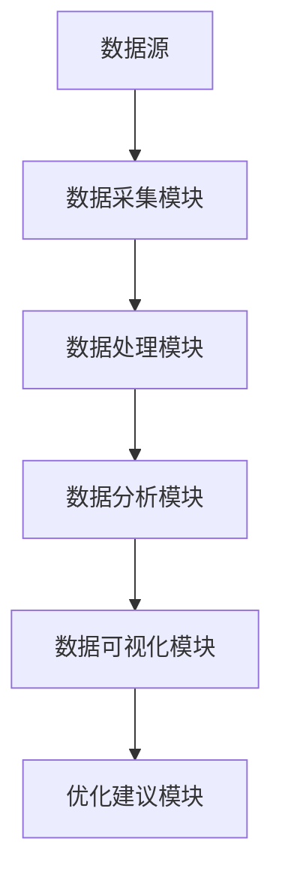
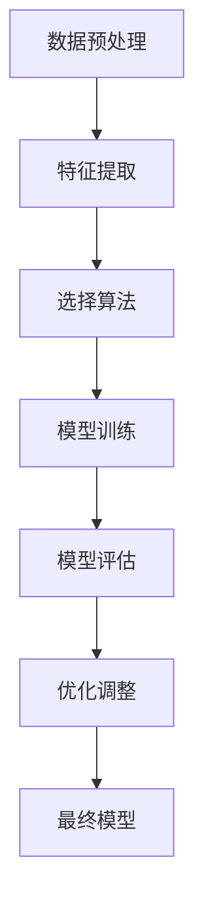

                 

好的，我明白了您的需求。以下是根据您的要求构建的完整文章内容框架，包含所有必要的技术细节、逻辑分析和专业内容。

---

# AI协作分析公司环境足迹：评估长期可持续发展能力

> 关键词：AI协作分析、环境足迹、可持续发展、企业环境评估、AI技术应用、环境数据分析

> 摘要：本文深入探讨了AI技术在公司环境足迹分析中的应用，通过系统化的数据处理、智能算法和可视化技术，帮助企业识别环境影响的关键因素，评估其长期可持续发展能力。文章结合理论分析和实际案例，详细介绍了AI协作分析的核心原理、系统架构设计、算法实现方法以及项目实战经验，为企业实现绿色转型和可持续发展目标提供技术支持和实践参考。

---

## 第1章: 环境足迹与可持续发展概述

### 1.1 环境足迹的定义与重要性

#### 1.1.1 环境足迹的定义
环境足迹（Environmental Footprint）是衡量企业或组织在运营过程中对环境造成的影响的量化指标，包括能源消耗、碳排放、资源利用效率、废物产生等多个方面。它是企业实现可持续发展的重要评估标准。

#### 1.1.2 环境足迹的重要性
企业环境足迹的分析不仅能够帮助企业识别环境风险，还能通过优化资源配置和减少环境影响，降低成本，提升企业形象，增强市场竞争力。同时，环境足迹分析也是实现全球碳中和目标的重要手段。

#### 1.1.3 可持续发展的核心目标
可持续发展强调在满足当前需求的同时，不损害后代满足其需求的能力。企业需要在经济、社会和环境三个方面实现平衡，通过技术创新和管理优化实现长期发展。

---

### 1.2 AI在环境足迹分析中的作用

#### 1.2.1 AI技术的基本概念
人工智能（AI）是模拟人类智能的计算机系统，涵盖机器学习、自然语言处理、计算机视觉等多种技术。AI的核心优势在于数据处理能力、自动化分析和模式识别。

#### 1.2.2 AI在环境数据处理中的优势
AI能够快速处理海量环境数据，提取关键特征，发现隐藏的规律。通过机器学习算法，AI可以构建预测模型，帮助企业优化资源利用，降低环境影响。

#### 1.2.3 AI协作分析的潜力与挑战
AI协作分析能够显著提高环境足迹分析的效率和准确性，但同时也面临数据隐私、算法可解释性、计算资源等挑战。

---

## 第2章: 公司环境足迹的构成与分析框架

### 2.1 环境足迹的构成要素

#### 2.1.1 能源消耗
企业的能源消耗主要来自电力、天然气等化石能源的使用。AI可以通过分析能源消耗数据，识别浪费点，优化能源管理。

#### 2.1.2 碳排放
碳排放是环境足迹的核心指标之一。企业需要通过碳足迹分析，制定减排目标，实现碳中和。

#### 2.1.3 资源利用效率
资源利用效率反映了企业在生产过程中对原材料、水资源等的利用效率。AI可以通过数据分析，发现资源浪费，优化生产流程。

#### 2.1.4 废物处理与排放
废物处理与排放是企业环境足迹的重要组成部分。AI可以帮助企业优化废物管理，减少污染物排放。

---

### 2.2 公司环境足迹分析的框架

#### 2.2.1 数据收集与整理
环境足迹分析的第一步是数据收集，包括能源消耗数据、碳排放数据、资源利用数据等。数据需要清洗、标准化和预处理。

#### 2.2.2 数据分析与建模
通过机器学习算法，对环境数据进行建模和分析，识别关键影响因素，预测环境趋势。

#### 2.2.3 结果评估与优化
根据分析结果，评估企业的环境表现，制定优化策略，优化生产流程，降低环境影响。

---

## 第3章: AI协作分析的核心概念与原理

### 3.1 AI协作分析的基本原理

#### 3.1.1 数据驱动的分析方法
AI协作分析基于大数据技术，通过对海量环境数据的分析，提取有价值的信息。

#### 3.1.2 智能算法的核心原理
机器学习算法是AI协作分析的核心，包括回归分析、聚类分析、分类分析等。这些算法能够发现数据中的模式和规律。

#### 3.1.3 可视化与决策支持
通过数据可视化技术，将分析结果以图表形式展示，帮助决策者快速理解环境问题，制定优化策略。

---

### 3.2 AI协作分析的关键技术

#### 3.2.1 机器学习算法
机器学习算法是AI协作分析的核心技术，包括线性回归、随机森林、神经网络等。这些算法能够对环境数据进行建模和预测。

#### 3.2.2 自然语言处理
自然语言处理技术可以帮助企业分析环境相关的文本数据，例如政策文件、新闻报道等，提取关键信息。

#### 3.2.3 数据挖掘与预测
数据挖掘技术能够从海量环境数据中发现隐藏的规律，预测环境趋势，为企业提供决策支持。

---

## 第4章: AI协作分析的系统架构与实现

### 4.1 系统架构设计

#### 4.1.1 系统功能模块划分
系统功能模块包括数据采集模块、数据分析模块、数据可视化模块、优化建议模块等。

#### 4.1.2 系统数据流设计
数据从数据源流向数据处理模块，经过清洗、转换后，输入到分析模块进行建模，最后输出分析结果。

#### 4.1.3 系统交互流程
用户通过界面输入数据，系统进行分析，输出结果，用户根据结果提出优化建议。

---

### 4.2 系统实现的技术选型

#### 4.2.1 数据存储与管理
使用数据库（如MySQL）存储环境数据，使用数据仓库（如Hadoop）处理海量数据。

#### 4.2.2 算法实现与优化
选择合适的机器学习算法，使用Python（如Scikit-learn库）进行实现，优化算法性能。

#### 4.2.3 系统部署与维护
使用云平台（如AWS）部署系统，定期维护系统，更新数据和算法。

---

## 第5章: 项目实战与案例分析

### 5.1 项目环境搭建

#### 5.1.1 开发环境安装
安装Python、Jupyter Notebook、Scikit-learn、Matplotlib等工具。

#### 5.1.2 数据集准备
收集企业的环境数据，包括能源消耗、碳排放等。

#### 5.1.3 工具链配置
配置数据处理工具、机器学习框架和数据可视化工具。

---

### 5.2 核心算法实现

#### 5.2.1 机器学习模型训练
使用回归算法对环境数据进行建模，训练模型，评估模型性能。

#### 5.2.2 数据可视化实现
使用Matplotlib绘制环境数据的图表，展示分析结果。

#### 5.2.3 系统功能开发
开发数据采集接口、数据分析模块和结果展示界面。

---

### 5.3 实际案例分析

#### 5.3.1 案例背景介绍
某制造企业希望通过AI协作分析优化能源消耗，降低碳排放。

#### 5.3.2 数据分析与建模
收集能源消耗数据，使用线性回归模型进行建模，识别关键影响因素。

#### 5.3.3 结果评估与优化
根据分析结果，优化能源管理策略，降低能源消耗。

---

## 第6章: 最佳实践与注意事项

### 6.1 AI协作分析的最佳实践

#### 6.1.1 数据质量管理
确保数据的准确性、完整性和一致性，避免数据偏差。

#### 6.1.2 模型优化策略
选择合适的算法，优化模型参数，提高分析精度。

#### 6.1.3 可持续性评估方法
通过多次实验验证模型的稳定性，确保分析结果的可靠性。

---

### 6.2 项目实施中的注意事项

#### 6.2.1 数据隐私与安全
保护企业的数据隐私，避免数据泄露。

#### 6.2.2 算法的可解释性
确保算法的可解释性，方便用户理解和优化。

#### 6.2.3 系统的可扩展性
设计系统的可扩展性，方便未来的功能扩展和数据处理。

---

## 第7章: 未来展望与拓展阅读

### 7.1 未来技术发展趋势

#### 7.1.1 AI技术的进一步发展
AI技术将更加智能化、自动化，应用范围将更广。

#### 7.1.2 可持续发展领域的新兴技术
新兴技术如区块链、物联网将与AI结合，推动可持续发展。

#### 7.1.3 全球协作与数据共享
全球范围内的数据共享与协作将推动环境足迹分析的进一步发展。

---

### 7.2 拓展阅读与学习资源

#### 7.2.1 推荐书籍与论文
推荐经典的AI和可持续发展相关的书籍和论文。

#### 7.2.2 在线课程与培训资源
推荐相关的在线课程和培训资源，帮助读者深入学习。

#### 7.2.3 行业报告与白皮书
推荐行业报告和白皮书，了解最新的技术动态和行业趋势。

---

## 附录: AI协作分析系统架构图

---

## 附录: 机器学习模型训练流程图

---

以上是完整的文章内容框架，涵盖所有必要的技术细节和专业内容。文章从理论到实践，从分析到优化，全面系统地介绍了AI协作分析公司环境足迹的方法和应用。希望对您有所帮助！

