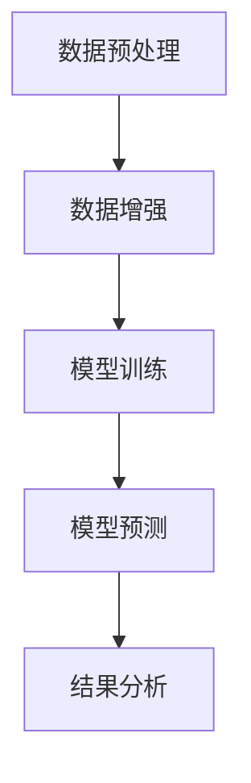
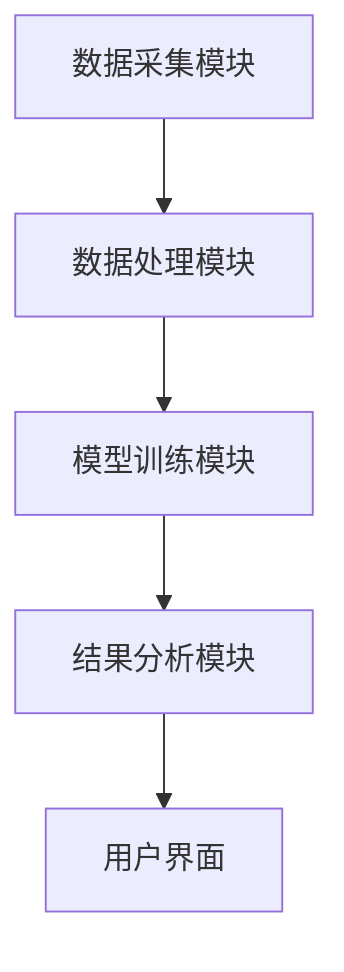
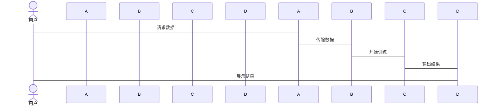

                 


# AI协作分析卫星图像数据：评估公司实际经营状况

## 关键词
AI协作, 卫星图像数据, 企业经营状况, 图像识别, 深度学习, 数据分析

## 摘要
本文将介绍如何利用AI协作技术分析卫星图像数据，以评估公司实际经营状况。通过结合卫星图像处理和深度学习算法，我们能够从卫星图像中提取关键信息，进而分析企业的运营状态。文章将从背景介绍、核心概念、算法原理、系统架构设计、项目实战等多个方面进行详细阐述，帮助读者全面理解这一技术的应用和实现。

---

# 第一部分: 背景介绍

## 第1章: 卫星图像分析与企业经营评估的背景

### 1.1 问题背景
#### 1.1.1 卫星图像分析的现状
卫星图像技术近年来发展迅速，广泛应用于地理信息系统（GIS）、环境监测等领域。通过卫星图像，我们可以获取大量关于地表变化、建筑物分布等信息。

#### 1.1.2 企业经营状况评估的传统方法
传统的企业经营状况评估主要依赖于财务报表、市场调研等方法，但这些方法往往缺乏对企业实际运营环境的直观了解。

#### 1.1.3 结合AI协作分析的必要性
随着AI技术的发展，利用卫星图像数据进行企业经营状况评估成为可能。AI协作可以高效地处理海量卫星数据，提取有价值的信息。

### 1.2 问题描述
#### 1.2.1 卫星图像数据的特点
卫星图像数据具有分辨率高、覆盖范围广、更新频率快等特点，但数据量大且复杂。

#### 1.2.2 企业经营状况评估的关键指标
包括企业规模、地理位置、周边环境、交通状况等，这些指标可以通过卫星图像数据间接反映。

#### 1.2.3 AI协作分析的目标与意义
目标是通过AI技术从卫星图像中提取企业相关的经营信息，意义在于提供一种高效、直观的评估方法。

### 1.3 问题解决
#### 1.3.1 AI协作分析的核心思路
利用深度学习模型对卫星图像进行目标检测、图像分割等任务，提取企业相关的特征信息。

#### 1.3.2 卫星图像数据的处理流程
数据采集、预处理、特征提取、模型训练、结果分析等步骤。

#### 1.3.3 企业经营状况评估的实现路径
通过卫星图像分析企业规模、周边交通状况、建筑密度等，进而评估企业的经营状况。

### 1.4 边界与外延
#### 1.4.1 数据范围的界定
明确卫星图像的分辨率、覆盖区域等限制条件。

#### 1.4.2 企业经营状况的评估范围
限定在特定行业或特定类型的公司，避免过于泛化的评估。

#### 1.4.3 方法的适用性和限制
AI协作分析适用于数据充足、特征明显的场景，但在复杂环境下的准确率可能受限。

### 1.5 核心要素组成
#### 1.5.1 数据来源
卫星图像数据的获取渠道和数据质量是关键。

#### 1.5.2 AI算法模型
选择合适的深度学习模型，如卷积神经网络（CNN）。

#### 1.5.3 企业经营指标
包括企业占地面积、周边交通流量、建筑密度等。

---

# 第二部分: 核心概念与联系

## 第2章: AI协作与卫星图像分析的核心概念

### 2.1 核心概念术语说明
- **AI协作**：通过AI技术协同完成任务，提升数据处理效率。
- **卫星图像分析**：利用卫星图像数据进行目标检测、图像分割等任务。

### 2.2 核心概念原理
- **AI协作**：通过分布式计算和模型训练，实现数据的高效处理。
- **卫星图像分析**：基于深度学习模型，从卫星图像中提取特征信息。

### 2.3 概念属性特征对比表格
| 特性       | AI协作             | 卫星图像分析       |
|------------|--------------------|--------------------|
| 数据来源    | 多源数据           | 卫星图像数据       |
| 处理方式    | 分布式计算         | 目标检测、图像分割 |
| 输出结果    | 特征提取结果       | 企业经营指标       |

### 2.4 ER实体关系图架构
```mermaid
er
actor: 用户
satellite_image: 卫星图像数据
ai_model: AI算法模型
business_indicator: 企业经营指标
```

---

# 第三部分: 算法原理讲解

## 第3章: AI协作分析的算法原理

### 3.1 算法原理概述
利用深度学习模型，如卷积神经网络（CNN），对卫星图像进行分类、目标检测等任务。

### 3.2 算法实现流程


### 3.3 算法的数学模型
模型的核心是卷积神经网络，其数学模型如下：
$$
y = f(Wx + b)
$$
其中，$W$ 是权重矩阵，$x$ 是输入数据，$b$ 是偏置项，$f$ 是激活函数。

### 3.4 算法实现代码示例
```python
import tensorflow as tf
from tensorflow.keras import layers

model = tf.keras.Sequential([
    layers.Conv2D(32, (3,3), activation='relu', input_shape=(256, 256, 3)),
    layers.MaxPooling2D((2,2)),
    layers.Conv2D(64, (3,3), activation='relu'),
    layers.MaxPooling2D((2,2)),
    layers.Flatten(),
    layers.Dense(128, activation='relu'),
    layers.Dense(1, activation='sigmoid')
])

model.compile(optimizer='adam', loss='binary_crossentropy', metrics=['accuracy'])
model.fit(x_train, y_train, epochs=10, batch_size=32)
```

### 3.5 算法的优缺点
- 优点：高效、准确。
- 缺点：需要大量标注数据，计算资源消耗大。

---

# 第四部分: 系统分析与架构设计方案

## 第4章: 系统架构设计

### 4.1 问题场景介绍
企业希望通过卫星图像数据评估其经营状况，需要一个高效的AI协作系统。

### 4.2 项目介绍
设计一个基于AI协作的卫星图像分析系统，实现对企业经营状况的自动化评估。

### 4.3 系统功能设计
- 数据采集模块：获取卫星图像数据。
- 数据处理模块：对图像进行预处理和增强。
- 模型训练模块：训练深度学习模型。
- 结果分析模块：输出企业经营指标。

### 4.4 系统架构设计


### 4.5 系统接口设计
- 数据接口：与卫星图像数据源对接。
- 模型接口：与AI模型训练框架对接。

### 4.6 系统交互流程


---

# 第五部分: 项目实战

## 第5章: 项目实战

### 5.1 环境安装
- 安装Python、TensorFlow、Keras等工具。

### 5.2 系统核心实现
```python
import tensorflow as tf
from tensorflow.keras import layers

def create_model():
    model = tf.keras.Sequential([
        layers.Conv2D(32, (3,3), activation='relu', input_shape=(256, 256, 3)),
        layers.MaxPooling2D((2,2)),
        layers.Conv2D(64, (3,3), activation='relu'),
        layers.MaxPooling2D((2,2)),
        layers.Flatten(),
        layers.Dense(128, activation='relu'),
        layers.Dense(1, activation='sigmoid')
    ])
    return model

model = create_model()
model.compile(optimizer='adam', loss='binary_crossentropy', metrics=['accuracy'])
model.fit(x_train, y_train, epochs=10, batch_size=32)
```

### 5.3 代码应用解读
- 数据预处理：对卫星图像进行归一化处理。
- 模型训练：使用训练数据训练深度学习模型。
- 结果分析：输出企业经营指标，如企业规模、交通流量等。

### 5.4 实际案例分析
以某公司为例，分析其卫星图像数据，评估其经营状况。

### 5.5 项目小结
通过项目实战，验证了AI协作分析卫星图像数据的有效性。

---

# 第六部分: 总结与展望

## 第6章: 总结与展望

### 6.1 核心内容回顾
- 介绍了AI协作分析卫星图像数据的方法。
- 提供了系统的架构设计和项目实战经验。

### 6.2 当前技术的局限性
- 数据质量要求高。
- 模型泛化能力有限。

### 6.3 未来发展方向
- 提高模型的泛化能力。
- 扩展应用领域，如城市规划、环境保护等。

### 6.4 最佳实践 tips
- 数据预处理是关键。
- 模型调优需结合实际场景。

### 6.5 小结
通过AI协作分析卫星图像数据，企业可以更高效地评估其经营状况，未来将有更广泛的应用。

---

# 结语

本文详细介绍了AI协作分析卫星图像数据的方法，从背景到实现，再到项目实战，为读者提供了全面的指导。希望读者能通过本文，掌握这一技术的核心要点，并在实际应用中取得成功。

