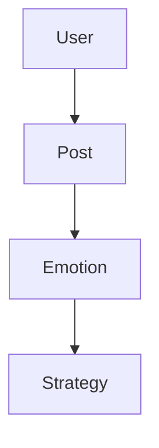
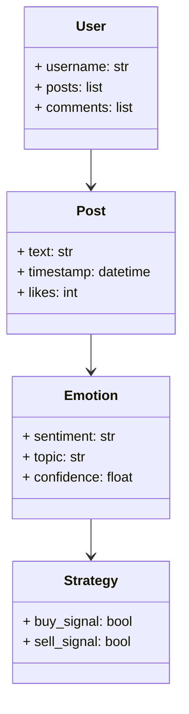

                 


# AI协作分析社交媒体情绪：增强价值投资的时机选择

## 关键词：社交媒体情绪分析，人工智能，价值投资，时机选择，情感计算，机器学习

## 摘要：  
本文探讨如何利用人工智能技术分析社交媒体情绪，以优化投资策略和时机选择。通过详细分析社交媒体数据，提取情绪特征，并结合市场趋势，构建一套基于AI的协作分析系统，帮助投资者做出更明智的决策。

---

# 第1章：背景介绍

## 1.1 问题背景  
- **社交媒体在投资中的作用**：社交媒体已成为投资者获取市场情绪的重要来源，用户的评论、帖子和互动反映了市场参与者的真实情感。  
- **情绪分析的挑战**：社交媒体数据具有多样性、噪声多、情感表达复杂等特点，如何准确提取情绪特征是关键。  
- **时机选择的重要性**：在价值投资中，选择合适的买入和卖出时机能够显著提升收益，而情绪分析为时机选择提供了新的视角。  

## 1.2 问题描述  
- **数据复杂性**：社交媒体数据包括文本、图片、视频等多种形式，如何高效处理这些数据是挑战。  
- **情绪分析的准确性**：现有方法在处理复杂情感表达（如讽刺、双关）时仍存在局限性。  
- **时机选择的不确定性**：情绪数据与实际市场走势之间存在滞后和偏差，如何建立两者之间的关联是关键。  

## 1.3 问题解决思路  
- **利用AI技术提取情绪特征**：通过自然语言处理（NLP）技术，提取社交媒体中的情绪信息。  
- **优化投资策略**：结合情绪数据和市场趋势，制定更精准的投资策略。  
- **提升时机选择能力**：基于情绪数据的时间序列分析，优化买入和卖出时机。  

## 1.4 边界与外延  
- **数据范围**：主要关注社交媒体文本数据，暂不考虑图片和视频。  
- **适用场景**：适用于股票、基金等金融资产的投资决策。  
- **限制条件**：情绪分析结果仅供参考，不构成直接投资建议。  

## 1.5 核心概念与组成  
- **社交媒体数据**：用户发布的内容，包括文本、评论、点赞等。  
- **情绪分析**：通过AI技术对社交媒体数据进行情感分类，提取情绪特征。  
- **时机选择系统**：基于情绪数据和市场数据，优化投资时机的决策系统。  

---

# 第2章：核心概念与联系

## 2.1 核心概念原理  
- **情感计算**：通过AI技术分析文本中的情感倾向，通常分为正面、负面和中性三类。  
- **主题建模**：识别社交媒体数据中的主要主题，帮助理解市场关注点。  
- **情绪传播**：分析情绪在社交媒体上的传播路径，预测市场情绪变化。  

## 2.2 概念属性对比表  
| 概念       | 属性           | 描述                                             |  
|------------|----------------|-------------------------------------------------|  
| 社交媒体数据 | 数据类型       | 文本、评论、点赞、分享                           |  
| 情绪分析   | 方法           | 基于规则的分析、机器学习模型                     |  
| 时机选择   | 目标           | 确定最佳买入和卖出时机                         |  

## 2.3 ER实体关系图  


---

# 第3章：算法原理讲解

## 3.1 算法流程  
- **数据预处理**：去除停用词、标点符号，分词处理。  
- **特征提取**：使用TF-IDF提取关键词，构建特征向量。  
- **模型训练**：基于机器学习（如SVM、随机森林）训练情感分类模型。  
- **结果预测**：对社交媒体数据进行情感分类，生成情绪时间序列。  

## 3.2 算法实现代码  
```python
import numpy as np
from sklearn.feature_extraction.text import TfidfVectorizer
from sklearn.svm import SVC

# 数据预处理
def preprocess(text):
    return text.lower().replace(',', ' ').replace('.', ' ')

# 特征提取
vectorizer = TfidfVectorizer(max_features=1000)
X = vectorizer.fit_transform(posts)

# 模型训练
model = SVC()
model.fit(X.toarray(), labels)

# 预测
test_text = preprocess("I love this stock!")
test_vec = vectorizer.transform([test_text])
prediction = model.predict(test_vec.toarray())
print(prediction)
```

## 3.3 数学模型  
- **情感分类模型**：基于支持向量机（SVM）的分类器，优化目标函数为：  
  $$ \text{minimize} \frac{1}{2}||w||^2 + C \sum_{i=1}^n \xi_i $$
- **主题建模**：使用LDA（Latent Dirichlet Allocation）模型，概率公式为：  
  $$ P(\text{topic} | \text{document}) = \frac{\exp(\beta_{\text{topic}})}{\sum_{k} \exp(\beta_{k})} $$  

---

# 第4章：系统分析与架构设计

## 4.1 问题场景介绍  
- **目标用户**：投资者、金融分析师  
- **目标任务**：实时监测社交媒体情绪，优化投资决策  
- **核心需求**：快速处理社交媒体数据，生成情绪分析报告  

## 4.2 系统功能设计  


## 4.3 系统架构设计  
```mermaid
graph TD
    API-->[社交媒体数据]
    API-->[市场数据]
    API-->[用户数据]
    API-->[情绪分析模块]
    API-->[时机选择模块]
    API-->[结果输出]
```

---

# 第5章：项目实战

## 5.1 环境安装  
- **Python 3.8+**  
- **库依赖**：numpy、scikit-learn、nltk、pandas  

## 5.2 核心代码实现  
```python
import pandas as pd
from sklearn.model_selection import train_test_split
from sklearn.metrics import accuracy_score

# 数据加载
df = pd.read_csv('social_media_data.csv')

# 数据分割
X_train, X_test, y_train, y_test = train_test_split(df['text'], df['label'], test_size=0.2)

# 模型训练
from sklearn.svm import SVC
model = SVC()
model.fit(X_train, y_train)

# 模型评估
y_pred = model.predict(X_test)
print(accuracy_score(y_test, y_pred))
```

## 5.3 代码解读与分析  
- **数据加载**：读取CSV文件中的社交媒体数据。  
- **数据分割**：将数据分为训练集和测试集。  
- **模型训练**：使用SVM模型训练情感分类器。  
- **模型评估**：计算准确率，评估模型性能。  

## 5.4 实际案例分析  
- **案例背景**：假设某科技股在社交媒体上的情绪突然转向负面，如何影响其股价走势。  
- **分析过程**：提取情绪数据，结合市场数据，预测股价变化。  
- **结论**：基于情绪分析，投资者可能提前卖出，避免损失。  

---

# 第6章：最佳实践

## 6.1 小结  
- 本文介绍了如何利用AI技术分析社交媒体情绪，优化投资策略和时机选择。  
- 通过算法实现和系统设计，展示了情绪分析在投资中的实际应用价值。  

## 6.2 注意事项  
- **数据质量**：确保社交媒体数据的完整性和准确性。  
- **模型优化**：不断优化情感分类模型，提升分析精度。  
- **风险控制**：情绪分析仅作为参考，需结合其他市场指标综合判断。  

## 6.3 拓展阅读  
- 《机器学习在金融中的应用》  
- 《自然语言处理在社交媒体分析中的实践》  

---

通过以上步骤，我们详细探讨了AI协作分析社交媒体情绪的理论与实践，为投资者提供了新的工具和方法，帮助他们在复杂多变的市场中做出更明智的决策。

