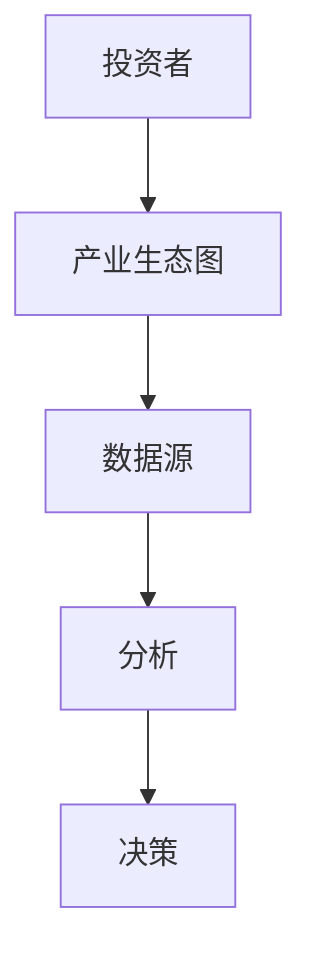
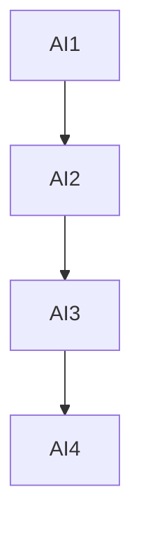
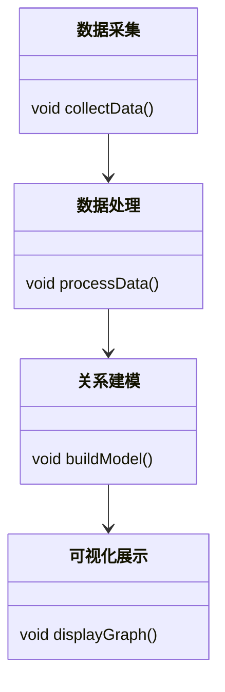

                 


# AI协作构建动态产业生态图：全面把握投资环境

---

## 关键词：
- AI协作
- 产业生态图
- 投资环境
- 动态系统
- 数据分析

---

## 摘要：
本文探讨了AI协作在构建动态产业生态图中的作用，以及如何通过AI技术全面把握投资环境。文章从AI协作的基本概念出发，分析了产业生态图的构建过程和动态特征，结合算法原理和系统架构设计，详细阐述了AI在投资环境分析中的应用。最后，通过实际案例展示了AI协作在动态产业生态图中的实战应用，并总结了最佳实践和未来发展方向。

---

# 第一章: AI协作与产业生态图概述

## 1.1 AI协作的基本概念
### 1.1.1 什么是AI协作
AI协作是指多个AI系统或算法之间通过协同工作，共同完成复杂任务的过程。其核心在于通过信息共享和任务分配，实现整体目标的最优解。

### 1.1.2 AI协作的核心要素
- **信息共享**：AI系统之间共享数据和知识。
- **任务分配**：根据AI系统的能力，分配合适的任务。
- **协同决策**：通过多AI系统的协作，做出最优决策。

### 1.1.3 AI协作的边界与外延
AI协作的边界在于其应用场景和任务类型。外延则包括AI在各个领域的应用，如金融、医疗、教育等。

## 1.2 产业生态图的构建
### 1.2.1 产业生态图的定义
产业生态图是对一个产业内各参与方及其关系的可视化表示，包括企业、供应商、客户、合作伙伴等。

### 1.2.2 产业生态图的构建过程
1. **数据收集**：收集产业内各方的数据。
2. **数据清洗**：去除噪声数据，确保数据质量。
3. **关系建模**：建立产业内各参与方之间的关系模型。
4. **可视化**：将关系模型可视化为产业生态图。

### 1.2.3 产业生态图的动态特征
产业生态图是一个动态系统，随着时间的推移，产业内的关系和结构会发生变化。

## 1.3 投资环境的全面把握
### 1.3.1 投资环境的定义
投资环境是指影响投资活动的各种外部因素，包括经济、政治、社会、技术等。

### 1.3.2 投资环境的分析方法
- **定量分析**：通过数据和指标进行分析。
- **定性分析**：通过专家意见和案例分析进行评估。

### 1.3.3 AI在投资环境分析中的作用
AI可以通过大数据分析和预测模型，帮助投资者更好地把握投资环境的变化趋势。

---

# 第二章: AI协作的核心概念与联系

## 2.1 AI协作的核心概念
### 2.1.1 AI协作的原理
AI协作通过信息共享和任务分配，实现多个AI系统之间的协同工作。

### 2.1.2 AI协作的关键属性
- **可扩展性**：支持大规模任务。
- **智能化**：具备自主学习和优化能力。
- **鲁棒性**：能够应对复杂和不确定性。

### 2.1.3 AI协作的特征对比表格

| 特性 | 单点AI | 协作AI |
|------|--------|--------|
| 性能 | 单一性能 | 集成性能 |
| 资源利用率 | 低 | 高 |
| 适应性 | 较低 | 较高 |

## 2.2 产业生态图与投资环境的关系
### 2.2.1 产业生态图的实体关系图（ER图）
```mermaid
er
  actor: 投资者, 企业, 供应商
  entity: 产业生态图
  relation: 参与, 依赖, 合作
```

### 2.2.2 产业生态图与投资环境的关联流程图（Mermaid）


---

# 第三章: AI协作的算法原理

## 3.1 图谱构建算法
### 3.1.1 图谱构建的基本原理
图谱构建通过节点和边的连接关系，构建一个网络图。

### 3.1.2 图谱构建的数学模型
$$ G = (V, E) $$
其中，$V$ 表示节点集合，$E$ 表示边集合。

## 3.2 关联规则挖掘算法
### 3.2.1 关联规则挖掘的原理
关联规则挖掘用于发现数据中的关联关系，如频繁项集和关联规则。

### 3.2.2 关联规则挖掘的数学公式
$$ support(A \rightarrow B) = \frac{count(A \cap B)}{total \, transactions} $$

## 3.3 群智协同算法
### 3.3.1 群智协同的基本原理
群智协同通过多个个体的协作，实现整体的智能目标。

### 3.3.2 群智协同的流程图（Mermaid）


---

# 第四章: 系统分析与架构设计

## 4.1 系统功能设计
### 4.1.1 问题场景介绍
我们希望通过AI协作构建动态产业生态图，帮助投资者全面把握投资环境。

### 4.1.2 系统功能设计
- **数据采集**：采集产业内的数据。
- **数据处理**：清洗和预处理数据。
- **关系建模**：建立产业生态图的关系模型。
- **可视化展示**：将产业生态图可视化。

### 4.1.3 系统功能设计的类图（Mermaid）


## 4.2 系统架构设计
### 4.2.1 系统架构设计
系统架构采用分层设计，包括数据层、逻辑层和应用层。

### 4.2.2 系统架构设计的架构图（Mermaid）
```mermaid
archi
    client --> server
    server --> database
    server --> worker
    worker --> database
```

---

# 第五章: 项目实战

## 5.1 环境安装
### 5.1.1 系统环境要求
- 操作系统：Windows/Linux/OS X
- Python版本：3.6+
- 依赖库：numpy, pandas, networkx, matplotlib

### 5.1.2 安装依赖
```bash
pip install numpy pandas networkx matplotlib
```

## 5.2 核心代码实现
### 5.2.1 图谱构建代码
```python
import networkx as nx
G = nx.Graph()
G.add_nodes_from(["A", "B", "C"])
G.add_edges_from([("A", "B"), ("B", "C")])
nx.draw(G)
plt.show()
```

### 5.2.2 关联规则挖掘代码
```python
from itertools import combinations

def get_support(dataset, item):
    count = 0
    for transaction in dataset:
        if all(i in transaction for i in item):
            count += 1
    return count / len(dataset)

dataset = [["A", "B"], ["B", "C"], ["A", "B", "C"]]
items = ["A", "B", "C"]
support = {}
for l in range(1, 4):
    for subset in combinations(items, l):
        support[frozenset(subset)] = get_support(dataset, subset)
print(support)
```

## 5.3 实际案例分析
### 5.3.1 案例背景
假设我们有一个产业，包含企业、供应商和客户。

### 5.3.2 案例分析
通过构建产业生态图，我们发现企业与供应商之间的关系最为紧密。

---

# 第六章: 最佳实践、小结、注意事项和拓展阅读

## 6.1 最佳实践
- **数据质量**：确保数据的准确性和完整性。
- **模型优化**：定期优化AI协作算法。
- **系统维护**：定期更新系统和数据。

## 6.2 小结
本文详细探讨了AI协作在构建动态产业生态图中的作用，并通过实际案例展示了其在投资环境分析中的应用。

## 6.3 注意事项
- AI协作需要多个系统的协同工作。
- 数据隐私和安全问题需要高度重视。

## 6.4 拓展阅读
- 推荐阅读《人工智能：一种现代的方法》。
- 关注相关领域的最新研究成果。

---

# 结语
通过本文的探讨，我们希望读者能够全面了解AI协作在构建动态产业生态图中的重要作用，并能够将这些方法应用于实际的投资环境分析中。未来，随着AI技术的不断发展，AI协作将发挥更大的作用。

