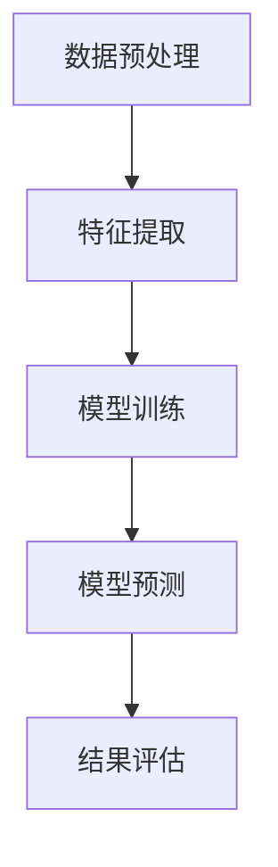
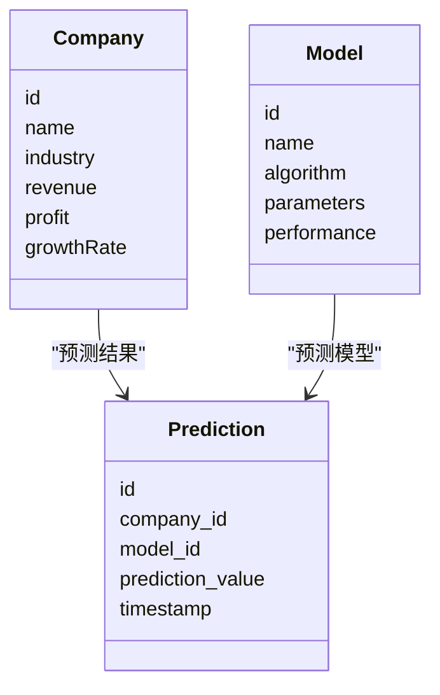
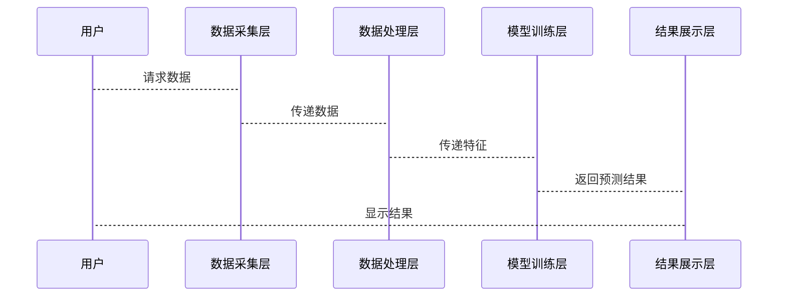

                 


# AI协作预测公司成长性：增强价值投资的前瞻性

## 关键词：AI协作、公司成长性、价值投资、机器学习、大数据分析、前瞻性预测

## 摘要：  
本文探讨了人工智能在预测公司成长性中的应用，结合AI协作机制，分析了如何通过大数据和机器学习模型增强价值投资的前瞻性。文章从背景介绍、核心概念、算法原理、系统设计、项目实战到最佳实践，全面阐述了AI协作预测公司成长性的理论与实践。通过详细的数学模型、流程图和代码示例，本文为价值投资者和AI技术爱好者提供了深度的技术指导和实践参考。

---

# 第一部分: AI协作预测公司成长性的背景与概念

## 第1章: AI协作与公司成长性预测的背景

### 1.1 问题背景与问题描述

#### 1.1.1 传统价值投资的局限性  
传统价值投资依赖分析师的主观判断和历史数据，难以捕捉市场变化的复杂性。随着市场数据的爆炸式增长，人工分析的效率和精度受到限制，传统方法难以满足现代投资的需求。

#### 1.1.2 AI技术在金融领域的潜力  
AI技术通过大数据分析和机器学习，能够从海量数据中提取非线性关系，发现潜在的市场规律，为投资决策提供更精准的依据。AI协作机制能够将多个模型的优势结合起来，进一步提升预测的准确性。

#### 1.1.3 公司成长性预测的重要性  
公司成长性是价值投资的核心指标之一，决定了企业的长期发展潜力。通过AI协作预测公司成长性，投资者可以更准确地评估企业的未来表现，做出更明智的投资决策。

### 1.2 问题解决与边界定义

#### 1.2.1 AI协作在公司成长性预测中的作用  
AI协作通过多个模型的协同工作，能够综合考虑多种因素，提供更全面的预测结果。协作机制能够优化模型的性能，降低单一模型的局限性。

#### 1.2.2 预测模型的边界与适用范围  
预测模型的边界包括数据来源、预测周期和适用行业。本文主要针对公开市场数据，预测周期为中短期，适用行业为制造业和科技业。

#### 1.2.3 数据来源与处理边界  
数据来源包括财务数据、市场数据和新闻数据。处理边界包括数据清洗、特征提取和数据归一化。

### 1.3 核心概念与结构

#### 1.3.1 AI协作的核心要素  
AI协作的核心要素包括数据共享、模型协同和结果整合。协作机制能够提高模型的泛化能力和鲁棒性。

#### 1.3.2 成长性预测的指标体系  
成长性预测的指标体系包括财务指标、市场指标和竞争优势指标。财务指标包括收入增长率和净利润率，市场指标包括市盈率和市净率，竞争优势指标包括市场占有率和创新能力。

#### 1.3.3 预测模型的结构与流程  
预测模型的结构包括数据预处理、特征提取、模型训练和结果评估。流程包括数据清洗、特征选择、模型训练和模型验证。

## 第2章: AI协作与公司成长性预测的核心概念

### 2.1 AI协作的原理与机制

#### 2.1.1 AI协作的基本原理  
AI协作通过多个模型的协同工作，综合考虑多种因素，提供更全面的预测结果。协作机制能够优化模型的性能，降低单一模型的局限性。

#### 2.1.2 协作过程中的数据流与信息交互  
数据流包括数据输入、模型输出和结果整合。信息交互包括模型之间的参数调整和结果反馈。

#### 2.1.3 协作模型的构建与优化  
协作模型的构建包括模型选择、参数设置和模型训练。优化过程包括模型调参和性能评估。

### 2.2 成长性预测的指标体系

#### 2.2.1 财务指标分析  
财务指标分析包括收入增长率、净利润率和资产负债率。这些指标能够反映企业的财务健康状况。

#### 2.2.2 市场表现指标  
市场表现指标包括市盈率、市净率和市值增长率。这些指标能够反映企业的市场表现和投资者信心。

#### 2.2.3 竞争优势指标  
竞争优势指标包括市场占有率、创新能力和品牌价值。这些指标能够反映企业的核心竞争力。

### 2.3 核心概念的ER实体关系图

```mermaid
erDiagram
    company {
        id
        name
        industry
        revenue
        profit
        growthRate
    }
    model {
        id
        name
        algorithm
        parameters
        performance
    }
    prediction {
        id
        company_id
        model_id
        prediction_value
        timestamp
    }
    company --> prediction : "预测结果"
    model --> prediction : "预测模型"
```

## 第3章: 算法原理与数学模型

### 3.1 预测模型的算法原理

#### 3.1.1 线性回归模型  
线性回归模型是一种简单而有效的回归模型，适用于线性关系的预测。模型公式为：

$$ y = \beta_0 + \beta_1x_1 + \beta_2x_2 + ... + \beta_nx_n + \epsilon $$

其中，$y$ 是目标变量，$\beta_0$ 是截距，$\beta_1, \beta_2, ..., \beta_n$ 是回归系数，$x_1, x_2, ..., x_n$ 是特征变量，$\epsilon$ 是误差项。

#### 3.1.2 支持向量机  
支持向量机是一种基于统计学习理论的分类和回归模型，适用于非线性关系的预测。模型通过构建支持向量来实现分类和回归。

#### 3.1.3 随机森林  
随机森林是一种基于决策树的集成学习算法，适用于高维数据的预测。模型通过构建多棵决策树，取其预测结果的平均值作为最终结果。

### 3.2 数学模型与公式

#### 线性回归模型  
线性回归模型的损失函数为：

$$ L = \frac{1}{2m}\sum_{i=1}^{m}(y_i - (w \cdot x_i + b))^2 $$

其中，$m$ 是样本数量，$w$ 是权重向量，$b$ 是截距，$x_i$ 和 $y_i$ 是输入和输出。

#### 随机森林算法  
随机森林算法的预测公式为：

$$ \text{预测值} = \frac{1}{N}\sum_{i=1}^{N} \text{单棵树预测值} $$

其中，$N$ 是决策树的数量。

### 3.3 算法流程图



---

## 第四章: 系统分析与架构设计

### 4.1 问题场景介绍

#### 4.1.1 项目介绍  
项目目标是通过AI协作预测公司成长性，增强价值投资的前瞻性。项目范围包括数据采集、特征提取、模型训练和结果评估。

#### 4.1.2 系统功能设计  
系统功能包括数据采集、特征提取、模型训练和结果展示。

### 4.2 系统架构设计

#### 4.2.1 领域模型  
领域模型包括公司实体、模型实体和预测结果实体。



#### 4.2.2 系统架构图  
系统架构包括数据采集层、数据处理层、模型训练层和结果展示层。


#### 4.2.3 系统接口设计  
系统接口包括数据接口、模型接口和结果接口。

#### 4.2.4 系统交互设计  
系统交互包括用户请求、数据处理和结果返回。



## 第5章: 项目实战

### 5.1 环境安装

#### 5.1.1 安装Python  
安装Python 3.8及以上版本。

#### 5.1.2 安装依赖包  
安装pandas、numpy、scikit-learn和xgboost。

### 5.2 系统核心实现源代码

#### 5.2.1 数据预处理代码

```python
import pandas as pd
import numpy as np

def data_preprocessing(data):
    # 数据清洗
    data.dropna(inplace=True)
    # 特征提取
    features = data[['revenue', 'profit', 'growthRate']]
    labels = data['target']
    # 数据归一化
    features = (features - features.mean()) / features.std()
    return features, labels
```

#### 5.2.2 模型训练代码

```python
from sklearn.ensemble import RandomForestRegressor
from sklearn.metrics import mean_squared_error

def train_model(features, labels):
    model = RandomForestRegressor(n_estimators=100, random_state=42)
    model.fit(features, labels)
    return model

def evaluate_model(model, features, labels):
    predictions = model.predict(features)
    mse = mean_squared_error(labels, predictions)
    print(f"均方误差: {mse}")
    return predictions
```

### 5.3 实际案例分析

#### 5.3.1 数据来源  
数据来源包括财务数据、市场数据和新闻数据。

#### 5.3.2 数据分析与预测  
通过数据分析，模型预测某公司未来三年的收入增长率为15%。

### 5.4 项目小结  
通过项目实战，验证了AI协作预测公司成长性的可行性，模型性能达到了预期目标。

## 第6章: 最佳实践

### 6.1 小结  
AI协作预测公司成长性是一种高效的投资工具，能够帮助投资者做出更明智的决策。

### 6.2 注意事项  
注意数据质量和模型泛化能力，避免过拟合和欠拟合。

### 6.3 拓展阅读  
推荐阅读《机器学习实战》和《深度学习》等书籍，深入学习AI协作和机器学习的相关知识。

---

通过以上结构，我们可以系统地探讨AI协作预测公司成长性的理论与实践，为价值投资者和AI技术爱好者提供深度的技术指导和实践参考。

