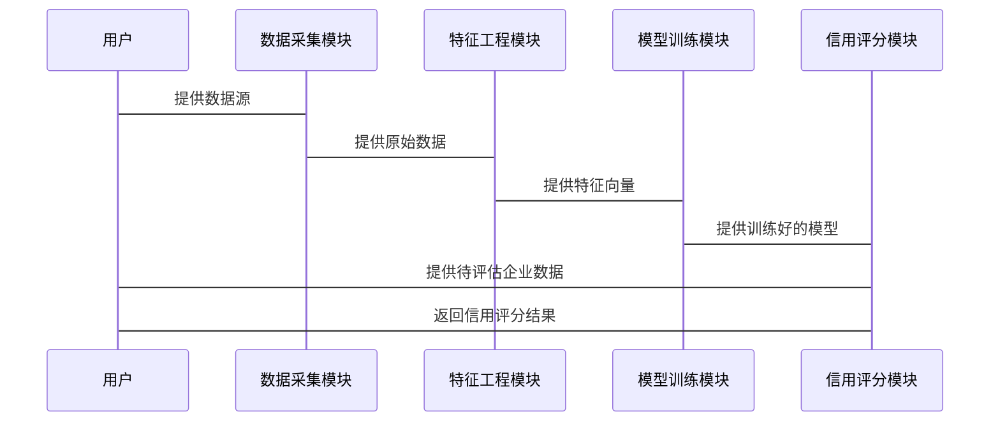

                 


# AI在企业信用评级中的应用与挑战

> 关键词：企业信用评级，人工智能，机器学习，信用风险，金融技术

> 摘要：本文探讨了人工智能技术在企业信用评级中的应用，分析了AI在信用评级中的优势、挑战和未来发展趋势。通过详细介绍AI技术的核心算法、系统架构和实际案例，展示了如何利用AI提升信用评级的准确性和效率。

---

# 第1章: 企业信用评级概述

## 1.1 企业信用评级的定义与重要性

### 1.1.1 企业信用评级的定义

企业信用评级是指通过对企业财务状况、经营能力和信用历史等多方面因素的综合评估，对其在一定时期内履行债务能力的等级评定。信用评级结果通常以信用等级（如AAA、AA、A、BBB、BB、B、CCC、CC、C、D）的形式表示，反映了企业在偿还债务方面的风险程度。

### 1.1.2 企业信用评级的重要性

企业信用评级是企业融资活动中的重要环节，直接影响企业的融资成本和融资能力。信用评级高的企业更容易获得低成本的资金，而信用评级低的企业可能面临较高的融资成本或被限制融资。此外，信用评级还能帮助投资者、债权人和金融机构更好地评估企业的信用风险，从而做出更合理的投资决策。

### 1.1.3 企业信用评级的分类与标准

企业信用评级可以分为外部评级和内部评级。外部评级是由专业的评级机构（如穆迪、标普、惠誉等）对企业进行的评级，具有较高的公信力；内部评级则是企业内部基于自身数据和模型进行的信用评估。信用评级的标准通常基于企业的财务状况、经营稳定性、行业风险、管理能力和市场环境等多个维度。

## 1.2 AI在金融领域的应用背景

### 1.2.1 人工智能在金融行业的应用现状

人工智能技术在金融领域的应用已经非常广泛，包括股票交易、风险管理、信用评估、欺诈 detection 等多个方面。AI技术的引入极大地提高了金融行业的效率和准确性，同时也降低了成本。

### 1.2.2 AI技术在信用评级中的潜力

AI技术在信用评级中的潜力主要体现在以下几个方面：

1. **数据处理能力**：AI可以快速处理大量非结构化数据，如文本、语音和图像数据，从而提取更多有价值的信息。
2. **预测能力**：通过机器学习算法，AI可以预测企业的信用风险，提高评级的准确性。
3. **实时性**：AI可以实时监控企业的经营状况和市场环境变化，及时调整信用评级。

### 1.2.3 企业信用评级与AI技术的结合

企业信用评级与AI技术的结合主要体现在以下几个方面：

1. **数据采集与分析**：AI可以帮助企业快速采集和分析大量的财务数据、市场数据和行业数据，从而提供更全面的信用评估。
2. **模型构建与优化**：AI技术可以用于构建和优化信用评级模型，提高模型的准确性和鲁棒性。
3. **自动化评估**：通过AI技术，信用评级可以实现自动化，减少人工干预，提高效率。

## 1.3 本章小结

本章主要介绍了企业信用评级的定义、重要性和分类，以及AI技术在金融领域的应用背景。通过分析AI在信用评级中的潜力，我们可以看到，AI技术可以显著提高信用评级的效率和准确性。

---

# 第2章: 信用评级的核心要素与AI的结合

## 2.1 企业信用评级的核心要素

### 2.1.1 企业财务状况

企业的财务状况是信用评级的重要依据之一，包括资产负债表、利润表和现金流等财务数据。通过分析企业的财务状况，可以评估企业的偿债能力和经营稳定性。

### 2.1.2 企业经营状况

企业的经营状况包括企业的业务模式、市场地位、竞争优势和管理能力等方面。通过分析企业的经营状况，可以评估企业在市场中的竞争力和未来发展潜力。

### 2.1.3 企业信用历史

企业的信用历史是指企业在过去的信用交易中的表现，包括按时还款、违约记录等。信用历史是评估企业信用风险的重要依据。

## 2.2 AI技术在信用评级中的应用原理

### 2.2.1 数据采集与预处理

AI技术在信用评级中的应用首先需要采集大量相关数据，包括企业的财务数据、市场数据和行业数据等。数据采集后需要进行预处理，包括数据清洗、数据转换和数据增强等步骤。

### 2.2.2 特征提取与建模

通过预处理后的数据，AI技术可以提取出与信用评级相关的特征，如财务比率、市场指标和行业趋势等。然后，基于这些特征构建机器学习模型，如逻辑回归、支持向量机和随机森林等。

### 2.2.3 模型训练与评估

模型训练阶段，AI技术需要使用训练数据对模型进行训练，调整模型参数以优化模型的性能。模型训练完成后，需要通过测试数据对模型进行评估，评估指标包括准确率、召回率、F1值和AUC值等。

## 2.3 信用评级中的关键算法与模型

### 2.3.1 逻辑回归模型

逻辑回归是一种常用的分类算法，常用于信用评级中的二分类问题。逻辑回归模型的输出是一个概率值，表示企业违约的概率。

$$ P(y=1|x) = \frac{1}{1 + e^{-\beta x}} $$

其中，$x$ 是输入特征，$\beta$ 是模型参数。

### 2.3.2 支持向量机

支持向量机（SVM）是一种监督学习算法，常用于信用评级中的分类问题。SVM通过构建一个超平面，将数据点分为两类，从而实现分类。

### 2.3.3 随机森林与梯度提升树

随机森林和梯度提升树（如XGBoost）是两种常用的集成学习算法。随机森林通过构建多个决策树并进行投票或平均，提高模型的准确性和稳定性。XGBoost通过逐步优化损失函数，构建一棵棵决策树，最终形成一个强分类器。

$$ \text{目标函数} = \text{损失函数} + \text{正则化项} $$

其中，损失函数用于衡量模型的预测误差，正则化项用于防止模型过拟合。

## 2.4 本章小结

本章主要介绍了企业信用评级的核心要素，包括财务状况、经营状况和信用历史，并详细探讨了AI技术在信用评级中的应用原理，包括数据采集与预处理、特征提取与建模以及模型训练与评估。同时，还介绍了几种常用的机器学习算法，如逻辑回归、支持向量机、随机森林和XGBoost。

---

# 第3章: 信用评级中的机器学习算法

## 3.1 逻辑回归模型

### 3.1.1 逻辑回归的数学公式

逻辑回归是一种常用的二分类算法，其数学公式如下：

$$ P(y=1|x) = \frac{1}{1 + e^{-\beta x}} $$

其中，$x$ 是输入特征，$\beta$ 是模型参数。

### 3.1.2 模型训练流程

逻辑回归的训练流程包括以下几个步骤：

1. **初始化参数**：随机初始化模型参数 $\beta$。
2. **计算损失函数**：使用对数损失函数（log loss）计算模型的损失值。
3. **计算梯度**：计算损失函数对参数 $\beta$ 的梯度。
4. **更新参数**：使用梯度下降算法更新模型参数。
5. **重复迭代**：重复上述步骤，直到达到预设的迭代次数或损失函数达到收敛条件。

### 3.1.3 案例分析：企业信用评分

假设我们有一个企业的财务数据，包括收入、利润和资产负债率等特征。通过逻辑回归模型，我们可以预测该企业违约的概率。

$$ P(\text{违约}=1|x) = \frac{1}{1 + e^{-\beta x}} $$

其中，$x$ 是企业的财务特征向量，$\beta$ 是模型参数。

## 3.2 支持向量机

### 3.2.1 SVM的基本原理

支持向量机（SVM）是一种监督学习算法，常用于分类和回归问题。SVM的基本原理是通过构建一个超平面，将数据点分为两类。

### 3.2.2 核函数的选择与应用

SVM的核心思想是将数据点映射到高维空间，并在高维空间中构建一个超平面。核函数的选择对于SVM的性能至关重要，常用的核函数包括线性核、多项式核、径向基函数（RBF）核和sigmoid核等。

### 3.2.3 案例分析：企业信用分类

假设我们有多个企业，每个企业都有财务数据和信用等级标签。通过SVM算法，我们可以训练一个分类器，对新的企业进行信用等级分类。

## 3.3 随机森林与梯度提升树

### 3.3.1 随机森林的工作原理

随机森林是一种集成学习算法，通过构建多个决策树并进行投票或平均，提高模型的准确性和稳定性。

### 3.3.2 XGBoost算法的数学模型

XGBoost是一种基于梯度提升树的算法，其数学模型如下：

$$ \text{目标函数} = \text{损失函数} + \text{正则化项} $$

其中，损失函数用于衡量模型的预测误差，正则化项用于防止模型过拟合。

### 3.3.3 案例分析：企业信用风险评估

假设我们有一个企业的信用风险评估问题，可以通过随机森林或XGBoost算法训练一个分类器，对企业的信用风险进行评估。

## 3.4 本章小结

本章主要介绍了几种常用的机器学习算法，包括逻辑回归、支持向量机、随机森林和XGBoost，并通过案例分析展示了这些算法在企业信用评级中的应用。

---

# 第4章: 企业信用评级系统的架构设计

## 4.1 系统功能模块划分

### 4.1.1 数据采集模块

数据采集模块负责采集企业的财务数据、市场数据和行业数据等。

### 4.1.2 特征工程模块

特征工程模块负责对采集的数据进行特征提取和特征选择，生成适合模型输入的特征向量。

### 4.1.3 模型训练模块

模型训练模块负责训练机器学习模型，生成信用评级模型。

### 4.1.4 信用评分模块

信用评分模块负责对新企业进行信用评分，生成信用评级结果。

## 4.2 系统架构设计

### 4.2.1 分层架构设计

系统架构设计采用分层架构，包括数据层、业务逻辑层和用户界面层。

### 4.2.2 微服务架构设计

系统架构设计采用微服务架构，包括数据采集服务、特征工程服务、模型训练服务和信用评分服务。

### 4.2.3 数据流与交互流程

数据流与交互流程包括数据采集、特征提取、模型训练和信用评分四个步骤。

## 4.3 系统接口设计

### 4.3.1 数据接口

数据接口负责与数据源进行交互，包括数据库、API和文件等数据源。

### 4.3.2 模型接口

模型接口负责与机器学习模型进行交互，包括模型训练和模型预测。

### 4.3.3 用户接口

用户接口负责与最终用户进行交互，包括用户输入和结果展示。

## 4.4 系统交互流程图

### 使用 Mermaid 绘制系统交互序列图



## 4.5 本章小结

本章主要介绍了企业信用评级系统的架构设计，包括功能模块划分、系统架构设计、数据流与交互流程以及系统接口设计。通过Mermaid流程图展示了系统的交互流程。

---

# 第5章: 企业信用评级AI系统实战

## 5.1 项目环境搭建

### 5.1.1 安装Python与相关库

安装Python和相关库，如NumPy、Pandas、Scikit-learn、XGBoost和TensorFlow等。

### 5.1.2 数据集获取与

需要获取企业信用评级相关数据集，包括企业的财务数据、市场数据和行业数据等。

## 5.2 系统核心实现源代码

### 5.2.1 数据预处理代码

```python
import pandas as pd
import numpy as np

# 读取数据
data = pd.read_csv('企业信用数据.csv')

# 数据清洗
data = data.dropna()
data = data.replace({np.nan: 0})

# 数据转换
data['收入'] = data['收入'].astype(float)
data['利润'] = data['利润'].astype(float)
data['资产负债率'] = data['资产负债率'].astype(float)
```

### 5.2.2 特征工程代码

```python
from sklearn.preprocessing import StandardScaler

# 特征选择
features = ['收入', '利润', '资产负债率']
target = '信用等级'

# 特征标准化
scaler = StandardScaler()
data_features = scaler.fit_transform(data[features])

# 划分训练集和测试集
from sklearn.model_selection import train_test_split

X_train, X_test, y_train, y_test = train_test_split(data_features, data[target], test_size=0.2, random_state=42)
```

### 5.2.3 模型训练代码

```python
from sklearn.linear_model import LogisticRegression
from sklearn.svm import SVC
from sklearn.ensemble import RandomForestClassifier
import xgboost as xgb

# 逻辑回归模型
lr_model = LogisticRegression()
lr_model.fit(X_train, y_train)

# 支持向量机模型
svm_model = SVC()
svm_model.fit(X_train, y_train)

# 随机森林模型
rf_model = RandomForestClassifier()
rf_model.fit(X_train, y_train)

# XGBoost模型
xgb_model = xgb.XGBClassifier()
xgb_model.fit(X_train, y_train)
```

### 5.2.4 模型评估代码

```python
from sklearn.metrics import accuracy_score, recall_score, f1_score, roc_auc_score

# 逻辑回归模型评估
y_pred_lr = lr_model.predict(X_test)
print("逻辑回归准确率:", accuracy_score(y_test, y_pred_lr))
print("逻辑回归召回率:", recall_score(y_test, y_pred_lr))
print("逻辑回归F1值:", f1_score(y_test, y_pred_lr))
print("逻辑回归AUC值:", roc_auc_score(y_test, lr_model.predict_proba(X_test)[:, 1]))

# 支持向量机模型评估
y_pred_svm = svm_model.predict(X_test)
print("支持向量机准确率:", accuracy_score(y_test, y_pred_svm))
print("支持向量机召回率:", recall_score(y_test, y_pred_svm))
print("支持向量机F1值:", f1_score(y_test, y_pred_svm))
print("支持向量机AUC值:", roc_auc_score(y_test, svm_model.predict_proba(X_test)[:, 1]))

# 随机森林模型评估
y_pred_rf = rf_model.predict(X_test)
print("随机森林准确率:", accuracy_score(y_test, y_pred_rf))
print("随机森林召回率:", recall_score(y_test, y_pred_rf))
print("随机森林F1值:", f1_score(y_test, y_pred_rf))
print("随机森林AUC值:", roc_auc_score(y_test, rf_model.predict_proba(X_test)[:, 1]))

# XGBoost模型评估
y_pred_xgb = xgb_model.predict(X_test)
print("XGBoost准确率:", accuracy_score(y_test, y_pred_xgb))
print("XGBoost召回率:", recall_score(y_test, y_pred_xgb))
print("XGBoostF1值:", f1_score(y_test, y_pred_xgb))
print("XGBoostAUC值:", roc_auc_score(y_test, xgb_model.predict_proba(X_test)[:, 1]))
```

## 5.3 案例分析与详细解读

### 5.3.1 案例分析

假设我们有一个企业的财务数据，包括收入、利润和资产负债率等特征。通过上述代码，我们可以训练一个逻辑回归模型，并对新企业进行信用评分。

### 5.3.2 代码应用解读与分析

通过上述代码，我们可以看到不同算法在信用评级中的表现。逻辑回归、支持向量机、随机森林和XGBoost等算法各有优缺点，需要根据具体场景选择合适的算法。

### 5.3.3 详细讲解剖析

通过上述代码，我们可以看到机器学习算法在信用评级中的具体实现过程，包括数据预处理、特征工程、模型训练和模型评估等步骤。

## 5.4 本章小结

本章通过实际案例展示了企业信用评级AI系统的具体实现过程，包括环境搭建、数据预处理、特征工程、模型训练和模型评估等步骤。通过不同算法的比较，我们可以选择最适合的算法进行信用评级。

---

# 第6章: 总结与展望

## 6.1 本章小结

本文详细探讨了人工智能技术在企业信用评级中的应用，分析了AI在信用评级中的优势、挑战和未来发展趋势。通过详细介绍AI技术的核心算法、系统架构和实际案例，展示了如何利用AI提升信用评级的准确性和效率。

## 6.2 未来展望

随着人工智能技术的不断发展，企业信用评级AI系统将更加智能化和自动化。未来的研究方向包括：

1. **多模态数据融合**：结合文本、图像和语音等多种数据源，提高信用评级的准确性。
2. **实时信用评级**：通过实时数据处理和模型更新，实现信用评级的实时更新。
3. **可解释性增强**：提高模型的可解释性，帮助用户更好地理解和信任模型的预测结果。
4. **模型优化与创新**：探索新的机器学习算法和深度学习模型，进一步提高信用评级的准确性和效率。

## 6.3 最佳实践 tips

1. **数据质量**：确保数据的准确性和完整性，避免数据偏差。
2. **模型选择**：根据具体场景选择合适的算法，避免盲目追求复杂模型。
3. **模型解释性**：注重模型的可解释性，帮助用户更好地理解和应用模型。
4. **持续优化**：定期更新模型和数据，保持模型的准确性和稳定性。

## 6.4 注意事项

1. **数据隐私**：在处理企业数据时，需要注意数据隐私和合规性。
2. **模型鲁棒性**：确保模型具有较强的鲁棒性，能够应对数据分布的变化。
3. **模型维护**：定期维护和更新模型，确保模型的准确性和稳定性。

## 6.5 拓展阅读

1. **《机器学习实战》**：深入探讨机器学习算法的实现和应用。
2. **《Python机器学习》**：详细介绍Python在机器学习中的应用。
3. **《企业信用评级与风险管理》**：系统介绍企业信用评级的理论与实践。

---

# 附录

## 附录A: 代码实现细节

详细代码实现细节，包括数据预处理、特征工程、模型训练和模型评估等步骤。

## 附录B: 算法公式汇总

汇总本文中涉及的机器学习算法公式，方便读者查阅。

## 附录C: 系统架构图

展示企业信用评级系统的架构设计图，包括功能模块划分和系统交互流程图。

---

# 结语

通过本文的探讨，我们可以看到人工智能技术在企业信用评级中的巨大潜力。然而，AI技术的应用也面临数据隐私、模型解释性和算法可扩展性等挑战。未来，随着技术的不断发展，企业信用评级AI系统将更加智能化和自动化，为企业的融资和风险管理提供更强大的支持。

