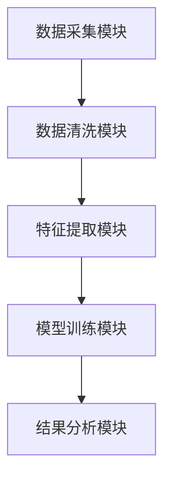

                 


---

# AI在企业并购协同效应预测与优化中的应用与挑战

## 文章关键词
企业并购、协同效应、人工智能、机器学习、数据分析

## 文章摘要
随着企业并购活动的频繁发生，协同效应的预测与优化成为企业战略决策中的关键环节。通过人工智能和机器学习技术，可以有效提升协同效应的预测精度和优化效率。本文将深入探讨AI在企业并购协同效应预测中的应用，分析其算法原理、系统架构设计以及在实际项目中的应用案例。同时，也将讨论在应用过程中面临的主要挑战，并提出相应的解决方案。通过对协同效应预测的系统化分析，本文为企业在并购决策中提供了新的思路和方法，助力企业实现更高效的协同效应管理。

---

## 第1章: 企业并购的背景与AI的应用

### 1.1 企业并购的定义与重要性
#### 1.1.1 企业并购的基本概念
企业并购（Mergers and Acquisitions, M&A）是指两个或多个企业之间的合并或收购行为。并购可以是吸收合并、新设合并、控股合并等形式，目的是通过资源整合、优势互补来实现企业价值的最大化。

#### 1.1.2 并购在企业发展中的作用
企业并购可以带来以下几方面的作用：
- **扩大规模**：通过并购快速进入新市场或行业。
- **优化资源**：整合双方的资源，降低运营成本。
- **技术升级**：通过并购获取先进的技术或研发能力。
- **战略调整**：通过并购调整企业战略发展方向。

#### 1.1.3 AI在企业并购中的潜在价值
人工智能技术在企业并购中的潜在价值主要体现在以下几个方面：
- **数据驱动的决策支持**：通过分析海量数据，提供精准的协同效应预测。
- **优化并购流程**：利用AI技术提高并购流程的效率和准确性。
- **风险控制**：通过预测模型识别潜在风险，降低并购失败的可能性。

### 1.2 协同效应的定义与预测的重要性
#### 1.2.1 协同效应的定义
协同效应（Synergy）是指在企业并购后，双方在资源整合过程中产生的额外价值。协同效应可以通过成本节约、收入增加或效率提升等方式表现出来。

#### 1.2.2 协同效应的类型与表现形式
协同效应主要分为以下几种类型：
- **成本协同效应**：通过资源整合降低重复成本。
- **收入协同效应**：通过市场协同扩大收入来源。
- **技术协同效应**：通过技术整合提升研发效率。

#### 1.2.3 协同效应预测在企业并购中的意义
协同效应预测是企业并购决策中的关键环节，其重要意义包括：
- **提高并购决策的准确性**：通过预测模型评估并购后的协同效应，为决策提供依据。
- **降低并购风险**：通过预测潜在风险，制定应对策略。
- **优化并购后的整合计划**：基于预测结果制定有效的整合方案。

### 1.3 本章小结
本章从企业并购的基本概念出发，探讨了并购的重要性和AI在其中的潜在价值。同时，详细介绍了协同效应的定义、类型及其在企业并购中的重要性。这些内容为后续章节的深入分析奠定了基础。

---

## 第2章: 协同效应预测的数学模型与数据来源

### 2.1 协同效应的数学模型
#### 2.1.1 协同效应指数的计算公式
协同效应指数（Synergy Index）可以通过以下公式计算：

$$
\text{协同效应指数} = \frac{\text{并购后的企业价值} - (\text{企业A价值} + \text{企业B价值})}{\text{企业A价值} + \text{企业B价值}}
$$

其中，企业价值可以通过市场价值法或资产价值法计算。

#### 2.1.2 协同效应的评估指标
常用的协同效应评估指标包括：
- **协同效应比率（Synergy Ratio）**：反映协同效应的实际实现程度。
- **协同效应净现值（Net Present Value of Synergy, NPV of Synergy）**：评估协同效应的经济价值。

#### 2.1.3 协同效应的数学模型与公式推导
协同效应的预测模型可以通过回归分析、时间序列分析或机器学习模型构建。以下是一个简单的线性回归模型：

$$
\text{协同效应} = \beta_0 + \beta_1 x_1 + \beta_2 x_2 + \epsilon
$$

其中，$x_1$和$x_2$是影响协同效应的变量，$\beta$是回归系数，$\epsilon$是误差项。

### 2.2 数据来源与特征工程
#### 2.2.1 数据来源的多样性
协同效应预测的数据来源包括：
- **财务数据**：收入、利润、成本等。
- **市场数据**：市场份额、竞争对手信息等。
- **技术数据**：专利数量、研发能力等。

#### 2.2.2 数据清洗与预处理
数据清洗的主要步骤包括：
1. **去除重复数据**：删除重复的记录。
2. **处理缺失值**：根据具体情况进行插值或删除。
3. **标准化/归一化**：对数据进行标准化处理，使其具有可比性。

#### 2.2.3 特征提取与选择
特征工程的关键在于选择对预测有重要影响的特征。常用的特征选择方法包括：
- **主成分分析（PCA）**：降维技术。
- **Lasso回归**：通过L1正则化进行特征选择。

### 2.3 本章小结
本章详细介绍了协同效应的数学模型及其评估指标，并探讨了数据来源和特征工程的重要性。通过合理的数据处理和特征选择，可以显著提高协同效应预测的准确性。

---

## 第3章: AI算法在协同效应预测中的应用

### 3.1 常见AI算法简介
#### 3.1.1 线性回归
线性回归是一种简单且常用的预测模型，适用于线性关系的预测。

$$
y = \beta_0 + \beta_1 x + \epsilon
$$

#### 3.1.2 支持向量机（SVM）
支持向量机适用于分类和回归问题，特别适合高维数据的处理。

#### 3.1.3 随机森林
随机森林是一种基于决策树的集成学习方法，具有较高的预测精度。

#### 3.1.4 神经网络
神经网络通过多层感知机模拟人脑的神经网络，适用于复杂的非线性关系预测。

### 3.2 协同效应预测的算法选择与优化
#### 3.2.1 算法选择的依据
算法选择应基于数据的特征、问题的类型以及计算资源等因素。

#### 3.2.2 算法调优与参数优化
通过交叉验证和网格搜索等方法，优化算法的参数设置，提高预测精度。

#### 3.2.3 算法性能评估指标
常用的性能评估指标包括：
- **均方误差（MSE）**：预测值与真实值的平方差的平均值。
- **R平方值（R²）**：模型解释变量的能力。

### 3.3 本章小结
本章介绍了几种常用的AI算法，并探讨了算法选择和优化的策略。通过合理的算法选择和参数调优，可以显著提高协同效应预测的准确性。

---

## 第4章: 协同效应预测的系统架构设计

### 4.1 系统功能模块划分
#### 4.1.1 数据采集模块
负责从多种数据源采集数据，包括财务数据、市场数据和技术数据等。

#### 4.1.2 模型训练模块
对采集的数据进行清洗、特征提取和模型训练，生成预测结果。

#### 4.1.3 结果分析模块
对预测结果进行分析和可视化，提供决策支持。

### 4.2 系统架构设计
#### 4.2.1 模块之间的关系
数据采集模块提供数据支持，模型训练模块进行数据处理和模型训练，结果分析模块对预测结果进行解读和可视化。

#### 4.2.2 系统架构的流程图


#### 4.2.3 系统交互设计
系统交互主要通过用户界面完成，用户输入数据和参数，系统输出预测结果和分析报告。

### 4.3 本章小结
本章详细介绍了协同效应预测系统的功能模块和系统架构设计，为后续的项目实现提供了清晰的指导。

---

## 第5章: 项目实战

### 5.1 环境搭建与数据准备
#### 5.1.1 Python环境安装
安装Python和必要的库，如NumPy、Pandas、Scikit-learn、XGBoost等。

#### 5.1.2 数据集的获取与预处理
从公开数据源获取企业并购数据，进行数据清洗和特征工程。

### 5.2 模型实现与结果分析
#### 5.2.1 模型实现代码
以下是协同效应预测的随机森林模型实现代码：

```python
import pandas as pd
from sklearn.ensemble import RandomForestRegressor
from sklearn.model_selection import train_test_split
from sklearn.metrics import mean_squared_error

# 数据加载
data = pd.read_csv('merger_data.csv')

# 数据分割
X = data.drop('synergy', axis=1)
y = data['synergy']

X_train, X_test, y_train, y_test = train_test_split(X, y, test_size=0.2, random_state=42)

# 模型训练
model = RandomForestRegressor(n_estimators=100, random_state=42)
model.fit(X_train, y_train)

# 预测与评估
y_pred = model.predict(X_test)
mse = mean_squared_error(y_test, y_pred)
r2 = model.score(X_test, y_test)

print(f"均方误差: {mse}")
print(f"R²值: {r2}")
```

#### 5.2.2 模型训练与评估
通过训练数据训练模型，并在测试数据上评估模型的性能。

#### 5.2.3 结果可视化
使用可视化工具（如Matplotlib）对预测结果和实际值进行对比分析。

### 5.3 本章小结
本章通过实际案例展示了协同效应预测系统的实现过程，包括数据准备、模型训练和结果分析。通过具体代码实现，帮助读者更好地理解和应用相关技术。

---

## 第6章: 挑战与解决方案

### 6.1 挑战分析
- **数据质量问题**：数据缺失、噪声等问题会影响预测精度。
- **模型泛化能力**：模型在不同场景下的表现可能存在差异。
- **计算资源限制**：复杂的模型需要大量计算资源。

### 6.2 解决方案
- **数据增强**：通过数据生成技术和数据清洗提高数据质量。
- **模型优化**：采用集成学习和超参数调优提升模型性能。
- **资源优化**：利用云计算和分布式计算技术提高计算效率。

### 6.3 本章小结
本章分析了协同效应预测过程中可能面临的挑战，并提出了相应的解决方案，为实际应用提供了指导。

---

## 第7章: 总结与展望

### 7.1 总结
本文详细探讨了AI在企业并购协同效应预测中的应用，从数学模型、算法选择到系统架构设计，再到项目实战，为读者提供了全面的指导。

### 7.2 未来展望
未来，随着AI技术的不断发展，协同效应预测将更加精准和智能化。同时，结合区块链和大数据技术，可以进一步提升预测的准确性和效率。

### 7.3 本章小结
本文通过系统的分析和实践，为企业的并购决策提供了新的思路和方法，未来将继续探索AI在企业并购中的更多应用。

---

## 参考文献
（此处列出相关的参考文献）

---

通过以上内容，本文系统地介绍了AI在企业并购协同效应预测中的应用，从理论到实践，为读者提供了全面的知识体系和实践指导。

