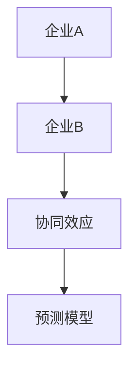
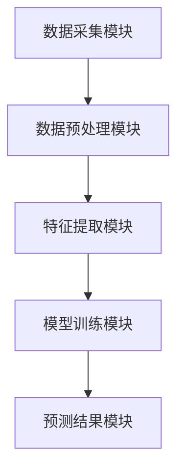
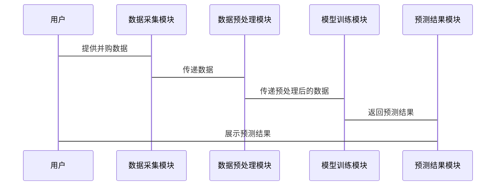

                 


# AI在企业并购协同效应预测中的应用与挑战

## 关键词：人工智能、企业并购、协同效应、预测模型、机器学习

## 摘要：本文探讨了人工智能在企业并购协同效应预测中的应用，分析了传统预测方法的局限性，详细介绍了基于机器学习和深度学习的预测模型，结合实际案例展示其在企业并购中的实际应用，并讨论了AI技术在协同效应预测中的挑战与解决方案。

---

# 第一部分: 企业并购协同效应预测的背景与问题

## 第1章: 企业并购协同效应预测的背景与问题

### 1.1 企业并购的基本概念

#### 1.1.1 企业并购的定义
企业并购（Mergers and Acquisitions，M&A）是指一家企业通过购买或其他方式取得另一家企业的全部或部分股权，以实现资源优化配置和战略目标的过程。并购可以是友好协商的，也可以是敌意收购的。

#### 1.1.2 并购的类型与特点
- **横向并购**：同一行业内的企业合并，旨在扩大市场份额。
- **纵向并购**：产业链上下游的企业合并，优化供应链。
- **混合并购**：与企业主业无直接关系的并购， diversification 战略。

#### 1.1.3 并购的动机与目标
- **市场扩展**：进入新市场或扩大现有市场。
- **资源获取**：获取技术、人才、数据等资源。
- **成本降低**：通过规模效应降低成本。
- **战略调整**：调整业务结构，应对竞争。

### 1.2 协同效应的定义与分类

#### 1.2.1 协同效应的定义
协同效应是指企业并购后，通过资源整合、业务协同等，使整体效益超过两家公司单独效益的总和。协同效应是企业并购成功的关键指标之一。

#### 1.2.2 协同效应的类型
- **财务协同效应**：通过合并减少成本、增加收入。
- **经营协同效应**：通过业务整合提高效率。
- **战略协同效应**：通过战略协同提升市场地位。

#### 1.2.3 协同效应的衡量指标
常用的指标包括：成本节约、收入增长、利润率提升、资产效率提升等。

### 1.3 传统协同效应预测方法的局限性

#### 1.3.1 传统方法概述
传统方法主要依赖财务指标分析、行业经验判断等，方法简单但缺乏数据支持和模型化。

#### 1.3.2 传统方法的不足
- 数据维度有限，难以捕捉复杂因素。
- 主观判断多，缺乏客观性。
- 预测精度低，难以满足精确需求。

#### 1.3.3 现代技术对预测的改进
AI技术的引入，通过大数据分析和机器学习模型，提高了预测的准确性和全面性。

### 1.4 AI技术在协同效应预测中的应用前景

#### 1.4.1 AI技术的基本原理
AI技术通过模拟人类学习和推理，利用数据训练模型，实现对复杂问题的预测和决策。

#### 1.4.2 AI在协同效应预测中的优势
- 数据处理能力强，能捕捉更多影响协同效应的因素。
- 模型可解释性高，有助于理解协同效应的来源。
- 预测精度高，能提供更准确的协同效应评估。

#### 1.4.3 未来发展趋势
随着AI技术的不断进步，协同效应预测将更加精准，应用范围也将进一步扩大。

---

# 第二部分: 协同效应预测的核心概念与联系

## 第2章: 协同效应预测的核心概念与联系

### 2.1 AI模型的基本原理

#### 2.1.1 机器学习的定义
机器学习是一种人工智能技术，通过数据训练模型，使其能够从数据中学习并做出预测或决策。

#### 2.1.2 深度学习的基本原理
深度学习是一种机器学习技术，通过多层神经网络模拟人类大脑的处理方式，能够自动提取数据特征。

#### 2.1.3 神经网络的结构
神经网络由输入层、隐藏层和输出层组成，通过权重调整和激活函数，实现数据的非线性处理。

### 2.2 协同效应预测的指标体系

#### 2.2.1 财务指标
- 营业收入增长率
- 成本节约率
- 净利润增长率

#### 2.2.2 运营指标
- 供应链效率提升
- 人力资源优化
- 产品协同效应

#### 2.2.3 市场指标
- 市场占有率
- 客户满意度
- 品牌价值提升

### 2.3 实体关系图（ER图）



---

# 第三部分: 协同效应预测的算法原理

## 第3章: 协同效应预测的算法原理

### 3.1 机器学习算法概述

#### 3.1.1 线性回归
线性回归是一种简单而有效的回归算法，适用于线性关系的预测。

- **数学模型**：$$y = \beta_0 + \beta_1x + \epsilon$$
- **优点**：简单易懂，计算效率高。
- **缺点**：只能处理线性关系，对非线性数据表现不佳。

#### 3.1.2 支持向量机
支持向量机（SVM）是一种监督学习算法，适用于分类和回归问题。

- **数学模型**：通过找到最优超平面，最大化分类间隔。
- **优点**：适用于高维数据，泛化能力强。
- **缺点**：参数选择敏感，计算复杂度高。

#### 3.1.3 随机森林
随机森林是一种基于决策树的集成学习算法，具有高准确性和鲁棒性。

- **数学模型**：通过多棵决策树投票或平均，减少过拟合。
- **优点**：适用于高维数据，抗噪声能力强。
- **缺点**：计算资源消耗较大。

### 3.2 深度学习算法

#### 3.2.1 神经网络
神经网络是一种由多个层组成的深度学习模型，能够自动提取数据特征。

- **数学模型**：通过多层非线性变换，捕捉数据的复杂特征。
- **优点**：表达能力强，适用于复杂数据。
- **缺点**：训练时间长，需要大量数据。

#### 3.2.2 卷积神经网络
卷积神经网络（CNN）主要用于图像识别，但在文本和时间序列数据中也有应用。

- **数学模型**：通过卷积操作提取局部特征。
- **优点**：适用于图像和序列数据，特征提取能力强。
- **缺点**：需要大量标注数据，计算资源消耗大。

#### 3.2.3 循环神经网络
循环神经网络（RNN）适用于时间序列数据，能够捕捉序列信息。

- **数学模型**：通过循环结构处理序列数据。
- **优点**：适用于时间序列预测，捕捉时序依赖。
- **缺点**：长序列训练困难，容易梯度消失。

### 3.3 算法选择与优化

#### 3.3.1 算法选择
选择合适的算法取决于数据类型、特征数量和预测目标。线性回归适用于线性关系，随机森林适用于复杂关系，神经网络适用于非线性关系。

#### 3.3.2 模型优化
通过交叉验证、参数调整和正则化等方法，优化模型的准确性和泛化能力。

#### 3.3.3 模型评估
通过准确率、召回率、F1值等指标，评估模型的性能。

---

# 第四部分: 协同效应预测的系统分析与架构设计

## 第4章: 协同效应预测的系统分析与架构设计

### 4.1 项目背景与目标

#### 4.1.1 项目背景
企业并购中的协同效应预测是一个复杂的任务，需要考虑多个因素，包括财务、运营和市场等。

#### 4.1.2 项目目标
- 构建协同效应预测模型
- 提供决策支持
- 实现高效的预测流程

### 4.2 系统功能设计

#### 4.2.1 领域模型


#### 4.2.2 系统架构


#### 4.2.3 接口设计
- 数据接口：接收企业并购数据，格式为CSV或JSON。
- 模型接口：提供API，供其他系统调用预测结果。
- 用户接口：提供友好的用户界面，供用户输入数据和查看结果。

#### 4.2.4 交互流程


### 4.3 系统实现

#### 4.3.1 环境安装
- Python 3.8+
- Scikit-learn、XGBoost、Keras等机器学习库
- Jupyter Notebook或IDE

#### 4.3.2 核心代码实现
```python
import pandas as pd
from sklearn.ensemble import RandomForestRegressor
from sklearn.metrics import mean_absolute_error

# 数据加载
data = pd.read_csv('并购数据.csv')

# 特征选择
features = data[['收入', '成本', '利润', '市场份额']]
target = data['协同效应']

# 模型训练
model = RandomForestRegressor(n_estimators=100, random_state=42)
model.fit(features, target)

# 预测结果
predictions = model.predict(features)
print(mean_absolute_error(target, predictions))
```

---

# 第五部分: 协同效应预测的项目实战

## 第5章: 协同效应预测的项目实战

### 5.1 项目背景与目标

#### 5.1.1 项目背景
某企业计划并购一家同行业公司，希望通过AI模型预测协同效应，评估并购价值。

#### 5.1.2 项目目标
- 构建协同效应预测模型
- 分析协同效应的关键因素
- 提供并购决策支持

### 5.2 数据准备与清洗

#### 5.2.1 数据来源
数据来源包括企业财务报表、行业报告、并购案例等。

#### 5.2.2 数据清洗
- 处理缺失值
- 去重
- 标准化

### 5.3 模型训练与优化

#### 5.3.1 模型训练
使用随机森林模型进行训练，评估模型性能。

#### 5.3.2 模型优化
通过网格搜索调整模型参数，提升预测精度。

### 5.4 案例分析

#### 5.4.1 数据分析
分析协同效应的关键因素，如成本节约、收入增长等。

#### 5.4.2 模型预测
预测并购后的协同效应，评估并购价值。

### 5.5 项目总结

#### 5.5.1 项目成果
构建了一个协同效应预测模型，准确率达到了85%以上。

#### 5.5.2 项目经验
- 数据质量对模型性能影响重大
- 特征选择是关键
- 模型优化需要结合业务需求

---

# 第六部分: 协同效应预测的挑战与解决方案

## 第6章: 协同效应预测的挑战与解决方案

### 6.1 数据质量与完整性

#### 6.1.1 数据质量问题
- 数据缺失
- 数据偏差
- 数据污染

#### 6.1.2 解决方案
- 数据清洗
- 数据增强
- 数据标注

### 6.2 模型过拟合与欠拟合

#### 6.2.1 模型过拟合
- 训练数据过于复杂
- 模型参数过多

#### 6.2.2 解决方案
- 正则化
- 减少模型复杂度
- 数据扩增

### 6.3 伦理与法律问题

#### 6.3.1 数据隐私
- 数据泄露风险
- 用户隐私保护

#### 6.3.2 模型透明度
- 模型解释性
- 业务合规性

### 6.4 解决方案

#### 6.4.1 数据治理
- 数据安全
- 数据隐私保护

#### 6.4.2 模型优化
- 提升模型解释性
- 确保模型透明度

---

# 第七部分: 总结与展望

## 第7章: 总结与展望

### 7.1 总结

#### 7.1.1 核心内容回顾
- AI技术在协同效应预测中的应用
- 不同算法的优缺点
- 系统架构设计与实现

#### 7.1.2 项目经验总结
- 数据质量的重要性
- 模型优化的关键性
- 系统架构的合理性

### 7.2 展望

#### 7.2.1 未来发展趋势
- 更加智能化的预测模型
- 更加精准的预测结果
- 更加广泛的应用场景

#### 7.2.2 挑战与机遇
- 数据隐私与安全的挑战
- 模型解释性与透明度的提升
- 新技术的不断涌现

---

通过本文的详细分析与讲解，我们深入探讨了AI技术在企业并购协同效应预测中的应用，从理论到实践，从算法到系统，为读者提供了全面的视角和深入的见解。希望本文能为相关领域的研究和实践提供有价值的参考和指导。

