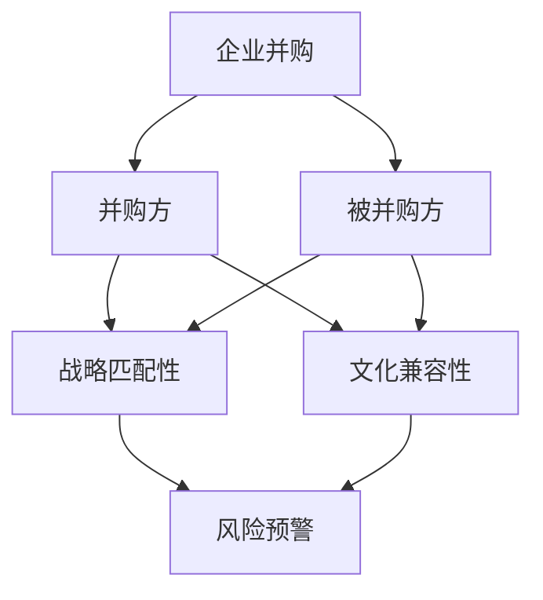
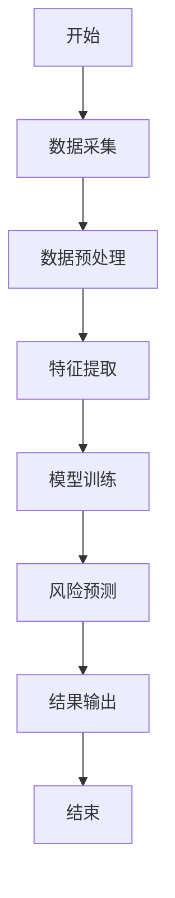
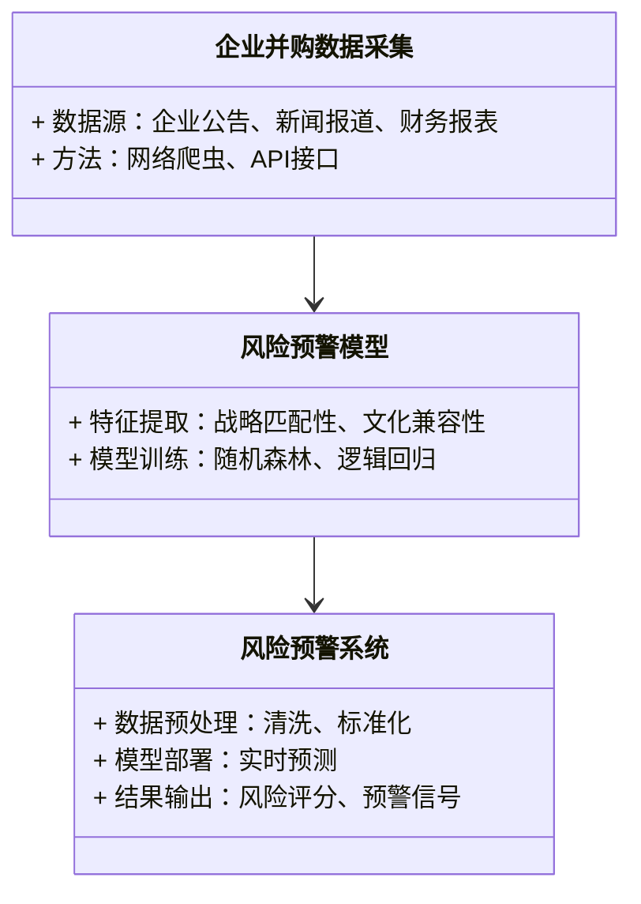
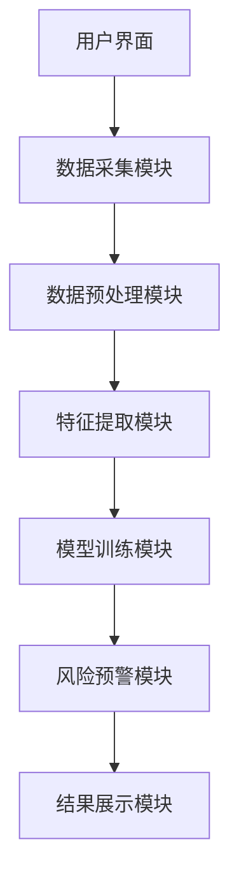
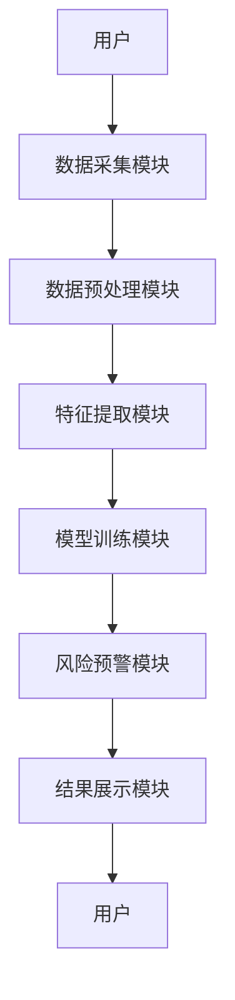

                 


# AI在企业并购整合风险预警中的应用与挑战

## 关键词：企业并购、风险预警、人工智能、机器学习、自然语言处理（NLP）、数据挖掘

## 摘要：  
企业并购是企业战略发展的重要手段之一，然而并购整合过程中的风险往往被低估或未能有效识别。随着人工智能技术的快速发展，利用AI技术进行企业并购整合风险预警成为可能。本文将深入探讨AI在企业并购整合风险预警中的应用与挑战，结合机器学习和自然语言处理技术，分析如何构建智能化的风险预警系统，以提高企业并购整合的成功率。

---

# 正文

## 第一部分: 企业并购整合风险预警的背景与概念

### 第1章: 企业并购整合的背景与挑战

#### 1.1 企业并购的基本概念  
企业并购是指一家企业通过购买其他企业的股权或资产，以实现资源优化配置和战略扩张的行为。并购整合则是指在并购完成后，将两家企业的业务、文化、组织结构等进行融合的过程。  

企业并购的核心目标包括：  
1. **资源优化**：通过并购获取关键技术、市场份额或原材料供应。  
2. **战略扩张**：通过并购进入新市场或扩展业务范围。  
3. **成本降低**：通过规模效应或协同效应降低成本。  

然而，并购整合过程中常常面临以下挑战：  
- **文化冲突**：不同企业的文化和管理风格可能导致整合失败。  
- **战略不匹配**：并购双方的战略目标不一致可能导致资源浪费。  
- **管理复杂性**：跨地域、跨文化的组织整合需要复杂的协调能力。  

#### 1.2 企业并购整合风险的定义  
企业并购整合风险是指在并购过程中或整合过程中，由于内外部因素的不确定性而导致并购目标未能实现的可能性。这些风险包括：  
1. **财务风险**：并购后的财务表现未达预期。  
2. **运营风险**：整合过程中出现的管理混乱或效率低下。  
3. **法律风险**：并购涉及的法律问题未得到妥善处理。  

#### 1.3 AI技术的应用背景  
随着人工智能技术的快速发展，AI在企业中的应用越来越广泛。在企业并购领域，AI可以通过以下方式发挥作用：  
1. **数据挖掘**：利用历史并购数据，识别并购失败的模式和规律。  
2. **自然语言处理（NLP）**：分析企业公告、新闻报道等文本数据，提取并购相关的风险信息。  
3. **机器学习**：构建风险预警模型，预测并购整合过程中可能发生的各类风险。  

#### 1.4 本章小结  
企业并购整合是一个复杂的过程，涉及多方面的风险。AI技术的引入为风险预警提供了新的可能性，但同时也需要克服技术与管理上的挑战。

---

## 第二部分: 企业并购整合风险预警的核心概念与联系

### 第2章: 企业并购整合风险预警的核心概念

#### 2.1 风险预警的定义与特点  
风险预警是指通过分析潜在风险因素，提前发出警示信号，以便采取应对措施。其特点包括：  
1. **实时性**：能够快速响应风险变化。  
2. **预测性**：基于历史数据和模型预测未来风险。  
3. **动态性**：风险因素随时间变化而变化。  

#### 2.2 企业并购整合风险的关键要素  
企业并购整合风险的关键要素包括：  
1. **战略匹配性**：并购双方的战略目标是否一致。  
2. **文化兼容性**：企业文化是否能够融合。  
3. **人力资源整合**：员工的适应性和团队协作能力。  
4. **财务风险**：并购后的财务表现是否稳健。  
5. **运营风险**：整合过程中的管理效率和流程优化。  

#### 2.3 风险预警的核心要素对比  
以下是核心要素的对比表格：  

| **要素**         | **描述**                                                                 |
|-------------------|--------------------------------------------------------------------------|
| 战略匹配性       | 并购双方的战略目标是否一致，影响整合的顺利程度。                         |
| 文化兼容性       | 企业文化是否能够融合，影响员工的适应性和团队协作能力。                   |
| 人力资源整合     | 员工的适应性和团队协作能力，影响整合后的组织效率。                         |
| 财务风险         | 并购后的财务表现是否稳健，影响企业的长期发展。                             |
| 运营风险         | 整合过程中的管理效率和流程优化，影响整合后的运营效果。                     |

### 第3章: 企业并购整合风险预警的实体关系分析

#### 3.1 实体关系图  
以下是企业并购整合风险预警的实体关系图：  



从图中可以看出，企业并购涉及并购方和被并购方，其战略匹配性和文化兼容性是影响风险预警的关键因素。  

#### 3.2 风险预警的流程图  
以下是风险预警的流程图：  



---

## 第三部分: 企业并购整合风险预警的算法原理

### 第4章: 企业并购整合风险预警的算法原理

#### 4.1 数据预处理  
数据预处理是构建风险预警模型的基础，主要包括：  
1. **数据清洗**：去除无效数据和异常值。  
2. **数据标准化**：将不同量纲的数据统一到同一尺度。  
3. **数据特征选择**：筛选对风险预警有重要影响的特征。  

#### 4.2 特征工程  
特征工程是提升模型性能的关键步骤，包括：  
1. **特征提取**：从文本数据中提取关键词或情感倾向。  
2. **特征组合**：将多个特征组合成新的特征。  
3. **特征降维**：使用主成分分析（PCA）等方法减少特征维度。  

#### 4.3 模型训练  
模型训练是基于机器学习算法对数据进行训练，包括：  
1. **分类模型选择**：常用的分类算法包括逻辑回归、支持向量机（SVM）和随机森林。  
2. **回归模型选择**：用于预测连续型风险指标，常用的回归算法包括线性回归和梯度下降。  
3. **模型调优**：通过交叉验证和网格搜索优化模型参数。  

#### 4.4 模型评估  
模型评估是验证模型性能的重要步骤，包括：  
1. **评估指标选择**：常用的评估指标包括准确率、召回率和F1分数。  
2. **模型验证方法**：通过留出法或交叉验证评估模型的泛化能力。  
3. **模型优化策略**：根据评估结果调整特征或优化算法。  

---

### 第5章: 企业并购整合风险预警的数学模型

#### 5.1 风险评估模型  
风险评估模型是基于机器学习算法构建的，以下是一个简单的线性回归模型：  

$$ \text{风险评分} = \beta_0 + \beta_1 \times \text{战略匹配性} + \beta_2 \times \text{文化兼容性} + \epsilon $$  

其中，$\beta_0$ 是截距项，$\beta_1$ 和 $\beta_2$ 是特征的系数，$\epsilon$ 是误差项。  

#### 5.2 风险预测模型  
风险预测模型可以基于随机森林算法构建，以下是一个随机森林的伪代码实现：  

```python
from sklearn.ensemble import RandomForestClassifier

# 初始化模型
model = RandomForestClassifier(n_estimators=100, random_state=42)

# 训练模型
model.fit(X_train, y_train)

# 预测风险
y_pred = model.predict(X_test)
```

---

## 第四部分: 企业并购整合风险预警的系统分析与架构设计

### 第6章: 企业并购整合风险预警的系统分析

#### 6.1 问题场景介绍  
企业并购整合风险预警系统需要解决以下问题：  
1. 如何高效采集和处理企业并购数据？  
2. 如何构建高精度的风险预警模型？  
3. 如何实时监控和预警风险？  

#### 6.2 系统功能设计  
以下是系统功能的领域模型：  



#### 6.3 系统架构设计  
以下是系统的架构图：  



#### 6.4 系统接口设计  
以下是系统的接口设计：  

1. 数据采集模块接口：  
   - 输入：企业名称、时间范围  
   - 输出：企业公告、新闻报道等数据  

2. 模型训练模块接口：  
   - 输入：特征数据、标签  
   - 输出：训练好的模型  

3. 风险预警模块接口：  
   - 输入：企业数据  
   - 输出：风险评分、预警信号  

#### 6.5 系统交互流程图  
以下是系统的交互流程图：  



---

## 第五部分: 企业并购整合风险预警的项目实战

### 第7章: 企业并购整合风险预警的项目实战

#### 7.1 环境安装  
以下是在Python中安装所需库的代码：  

```bash
pip install pandas numpy scikit-learn seaborn
```

#### 7.2 系统核心实现源代码  
以下是风险预警模型的实现代码：  

```python
import pandas as pd
from sklearn.ensemble import RandomForestClassifier
from sklearn.metrics import accuracy_score, recall_score, f1_score

# 数据加载
data = pd.read_csv('并购数据.csv')

# 数据预处理
data.dropna(inplace=True)
data = pd.get_dummies(data)

# 特征选择
X = data[['战略匹配性', '文化兼容性']]
y = data['风险标签']

# 模型训练
model = RandomForestClassifier(random_state=42)
model.fit(X, y)

# 模型预测
y_pred = model.predict(X)

# 模型评估
print(f'准确率: {accuracy_score(y, y_pred)}')
print(f'召回率: {recall_score(y, y_pred)}')
print(f'F1分数: {f1_score(y, y_pred)}')
```

#### 7.3 代码应用解读与分析  
上述代码实现了以下功能：  
1. 数据加载与预处理：去除缺失值并进行独热编码。  
2. 特征选择：选择战略匹配性和文化兼容性作为特征。  
3. 模型训练：使用随机森林算法训练风险预警模型。  
4. 模型预测与评估：计算模型的准确率、召回率和F1分数。  

#### 7.4 实际案例分析  
以下是一个实际案例分析：  

假设我们有以下企业并购数据：  

| 企业名称 | 战略匹配性 | 文化兼容性 | 风险标签 |
|----------|------------|------------|----------|
| 企业A    | 0.8        | 0.6        | 1        |
| 企业B    | 0.7        | 0.5        | 0        |
| 企业C    | 0.9        | 0.7        | 1        |

通过上述代码训练模型后，我们可以预测新企业的风险标签。例如，对于企业D，其战略匹配性为0.8，文化兼容性为0.6，模型预测其风险标签为1，表示存在较高的整合风险。

---

## 第六部分: 总结与展望

### 第8章: 总结与展望

#### 8.1 最佳实践  
1. 在企业并购整合过程中，应注重数据的完整性和准确性。  
2. 使用多种算法进行模型训练，并结合业务知识进行模型优化。  
3. 定期更新模型，以适应市场环境的变化。  

#### 8.2 小结  
本文详细探讨了AI在企业并购整合风险预警中的应用，结合机器学习和自然语言处理技术，构建了智能化的风险预警系统。  

#### 8.3 注意事项  
1. 数据隐私和安全问题需要高度重视。  
2. 模型的可解释性需要进一步提升。  
3. 风险预警的结果应结合企业实际情况进行调整。  

#### 8.4 拓展阅读  
1. 《机器学习实战》  
2. 《自然语言处理入门》  
3. 《企业并购风险管理》  

---

通过本文的分析，我们可以看到AI技术在企业并购整合风险预警中的巨大潜力，但也需要克服技术与管理上的挑战。未来，随着技术的不断发展，AI将在企业并购整合中发挥更加重要的作用。

