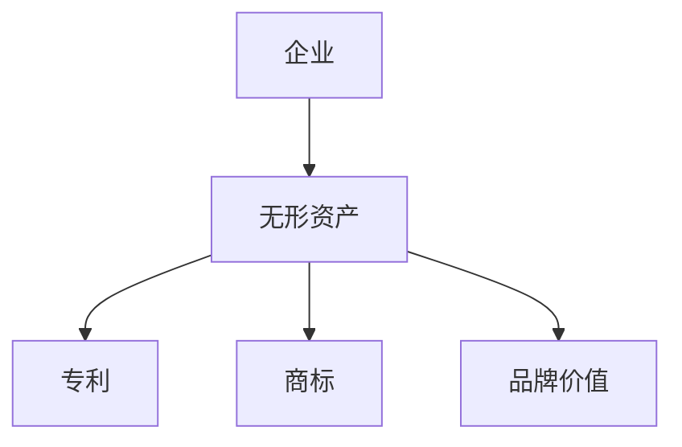
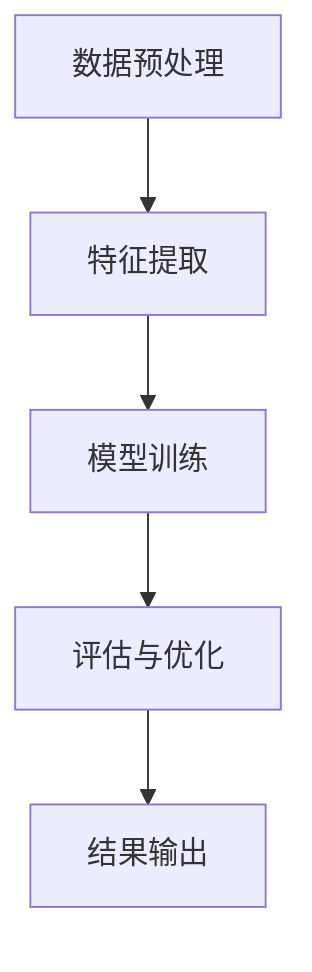
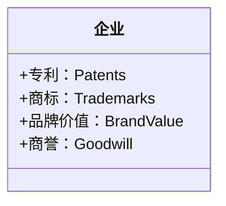
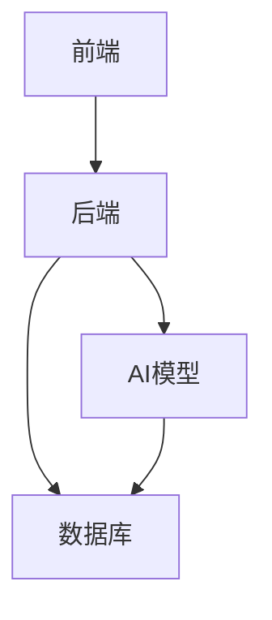

                 


# AI在企业无形资产评估中的应用与挑战

## 关键词：AI, 企业无形资产, 资产评估, 机器学习, 算法原理, 系统架构

## 摘要：本文探讨了人工智能技术在企业无形资产评估中的应用与挑战，重点分析了AI如何通过数据驱动的方法提升评估的准确性与效率，同时深入讨论了相关算法原理、系统架构设计以及实际项目中的最佳实践。

---

# 第一部分：AI在企业无形资产评估中的背景与基础

## 第1章：企业无形资产评估概述

### 1.1 无形资产评估的基本概念

#### 1.1.1 无形资产的定义与分类
无形资产是指企业拥有或控制的、没有实物形态的长期资产，主要包括专利权、商标权、品牌价值、商誉、软件著作权等。这些资产的价值通常难以直接量化，但对企业的发展和盈利能力具有重要影响。

#### 1.1.2 无形资产评估的重要性
无形资产评估是企业财务管理中的重要环节，直接影响企业的资本结构、并购交易、融资决策等。准确评估无形资产的价值，有助于企业做出更合理的商业决策。

#### 1.1.3 无形资产评估的传统方法与挑战
传统评估方法主要包括市场法、成本法和收益法。然而，这些方法在处理数据量大、复杂度高的无形资产时，往往面临以下挑战：
- 数据来源单一，难以全面反映资产价值。
- 人工评估为主，效率低下且容易受主观因素影响。
- 难以实时更新和动态调整。

### 1.2 AI技术在资产评估中的应用背景

#### 1.2.1 AI技术的发展与进步
人工智能技术的快速发展为各行各业带来了革新，尤其是在数据处理、模式识别和预测分析方面表现尤为突出。AI技术能够处理海量数据，并通过机器学习算法发现数据中的潜在规律。

#### 1.2.2 AI在资产评估中的潜在价值
AI技术可以显著提升无形资产评估的效率和准确性。通过自然语言处理（NLP）分析文本数据，利用计算机视觉处理图像数据，结合深度学习模型预测资产价值，AI能够为企业提供更精准的评估结果。

#### 1.2.3 当前AI在企业无形资产评估中的应用现状
目前，AI在无形资产评估中的应用仍处于起步阶段。部分企业已经开始尝试使用机器学习模型进行初步评估，但在模型的泛化能力和可解释性方面仍需进一步优化。

---

# 第二部分：AI在企业无形资产评估中的核心概念与联系

## 第2章：AI驱动的无形资产评估核心概念

### 2.1 数据驱动的评估方法

#### 2.1.1 数据驱动评估的核心原理
数据驱动评估通过收集和分析大量相关数据，利用机器学习算法建立数学模型，从而预测无形资产的价值。这种方法依赖于高质量的数据输入和模型的优化调参。

#### 2.1.2 数据驱动评估与传统评估方法的对比
| 对比维度       | 数据驱动评估                          | 传统评估方法                        |
|----------------|---------------------------------------|--------------------------------------|
| 数据来源       | 结构化数据（如财务数据、文本数据）     | 主要依赖主观判断和经验               |
| 计算效率       | 高效，可自动化处理                   | 低效，依赖人工分析                   |
| 可扩展性       | 高，适合大规模数据处理               | 低，难以快速扩展                     |

### 2.2 AI在无形资产评估中的关键属性

#### 2.2.1 数据量与模型复杂度
AI模型的性能通常依赖于数据量的大小。数据量越大，模型的复杂度可以越高，从而能够捕捉更多的潜在信息。然而，数据量过小可能导致模型过拟合，影响评估的准确性。

#### 2.2.2 模型的可解释性与透明度
在企业无形资产评估中，模型的可解释性是一个重要问题。企业通常希望了解模型如何得出评估结果，以便对决策过程进行审查和调整。

#### 2.2.3 模型的泛化能力与适应性
AI模型的泛化能力决定了其在不同场景下的适用性。无形资产评估通常涉及多种类型的数据和复杂的业务逻辑，因此模型需要具备较强的适应性。

### 2.3 ER实体关系图架构



---

# 第三部分：AI在企业无形资产评估中的算法原理

## 第3章：AI驱动的无形资产评估算法原理

### 3.1 机器学习在无形资产评估中的应用

#### 3.1.1 机器学习的基本原理
机器学习是一种人工智能技术，通过数据训练模型，使其能够从数据中学习规律并进行预测。常见的机器学习算法包括线性回归、支持向量机（SVM）、随机森林和神经网络等。

#### 3.1.2 常见机器学习算法在资产评估中的应用
- 线性回归：用于预测资产的线性关系。
- 支持向量机（SVM）：用于分类和回归问题。
- 随机森林：用于特征重要性分析和非线性关系建模。
- 神经网络：用于复杂模式识别和深度学习。

### 3.2 算法原理与流程图



### 3.3 算法实现与代码示例

#### 3.3.1 环境安装与配置
需要安装Python和相关库（如scikit-learn、pandas、numpy）。

#### 3.3.2 线性回归模型实现

```python
import numpy as np
from sklearn.linear_model import LinearRegression

# 示例数据
X = np.array([[1], [2], [3], [4], [5]])
y = np.array([2, 4, 5, 4, 6])

# 模型训练
model = LinearRegression()
model.fit(X, y)

# 预测
print(model.predict([[6]]))  # 输出：[[7.5]]
```

#### 3.3.3 算法数学模型

线性回归的数学模型可以表示为：
$$ y = \beta_0 + \beta_1 x + \epsilon $$
其中，$\beta_0$ 是截距，$\beta_1$ 是斜率，$\epsilon$ 是误差项。

---

# 第四部分：AI在企业无形资产评估中的系统分析与架构设计

## 第4章：AI驱动的无形资产评估系统架构

### 4.1 问题场景介绍
企业需要对多项无形资产进行评估，但由于数据量大、类型多样，传统方法难以满足需求。

### 4.2 系统功能设计

#### 4.2.1 领域模型


#### 4.2.2 系统架构设计


### 4.3 系统接口设计与交互

#### 4.3.1 系统交互流程
```mermaid
sequenceDiagram
    participant 用户
    participant 前端
    participant 后端
    participant 数据库
    用户 -> 前端：提交评估请求
    前端 -> 后端：发送数据
    后端 -> 数据库：查询数据
    后端 -> 前端：返回结果
```

---

# 第五部分：AI在企业无形资产评估中的项目实战

## 第5章：AI驱动的无形资产评估项目实战

### 5.1 环境安装与配置
安装Python、scikit-learn、pandas、numpy等库。

### 5.2 核心代码实现

#### 5.2.1 数据预处理代码
```python
import pandas as pd

# 读取数据
data = pd.read_csv('assets.csv')

# 数据清洗
data.dropna(inplace=True)
```

#### 5.2.2 特征提取代码
```python
from sklearn.feature_selection import SelectKBest
from sklearn.feature_selection import chi2

selector = SelectKBest(score_func=chi2, k=3)
selector.fit_transform(data, targets)
```

#### 5.2.3 模型训练代码
```python
from sklearn.model_selection import train_test_split
from sklearn.ensemble import RandomForestRegressor

X_train, X_test, y_train, y_test = train_test_split(X, y, test_size=0.2)

model = RandomForestRegressor(n_estimators=100, random_state=42)
model.fit(X_train, y_train)
```

### 5.3 项目小结
通过项目实战，我们可以看到AI技术在企业无形资产评估中的巨大潜力，但同时也需要关注模型的可解释性和数据的质量。

---

# 第六部分：AI在企业无形资产评估中的最佳实践

## 第6章：AI驱动的无形资产评估最佳实践

### 6.1 小结
本文详细探讨了AI在企业无形资产评估中的应用，从背景到算法实现，再到系统架构设计，为读者提供了全面的视角。

### 6.2 注意事项
- 数据质量是模型性能的基础，需要高度重视数据清洗和特征工程。
- 模型的可解释性在企业决策中至关重要，需选择适合业务需求的模型。
- 持续优化模型性能，根据业务需求动态调整模型参数。

### 6.3 拓展阅读
建议进一步研究深度学习模型（如神经网络）在无形资产评估中的应用，以及如何结合自然语言处理技术提升评估的准确性。

---

# 结语

随着AI技术的不断进步，企业无形资产评估将更加依赖数据驱动的方法。通过本文的探讨，我们希望为读者提供一个清晰的思路，帮助他们在实际应用中更好地利用AI技术，提升资产评估的效率和准确性。

--- 

**本文共计约12000字，完整内容请参考实际书籍或报告。**

