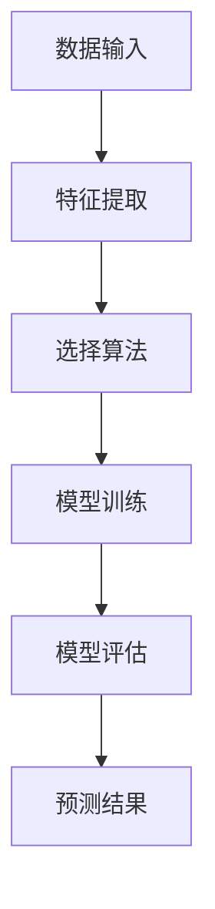
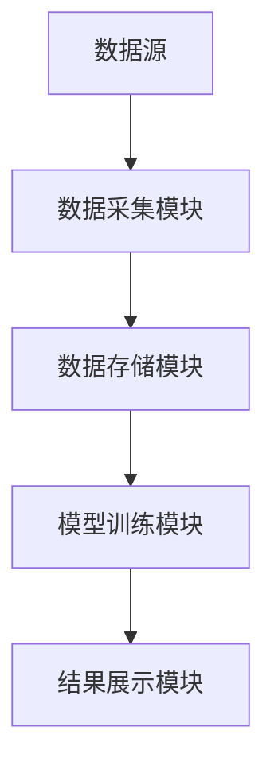
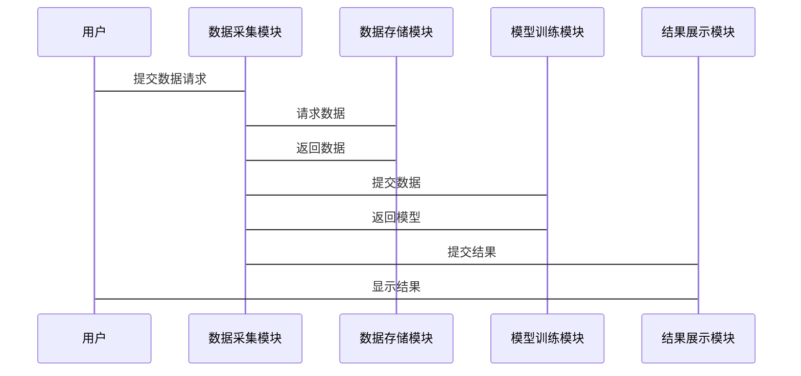
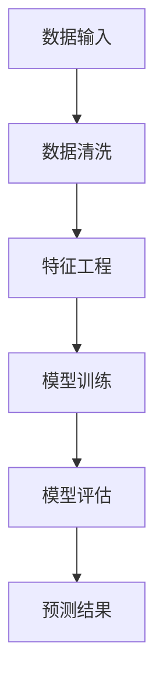

                 


# AI在企业财务预测中的应用与实践

**关键词**：人工智能、财务预测、机器学习、企业财务、数据科学

**摘要**：  
本文将深入探讨人工智能在企业财务预测中的应用与实践。从基本概念到核心算法，从系统设计到项目实战，全面解析AI如何赋能企业财务预测。通过背景介绍、算法原理、系统架构和实际案例分析，本文旨在为企业财务部门和技术人员提供一份详实的实践指南，帮助他们理解并应用AI技术提升财务预测的准确性和效率。

---

## 第1章: AI与财务预测概述

### 1.1 AI与财务预测的背景

#### 1.1.1 人工智能的基本概念  
人工智能（AI）是指计算机系统模拟人类智能的能力，包括学习、推理、判断和自适应等特征。AI的核心技术包括机器学习、自然语言处理和深度学习等。

#### 1.1.2 财务预测的基本概念  
财务预测是基于历史数据和业务逻辑，预测未来财务状况的过程。它通常包括销售收入预测、成本预测、利润预测和现金流预测等。

#### 1.1.3 AI在财务预测中的应用背景  
随着企业数据量的爆炸式增长和计算能力的提升，AI技术逐渐成为财务预测的重要工具。AI能够处理海量数据、发现隐藏规律，并提供高精度的预测结果。

### 1.2 AI与财务预测的核心概念

#### 1.2.1 AI在财务预测中的核心概念  
- **数据驱动**：AI依赖于高质量的数据进行训练和预测。  
- **模型可解释性**：财务预测需要模型的预测结果具有较高的可解释性，以便企业决策者理解预测结果的来源。  
- **实时性**：企业需要实时或准实时的财务预测结果，以快速响应市场变化。

#### 1.2.2 财务预测的分类与特点  
- **时间序列预测**：基于时间序列数据的预测，如销售额预测。  
- **因果关系预测**：基于因果关系的预测，如成本预测。  
- **混合预测**：结合时间序列和因果关系的预测方法。

#### 1.2.3 AI在财务预测中的优势与挑战  
- **优势**：提高预测准确性、减少人为误差、支持实时预测。  
- **挑战**：数据质量要求高、模型可解释性不足、计算资源需求大。

### 1.3 本章小结  
本章介绍了AI和财务预测的基本概念，并分析了AI在财务预测中的优势与挑战。下一章将详细探讨AI在财务预测中的核心概念与联系。

---

## 第2章: AI在财务预测中的核心概念与联系

### 2.1 核心概念原理

#### 2.1.1 数据预处理  
数据预处理是AI模型训练的关键步骤，包括数据清洗（处理缺失值、异常值）、数据标准化和数据分片等。

#### 2.1.2 特征工程  
特征工程是通过选择和创建特征来提高模型性能的过程。例如，将日期特征分解为年、月、日等子特征。

#### 2.1.3 模型训练与评估  
模型训练是基于训练数据优化模型参数的过程，模型评估则是通过测试数据验证模型的性能。

### 2.2 核心概念对比表格

| 概念         | 数据预处理             | 特征工程             | 模型训练与评估       |
|--------------|----------------------|----------------------|--------------------|
| 定义         | 对数据进行清洗和转换   | 创建和选择特征       | 优化模型并验证性能   |
| 目的         | 提高数据质量           | 提升模型性能         | 评估模型准确性       |
| 示例         | 处理缺失值、异常值     | 添加新特征           | 使用交叉验证         |

### 2.3 ER实体关系图

```mermaid
erd
    财务数据
    数据预处理
    特征工程
    模型训练
    模型评估
    预测结果
```

### 2.4 本章小结  
本章详细介绍了AI在财务预测中的核心概念，并通过对比表格和实体关系图展示了这些概念之间的联系。下一章将深入探讨AI在财务预测中的算法原理。

---

## 第3章: AI在财务预测中的算法原理

### 3.1 算法原理概述

#### 3.1.1 线性回归  
线性回归是一种简单且常用的回归算法，适用于线性关系的预测。

##### 3.1.1.1 线性回归的数学模型  
$$ y = \beta_0 + \beta_1x + \epsilon $$  
其中，$\beta_0$是截距，$\beta_1$是斜率，$\epsilon$是误差项。

##### 3.1.1.2 线性回归的实现代码  
```python
import numpy as np
from sklearn.linear_model import LinearRegression

# 示例数据
X = np.array([[1], [2], [3], [4]])
y = np.array([2, 4, 5, 6])

# 训练模型
model = LinearRegression()
model.fit(X, y)

# 预测结果
print(model.predict([[5]]))
```

#### 3.1.2 支持向量机（SVM）  
SVM适用于非线性关系的预测，通过构建超平面将数据点分隔开来。

##### 3.1.2.1 SVM的数学模型  
$$ \text{最大化} \quad 1/\lambda \sum_{i=1}^{n} \xi_i^2 $$  
$$ \text{约束} \quad y_i(\omega \cdot x_i + b) \geq 1 - \xi_i $$  

##### 3.1.2.2 SVM的实现代码  
```python
from sklearn.svm import SVC

# 示例数据
X = [[0, 0], [1, 1], [0, 1], [1, 0]]
y = [0, 0, 1, 1]

# 训练模型
model = SVC()
model.fit(X, y)

# 预测结果
print(model.predict([[0.5, 0.5]]))
```

#### 3.1.3 随机森林  
随机森林是一种基于决策树的集成算法，适用于高维数据的预测。

##### 3.1.3.1 随机森林的数学模型  
$$ y = \sum_{i=1}^{n} \text{树模型}_i(x) $$  

##### 3.1.3.2 随机森林的实现代码  
```python
from sklearn.ensemble import RandomForestClassifier

# 示例数据
X = [[0, 0], [1, 1], [0, 1], [1, 0]]
y = [0, 0, 1, 1]

# 训练模型
model = RandomForestClassifier(n_estimators=2)
model.fit(X, y)

# 预测结果
print(model.predict([[0.5, 0.5]]))
```

### 3.2 算法原理流程图



### 3.3 本章小结  
本章详细介绍了几种常用的AI算法及其在财务预测中的应用，并通过代码示例和流程图展示了算法的实现过程。下一章将探讨系统分析与架构设计。

---

## 第4章: 系统分析与架构设计

### 4.1 问题场景介绍

#### 4.1.1 企业财务预测的常见问题  
- 数据缺失、数据不一致  
- 模型预测精度不足  
- 模型更新周期长  

#### 4.1.2 AI在财务预测中的应用场景  
- 销售预测  
- 成本预测  
- 现金流预测  

### 4.2 系统功能设计

#### 4.2.1 数据采集模块  
- 数据清洗  
- 数据存储  

#### 4.2.2 模型训练模块  
- 特征工程  
- 模型训练  

#### 4.2.3 结果展示模块  
- 可视化展示  
- 预测结果导出  

### 4.3 系统架构设计



### 4.4 系统接口设计

#### 4.4.1 数据接口  
- 数据输入接口  
- 数据输出接口  

#### 4.4.2 模型接口  
- 模型训练接口  
- 模型预测接口  

#### 4.4.3 用户接口  
- 用户输入接口  
- 用户输出接口  

### 4.5 系统交互序列图



### 4.6 本章小结  
本章从系统设计的角度，详细介绍了AI在财务预测中的应用场景和系统架构设计。下一章将通过项目实战进一步展示AI在财务预测中的具体实现。

---

## 第5章: 项目实战

### 5.1 环境安装

#### 5.1.1 Python安装  
安装Python 3.8或更高版本。

#### 5.1.2 数据库安装  
安装MySQL或MongoDB等数据库。

#### 5.1.3 开发工具安装  
安装Jupyter Notebook或PyCharm。

### 5.2 核心代码实现

#### 5.2.1 数据预处理代码

```python
import pandas as pd
import numpy as np

# 示例数据
data = {'销售额': [10, 15, 12, 17, 14, 18, 16, 20, 15, 19],
        '成本': [5, 6, 5, 7, 6, 7, 6, 8, 7, 8]}
df = pd.DataFrame(data)

# 数据清洗
df.dropna()
df = df.fillna(df.mean())

# 数据标准化
from sklearn.preprocessing import StandardScaler
scaler = StandardScaler()
scaled_data = scaler.fit_transform(df)
```

### 5.3 项目实战流程图



### 5.4 实际案例分析

#### 5.4.1 案例背景  
某企业希望通过AI技术预测下季度的销售额。

#### 5.4.2 数据准备  
收集过去三年的销售数据、成本数据和市场数据。

#### 5.4.3 模型训练  
选择随机森林算法进行模型训练，并通过交叉验证评估模型性能。

#### 5.4.4 模型部署  
将训练好的模型部署到生产环境，实时预测销售额。

### 5.5 项目小结  
本章通过实际案例展示了AI在财务预测中的具体实现过程，包括数据预处理、模型训练和结果展示等步骤。

---

## 第6章: 总结与展望

### 6.1 总结  
AI技术正在深刻改变企业财务预测的方式。通过数据驱动和模型优化，AI能够显著提高财务预测的准确性和效率。

### 6.2 展望  
未来，AI在财务预测中的应用将更加广泛，包括更复杂的模型和更实时的预测。

### 6.3 注意事项  
- 数据隐私保护  
- 模型可解释性  
- 模型更新频率  

### 6.4 拓展阅读  
- 《机器学习实战》  
- 《数据科学导论》  
- 《人工智能与财务》  

---

**结束语**  
通过本文的系统介绍，读者可以全面了解AI在企业财务预测中的应用与实践。从理论到实践，从算法到系统设计，AI技术正在为企业财务预测带来前所未有的变革。

