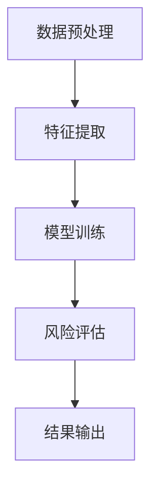
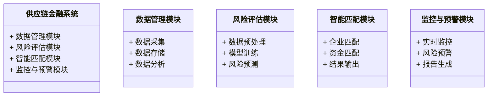
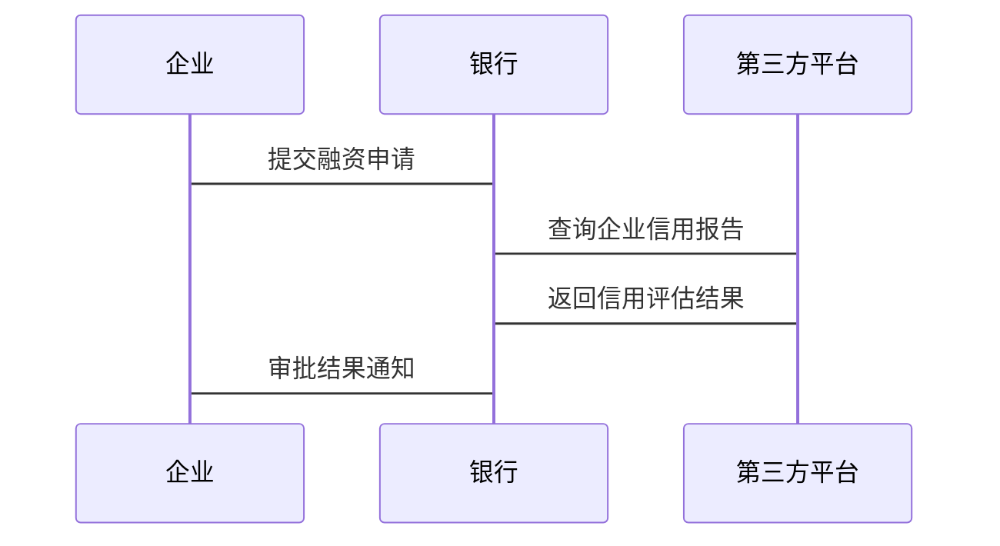

                 


# AI在供应链金融中的深度应用研究

> 关键词：供应链金融，人工智能，机器学习，深度学习，风险管理，数据驱动

> 摘要：本文深入探讨了人工智能技术在供应链金融领域的应用，分析了供应链金融的核心概念、AI技术的原理及其在风险评估、智能匹配等方面的具体应用。通过实际案例的分析，展示了AI如何提升供应链金融的效率和准确性，为行业提供了新的思路和解决方案。

---

## 第一部分: 供应链金融与AI的结合概述

### 1.1 供应链金融的基本概念

供应链金融是指通过整合供应链上的各个环节，为供应链中的企业提供资金支持的一种融资方式。它不仅解决了中小企业的融资难题，还优化了供应链的整体运作效率。供应链金融的核心在于通过数据和信息的共享，降低融资成本和风险。

#### 1.1.1 供应链金融的定义

供应链金融（Supply Chain Finance，SCF）是指银行或非银行金融机构为供应链上的企业提供资金支持，以满足企业在采购、生产、销售等环节的资金需求。供应链金融通常涉及供应商、客户、银行和第三方平台等多个角色。

#### 1.1.2 供应链金融的核心要素

- **供应商**：供应链的起点，提供原材料或产品的企业。
- **客户**：供应链的终点，购买产品或服务的企业。
- **资金流**：供应链中的资金流动，包括采购、生产、销售等环节的资金需求。
- **信息流**：供应链中的信息共享，包括订单、物流、财务等数据。

#### 1.1.3 供应链金融的业务流程

1. **需求分析**：企业根据生产或销售需求确定资金需求。
2. **融资申请**：企业向银行或第三方平台提出融资申请。
3. **审核与评估**：银行或平台对企业的信用状况、财务状况等进行评估。
4. **资金发放**：审核通过后，资金发放给企业。
5. **资金使用与回收**：企业使用资金进行生产和销售，最终回收资金。

### 1.2 AI技术的基本概念

人工智能（Artificial Intelligence，AI）是指模拟人类智能的计算机系统，能够通过数据和算法进行学习、推理和决策。AI的核心技术包括机器学习、深度学习、自然语言处理和计算机视觉等。

#### 1.2.1 人工智能的定义

人工智能是研究、开发能模拟人类智能的理论、方法、技术及应用系统的一门学科。AI系统能够执行复杂任务，如视觉识别、语音识别、决策制定等。

#### 1.2.2 机器学习与深度学习的区别

- **机器学习**：通过数据训练模型，使模型能够从数据中学习规律并进行预测。
- **深度学习**：属于机器学习的一种，使用多层神经网络模型，能够自动提取数据特征。

#### 1.2.3 AI在金融领域的应用现状

AI技术在金融领域的应用广泛，包括股票交易、信用评估、风险管理、欺诈检测等。AI能够通过分析大量数据，提高金融决策的准确性和效率。

### 1.3 供应链金融与AI的结合背景

#### 1.3.1 供应链金融的传统挑战

- **信息不对称**：供应链上的企业之间信息共享不足，导致融资困难。
- **风险管理复杂**：供应链涉及多个环节和企业，风险评估和控制较为复杂。
- **效率低下**：传统的融资流程繁琐，审批时间长，难以满足企业的资金需求。

#### 1.3.2 AI技术如何解决供应链金融问题

- **数据驱动的决策**：通过分析供应链中的数据，AI能够提供更精准的信用评估和风险预测。
- **自动化流程**：AI技术能够自动化处理融资申请、审核和资金发放，提高效率。
- **实时监控**：AI能够实时监控供应链中的数据，及时发现和处理风险。

#### 1.3.3 当前AI在供应链金融中的应用趋势

- **智能化的风险管理**：通过AI技术进行实时风险评估和预测。
- **数据驱动的融资决策**：利用大数据分析优化融资方案。
- **自动化流程**：AI技术推动供应链金融流程的自动化和智能化。

---

## 第二部分: 供应链金融的核心概念与AI的联系

### 2.1 供应链金融的核心概念

供应链金融的核心在于通过数据和信息的共享，优化供应链中的资金流动和风险控制。AI技术能够通过分析供应链中的数据，提供更精准的融资决策和风险管理。

#### 2.1.1 供应商

供应商是供应链的起点，为生产提供原材料或半成品的企业。AI技术可以通过分析供应商的历史交易数据，评估其信用状况和供应能力。

#### 2.1.2 客户

客户是供应链的终点，购买产品或服务的企业。AI技术可以通过分析客户的订单数据和信用记录，评估其还款能力。

#### 2.1.3 资金流

资金流是供应链中的关键要素，涉及企业的采购、生产、销售等环节。AI技术可以通过分析资金流数据，优化融资方案和资金分配。

#### 2.1.4 信息流

信息流是供应链中的数据共享，包括订单、物流、财务等信息。AI技术可以通过分析信息流数据，提高供应链的整体效率。

### 2.2 AI技术的核心概念

AI技术的核心在于通过数据和算法进行学习和决策。在供应链金融中，AI技术能够通过分析大量的数据，提供更精准的信用评估和风险管理。

#### 2.2.1 数据挖掘

数据挖掘是通过分析数据，发现数据中的模式和规律。在供应链金融中，数据挖掘可以用于发现企业的信用风险和融资需求。

#### 2.2.2 机器学习模型

机器学习模型是通过数据训练模型，使模型能够进行预测和分类。在供应链金融中，机器学习模型可以用于信用评估和风险预测。

#### 2.2.3 自然语言处理

自然语言处理是通过计算机理解人类语言的技术。在供应链金融中，自然语言处理可以用于分析合同和文档，提取关键信息。

#### 2.2.4 图神经网络

图神经网络是用于处理图数据的深度学习模型。在供应链金融中，图神经网络可以用于建模供应链中的关系和风险传播。

### 2.3 供应链金融与AI的实体关系图

以下是一个供应链金融与AI技术的实体关系图：

```mermaid
erDiagram
    actor 供应商
    actor 客户
    actor 银行
    actor 第三方平台
    product 产品
    transaction 交易记录
    contract 合同
    risk 风险评估
    payment 资金支付
    供应商 --> 产品: 提供
    客户 --> 产品: 需求
    供应商 --> transaction: 参与
    客户 --> transaction: 参与
    transaction --> risk: 评估
    risk --> payment: 决策
    payment --> 银行: 操作
    银行 --> 第三方平台: 数据共享
```

---

## 第三部分: AI在供应链金融中的算法原理

### 3.1 常见的AI算法及其应用

在供应链金融中，常用的AI算法包括机器学习和深度学习算法。

#### 3.1.1 机器学习算法

- **线性回归**：用于预测连续变量，如企业的信用评分。
- **支持向量机（SVM）**：用于分类问题，如企业信用分类。
- **随机森林**：用于分类和回归问题，如风险评估。

#### 3.1.2 深度学习算法

- **神经网络**：用于复杂的非线性分类和回归问题。
- **卷积神经网络（CNN）**：用于图像识别和处理。
- **循环神经网络（RNN）**：用于时间序列数据的分析。

#### 3.1.3 图神经网络算法

图神经网络（Graph Neural Network，GNN）是一种处理图数据的深度学习模型。在供应链金融中，图神经网络可以用于建模供应链中的关系和风险传播。

### 3.2 供应链金融中的风险评估算法

风险评估是供应链金融中的关键环节，AI技术可以通过以下步骤进行风险评估：

1. **数据收集**：收集企业的财务数据、交易记录、信用报告等。
2. **特征提取**：从数据中提取特征，如收入、利润、应收账款等。
3. **模型训练**：使用机器学习或深度学习模型进行训练。
4. **风险预测**：根据模型预测企业的信用风险。

以下是一个风险评估算法的流程图：



### 3.3 算法实现的数学模型

#### 3.3.1 线性回归模型

线性回归模型用于预测连续变量，其数学模型如下：

$$ y = \beta_0 + \beta_1x + \epsilon $$

其中，$y$ 是预测值，$x$ 是自变量，$\beta_0$ 和 $\beta_1$ 是模型参数，$\epsilon$ 是误差项。

#### 3.3.2 神经网络模型

神经网络模型用于复杂的分类和回归问题，其数学模型如下：

$$ a^{(l)} = \sigma(w^{(l)} a^{(l-1)} + b^{(l)}) $$

其中，$a^{(l)}$ 是第$l$层的激活值，$w^{(l)}$ 是权重矩阵，$b^{(l)}$ 是偏置向量，$\sigma$ 是激活函数。

---

## 第四部分: 供应链金融系统的架构设计

### 4.1 系统功能设计

供应链金融系统需要具备以下功能模块：

- **风险评估模块**：用于评估企业的信用风险。
- **智能匹配模块**：用于匹配企业和资金提供方。
- **数据管理模块**：用于管理和分析供应链中的数据。
- **监控与预警模块**：用于实时监控供应链中的风险。

### 4.2 系统架构设计

以下是一个供应链金融系统的架构图：



### 4.3 系统接口设计

供应链金融系统需要与多个外部系统进行接口设计，如银行系统、第三方平台等。以下是一个接口设计的序列图：



---

## 第五部分: 项目实战

### 5.1 环境配置

为了实现AI驱动的供应链金融系统，需要以下环境配置：

- **编程语言**：Python 3.8+
- **深度学习框架**：TensorFlow或PyTorch
- **数据存储**：MySQL或MongoDB
- **开发工具**：Jupyter Notebook或VS Code

### 5.2 核心代码实现

以下是一个基于机器学习的风险评估模型的实现代码：

```python
import numpy as np
import pandas as pd
from sklearn.model_selection import train_test_split
from sklearn.linear_model import LinearRegression
from sklearn.metrics import mean_squared_error

# 数据加载
data = pd.read_csv('supply_chain_data.csv')

# 数据预处理
X = data.drop('credit_score', axis=1)
y = data['credit_score']

# 数据分割
X_train, X_test, y_train, y_test = train_test_split(X, y, test_size=0.2, random_state=42)

# 模型训练
model = LinearRegression()
model.fit(X_train, y_train)

# 模型预测
y_pred = model.predict(X_test)

# 模型评估
mse = mean_squared_error(y_test, y_pred)
print(f"均方误差: {mse}")
print(f"决定系数: {model.score(X_test, y_test)}")
```

### 5.3 代码解读与分析

上述代码实现了一个基于线性回归的信用评分模型。数据加载后，进行了数据预处理和分割，然后使用线性回归模型进行训练和预测。最后，通过均方误差和决定系数评估模型的性能。

### 5.4 实际案例分析

以某制造企业为例，通过AI技术进行风险评估和融资匹配，优化了企业的融资流程，提高了融资效率。

### 5.5 项目小结

通过本项目，我们展示了AI技术在供应链金融中的应用，包括数据处理、模型训练和结果分析。AI技术能够显著提高供应链金融的效率和准确性。

---

## 第六部分: 总结

### 6.1 最佳实践 tips

- 数据是AI的核心，确保数据的准确性和完整性。
- 选择合适的算法和模型，根据具体问题进行调整。
- 定期更新模型，适应市场的变化。

### 6.2 小结

本文深入探讨了AI技术在供应链金融中的应用，包括核心概念、算法原理和系统设计。通过实际案例的分析，展示了AI技术如何优化供应链金融的流程和决策。

### 6.3 注意事项

- 保护数据隐私，遵守相关法律法规。
- 定期监控和维护模型，确保系统的稳定运行。
- 提供用户友好的界面，方便企业的使用。

### 6.4 拓展阅读

- 《机器学习实战》
- 《深度学习》
- 《供应链管理》

---

通过本文的分析和实践，我们可以看到AI技术在供应链金融中的巨大潜力。未来，随着技术的不断发展，AI将为供应链金融带来更多的创新和突破。

