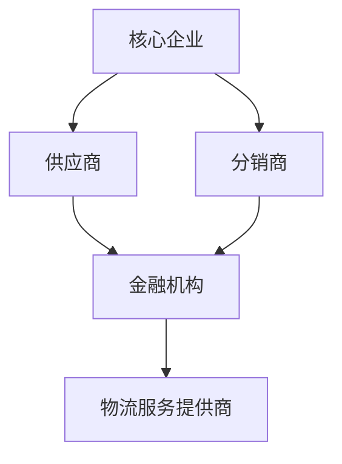
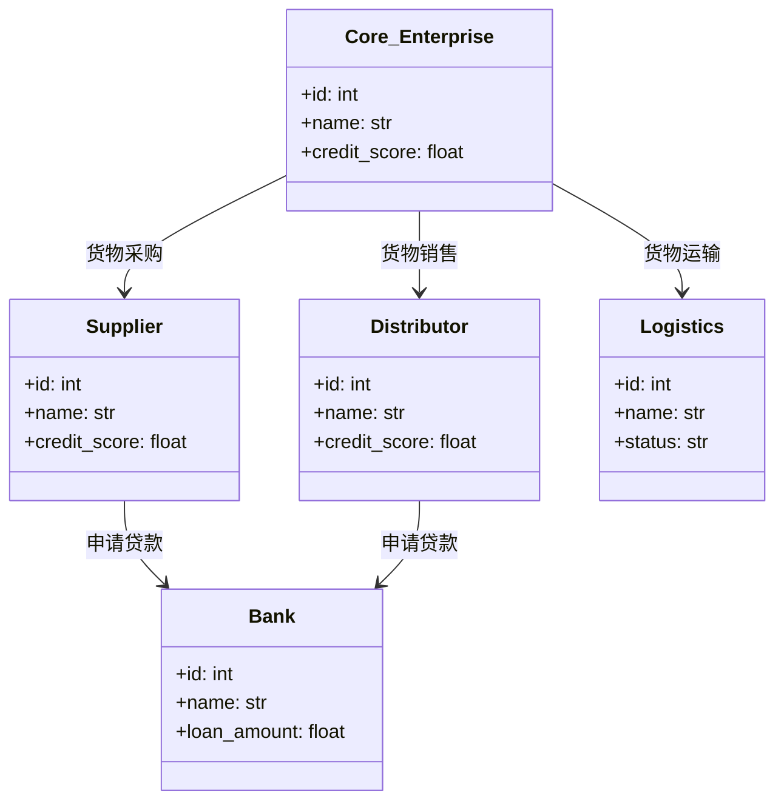

                 


# AI在供应链金融信用网络优化中的深度应用

> **关键词**：供应链金融、信用网络优化、人工智能、深度学习、图神经网络、风险管理

> **摘要**：本文深入探讨了人工智能技术在供应链金融信用网络优化中的应用。首先介绍了供应链金融的基本概念和现状，分析了信用网络优化的重要性和挑战。接着详细讲解了AI技术在信用评估、风险预测和流程优化中的具体应用。通过构建数学模型和算法流程图，阐述了基于深度学习和图神经网络的信用评分和风险预测方法。最后，通过一个实际案例展示了AI技术在供应链金融中的应用效果，并提出了未来的发展方向。

---

# 第一部分: 供应链金融与信用网络优化概述

## 第1章: 供应链金融的定义与现状

### 1.1 供应链金融的定义

#### 1.1.1 供应链金融的基本概念
供应链金融（Supply Chain Finance，SCF）是指通过整合供应链上下游企业之间的资金流、信息流和物流，提供融资服务的一种金融模式。其核心目标是解决中小企业的融资难题，优化资金配置，降低整体供应链的成本和风险。

#### 1.1.2 供应链金融的核心参与者
- **核心企业**：供应链中的主导企业，通常是制造商或分销商。
- **供应商**：为核心企业提供原材料或服务的企业。
- **分销商/零售商**：负责销售核心企业产品的渠道。
- **金融机构**：包括银行、保理公司等，提供融资服务。
- **物流服务提供商**：负责产品的仓储和运输。

#### 1.1.3 供应链金融的主要模式
- **应收账款融资**：基于供应商与核心企业的应收账款进行融资。
- **存货融资**：基于存货的价值进行融资。
- **预付款融资**：基于预付款的未来现金流进行融资。

### 1.2 供应链金融的现状与挑战

#### 1.2.1 当前供应链金融的发展状况
供应链金融在全球范围内发展迅速，尤其是在制造业和零售业。随着全球化的深入，供应链的复杂性不断增加，企业对高效的融资服务需求也在增长。

#### 1.2.2 供应链金融面临的主要问题
- **信息不对称**：供应链上下游企业之间的信息难以共享，导致融资效率低下。
- **信用风险**：中小企业的信用评估难度大，导致金融机构的风险厌恶。
- **融资成本高**：传统融资方式效率低，中小企业融资成本高。
- **缺乏透明度**：供应链中的交易数据分散，难以监控和管理。

#### 1.2.3 供应链金融的未来发展趋势
- **数字化转型**：通过区块链、大数据和AI技术实现供应链信息的透明化和智能化。
- **智能风控**：利用AI技术进行信用评估和风险预测。
- **生态化发展**：构建供应链金融生态系统，整合多方资源。

### 1.3 信用网络在供应链金融中的作用

#### 1.3.1 信用网络的定义与特点
信用网络是指供应链上下游企业之间的信用关系和信用行为构成的网络。其特点包括：
- **复杂性**：涉及多方主体和多种交易类型。
- **动态性**：信用关系随市场变化而变化。
- **关联性**：企业之间的信用风险相互关联。

#### 1.3.2 信用网络在供应链金融中的重要性
信用网络是供应链金融的核心基础设施。良好的信用网络可以降低融资成本，提高融资效率，优化资金流。

#### 1.3.3 信用网络优化的目标与意义
- **目标**：降低信用风险，提高融资效率，优化资源配置。
- **意义**：通过优化信用网络，可以增强供应链的韧性和竞争力。

## 第2章: AI技术在供应链金融中的应用价值

### 2.1 AI技术的基本概念与特点

#### 2.1.1 人工智能的定义与分类
人工智能（Artificial Intelligence，AI）是指计算机系统执行人类智能任务的能力，如学习、推理、识别和决策。AI可以分为弱人工智能和强人工智能，目前主要应用的是弱人工智能。

#### 2.1.2 深度学习与机器学习的区别
- **机器学习**：通过训练数据，学习特征，进行预测或分类。
- **深度学习**：一种特殊的机器学习方法，通过多层神经网络进行特征提取和学习。

#### 2.1.3 AI技术在金融领域的应用现状
AI技术在金融领域的应用包括信用评估、风险预测、智能投顾、欺诈 detection等。

### 2.2 AI技术在供应链金融中的应用场景

#### 2.2.1 供应链金融中的信用评估
- **传统方法**：基于财务报表和历史数据进行信用评估。
- **AI方法**：利用机器学习模型分析企业内外部数据，进行实时信用评分。

#### 2.2.2 供应链金融中的风险预测
- **信用风险**：通过深度学习模型预测企业违约概率。
- **市场风险**：基于市场数据和供应链数据预测价格波动风险。

#### 2.2.3 供应链金融中的流程优化
- **自动化审批**：通过AI技术实现融资申请的自动化处理。
- **智能监控**：实时监控供应链中的交易数据，发现异常情况。

### 2.3 AI技术在信用网络优化中的潜力

#### 2.3.1 信用网络优化的核心问题
- **信用风险分散**：如何在供应链中分散信用风险。
- **信息共享机制**：如何实现供应链上下游企业之间的信息共享。
- **信用评估模型**：如何构建高效的信用评估模型。

#### 2.3.2 AI技术在信用网络优化中的优势
- **数据驱动**：AI技术可以处理海量数据，发现数据中的潜在关系。
- **实时性**：AI技术可以实时分析数据，及时发现风险。
- **可扩展性**：AI技术可以扩展到大规模的供应链网络。

#### 2.3.3 信用网络优化的未来发展方向
- **智能化信用评估**：基于AI技术构建动态信用评分模型。
- **网络化风险管理**：通过AI技术实现供应链信用网络的风险预警和控制。
- **生态化金融模式**：构建供应链金融生态系统，实现多方共赢。

---

# 第二部分: 供应链金融信用网络优化的核心概念与联系

## 第3章: 供应链金融信用网络的结构与属性

### 3.1 供应链金融信用网络的构成

#### 3.1.1 供应链金融信用网络的参与者
- **核心企业**：供应链的主导企业。
- **供应商**：为核心企业提供原材料或服务的企业。
- **分销商/零售商**：负责销售核心企业产品的渠道。
- **金融机构**：包括银行、保理公司等，提供融资服务。
- **物流服务提供商**：负责产品的仓储和运输。

#### 3.1.2 信用网络的实体关系
通过Mermaid图展示供应链金融信用网络的实体关系：



### 3.2 信用网络的属性与优化目标

#### 3.2.1 信用网络的属性
- **信用评分**：企业的信用评分。
- **信用关系**：企业之间的信用依赖关系。
- **信用风险**：企业违约的可能性。

#### 3.2.2 信用网络优化的目标
- **降低信用风险**：通过优化信用评分模型，降低企业违约概率。
- **提高融资效率**：通过自动化流程，提高融资审批效率。
- **优化资源配置**：通过数据驱动的决策，优化供应链资源配置。

#### 3.2.3 优化的核心要素
- **数据**：供应链中的交易数据、企业数据、市场数据。
- **模型**：信用评分模型、风险预测模型。
- **算法**：机器学习算法、深度学习算法。

---

## 第4章: 基于AI的信用网络优化算法原理

### 4.1 算法概述

#### 4.1.1 算法目标
构建基于AI的信用评分模型，优化供应链金融信用网络。

#### 4.1.2 算法流程
1. 数据采集：收集供应链中的交易数据、企业数据、市场数据。
2. 数据预处理：清洗数据、特征提取。
3. 模型训练：基于机器学习或深度学习算法训练信用评分模型。
4. 模型评估：评估模型的准确率、召回率等指标。
5. 模型优化：调整模型参数，提高预测精度。
6. 实际应用：将模型应用于信用评分和风险预测。

### 4.2 深度学习模型

#### 4.2.1 模型结构
- **输入层**：供应链中的交易数据、企业数据。
- **隐藏层**：多个隐藏层，用于特征提取。
- **输出层**：信用评分（0-1之间的概率值）。

#### 4.2.2 模型训练
使用反向传播算法训练模型，优化损失函数。

#### 4.2.3 损失函数
常用的损失函数是交叉熵损失函数：

$$ L = -\frac{1}{n}\sum_{i=1}^{n} [y_i \log p_i + (1-y_i)\log (1-p_i)] $$

其中，$y_i$是真实标签，$p_i$是模型预测概率。

#### 4.2.4 模型优化
使用梯度下降算法优化模型参数：

$$ \theta = \theta - \eta \frac{\partial L}{\partial \theta} $$

其中，$\theta$是模型参数，$\eta$是学习率。

### 4.3 算法实现

#### 4.3.1 Python代码实现
以下是一个简单的信用评分模型的Python代码示例：

```python
import numpy as np
import pandas as pd
from sklearn.model_selection import train_test_split
from sklearn.linear_model import LogisticRegression
from sklearn.metrics import accuracy_score

# 数据加载
data = pd.read_csv('supply_chain_data.csv')
X = data.drop('target', axis=1)
y = data['target']

# 数据分割
X_train, X_test, y_train, y_test = train_test_split(X, y, test_size=0.2, random_state=42)

# 模型训练
model = LogisticRegression()
model.fit(X_train, y_train)

# 模型预测
y_pred = model.predict(X_test)

# 模型评估
print('Accuracy:', accuracy_score(y_test, y_pred))
```

---

## 第5章: 系统分析与架构设计方案

### 5.1 系统功能设计

#### 5.1.1 领域模型
通过Mermaid类图展示系统功能模块：



### 5.2 系统架构设计

#### 5.2.1 系统架构图
通过Mermaid架构图展示系统架构：

```mermaid
container 供应链金融信用网络优化系统 {
    Service Layer
    Data Layer
    UI Layer
    API Layer
}

Service Layer --> Data Layer: 数据访问
Service Layer --> API Layer: 接口调用
API Layer --> UI Layer: 页面请求
```

### 5.3 系统接口设计

#### 5.3.1 核心接口
- **信用评分接口**：`POST /api/credit_score`
- **风险预测接口**：`POST /api/risk_prediction`
- **融资申请接口**：`POST /api/loan_application`

---

## 第6章: 项目实战

### 6.1 环境安装

#### 6.1.1 Python安装
- 安装Python 3.8或更高版本。

#### 6.1.2 依赖安装
安装以下依赖：

```bash
pip install numpy pandas scikit-learn
```

### 6.2 核心代码实现

#### 6.2.1 数据加载与预处理
```python
import pandas as pd
import numpy as np
from sklearn.model_selection import train_test_split
from sklearn.linear_model import LogisticRegression
from sklearn.metrics import accuracy_score

# 数据加载
data = pd.read_csv('supply_chain_data.csv')

# 数据预处理
data = data.dropna()
X = data.drop('target', axis=1)
y = data['target']

# 数据分割
X_train, X_test, y_train, y_test = train_test_split(X, y, test_size=0.2, random_state=42)
```

#### 6.2.2 模型训练与评估
```python
# 模型训练
model = LogisticRegression()
model.fit(X_train, y_train)

# 模型预测
y_pred = model.predict(X_test)

# 模型评估
print('Accuracy:', accuracy_score(y_test, y_pred))
```

### 6.3 案例分析

#### 6.3.1 案例背景
某制造企业与其上游供应商和下游分销商的供应链金融信用网络优化项目。

#### 6.3.2 数据分析
通过机器学习模型分析企业的信用评分，发现高风险供应商并优化信用分配。

#### 6.3.3 实施效果
- 提高了融资效率，降低了融资成本。
- 降低了信用风险，优化了资源配置。

---

## 第7章: 总结与展望

### 7.1 总结
本文详细探讨了AI技术在供应链金融信用网络优化中的应用，从理论到实践，展示了如何通过AI技术优化信用评分、降低信用风险、提高融资效率。

### 7.2 最佳实践Tips
- 数据是关键，确保数据质量和完整性。
- 选择合适的算法，根据数据特征进行模型优化。
- 系统集成与安全性是关键，确保系统的稳定性和数据的安全性。

### 7.3 小结
供应链金融信用网络优化是一个复杂但充满潜力的领域，AI技术的应用将推动供应链金融的智能化和高效化。

### 7.4 注意事项
- 数据隐私和安全问题需要高度重视。
- 模型的可解释性是实际应用中的重要考量。
- 系统的实时性和可扩展性需要在设计阶段充分考虑。

### 7.5 拓展阅读
- 《供应链金融：理论、方法与实践》
- 《人工智能在金融领域的应用》
- 《深度学习与信用评分模型》

---

通过以上内容，您可以看到AI技术在供应链金融信用网络优化中的深度应用，从理论到实践，从算法到系统，全面展示了AI技术如何优化供应链金融的信用网络，降低风险，提高效率。

