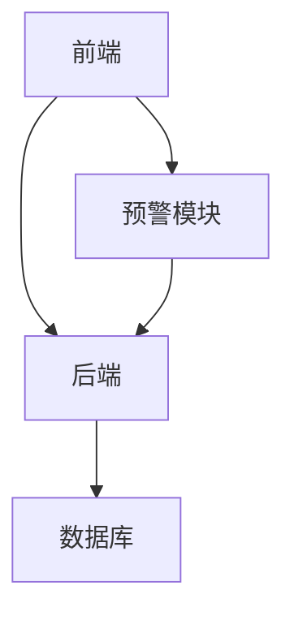
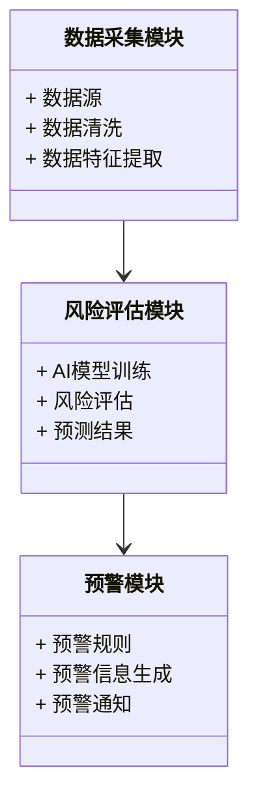

                 


# AI在供应链金融风险预警中的深度应用

> 关键词：供应链金融，人工智能，风险预警，机器学习，深度学习，自然语言处理

> 摘要：本文深入探讨了人工智能技术在供应链金融风险预警中的应用，从供应链金融的基本概念到AI技术的核心原理，再到风险预警系统的实现与实战，系统地分析了AI技术如何帮助供应链金融企业有效识别和规避风险，提升整体风险管理能力。文章结合实际案例，详细讲解了AI在供应链金融风险预警中的算法实现、系统架构设计、项目实战以及最佳实践，为读者提供了一套完整的解决方案。

---

## 第一部分: 供应链金融与AI技术概述

### 第1章: 供应链金融的基本概念

#### 1.1 供应链金融的定义与特点
供应链金融是一种通过整合供应链上下游企业之间的资金流、信息流和物流，为企业提供融资支持的金融模式。其核心在于通过控制供应链中的核心企业，为其上下游企业提供融资服务，从而优化整个供应链的资金流动效率。

**特点：**
- **整体性**：供应链金融强调对整个供应链的管理和优化。
- **依赖性**：核心企业是供应链金融的核心，上下游企业依赖于核心企业的信用和资金支持。
- **动态性**：供应链金融需要根据市场变化和企业经营状况实时调整融资策略。

#### 1.2 供应链金融中的风险类型
供应链金融涉及多个环节和企业，因此存在多种风险类型。

**风险类型：**
- **信用风险**：上下游企业可能因经营不善或恶意违约导致的融资风险。
- **操作风险**：供应链金融操作中的流程复杂性可能导致的操作失误或欺诈行为。
- **市场风险**：市场波动可能影响企业的经营状况和融资能力。

#### 1.3 AI技术在供应链金融中的应用背景
随着大数据和AI技术的快速发展，供应链金融领域的风险管理也逐渐引入AI技术。AI技术可以通过对海量数据的分析和挖掘，快速识别潜在风险，并提供实时预警。

---

### 第2章: AI技术的基本原理

#### 2.1 人工智能的核心概念
人工智能（AI）是指通过计算机模拟人类智能的技术，包括学习、推理、识别和自然语言处理等功能。

**核心概念：**
- **机器学习**：通过数据训练模型，使模型能够从数据中学习并做出预测。
- **深度学习**：一种基于人工神经网络的机器学习方法，能够处理复杂的非结构化数据。
- **自然语言处理**：对文本数据进行理解和处理的技术，常用于风险预警中的信息提取。

#### 2.2 常见AI算法简介
在供应链金融风险预警中，常用的AI算法包括机器学习和深度学习算法。

**算法简介：**
- **机器学习**：
  - **线性回归**：用于预测连续型变量，如企业的信用评分。
  - **支持向量机（SVM）**：用于分类问题，如企业信用等级分类。
- **深度学习**：
  - **神经网络**：用于处理复杂的非结构化数据，如文本和图像。

#### 2.3 AI在金融领域的应用现状
AI技术在金融领域的应用已经非常广泛，尤其是在信用评估、欺诈检测和投资决策等领域。

**应用现状：**
- **信用评估**：通过AI技术分析企业的财务数据和市场数据，评估企业的信用风险。
- **欺诈检测**：利用AI技术识别异常交易行为，防止欺诈。
- **投资决策**：通过AI技术分析市场数据，辅助投资决策。

---

### 第3章: 供应链金融风险预警的核心概念

#### 3.1 供应链金融风险预警的定义
供应链金融风险预警是指通过AI技术对供应链中的潜在风险进行实时监测和预警，以便及时采取应对措施，降低风险损失。

**定义：**
- 风险预警是供应链金融中的重要环节，旨在通过数据驱动的方式，提前识别和预警潜在风险。

#### 3.2 供应链金融风险预警的关键指标
在供应链金融风险预警中，需要关注多个关键指标。

**关键指标：**
- **财务指标**：如企业盈利能力、偿债能力等。
- **运营指标**：如供应链的周转率、库存水平等。
- **市场指标**：如行业趋势、市场波动等。

#### 3.3 AI在供应链金融风险预警中的优势
AI技术在供应链金融风险预警中的优势主要体现在数据处理能力和模型预测能力上。

**优势：**
- **数据处理能力**：AI能够处理海量数据，提取有价值的信息。
- **模型预测能力**：AI可以通过机器学习和深度学习模型，对潜在风险进行精准预测。
- **实时监控能力**：AI能够实时监测供应链中的风险变化，提供及时预警。

---

## 第二部分: AI技术在供应链金融风险预警中的应用

### 第4章: 数据采集与 Preprocessing

#### 4.1 数据来源
在供应链金融风险预警中，数据来源主要包括企业财务数据、市场数据、供应链数据等。

**数据来源：**
- **企业财务数据**：如销售收入、利润、资产负债表等。
- **市场数据**：如行业趋势、市场波动等。
- **供应链数据**：如订单数据、物流数据等。

#### 4.2 数据清洗与特征提取
数据清洗和特征提取是AI模型训练前的重要步骤。

**数据清洗：**
- 去除重复数据、填充缺失值、处理异常值等。
- 数据清洗的目标是确保数据的质量和一致性。

**特征提取：**
- 从原始数据中提取有价值的特征，如财务比率、市场趋势等。
- 特征提取可以通过统计方法或机器学习方法实现。

#### 4.3 数据 Preprocessing 的实现
以下是数据 Preprocessing 的具体实现步骤。

**代码示例：**

```python
import pandas as pd
import numpy as np

# 加载数据
data = pd.read_csv('supply_chain_data.csv')

# 去除重复数据
data.drop_duplicates(inplace=True)

# 填充缺失值
data.fillna(method='ffill', inplace=True)

# 处理异常值
data = data[abs(data['revenue'] - data['revenue'].mean()) <= 3 * data['revenue'].std()]

# 特征提取
data['profit_margin'] = data['net_profit'] / data['revenue']
```

---

### 第5章: AI算法在风险预警中的应用

#### 5.1 机器学习模型
在供应链金融风险预警中，常用的机器学习模型包括线性回归、支持向量机（SVM）等。

**代码示例：**
```python
from sklearn.linear_model import LinearRegression
from sklearn.svm import SVC

# 训练线性回归模型
model_lr = LinearRegression()
model_lr.fit(X_train, y_train)

# 预测
y_pred_lr = model_lr.predict(X_test)

# 训练支持向量机模型
model_svm = SVC()
model_svm.fit(X_train, y_train)

# 预测
y_pred_svm = model_svm.predict(X_test)
```

#### 5.2 深度学习模型
在处理复杂的非结构化数据时，深度学习模型如神经网络更为有效。

**代码示例：**
```python
import tensorflow as tf
from tensorflow.keras import layers

# 构建神经网络模型
model = tf.keras.Sequential()
model.add(layers.Dense(64, activation='relu', input_shape=(n_features,)))
model.add(layers.Dense(1, activation='sigmoid'))

# 编译模型
model.compile(optimizer='adam', loss='binary_crossentropy', metrics=['accuracy'])

# 训练模型
model.fit(X_train, y_train, epochs=10, batch_size=32)
```

#### 5.3 混合模型
在实际应用中，可以结合机器学习和深度学习模型，构建混合模型以提高预测精度。

**代码示例：**
```python
import lightgbm as lgb

# 训练 LightGBM 模型
model_lgb = lgb.LGBMClassifier()
model_lgb.fit(X_train, y_train)

# 预测
y_pred_lgb = model_lgb.predict(X_test)
```

---

### 第6章: 系统架构与设计

#### 6.1 系统架构设计
供应链金融风险预警系统的架构设计需要考虑系统的可扩展性和可维护性。

**架构设计：**
- **前端**：用户界面，用于展示预警信息和操作。
- **后端**：业务逻辑处理，包括数据采集、模型训练和预警生成。
- **数据库**：存储供应链相关数据和模型参数。

**系统架构图：**


#### 6.2 系统功能设计
系统功能模块包括数据采集、风险评估和预警模块。

**功能模块：**
- **数据采集模块**：负责采集供应链相关数据。
- **风险评估模块**：基于AI模型对供应链风险进行评估。
- **预警模块**：根据评估结果生成预警信息。

**功能模块图：**


---

### 第7章: 项目实战

#### 7.1 环境安装
在开始项目之前，需要安装必要的软件和库。

**环境安装步骤：**
1. 安装Python和Jupyter Notebook。
2. 安装所需的库，如Pandas、NumPy、Scikit-learn、TensorFlow等。
3. 配置开发环境，如PyCharm或VS Code。

**代码示例：**
```bash
pip install pandas numpy scikit-learn tensorflow
```

#### 7.2 核心代码实现
以下是供应链金融风险预警系统的核心代码实现。

**数据采集与 Preprocessing：**
```python
import pandas as pd

# 加载数据
data = pd.read_csv('supply_chain_data.csv')

# 数据清洗
data.drop_duplicates(inplace=True)
data.fillna(method='ffill', inplace=True)

# 特征提取
data['profit_margin'] = data['net_profit'] / data['revenue']
```

**模型训练与预测：**
```python
from sklearn.ensemble import RandomForestClassifier

# 训练随机森林模型
model = RandomForestClassifier()
model.fit(X_train, y_train)

# 预测
y_pred = model.predict(X_test)
```

#### 7.3 案例分析与解读
通过实际案例分析，展示AI技术在供应链金融风险预警中的应用效果。

**案例分析：**
假设某供应链企业存在多个上下游企业，通过AI技术分析企业的财务数据和市场数据，识别潜在风险，并提供预警信息。例如，通过模型预测某下游企业的信用风险，提前采取措施避免损失。

---

## 第三部分: 最佳实践与展望

### 第8章: 最佳实践与注意事项

#### 8.1 数据质量管理
数据质量是AI模型预测准确性的关键因素。在实际应用中，需要重视数据的准确性和完整性。

**注意事项：**
- 数据清洗是AI模型训练前的重要步骤。
- 数据特征的选择需要结合业务背景。

#### 8.2 模型优化
模型优化是提高预测精度的重要手段。

**优化建议：**
- 使用交叉验证选择最优模型。
- 调整模型参数，优化模型性能。
- 结合业务需求，选择合适的模型。

#### 8.3 系统安全性
供应链金融风险预警系统需要具备较高的安全性，防止数据泄露和网络攻击。

**安全性建议：**
- 数据加密存储和传输。
- 系统权限管理，确保数据安全。
- 定期进行安全漏洞检测。

---

### 第9章: 项目小结与展望

#### 9.1 项目小结
通过本文的介绍，读者可以了解AI技术在供应链金融风险预警中的应用，从数据采集、模型训练到系统实现的完整流程。

#### 9.2 未来展望
随着AI技术的不断发展，供应链金融风险预警系统将更加智能化和自动化。未来，可以结合区块链技术，进一步提升系统的安全性和透明度。

---

## 第10章: 拓展阅读与学习资源

#### 10.1 推荐书籍
- 《Python机器学习实战》
- 《深度学习入门：基于Python的TensorFlow实现》
- 《供应链金融：理论与实践》

#### 10.2 在线课程
- Coursera：《机器学习专项课程》
- edX：《供应链管理入门》
- Udemy：《Python数据分析与可视化》

#### 10.3 技术博客与社区
- Towards Data Science
- Medium：AI in Supply Chain
- Kaggle：供应链金融相关数据集

---

通过本文的详细介绍，读者可以全面了解AI技术在供应链金融风险预警中的深度应用，从理论到实践，掌握一套完整的解决方案。

