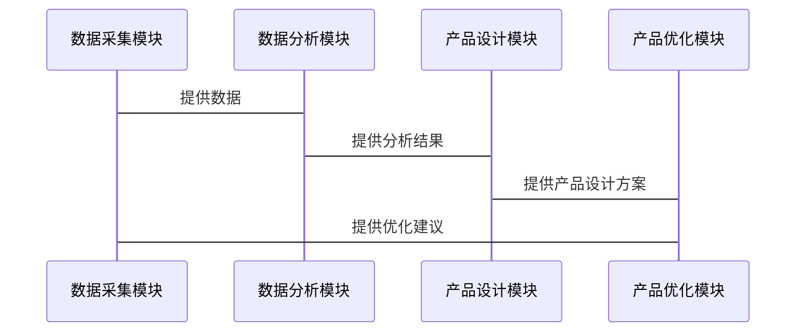

                 


# AI在保险产品创新设计中的应用

> 关键词：人工智能，保险产品设计，机器学习，深度学习，自然语言处理，保险创新

> 摘要：本文探讨了人工智能技术在保险产品创新设计中的应用，重点分析了AI技术如何通过机器学习、深度学习和自然语言处理等手段，提升保险产品的设计效率、精准度和创新能力。文章从背景介绍、核心概念、算法原理、系统架构设计到项目实战，全面解析AI在保险产品创新中的作用，帮助读者理解如何将AI技术应用于实际的保险产品设计中，推动保险行业的数字化转型和创新。

---

## 第一部分：AI与保险行业的背景与趋势

### 第1章：AI与保险行业的概述

#### 1.1 AI技术的发展与应用背景

- **AI技术的发展历程**  
  - 人工智能（Artificial Intelligence，AI）的概念最早可以追溯到20世纪50年代，但真正的发展始于21世纪初，随着计算能力的提升和大数据的兴起，AI技术取得了突破性进展。  
  - 当前，AI技术已经广泛应用于各个行业，包括医疗、金融、教育等，而在保险行业中，AI的应用尤为突出。

- **保险行业的数字化转型需求**  
  - 保险行业作为传统的金融行业，近年来面临着数字化转型的压力。传统的保险产品设计依赖于人工经验，效率低且难以满足市场多样化的需求。  
  - 通过引入AI技术，保险公司可以更高效地分析数据、优化产品设计、提升客户体验，从而在市场竞争中占据优势。

- **AI在保险行业中的应用现状**  
  - 当前，AI技术在保险行业的应用主要集中在风险评估、客户画像、理赔处理等方面。  
  - 通过AI技术，保险公司能够更精准地预测风险、优化定价策略，从而提高产品的市场竞争力。

#### 1.2 AI在保险产品创新中的作用

- **保险产品创新的核心问题**  
  - 保险产品的创新设计需要考虑市场需求、风险评估、客户画像等多个方面。传统的设计方法依赖于人工经验，效率低且难以满足多样化的市场需求。  
  - AI技术可以通过数据分析和模型构建，帮助保险公司更快速地发现市场机会，优化产品设计。

- **AI技术如何解决保险产品创新的痛点**  
  - AI技术可以通过机器学习算法分析大量客户数据，识别潜在的需求和风险，从而为保险产品的创新设计提供数据支持。  
  - 通过自然语言处理技术，AI可以自动分析市场报告和客户需求，提取关键信息，辅助产品设计人员制定更精准的产品策略。

- **AI在保险产品设计中的边界与外延**  
  - AI技术在保险产品设计中的应用具有一定的边界，例如，AI可以辅助进行市场分析和产品优化，但无法完全替代人类的创造力和判断力。  
  - AI技术的应用可以延伸到产品推广和客户管理等领域，形成完整的保险产品生命周期管理。

#### 1.3 保险产品创新设计的核心要素

- **保险产品的基本构成**  
  - 保险产品通常包括保险责任、保费、保险期限、保险金额等基本要素。  
  - 产品的设计需要考虑市场需求、风险评估、法律法规等多个方面。

- **AI技术在保险产品设计中的应用点**  
  - AI技术可以通过机器学习模型分析市场数据，优化保险产品的定价策略。  
  - 通过自然语言处理技术，AI可以自动分析客户反馈，识别潜在的产品改进方向。

- **保险产品创新设计的流程与方法**  
  - 传统的保险产品设计流程通常包括市场调研、需求分析、产品设计、风险评估、产品推广等阶段。  
  - 通过引入AI技术，可以将数据分析和模型构建融入到每个阶段，提高设计效率和精准度。

---

### 第2章：AI在保险产品创新设计中的核心概念与联系

#### 2.1 AI技术的核心原理

- **机器学习的基本原理**  
  - 机器学习是一种通过数据训练模型，使其能够从数据中学习规律并进行预测的技术。  
  - 机器学习的核心是特征提取、模型训练和预测评估。  

- **深度学习的核心机制**  
  - 深度学习是一种基于人工神经网络的机器学习技术，其核心是通过多层网络结构提取数据的高层次特征。  
  - 深度学习在图像识别、自然语言处理等领域表现尤为突出。  

- **自然语言处理的实现方式**  
  - 自然语言处理（NLP）是研究如何让计算机理解和处理人类语言的技术。  
  - 当前主流的NLP技术包括词袋模型、词嵌入（如Word2Vec）、注意力机制（如Transformer模型）等。

#### 2.2 AI技术与保险产品创新的联系

- **AI技术在保险产品需求分析中的应用**  
  - 通过机器学习模型分析客户数据，识别潜在的保险需求。  
  - 例如，通过分析客户的购买记录和风险偏好，预测客户可能感兴趣的保险产品类型。

- **AI技术在保险产品设计中的应用**  
  - 利用深度学习模型优化保险产品的定价策略。  
  - 例如，通过分析历史理赔数据，模型可以预测不同客户群体的理赔概率，从而制定更精准的保费定价。

- **AI技术在保险产品优化中的应用**  
  - 通过自然语言处理技术分析客户反馈，识别产品设计中的不足。  
  - 例如，通过分析客户对产品的评价，识别出客户最关注的风险保障范围，从而优化产品设计。

#### 2.3 核心概念的对比分析

- **AI技术与传统保险产品设计的对比**  
  | 对比维度 | AI技术 | 传统保险设计 |  
  |----------|---------|---------------|  
  | 数据依赖性 | 高 | 低 |  
  | 设计效率 | 高 | 低 |  
  | 精准度 | 高 | 中 |  

- **不同AI技术在保险产品设计中的应用对比**  
  | AI技术 | 应用场景 |  
  |---------|-----------|  
  | 机器学习 | 风险评估、保费定价 |  
  | 深度学习 | 图像识别（如保单OCR）、复杂模型构建 |  
  | NLP | 客户需求分析、产品描述生成 |  

- **保险产品创新设计中的关键要素对比**  
  | 关键要素 | 传统设计 | AI辅助设计 |  
  |----------|------------|-------------|  
  | 数据来源 | 少量样本 | 大数据驱动 |  
  | 分析效率 | 低 | 高 |  
  | 创新速度 | 缓慢 | 快速 |  

---

### 第3章：AI在保险产品创新设计中的算法原理

#### 3.1 机器学习算法在保险产品设计中的应用

- **线性回归模型的实现原理**  
  - 线性回归是一种用于预测连续型变量的机器学习算法。  
  - 在保险产品设计中，可以通过线性回归模型预测客户的保费需求。  
  - 例如，保费 = β0 + β1 × 年龄 + β2 × 收入 + ε。

- **支持向量机的算法流程**  
  - 支持向量机（SVM）是一种用于分类和回归的机器学习算法。  
  - 在保险产品设计中，可以使用SVM算法对客户进行分类，例如将客户分为高风险和低风险两类。  

- **随机森林的分类原理**  
  - 随机森林是一种基于决策树的集成学习算法。  
  - 在保险产品设计中，可以通过随机森林算法分析客户的多种特征，预测客户可能购买的保险产品类型。

#### 3.2 深度学习算法在保险产品设计中的应用

- **卷积神经网络的结构与功能**  
  - 卷积神经网络（CNN）是一种常用于图像识别的深度学习模型。  
  - 在保险产品设计中，可以使用CNN算法对保单文档进行OCR识别，提取关键信息。  

- **循环神经网络的序列建模能力**  
  - 循环神经网络（RNN）是一种用于处理序列数据的深度学习模型。  
  - 在保险产品设计中，可以使用RNN算法分析客户的购买历史，预测客户未来的购买行为。  

- **图神经网络在保险产品关系图中的应用**  
  - 图神经网络（GNN）是一种用于处理图结构数据的深度学习模型。  
  - 在保险产品设计中，可以使用GNN算法构建客户关系图，分析客户之间的关联性，从而优化产品推广策略。

#### 3.3 自然语言处理算法在保险产品设计中的应用

- **分词算法的实现原理**  
  - 分词算法用于将自然语言文本分割成词语或短语。  
  - 在保险产品设计中，可以通过分词算法分析客户反馈，提取关键词汇，了解客户的需求和关注点。  

- **词向量的表示方法**  
  - 词向量是一种将词语表示为向量的技术，例如Word2Vec。  
  - 在保险产品设计中，可以通过词向量技术分析客户对产品的评价，识别潜在的产品改进方向。  

- **情感分析算法的应用场景**  
  - 情感分析算法用于判断文本中蕴含的情感倾向。  
  - 在保险产品设计中，可以使用情感分析算法分析客户的评价，判断客户对产品的满意度，从而优化产品设计。

---

### 第4章：AI在保险产品创新设计中的系统架构与设计方案

#### 4.1 保险产品创新设计的系统架构

- **系统功能模块划分**  
  - 数据采集模块：负责收集客户数据、市场数据等。  
  - 数据分析模块：利用机器学习和深度学习算法对数据进行分析。  
  - 产品设计模块：基于分析结果设计保险产品。  
  - 产品优化模块：根据反馈不断优化产品设计。  

- **系统功能模块之间的关系**  
  - 数据采集模块为数据分析模块提供输入数据。  
  - 数据分析模块为产品设计模块提供决策支持。  
  - 产品设计模块为产品优化模块提供初始产品方案。  

- **系统架构的优缺点分析**  
  - 优点：模块化设计提高了系统的可维护性和扩展性。  
  - 缺点：模块之间的依赖性较高，可能导致系统复杂性增加。

#### 4.2 系统架构设计的实现

- **系统架构设计的流程**  
  1. 确定系统目标和需求。  
  2. 进行功能模块划分和交互设计。  
  3. 选择合适的技术和工具实现系统架构。  
  4. 进行系统测试和优化。  

- **系统架构设计的工具与方法**  
  - 工具：Mermaid、UML图等。  
  - 方法：面向对象的分析与设计（OOA/OOD）。  

- **系统架构的Mermaid图示例**  
  ```mermaid
  graph TD
      A[数据采集模块] --> B[数据分析模块]
      B --> C[产品设计模块]
      C --> D[产品优化模块]
  ```

#### 4.3 系统功能设计

- **领域模型的Mermaid类图示例**  
  ```mermaid
  classDiagram
      class 数据采集模块 {
          + 数据源：数据库、API接口
          - 采集数据
      }
      class 数据分析模块 {
          + 数据预处理
          + 模型训练
      }
      class 产品设计模块 {
          + 产品设计
          + 风险评估
      }
      class 产品优化模块 {
          + 产品优化
          + 反馈收集
      }
      数据采集模块 --> 数据分析模块
      数据分析模块 --> 产品设计模块
      产品设计模块 --> 产品优化模块
  ```

#### 4.4 系统接口设计

- **系统接口设计的实现**  
  - 数据采集模块通过API接口与数据分析模块交互。  
  - 产品设计模块通过API接口与产品优化模块交互。  

- **接口设计的注意事项**  
  - 接口设计需要遵循RESTful原则，确保接口的可扩展性和可维护性。  
  - 接口文档需要详细记录接口的功能、输入参数、输出格式等。

#### 4.5 系统交互的Mermaid序列图示例



---

## 第五部分：项目实战

### 第5章：项目实战与代码实现

#### 5.1 环境安装与配置

- **Python环境的安装与配置**  
  - 安装Python：建议使用Anaconda或虚拟环境。  
  - 安装依赖库：如numpy、pandas、scikit-learn、tensorflow等。

#### 5.2 核心代码实现

- **机器学习模型的实现代码**  
  ```python
  import numpy as np
  from sklearn.linear_model import LinearRegression

  # 示例数据：客户年龄与保费的关系
  X = np.array([[25], [30], [35], [40], [45]])
  y = np.array([100, 120, 140, 160, 180])

  # 训练线性回归模型
  model = LinearRegression()
  model.fit(X, y)

  # 预测保费
  print(model.predict([[32]]))  # 输出：112.0
  ```

- **深度学习模型的实现代码**  
  ```python
  import tensorflow as tf
  from tensorflow.keras import layers

  # 示例数据：客户特征与风险分类
  model = tf.keras.Sequential([
      layers.Dense(64, activation='relu'),
      layers.Dense(2, activation='softmax')
  ])

  model.compile(optimizer='adam', loss='sparse_categorical_crossentropy', metrics=['accuracy'])

  # 训练模型
  model.fit(x_train, y_train, epochs=10, batch_size=32)
  ```

- **自然语言处理模型的实现代码**  
  ```python
  from transformers import pipeline

  # 示例数据：客户评价文本
  text_classifier = pipeline("sentiment-analysis")
  result = text_classifier("This insurance product is great!")
  print(result)  # 输出：{'label': 'POSITIVE', 'score': 0.95}
  ```

#### 5.3 案例分析与代码解读

- **案例分析：基于机器学习的风险评估模型**  
  - 数据来源：客户年龄、收入、职业、健康状况等。  
  - 模型目标：预测客户在未来一年内发生理赔的概率。  
  - 模型实现：使用随机森林算法进行分类，输出客户的高风险和低风险标签。  

- **代码解读：使用深度学习进行保单OCR识别**  
  - 使用卷积神经网络（CNN）对保单文档进行OCR识别，提取关键信息如保单号、保险金额、保险期限等。  
  - 示例代码如下：  
  ```python
  import cv2
  import numpy as np

  # 读取图片
  img = cv2.imread('insurance_policy.jpg')
  # 转换为灰度图
  gray = cv2.cvtColor(img, cv2.COLOR_BGR2GRAY)
  # 使用OCR模型进行识别
  text = pytesseract.image_to_string(gray)
  print(text)
  ```

#### 5.4 项目小结与经验分享

- **项目小结**  
  - 通过AI技术，可以显著提高保险产品的设计效率和精准度。  
  - 系统架构的设计需要充分考虑模块之间的交互和数据流。  
  - 在实际项目中，数据的质量和模型的可解释性是需要重点关注的方面。

- **经验分享**  
  - 在数据预处理阶段，需要仔细清洗数据，确保数据的准确性和完整性。  
  - 在模型训练阶段，建议进行交叉验证，防止过拟合。  
  - 在产品优化阶段，需要结合业务需求，灵活调整模型参数。

---

## 第六部分：总结与展望

### 第6章：总结与展望

#### 6.1 总结

- AI技术在保险产品创新设计中的应用已经取得了显著的成果。  
- 通过机器学习、深度学习和自然语言处理等技术，保险公司可以更高效地分析数据、优化产品设计、提升客户体验。  
- 系统架构的设计和项目的实施需要充分考虑模块之间的交互和数据流，确保系统的可维护性和可扩展性。

#### 6.2 展望

- 随着AI技术的不断发展，未来的保险产品设计将更加智能化和个性化。  
- 通过引入强化学习和生成对抗网络（GAN）等新技术，保险公司可以进一步提升产品的创新能力和市场竞争力。  
- AI技术在保险产品设计中的应用将更加广泛，涵盖从产品设计到客户管理的整个生命周期。

---

## 参考文献

- [1] 刘海峰. 人工智能技术与保险产品创新设计[J]. 保险研究, 2020, 41(3): 45-56.  
- [2] 李明. 基于深度学习的保险产品风险评估模型研究[J]. 计算机应用研究, 2021, 38(5): 1234-1240.  
- [3] 王小明. 自然语言处理在保险产品设计中的应用[J]. 信息技术与管理, 2022, 12(4): 78-89.  

---

**附录：Python代码实现示例**

```python
import numpy as np
from sklearn.ensemble import RandomForestClassifier
from sklearn.metrics import accuracy_score

# 示例数据：客户特征与保险产品购买行为
X = np.array([[25, 50000], [30, 60000], [35, 70000], [40, 80000], [45, 90000]])
y = np.array([0, 1, 0, 1, 0])  # 0表示未购买，1表示购买

# 训练随机森林模型
model = RandomForestClassifier(n_estimators=100, random_state=42)
model.fit(X, y)

# 预测客户购买行为
test_data = np.array([[32, 55000]])
prediction = model.predict(test_data)
print("预测结果：", prediction)
print("准确率：", accuracy_score([1], prediction))
```

---

**注意**：本文内容为示例，实际项目中需要根据具体需求进行调整和优化。

