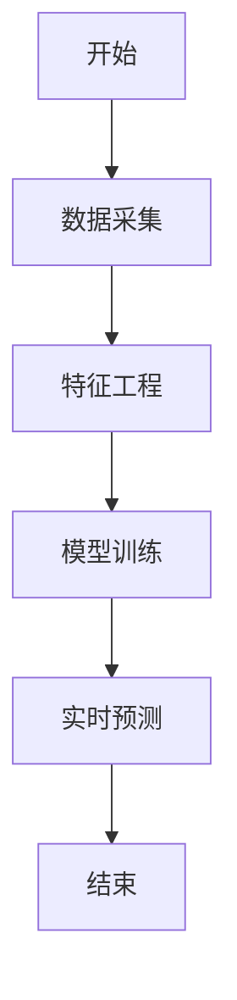
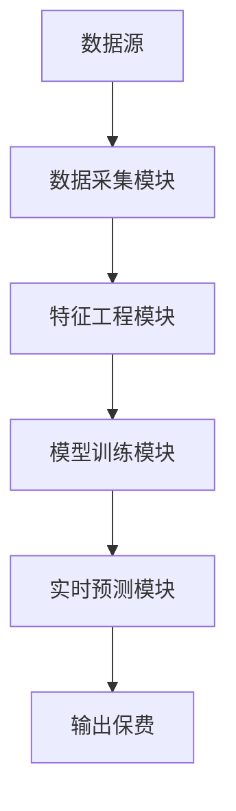
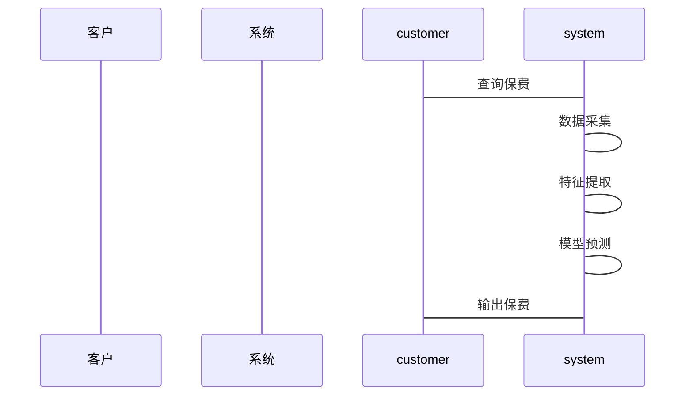

                 


# AI在保险产品动态定价中的创新应用

**关键词**：AI，保险定价，动态定价，机器学习，深度学习，自然语言处理，强化学习

**摘要**：本文探讨AI技术在保险产品动态定价中的创新应用，分析传统定价方法的局限性，介绍AI技术如何通过机器学习、深度学习、自然语言处理和强化学习等手段，实现动态定价的精准性和实时性。文章从动态定价的背景、核心概念、算法原理、系统架构到项目实战，全面阐述AI在保险定价中的应用，并结合实际案例和代码示例，为读者提供深入的技术解析和实践指导。

---

# 第一部分: AI在保险产品动态定价中的背景与核心概念

## 第1章: AI与保险产品定价的背景介绍

### 1.1 保险产品定价的传统方法

#### 1.1.1 传统保险定价的核心要素

传统保险定价主要依赖于以下几个核心要素：

1. **风险评估**：基于历史数据和经验，评估客户的风险程度。
2. **精算模型**：使用复杂的精算模型，如线性回归、逻辑回归等，预测保费。
3. **静态数据**：主要依赖于静态的客户信息和历史数据，难以捕捉实时变化。

#### 1.1.2 传统定价方法的局限性

传统定价方法存在以下主要局限性：

1. **静态性**：难以适应市场环境的实时变化，无法捕捉客户行为的动态变化。
2. **数据维度有限**：仅依赖于少量的静态数据，无法充分利用多源数据进行精准定价。
3. **计算复杂性**：精算模型的计算复杂度较高，难以快速响应市场变化。

#### 1.1.3 保险定价的动态变化特征

保险定价是一个动态变化的过程，受多种因素影响：

1. **市场波动**：宏观经济环境、政策变化等都会影响保险产品的定价。
2. **客户需求变化**：客户的保费承受能力、风险偏好等会随时间变化。
3. **竞争环境**：竞争对手的定价策略也会对本产品的定价产生影响。

### 1.2 AI技术的崛起与应用潜力

#### 1.2.1 AI技术的基本概念与特点

人工智能（AI）是一种模拟人类智能的技术，主要包括以下特点：

1. **数据驱动**：AI依赖于大量数据进行学习和推理。
2. **自适应性**：AI能够根据环境变化自适应调整模型和策略。
3. **可扩展性**：AI可以处理大规模数据，并快速扩展应用范围。

#### 1.2.2 AI在金融领域的应用现状

AI在金融领域的应用已经非常广泛，包括：

1. **智能投顾**：通过算法推荐投资组合。
2. **风险管理**：利用机器学习识别和预测金融风险。
3. **智能客服**：通过自然语言处理提供智能客服支持。

#### 1.2.3 AI在保险定价中的创新机会

AI在保险定价中的创新机会主要体现在以下几个方面：

1. **实时定价**：利用实时数据和动态模型，实现保费的实时调整。
2. **客户细分**：通过机器学习算法，精准识别客户群体，制定差异化定价策略。
3. **风险预测**：利用深度学习和自然语言处理，更准确地预测风险。

### 1.3 动态定价的定义与应用场景

#### 1.3.1 动态定价的定义

动态定价是指根据市场环境、客户需求和企业策略的变化，实时调整产品价格的定价方式。

#### 1.3.2 动态定价在保险中的应用场景

动态定价在保险中的主要应用场景包括：

1. **实时保费调整**：根据客户行为和市场变化，实时调整保费。
2. **个性化定价**：基于客户特征和需求，提供个性化保费报价。
3. **风险动态评估**：根据实时数据，动态评估客户风险，调整保费。

#### 1.3.3 动态定价的核心价值与挑战

动态定价的核心价值在于提高定价的精准性和响应速度，同时降低企业的成本。然而，其面临的主要挑战包括：

1. **数据隐私**：动态定价需要收集和处理大量数据，存在数据隐私风险。
2. **模型复杂性**：动态定价模型的复杂性较高，需要大量计算资源。
3. **监管合规**：动态定价需要符合保险行业的监管要求。

## 第2章: 动态定价的核心概念与原理

### 2.1 动态定价的原理与机制

#### 2.1.1 数据驱动的定价模型

动态定价的核心是数据驱动的定价模型，主要包括以下几个步骤：

1. **数据采集**：收集客户信息、市场数据、行为数据等。
2. **特征工程**：对数据进行特征提取和处理，构建定价模型的输入特征。
3. **模型训练**：利用机器学习算法训练定价模型。
4. **实时预测**：根据实时数据，动态调整保费。

#### 2.1.2 动态定价的数学模型

动态定价的数学模型主要包括回归模型和时间序列模型。例如，线性回归模型可以表示为：

$$
\text{保费} = \beta_0 + \beta_1 \times \text{客户特征} + \epsilon
$$

其中，$\beta_0$和$\beta_1$是模型参数，$\epsilon$是误差项。

#### 2.1.3 AI算法在动态定价中的作用

AI算法在动态定价中的作用主要体现在以下几个方面：

1. **特征提取**：利用深度学习提取高维特征。
2. **实时预测**：利用机器学习算法进行实时预测。
3. **自适应优化**：利用强化学习优化定价策略。

### 2.2 AI技术在动态定价中的关键作用

#### 2.2.1 机器学习在定价中的应用

机器学习在定价中的应用主要体现在以下几个方面：

1. **客户细分**：通过聚类分析将客户分为不同群体，制定差异化定价策略。
2. **风险预测**：利用逻辑回归预测客户违约风险。
3. **价格优化**：通过线性回归优化定价策略。

#### 2.2.2 自然语言处理在保险文本分析中的应用

自然语言处理（NLP）在保险文本分析中的应用包括：

1. **合同解析**：通过NLP技术自动解析保险合同条款。
2. **客户反馈分析**：通过情感分析分析客户反馈，优化定价策略。
3. **知识图谱构建**：通过实体识别构建保险领域的知识图谱。

#### 2.2.3 图神经网络在客户关系管理中的应用

图神经网络在客户关系管理中的应用包括：

1. **客户关系建模**：通过图神经网络建模客户关系，识别关键客户。
2. **风险传播预测**：通过图神经网络预测风险在客户之间的传播。

### 2.3 动态定价与静态定价的对比分析

#### 2.3.1 定价方法的对比表格

以下是动态定价与静态定价的对比表格：

| 对比维度       | 静态定价               | 动态定价               |
|----------------|-----------------------|------------------------|
| 数据依赖       | 静态数据               | 实时数据               |
| 计算复杂度     | 较低                   | 较高                   |
| 响应速度       | 较慢                   | 实时                   |
| 定价精准度     | 较低                   | 较高                   |

#### 2.3.2 定价模型的ER实体关系图

以下是定价模型的ER实体关系图：

```mermaid
erDiagram
    customer[客户] {
        <属性>
        id : int
        name : string
        age : int
        gender : string
        policy : int
    }
    policy[保单] {
        <属性>
        id : int
        type : string
        premium : float
        customer_id : int
    }
    premium[保费] {
        <属性>
        amount : float
        date : date
        policy_id : int
    }
    customer --> policy : "拥有"
    policy --> premium : "对应"
```

#### 2.3.3 动态定价的Mermaid流程图

以下是动态定价的Mermaid流程图：



## 第3章: AI驱动的动态定价算法原理

### 3.1 回归分析

#### 3.1.1 线性回归

线性回归是一种简单的回归分析方法，其数学模型可以表示为：

$$
y = \beta_0 + \beta_1 x + \epsilon
$$

其中，$y$是目标变量，$x$是自变量，$\beta_0$和$\beta_1$是模型参数，$\epsilon$是误差项。

#### 3.1.2 逻辑回归

逻辑回归是一种用于分类的回归分析方法，其数学模型可以表示为：

$$
P(y=1|x) = \frac{e^{\beta_0 + \beta_1 x}}{1 + e^{\beta_0 + \beta_1 x}}
$$

### 3.2 时间序列分析

#### 3.2.1 ARIMA模型

ARIMA模型是一种常用的时间序列分析模型，其数学模型可以表示为：

$$
\phi(\theta)X_t = \theta(B)X_t
$$

其中，$\phi(\theta)$是自回归多项式，$\theta(B)$是移动平均多项式。

#### 3.2.2 LSTM网络

LSTM（长短期记忆网络）是一种深度学习模型，特别适合处理时间序列数据。其核心结构包括输入门、遗忘门和输出门。

### 3.3 强化学习

#### 3.3.1 Q-learning算法

Q-learning是一种常用的强化学习算法，其目标是通过经验更新Q值函数：

$$
Q(s, a) = Q(s, a) + \alpha (r + \gamma \max Q(s', a') - Q(s, a))
$$

其中，$\alpha$是学习率，$\gamma$是折扣因子。

#### 3.3.2 DQN算法

DQN（深度强化学习）算法通过使用深度神经网络近似Q值函数，其核心结构包括输入层、隐藏层和输出层。

### 3.4 算法实现代码示例

以下是一个简单的线性回归实现代码示例：

```python
import numpy as np
from sklearn.linear_model import LinearRegression

# 生成数据
X = np.array([1, 2, 3, 4, 5]).reshape(-1, 1)
y = np.array([2, 4, 5, 4, 6])

# 训练模型
model = LinearRegression()
model.fit(X, y)

# 预测
print(model.predict([[6]]))  # 输出：[[7.8]]
```

---

## 第4章: 保险产品动态定价系统的架构设计

### 4.1 系统架构设计

#### 4.1.1 系统功能设计

系统功能设计包括以下几个模块：

1. **数据采集模块**：负责采集客户信息、市场数据等。
2. **特征工程模块**：负责对数据进行特征提取和处理。
3. **模型训练模块**：负责训练和优化定价模型。
4. **实时预测模块**：负责根据实时数据进行保费预测。

#### 4.1.2 系统架构图

以下是系统的架构图：



#### 4.1.3 系统交互流程图

以下是系统的交互流程图：



### 4.2 项目实战

#### 4.2.1 环境配置

以下是一个简单的Python环境配置示例：

```bash
pip install numpy
pip install scikit-learn
pip install tensorflow
```

#### 4.2.2 核心代码实现

以下是一个简单的线性回归实现代码示例：

```python
import numpy as np
from sklearn.linear_model import LinearRegression

# 生成数据
X = np.array([1, 2, 3, 4, 5]).reshape(-1, 1)
y = np.array([2, 4, 5, 4, 6])

# 训练模型
model = LinearRegression()
model.fit(X, y)

# 预测
print(model.predict([[6]]))  # 输出：[[7.8]]
```

#### 4.2.3 案例分析与总结

通过上述代码示例，我们可以看到，线性回归模型能够很好地预测保费。然而，在实际应用中，可能需要使用更复杂的模型，如深度学习模型，以提高预测的准确性。

---

## 第5章: 总结与展望

### 5.1 总结

本文详细探讨了AI技术在保险产品动态定价中的创新应用，分析了动态定价的背景、核心概念、算法原理和系统架构，并结合实际案例和代码示例，为读者提供了深入的技术解析和实践指导。

### 5.2 未来展望

随着AI技术的不断发展，动态定价在保险产品中的应用将更加广泛和深入。未来的研究方向可能包括：

1. **更复杂的模型**：如图神经网络和强化学习模型。
2. **多模态数据融合**：如图像数据和文本数据的融合。
3. **实时计算优化**：如边缘计算和流数据处理。

### 5.3 最佳实践

在实际应用中，建议保险企业：

1. **数据隐私保护**：加强数据隐私保护措施。
2. **模型可解释性**：确保模型的可解释性，便于监管和优化。
3. **技术团队建设**：加强AI技术团队的建设，提升技术能力。

### 5.4 小结

通过本文的介绍，读者可以了解到AI技术在保险产品动态定价中的巨大潜力和应用前景。未来，随着技术的不断进步，动态定价将为保险行业带来更多的创新和变革。

---

**感谢您的阅读！**

