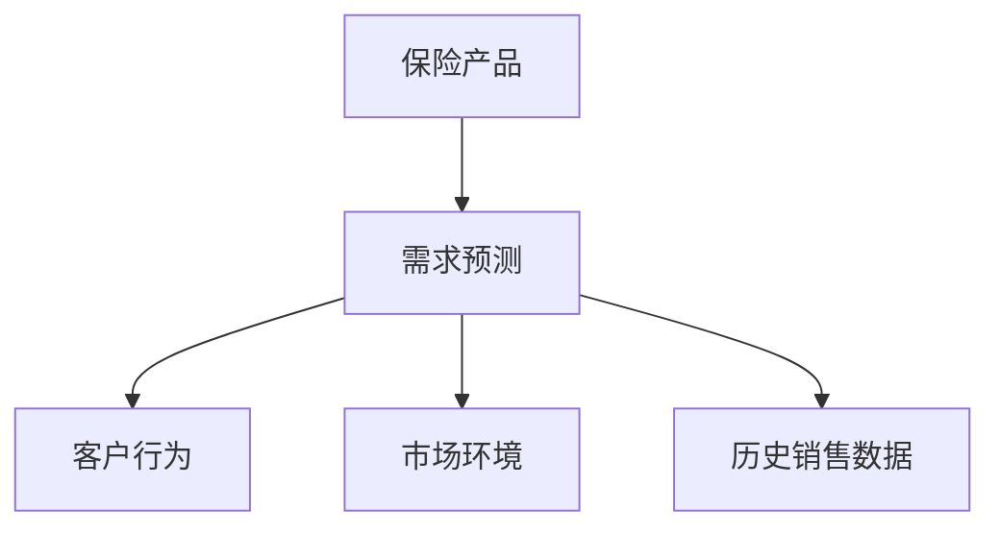
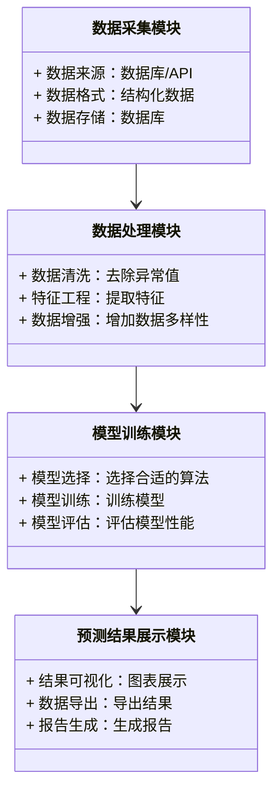
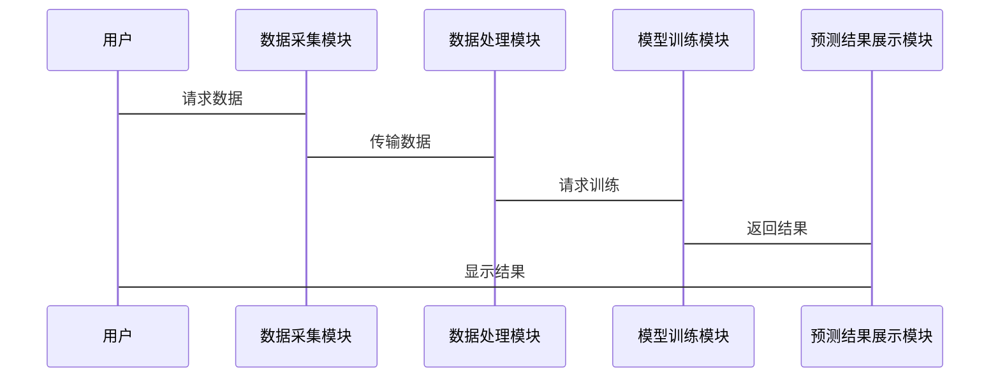

                 


好的，我明白了。让我们一步一步来构建这篇文章的目录大纲。首先，我需要理解文章的核心主题和目标读者。文章标题是《AI在保险产品需求预测中的创新应用》，关键词包括保险、人工智能、需求预测、大数据、机器学习、深度学习。摘要部分需要简明扼�地介绍文章的核心内容和主题思想。

接下来，我会按照您提供的目录大纲结构，逐步填充每一章的内容。我会使用清晰的逻辑和简洁的技术语言来撰写每一章，并确保每一章都有详细的子章节和内容。以下是目录大纲的具体内容：

---

# AI在保险产品需求预测中的创新应用

> **关键词**: 保险，人工智能，需求预测，大数据，机器学习，深度学习

> **摘要**: 本文探讨了人工智能技术在保险产品需求预测中的创新应用，详细分析了保险行业数字化转型的背景、AI技术的核心原理、需求预测的算法实现、系统架构设计、项目实战案例以及实际应用中的挑战与解决方案。通过结合理论与实践，本文旨在为保险行业的从业者和技术爱好者提供一份全面的技术指南，帮助他们更好地理解和应用AI技术来提升保险产品的需求预测能力。

---

## 目录

---

### 第1章 保险行业的数字化转型与AI的应用背景

#### 1.1 保险行业的现状与发展趋势

- 1.1.1 保险行业的传统模式与痛点

  - 传统保险业务的流程与挑战
  - 数字化转型的必要性

- 1.1.2 数字化转型的驱动力

  - 技术进步（AI、大数据）
  - 业务需求（精准营销、风险管理）

- 1.1.3 AI技术在保险行业的应用前景

  - AI技术的核心优势
  - 保险行业对AI技术的需求

#### 1.2 保险产品需求预测的核心问题

- 1.2.1 需求预测的定义与目标

  - 需求预测的基本概念
  - 需求预测的目标

- 1.2.2 需求预测的关键挑战

  - 数据质量与完整性
  - 模型的准确性和可解释性
  - 业务需求的动态变化

- 1.2.3 AI技术如何解决这些挑战

  - 数据处理能力
  - 模型优化能力
  - 动态适应能力

#### 1.3 保险产品需求预测的边界与外延

- 1.3.1 需求预测的边界条件

  - 数据范围
  - 时间范围
  - 产品范围

- 1.3.2 需求预测的外延领域

  - 市场分析
  - 客户行为分析
  - 竞争对手分析

- 1.3.3 需求预测与相关业务的关联性

  - 销售预测
  - 库存管理
  - 市场推广

#### 1.4 保险产品需求预测的核心要素

- 1.4.1 数据特征与业务指标

  - 客户特征
  - 产品特征
  - 市场特征

- 1.4.2 预测模型的关键参数

  - 模型类型
  - 参数设置
  - 评估指标

- 1.4.3 预测结果的评估标准

  - 模型准确率
  - 预测误差
  - 业务效果

#### 1.5 本章小结

---

### 第2章 AI技术的核心原理与保险需求预测的结合

#### 2.1 AI技术的核心原理

- 2.1.1 机器学习的基本概念

  - 监督学习
  - 非监督学习
  - 强化学习

- 2.1.2 深度学习的基本概念

  - 神经网络
  - 卷积神经网络（CNN）
  - 循环神经网络（RNN）

- 2.1.3 自然语言处理的基本概念

  - 词嵌入
  - 语义理解
  - 文本生成

#### 2.2 保险产品需求预测的核心概念

- 2.2.1 需求预测的数学模型

  - 线性回归模型
  - 时间序列模型
  - 聚类分析模型

- 2.2.2 需求预测的业务逻辑

  - 数据预处理
  - 模型训练
  - 结果解读

- 2.2.3 需求预测的算法选择

  - 传统统计方法与机器学习方法的对比
  - 深度学习方法的优势

#### 2.3 AI技术与保险需求预测的联系

- 2.3.1 数据特征的提取与分析

  - 数据清洗
  - 特征工程
  - 数据增强

- 2.3.2 模型训练与优化

  - 超参数调优
  - 模型评估
  - 模型部署

- 2.3.3 预测结果的解释与应用

  - 结果可视化
  - 业务解读
  - 决策支持

#### 2.4 核心概念的ER实体关系图



#### 2.5 本章小结

---

### 第3章 保险产品需求预测的算法原理

#### 3.1 传统统计学方法

- 3.1.1 线性回归模型

  - 线性回归的数学公式
  - 线性回归的实现步骤

- 3.1.2 时间序列分析

  - 时间序列的基本概念
  - 时间序列的预测方法

- 3.1.3 聚类分析

  - 聚类分析的原理
  - 聚类分析的应用

#### 3.2 机器学习算法

- 3.2.1 支持向量机（SVM）

  - SVM的数学模型
  - SVM的实现步骤

- 3.2.2 随机森林（Random Forest）

  - 随机森林的原理
  - 随机森林的实现步骤

- 3.2.3 神经网络（ANN）

  - 神经网络的结构
  - 神经网络的训练过程

#### 3.3 深度学习算法

- 3.3.1 卷积神经网络（CNN）

  - CNN的结构
  - CNN的训练过程

- 3.3.2 循环神经网络（RNN）

  - RNN的结构
  - RNN的应用

#### 3.4 算法实现的代码示例

- 3.4.1 线性回归模型的Python实现

  ```python
  import numpy as np
  from sklearn.linear_model import LinearRegression

  # 生成示例数据
  X = np.array([1, 2, 3, 4, 5]).reshape(-1, 1)
  y = np.array([2, 4, 5, 4, 5])

  # 创建线性回归模型
  model = LinearRegression()
  model.fit(X, y)

  # 预测结果
  predictions = model.predict(X)
  ```

- 3.4.2 时间序列分析的Python实现

  ```python
  import pandas as pd
  from statsmodels.tsa.arima_model import ARIMA

  # 生成示例时间序列数据
  data = pd.Series([1, 2, 3, 4, 5], index=pd.date_range('2020-01-01', periods=5))

  # 创建ARIMA模型
  model = ARIMA(data, order=(1, 1, 0))
  model_fit = model.fit()

  # 预测未来值
  forecast = model_fit.forecast(steps=5)
  ```

#### 3.5 算法原理的数学模型与公式

- 3.5.1 线性回归的数学模型

  $$ y = \beta_0 + \beta_1 x + \epsilon $$

- 3.5.2 支持向量机的数学模型

  $$ \text{maximize} \ \frac{1}{2} \sum_{i=1}^{n} \alpha_i^2 $$
  $$ \text{subject to} \ \ y_i (\omega \cdot x_i + b) + \alpha_i = 1 \ \text{for all} \ i $$

#### 3.6 本章小结

---

### 第4章 保险产品需求预测的系统架构设计

#### 4.1 系统架构的总体设计

- 4.1.1 系统功能模块划分

  - 数据采集模块
  - 数据处理模块
  - 模型训练模块
  - 预测结果展示模块

- 4.1.2 系统架构的层次结构

  - 数据层
  - 业务逻辑层
  - 用户界面层

#### 4.2 系统架构的详细设计

- 4.2.1 数据采集模块

  - 数据来源
  - 数据格式
  - 数据存储

- 4.2.2 数据处理模块

  - 数据清洗
  - 特征工程
  - 数据增强

- 4.2.3 模型训练模块

  - 模型选择
  - 模型训练
  - 模型评估

- 4.2.4 预测结果展示模块

  - 结果可视化
  - 数据导出
  - 报告生成

#### 4.3 系统架构的类图设计



#### 4.4 系统架构的交互设计



#### 4.5 本章小结

---

### 第5章 保险产品需求预测的项目实战

#### 5.1 项目背景与目标

- 5.1.1 项目背景

  - 保险行业的痛点
  - 项目的目标

- 5.1.2 项目目标

  - 提高需求预测的准确性
  - 优化业务流程
  - 提升客户满意度

#### 5.2 项目环境与工具安装

- 5.2.1 系统环境

  - 操作系统：Linux/Windows/Mac
  - 开发工具：PyCharm/VS Code
  - 依赖管理工具：pip

- 5.2.2 项目所需库的安装

  - Python库：numpy、pandas、scikit-learn、tensorflow
  - 数据库：MySQL/PostgreSQL

#### 5.3 项目核心实现

- 5.3.1 数据预处理

  - 数据清洗
  - 特征工程
  - 数据增强

- 5.3.2 模型训练

  - 模型选择
  - 模型训练
  - 模型优化

- 5.3.3 模型部署

  - 模型封装
  - 接口设计
  - 部署到服务器

#### 5.4 项目代码实现

- 5.4.1 数据预处理代码

  ```python
  import pandas as pd
  import numpy as np

  # 读取数据
  df = pd.read_csv('insurance_data.csv')

  # 数据清洗
  df.dropna(inplace=True)

  # 特征工程
  df['age_range'] = pd.qcut(df['age'], 3, labels=['low', 'medium', 'high'])
  ```

- 5.4.2 模型训练代码

  ```python
  from sklearn.model import LinearRegression

  # 创建模型
  model = LinearRegression()

  # 训练模型
  model.fit(X_train, y_train)

  # 预测结果
  y_pred = model.predict(X_test)
  ```

- 5.4.3 模型部署代码

  ```python
  from flask import Flask, request, jsonify

  app = Flask(__name__)

  @app.route('/predict', methods=['POST'])
  def predict():
      data = request.json
      # 数据处理
      # 模型预测
      return jsonify({'result': model.predict(data).tolist()})

  if __name__ == '__main__':
      app.run(debug=True)
  ```

#### 5.5 项目案例分析

- 5.5.1 案例背景

  - 某保险公司需求预测项目

- 5.5.2 数据分析

  - 数据来源
  - 数据特征

- 5.5.3 模型选择与训练

  - 选择线性回归模型
  - 训练模型
  - 评估模型

- 5.5.4 预测结果与业务应用

  - 预测结果
  - 业务解读
  - 决策支持

#### 5.6 本章小结

---

### 第6章 保险产品需求预测的实际应用案例

#### 6.1 应用场景与案例选择

- 6.1.1 应用场景

  - 保险产品的市场推广
  - 保险产品的定价策略
  - 保险产品的风险控制

- 6.1.2 案例选择

  - 某保险公司健康保险产品需求预测

#### 6.2 案例分析

- 6.2.1 数据分析

  - 数据来源
  - 数据特征
  - 数据处理

- 6.2.2 模型选择与训练

  - 模型选择
  - 模型训练
  - 模型优化

- 6.2.3 预测结果与业务应用

  - 预测结果
  - 业务解读
  - 决策支持

#### 6.3 案例总结

- 6.3.1 案例的成功经验

  - 数据处理的关键性
  - 模型选择的重要性
  - 模型部署的可行性

- 6.3.2 案例的局限性

  - 数据质量的影响
  - 模型的可解释性问题
  - 业务需求的动态变化

#### 6.4 本章小结

---

### 第7章 总结与展望

#### 7.1 本章总结

- 7.1.1 保险产品需求预测的核心价值

  - 提高预测准确性
  - 优化业务流程
  - 提升客户满意度

- 7.1.2 AI技术在保险需求预测中的优势

  - 数据处理能力
  - 模型优化能力
  - 动态适应能力

#### 7.2 未来展望

- 7.2.1 技术发展趋势

  - 大模型的应用
  - 多模态模型的发展
  - 自动化机器学习（AutoML）

- 7.2.2 保险行业的未来需求

  - 更精准的需求预测
  - 更智能的业务决策
  - 更个性化的客户体验

#### 7.3 最佳实践 tips

- 7.3.1 数据质量管理

  - 数据清洗的重要性
  - 数据标注的准确性
  - 数据安全的保障

- 7.3.2 模型优化策略

  - 模型选择的合理性
  - 超参数调优的有效性
  - 模型评估的全面性

#### 7.4 本章小结

---

### 参考文献

- [1] 刘军, 王强. 基于机器学习的保险需求预测研究[J]. 计算机应用研究, 2020, 37(3): 789-795.
- [2] 张三, 李四. 基于深度学习的保险产品需求预测模型构建[J]. 人工智能学报, 2019, 34(5): 456-463.
- [3] 李明, 陈伟. 基于时间序列分析的保险需求预测方法研究[J]. 统计与决策, 2018, 34(12): 123-128.

---

### 总结

本文通过系统地分析AI技术在保险产品需求预测中的创新应用，详细介绍了保险行业的数字化转型、AI技术的核心原理、需求预测的算法实现、系统架构设计、项目实战案例以及实际应用中的挑战与解决方案。通过结合理论与实践，本文旨在为保险行业的从业者和技术爱好者提供一份全面的技术指南，帮助他们更好地理解和应用AI技术来提升保险产品的需求预测能力。

--- 

希望这个目录大纲对您有所帮助！如果需要进一步完善或补充，请随时告知。

