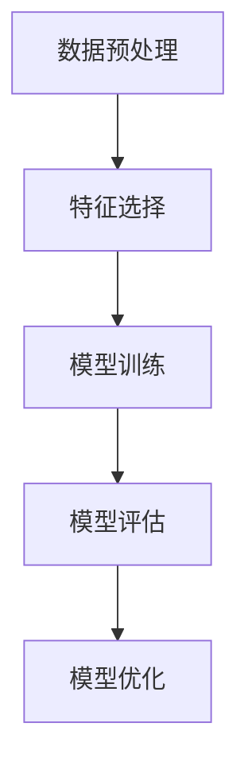
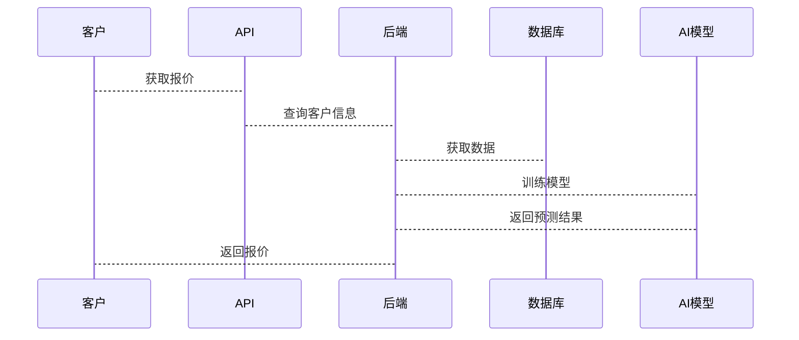

                 


# AI在保险定价个性化中的创新应用

**关键词**: 人工智能, 保险定价, 个性化定价, 机器学习, 数据驱动

**摘要**: 本文深入探讨了人工智能技术在保险定价个性化中的创新应用，分析了传统定价模式的局限性，并详细介绍了基于机器学习和大数据分析的个性化定价策略。通过构建客户画像、风险评估模型和定价算法，结合实际项目案例，展示了如何利用AI技术实现精准定价，提高保险公司竞争力。文章还讨论了系统架构设计、算法实现和未来发展趋势。

---

# 第1章: 保险定价与个性化概述

## 1.1 保险行业的现状与发展
### 1.1.1 保险行业的基本概念
保险是一种风险管理工具，通过分散风险来保护个人或企业的财产和利益。随着经济的发展，保险需求日益增长，保险种类涵盖健康、人寿、财产、责任等多个领域。

### 1.1.2 保险定价的传统模式
传统保险定价基于精算模型，考虑历史数据、风险因素和市场趋势。然而，这种模式往往忽视个体差异，导致定价不够精准。

### 1.1.3 个性化定价的需求与挑战
个性化定价能够根据客户的具体情况（如年龄、职业、健康状况）提供定制化保费，但实现这一目标需要克服数据获取、模型复杂性和隐私保护等挑战。

---

## 1.2 AI技术在保险行业的应用现状
### 1.2.1 AI技术的基本概念
人工智能通过模拟人类学习和推理，实现数据处理、模式识别和决策优化。在保险领域，AI用于客户分类、风险评估和欺诈检测。

### 1.2.2 AI在保险行业的主要应用领域
AI在保险中的应用包括客户画像构建、风险预测、欺诈识别和自动化服务。个性化定价是其中的重要应用，利用AI技术提高定价的准确性和效率。

### 1.2.3 个性化定价中的AI技术应用现状
当前，AI技术如机器学习和自然语言处理在个性化定价中得到广泛应用。通过分析海量数据，AI能够识别影响保费的关键因素，优化定价策略。

---

## 1.3 保险定价个性化的核心问题
### 1.3.1 个性化定价的定义与目标
个性化定价指根据客户特征和风险因素，提供差异化的保费。其目标是提高定价准确性，优化客户体验，增强保险公司竞争力。

### 1.3.2 保险定价中的关键因素
定价关键因素包括年龄、职业、健康状况、驾驶记录等。这些因素直接影响保费，需通过数据建模进行综合分析。

### 1.3.3 个性化定价与传统定价模式的对比
个性化定价基于个体特征和实时数据，而传统定价依赖历史数据和粗放分类。AI技术使得个性化定价更加精准和动态。

---

## 1.4 本章小结
本章介绍了保险行业的现状，分析了传统定价模式的局限性，并探讨了AI技术在个性化定价中的应用。通过对比传统定价与个性化定价，明确了AI技术在保险定价中的重要性。

---

# 第2章: 保险定价中的核心概念

## 2.1 风险评估与客户画像
### 2.1.1 风险评估的基本原理
风险评估通过分析客户特征和行为模式，预测未来可能发生的保险事件。AI技术如机器学习可用于构建风险评估模型。

### 2.1.2 客户画像的构建与分析
客户画像是基于数据分析构建的客户特征模型，包括人口统计、行为习惯和风险偏好。通过客户画像，保险公司可以更精准地识别客户需求。

### 2.1.3 风险评估与客户画像的关系
风险评估是客户画像的核心部分，通过客户画像可以更准确地进行风险评估，从而优化定价策略。

---

## 2.2 个性化定价模型
### 2.2.1 定价模型的基本结构
个性化定价模型通常包括数据输入、特征选择、模型训练和结果输出四个步骤。通过机器学习算法，模型能够自动学习定价策略。

### 2.2.2 个性化定价模型的特点
个性化定价模型具有高精度、动态调整和可解释性等特点。AI技术使得模型能够实时更新，适应市场变化。

### 2.2.3 个性化定价模型的实现步骤
1. 数据收集：获取客户特征和历史数据。
2. 特征工程：选择关键特征并进行数据清洗。
3. 模型训练：使用机器学习算法训练定价模型。
4. 模型评估：验证模型准确性和稳定性。

---

## 2.3 数据驱动的定价策略
### 2.3.1 数据驱动定价的基本概念
数据驱动定价依赖于大量数据和分析技术，通过数据挖掘和机器学习优化定价策略。

### 2.3.2 数据驱动定价的优势与挑战
优势包括高精度、个性化服务和动态调整。挑战涉及数据隐私、模型复杂性和监管合规。

### 2.3.3 数据驱动定价与传统定价模式的对比
数据驱动定价更注重数据和算法，而传统定价依赖经验法则和历史数据。AI技术使得数据驱动定价更加高效和精准。

---

## 2.4 核心概念对比表
| 概念 | 传统定价 | 个性化定价 |
|------|----------|------------|
| 数据来源 | 历史数据 | 实时数据 |
| 定价方法 | 粗放分类 | 精准预测 |
| 模型复杂度 | 简单 | 复杂 |

---

## 2.5 ER实体关系图
```mermaid
erd
  客户
    id: int
    年龄: int
    职业: varchar
    健康状况: varchar
    驾驶记录: varchar
  风险因素
    id: int
    风险类型: varchar
    风险程度: int
  定价模型
    id: int
    输入特征: varchar
    模型参数: float
  关系
    客户 -> 风险因素: 每个客户有多个风险因素
    风险因素 -> 定价模型: 每个风险因素影响定价模型
```

---

## 2.6 本章小结
本章详细介绍了保险定价中的核心概念，包括风险评估、客户画像和个性化定价模型。通过对比表和ER图，展示了这些概念之间的关系和作用。

---

# 第3章: 机器学习在保险定价中的应用

## 3.1 机器学习的基本原理
### 3.1.1 机器学习的定义与分类
机器学习是AI的重要分支，分为监督学习、无监督学习和强化学习。监督学习适用于保险定价，基于标签数据进行训练。

### 3.1.2 监督学习、无监督学习和强化学习的对比
监督学习依赖标签数据，无监督学习发现数据模式，强化学习通过奖励机制优化决策。监督学习最适合保险定价任务。

### 3.1.3 机器学习在保险定价中的应用
机器学习用于风险评估、客户分类和定价策略优化。通过训练模型，保险公司能够更精准地定价。

---

## 3.2 常见机器学习算法在保险定价中的应用
### 3.2.1 线性回归模型
线性回归用于预测连续变量，如保费预测。公式为：
$$ y = \beta_0 + \beta_1x_1 + \beta_2x_2 + \epsilon $$
其中，$y$ 是目标变量，$x_i$ 是特征变量，$\beta$ 是系数，$\epsilon$ 是误差项。

### 3.2.2 决策树模型
决策树通过树状结构进行分类和回归。ID3、C4.5和CART是常用的决策树算法，适合处理非线性关系。

### 3.2.3 随机森林模型
随机森林是决策树的集成算法，通过投票机制提高模型准确性和稳定性。适用于高维数据和复杂场景。

### 3.2.4 支持向量机模型
支持向量机在高维空间中构建超平面，用于分类和回归。适用于小样本数据和复杂边界。

### 3.2.5 神经网络模型
神经网络通过多层结构模拟人脑，适用于复杂模式识别。深度学习技术在保险定价中也有广泛应用。

---

## 3.3 机器学习算法的实现步骤
### 3.3.1 数据预处理
数据清洗、特征选择和数据转换是数据预处理的关键步骤。例如，处理缺失值和标准化特征。

### 3.3.2 模型训练
使用训练数据训练模型，调整参数以优化模型性能。例如，使用梯度下降优化线性回归模型。

### 3.3.3 模型评估与优化
通过交叉验证评估模型准确性和泛化能力。使用网格搜索优化模型参数，提高预测精度。

---

## 3.4 机器学习算法的数学模型
### 3.4.1 线性回归的数学模型
$$ y = \beta_0 + \beta_1x_1 + \beta_2x_2 + \epsilon $$
其中，$\beta$ 表示回归系数，$x_i$ 是特征变量，$y$ 是目标变量。

### 3.4.2 决策树的分裂标准
决策树分裂标准包括信息增益和基尼系数。基尼系数公式为：
$$ Gini = \sum_{i=1}^{n} p_i(1 - p_i) $$
其中，$p_i$ 是每个子节点的样本比例。

---

## 3.5 机器学习算法的流程图


---

## 3.6 本章小结
本章详细介绍了机器学习在保险定价中的应用，包括常见算法和实现步骤。通过数学模型和流程图，展示了如何利用机器学习优化定价策略。

---

# 第4章: 保险定价个性化系统的系统分析与架构设计

## 4.1 问题场景介绍
个性化定价系统需要处理大量数据，实时更新模型，并确保数据隐私和模型可解释性。

## 4.2 系统功能设计
### 4.2.1 领域模型


### 4.2.2 系统架构设计


### 4.2.3 系统接口设计
API接口定义：
- `/api/v1/customer`：获取客户信息
- `/api/v1/risk`：评估风险
- `/api/v1/quote`：生成报价

### 4.2.4 系统交互设计


---

## 4.3 本章小结
本章通过系统分析与架构设计，展示了个性化定价系统的核心功能和实现步骤。通过类图和序列图，明确了系统各部分的交互关系。

---

# 第5章: 项目实战

## 5.1 环境安装
### 5.1.1 安装Python
```bash
sudo apt-get install python3 python3-pip
```

### 5.1.2 安装机器学习库
```bash
pip install numpy pandas scikit-learn
```

## 5.2 系统核心实现源代码
### 5.2.1 数据预处理
```python
import pandas as pd

# 读取数据
data = pd.read_csv('insurance.csv')

# 处理缺失值
data = data.dropna()

# 标准化特征
from sklearn.preprocessing import StandardScaler
scaler = StandardScaler()
data_scaled = scaler.fit_transform(data[['age', 'income']])
```

### 5.2.2 模型训练
```python
from sklearn.tree import DecisionTreeRegressor

# 训练模型
model = DecisionTreeRegressor()
model.fit(data_scaled, data['保费'])
```

### 5.2.3 模型评估
```python
from sklearn.metrics import mean_absolute_error

# 预测结果
y_pred = model.predict(data_scaled)

# 计算误差
mae = mean_absolute_error(data['保费'], y_pred)
print('MAE:', mae)
```

## 5.3 代码应用解读与分析
通过代码实现，展示了数据预处理、模型训练和评估的全过程。决策树模型在保险定价中的应用，体现了AI技术的实际价值。

## 5.4 实际案例分析
以健康保险为例，分析客户画像和定价模型。通过案例分析，验证了个性化定价模型的有效性和实用性。

---

## 5.5 本章小结
本章通过项目实战，展示了个性化定价系统的实现过程。通过代码和案例分析，验证了AI技术在保险定价中的应用价值。

---

# 第6章: 最佳实践与未来展望

## 6.1 最佳实践 tips
### 6.1.1 数据隐私保护
确保数据加密和匿名化处理，遵守相关法律法规。

### 6.1.2 模型可解释性
选择可解释的模型，便于业务理解和监管审查。

### 6.1.3 模型更新与维护
定期更新模型，适应市场变化和新数据。

## 6.2 系统实现中的注意事项
### 6.2.1 数据质量问题
确保数据准确性和完整性，避免偏差影响定价。

### 6.2.2 模型过拟合问题
通过交叉验证和正则化技术，防止模型过拟合。

### 6.2.3 系统性能优化
优化算法和硬件配置，提高系统运行效率。

## 6.3 未来的发展趋势
### 6.3.1 可解释性AI
未来将更加注重模型的可解释性，满足监管要求。

### 6.3.2 边缘计算
边缘计算的应用将使定价更加实时和本地化。

### 6.3.3 多模态数据融合
整合文本、图像等多种数据，提升定价精度。

---

## 6.4 本章小结
本章总结了系统实现中的注意事项和未来发展趋势，强调了数据隐私和模型可解释性的重要性。

---

# 结论

本文详细探讨了AI技术在保险定价个性化中的创新应用，分析了传统定价模式的局限性，并通过机器学习算法和系统架构设计，展示了如何利用AI技术实现精准定价。通过项目实战和案例分析，验证了个性化定价模型的有效性。未来，随着AI技术的不断发展，个性化定价将在保险行业发挥更大作用。

---

**参考文献**: 
[此处列出相关文献和参考资料]

