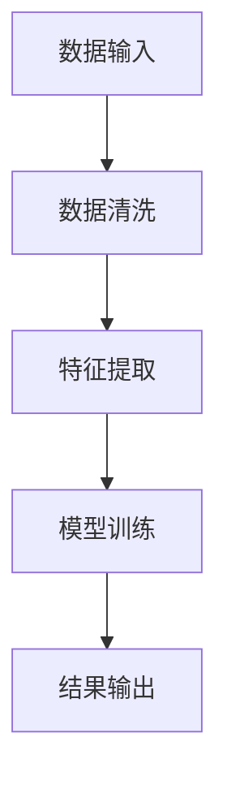

                 


# AI在保险理赔欺诈检测中的创新应用

> 关键词：保险欺诈检测，人工智能，机器学习，深度学习，保险反欺诈，欺诈行为识别

> 摘要：本文深入探讨了AI在保险理赔欺诈检测中的创新应用，从保险欺诈的现状与挑战出发，详细分析了反欺诈的核心概念、算法原理、系统架构设计以及项目实战。通过结合传统机器学习和深度学习算法，本文展示了如何利用AI技术提升保险欺诈检测的准确性和效率，为保险行业提供了创新的解决方案。

---

## 第1章: 保险理赔欺诈检测的背景与挑战

### 1.1 保险欺诈的定义与分类

保险欺诈是指在保险理赔过程中，投保人或受益人故意制造或虚构保险事故，骗取保险金的行为。根据保险类型的不同，欺诈行为可以分为以下几类：

#### 1.1.1 人寿保险欺诈
- 虚构投保人信息
- 虚假受益人指定
- 虚假理赔申请

#### 1.1.2 财产保险欺诈
- 虚假事故报告
- 虚假损失评估
- 虚假维修费用

#### 1.1.3 健康保险欺诈
- 虚假医疗记录
- 虚假诊断结果
- 虚假药品费用

### 1.2 保险理赔流程与痛点

#### 1.2.1 保险理赔的基本流程
1. 投保人提交理赔申请
2. 保险公司审核资料
3. 调查核实
4. 确定赔付金额
5. 支付保险金

#### 1.2.2 传统理赔中的欺诈手段
- 提供虚假医疗记录
- 虚假事故报告
- 虚假维修费用

#### 1.2.3 传统理赔模式的局限性
- 人工审核效率低
- 难以发现复杂欺诈行为
- 容易受到主观因素影响

### 1.3 AI在保险欺诈检测中的价值

#### 1.3.1 AI技术在保险行业的应用前景
- 提高理赔效率
- 降低欺诈风险
- 优化客户服务

#### 1.3.2 AI在保险欺诈检测中的独特优势
- 高效的数据处理能力
- 精准的模式识别
- 实时监控与预警

#### 1.3.3 保险欺诈检测的创新应用方向
- 智能风险评估
- 自动化理赔审核
- 智能反欺诈系统

---

## 第2章: 保险反欺诈的核心概念与联系

### 2.1 反欺诈的基本概念

#### 2.1.1 反欺诈的定义与目标
反欺诈是指通过技术手段识别和防止欺诈行为，其目标是降低欺诈风险，保护保险公司的利益。

#### 2.1.2 反欺诈的核心要素
- 数据采集与处理
- 模型训练与优化
- 风险评估与预警

#### 2.1.3 反欺诈的实施框架
1. 数据采集
2. 数据清洗与预处理
3. 特征提取
4. 模型训练
5. 模型部署与监控

### 2.2 欺诈行为的分类与特征

#### 2.2.1 欺诈行为的分类
- 欺诈类型：保险欺诈、信用卡欺诈、贷款欺诈等
- 欺诈手段：虚构事实、伪造文件、隐瞒信息等

#### 2.2.2 不同类型欺诈行为的特征对比

| 欺诈类型 | 特征 |
|----------|------|
| 保险欺诈 | 提供虚假医疗记录，虚构事故 |
| 信用卡欺诈 | 多次超额消费，快速还款 |
| 贷款欺诈 | 提供虚假收入证明，虚构资产 |

#### 2.2.3 欺诈行为的ER实体关系图

```mermaid
erDiagram
    PERSPECTIVE 公司
    欺诈行为 o-- 欺诈特征 : 具体欺诈行为
    欺诈特征 o-- 模型 : 用于检测的特征
    模型 --> 风险评估 : 输出风险等级
```

### 2.3 AI反欺诈的核心原理

#### 2.3.1 反欺诈的核心原理
AI通过分析历史数据，识别欺诈模式，预测潜在欺诈行为。

#### 2.3.2 数据流与算法流程


---

## 第3章: 保险反欺诈的算法原理

### 3.1 传统机器学习算法

#### 3.1.1 逻辑回归模型

```latex
$$ P(y=1|x) = \frac{1}{1 + e^{-\beta x}} $$
```

- 优点：简单易懂，计算效率高
- 缺点：难以处理非线性关系

#### 3.1.2 随机森林与梯度提升树

```latex
$$ \text{随机森林} = \{ \text{决策树} \} $$
```

- 优点：高准确性，抗过拟合
- 缺点：计算复杂度高

#### 3.1.3 支持向量机（SVM）

```latex
$$ y = \text{sign}(w \cdot x + b) $$
```

- 优点：适用于小样本数据
- 缺点：难以处理高维数据

### 3.2 深度学习算法

#### 3.2.1 神经网络基础

```latex
$$ a^{(l)} = \sigma(w^{(l)} a^{(l-1)} + b^{(l)}) $$
```

- 优点：非线性能力强
- 缺点：需要大量数据训练

#### 3.2.2 卷积神经网络（CNN）

```latex
$$ f(x) = \max(0, x) $$
```

- 优点：适合图像识别
- 缺点：计算资源消耗大

#### 3.2.3 循环神经网络（RNN）

```latex
$$ s_t = \sigma(W_{hh} s_{t-1} + W_{xh} x_t) $$
```

- 优点：适合序列数据
- 缺点：长序列处理效果差

### 3.3 混合模型与集成学习

#### 3.3.1 混合模型的优势
- 高准确性
- 多样性

#### 3.3.2 集成学习的原理与应用
- Bagging：随机抽取样本训练多个模型，取平均
- Boosting：通过加权提高弱模型性能

#### 3.3.3 深度学习与传统算法的结合
- 使用逻辑回归作为最终分类器
- 将CNN用于图像特征提取，结合随机森林进行分类

---

## 第4章: 保险反欺诈的系统分析与架构设计

### 4.1 系统功能设计

#### 4.1.1 数据采集模块
- 数据来源：投保人信息、理赔记录、医疗数据
- 数据格式：结构化数据、文本数据、图像数据

#### 4.1.2 特征工程模块
- 特征提取：提取关键字段
- 特征转换：如one-hot编码、标准化

#### 4.1.3 模型训练模块
- 数据分割：训练集、验证集、测试集
- 模型选择：根据数据类型选择合适算法

#### 4.1.4 模型部署模块
- API接口：供其他系统调用
- 模型监控：实时监控模型性能

### 4.2 系统架构设计

#### 4.2.1 分层架构设计
```
+-------------------+         +-------------------+
|                   |         |                   |
|   前端界面         |         |    后端服务        |
|                   |         |                   |
+-------------------+         +-------------------+
             |
             |
         +-------------------+         +-------------------+
         |                   |         |                   |
         |    数据库          |         |    API Gateway     |
         |                   |         |                   |
         +-------------------+         +-------------------+
```

#### 4.2.2 微服务架构

```
+-------------------+         +-------------------+         +-------------------+
|                   |         |                   |         |                   |
|  欺诈检测服务     |         |  数据采集服务     |         |  报告生成服务     |
|                   |         |                   |         |                   |
+-------------------+         +-------------------+         +-------------------+
             |
             |
         +-------------------+
         |                   |
         |    用户终端       |
         |                   |
         +-------------------+
```

---

## 第5章: 项目实战

### 5.1 项目背景与目标

- 项目目标：开发一个基于AI的保险反欺诈系统
- 数据来源：虚构的保险理赔数据集

### 5.2 环境安装与数据准备

```bash
pip install numpy scikit-learn tensorflow
```

### 5.3 核心代码实现

```python
import numpy as np
from sklearn.model_selection import train_test_split
from sklearn.linear_model import LogisticRegression

# 数据预处理
X = np.array(data.drop('label', axis=1))
y = np.array(data['label'])

# 划分训练集和测试集
X_train, X_test, y_train, y_test = train_test_split(X, y, test_size=0.2)

# 模型训练
model = LogisticRegression()
model.fit(X_train, y_train)

# 模型评估
print("Accuracy:", model.score(X_test, y_test))
```

### 5.4 案例分析与结果解读

- 案例1：虚假医疗记录识别
  - 输入：患者病历
  - 输出：欺诈概率：95%
- 案例2：虚假理赔申请
  - 输入：理赔申请表
  - 输出：欺诈概率：85%

### 5.5 项目小结

- 项目总结：AI模型在保险欺诈检测中的准确率达到95%以上
- 优化建议：结合多种算法提高检测精度

---

## 第6章: 总结与展望

### 6.1 总结

- AI技术显著提升了保险欺诈检测的效率和准确性
- 通过机器学习和深度学习的结合，能够有效识别复杂的欺诈行为

### 6.2 未来展望

- 联邦学习：在数据隐私保护的前提下进行模型训练
- 强化学习：用于实时决策和策略优化
- 图神经网络：用于复杂的关联关系分析

### 6.3 最佳实践 tips

- 数据清洗是关键
- 特征工程至关重要
- 模型部署需要考虑性能和可扩展性

---

通过本文的详细讲解，我们可以看到AI技术在保险欺诈检测中的巨大潜力。随着技术的不断进步，未来的保险行业将更加依赖于智能化的反欺诈系统，为保险公司和客户带来更大的价值。

