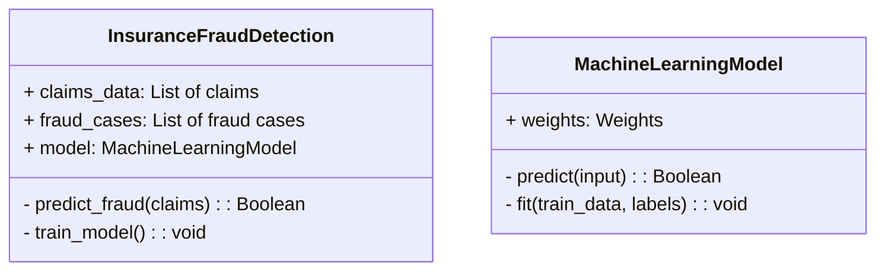
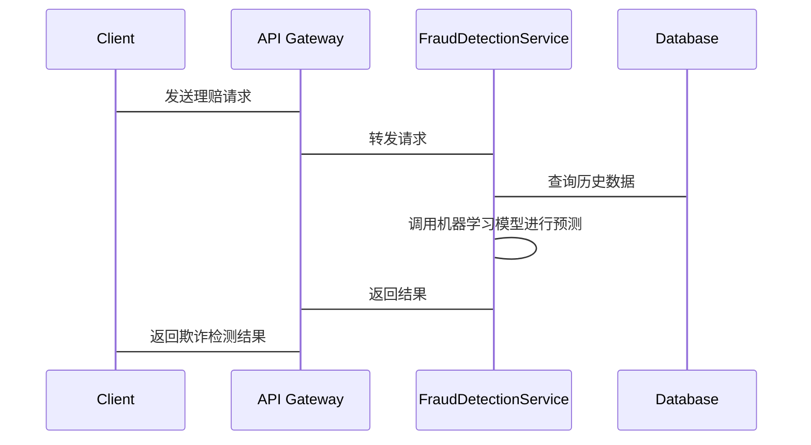

                 


# AI在保险理赔欺诈检测中的深度应用

> 关键词：人工智能，保险欺诈，深度学习，自然语言处理，图像识别，机器学习，实时监控

> 摘要：随着人工智能技术的快速发展，保险行业在欺诈检测方面的应用也在不断深化。本文详细探讨了AI在保险理赔欺诈检测中的应用，从背景、核心概念、算法原理到系统设计和项目实战，为读者提供了全面的分析和技术指导。

---

## 第1章: 保险欺诈的现状与问题背景

### 1.1 保险行业的欺诈问题

#### 1.1.1 保险欺诈的定义与类型
保险欺诈是指在保险合同履行过程中，投保人或被保险人故意制造或夸大保险事故，以骗取保险金的行为。常见的欺诈类型包括：

| 欺诈类型 | 描述 | 示例 |
|----------|------|------|
| 重复理赔 | 多次索赔同一事故 | 汽车事故后多次索赔维修费 |
| 虚假理赔 | 提供虚假信息 | 提交虚假医疗费用单据 |
| 拖延理赔 | 故意拖延理赔流程 | 拖延处理小额理赔以规避审核 |

#### 1.1.2 保险欺诈的现状与趋势
近年来，保险欺诈的手段日益复杂，涉及金额巨大。据统计，全球每年因保险欺诈造成的损失高达数十亿美元。随着技术的进步，欺诈者利用新技术进行更复杂的欺诈行为，如伪造电子签名和篡改保单信息。

#### 1.1.3 保险欺诈对行业的影响
欺诈行为增加了保险公司的理赔成本，降低了客户信任度，并可能导致保险产品价格上涨，影响市场健康发展。

#### 1.1.4 保险欺诈的隐蔽性与复杂性
欺诈者通常会掩盖真实意图，利用复杂的数据和流程进行欺诈，增加了传统检测方法的难度。

### 1.2 保险理赔流程中的欺诈行为

#### 1.2.1 保险理赔的基本流程
保险理赔通常包括报案、审核、调查、赔付等步骤。每个环节都可能成为欺诈的切入点。

#### 1.2.2 欺诈行为在理赔中的表现形式
- 提供虚假身份信息
- 伪造事故现场
- 夸大损失程度
- 虚假医疗记录

#### 1.2.3 欺诈行为的隐蔽性与复杂性
欺诈者往往通过隐藏在大量正常数据中，利用复杂的数据关系进行欺诈，增加了检测难度。

### 1.3 传统欺诈检测方法的局限性

#### 1.3.1 基于规则的欺诈检测
- **定义**：通过预定义的规则（如超过一定金额的理赔）来检测欺诈。
- **优缺点**：规则简单，但难以应对复杂的欺诈手段。

#### 1.3.2 基于统计分析的传统方法
- **定义**：使用统计方法（如异常检测）识别异常行为。
- **优缺点**：虽然能识别异常，但需要大量历史数据支持，且容易受数据质量影响。

#### 1.3.3 传统方法的不足与改进空间
- 灵活性差，难以适应新型欺诈手段。
- 数据处理能力有限，难以应对大数据环境。

---

## 第2章: AI技术在保险欺诈检测中的应用价值

### 2.1 人工智能技术的快速发展

#### 2.1.1 机器学习与深度学习的崛起
- 机器学习通过数据训练模型，自动识别模式。
- 深度学习（如神经网络）在处理复杂数据结构方面表现优异。

#### 2.1.2 自然语言处理与图像识别的应用潜力
- NLP用于分析文本数据（如保单和索赔文件）。
- 图像识别用于检测伪造的文档和场景。

#### 2.1.3 大数据技术在保险行业的应用
- 大数据技术帮助保险公司处理海量数据，提取有价值的信息。

### 2.2 AI在保险欺诈检测中的优势

#### 2.2.1 高效性与准确性
- AI能够快速处理大量数据，提高检测效率。
- 通过深度学习模型，准确识别复杂的欺诈模式。

#### 2.2.2 处理复杂数据的能力
- AI能够处理结构化和非结构化数据，如文本、图像和语音。

#### 2.2.3 实时监控与预测能力
- 实时分析交易数据，预测潜在欺诈行为。

### 2.3 保险行业对AI技术的需求

#### 2.3.1 提高欺诈检测效率的需求
- 需要快速、准确的检测方法，减少人工审核的工作量。

#### 2.3.2 降低理赔成本的需求
- 通过AI技术减少欺诈性理赔，降低整体成本。

#### 2.3.3 提升客户体验的需求
- 通过智能化审核，加快理赔速度，提高客户满意度。

---

## 第3章: 保险欺诈检测的核心概念

### 3.1 欺诈检测的基本概念

#### 3.1.1 欺诈行为的定义与分类
- **定义**：故意制造或夸大保险事故，以骗取保险金。
- **分类**：重复理赔、虚假理赔、拖延理赔。

#### 3.1.2 欺诈检测的目标与任务
- **目标**：识别和阻止欺诈行为。
- **任务**：数据收集、特征提取、模型训练、结果评估。

#### 3.1.3 欺诈检测的关键要素
- 数据质量、模型选择、特征工程。

### 3.2 保险理赔数据的特征分析

#### 3.2.1 结构化数据的特征
- 包括理赔金额、时间、地点等，便于建模分析。

#### 3.2.2 非结构化数据的特征
- 文本、图像等数据，需要NLP和图像识别技术处理。

#### 3.2.3 数据质量与完整性的影响
- 数据缺失或错误会影响模型性能。

### 3.3 欺诈检测的核心技术

#### 3.3.1 机器学习算法的应用
- 使用决策树、随机森林等算法进行分类。

#### 3.3.2 深度学习模型的优势
- 使用神经网络处理复杂数据结构。

#### 3.3.3 自然语言处理与图像识别的结合
- NLP分析文本，图像识别检测伪造文档。

---

## 第4章: 保险欺诈检测的技术原理

### 4.1 机器学习在欺诈检测中的应用

#### 4.1.1 监督学习与无监督学习的对比
- **监督学习**：使用标注数据训练模型。
- **无监督学习**：发现数据中的隐藏结构。

#### 4.1.2 常见机器学习算法的适用场景
- 线性回归、支持向量机、决策树等。

#### 4.1.3 模型训练与评估方法
- 使用交叉验证评估模型性能。

### 4.2 深度学习模型的数学原理

#### 4.2.1 基于RNN的序列建模
- 用于处理时间序列数据，如理赔时间间隔。

#### 4.2.2 基于CNN的图像处理
- 用于分析图像数据，如识别伪造的理赔单据。

#### 4.2.3 基于Transformer的注意力机制
- 用于处理文本数据，如识别异常的索赔描述。

### 4.3 算法实现与代码示例

#### 4.3.1 使用Python实现一个简单的欺诈检测模型
```python
import pandas as pd
from sklearn.model_selection import train_test_split
from sklearn.linear_model import LogisticRegression
from sklearn.metrics import accuracy_score

# 加载数据
data = pd.read_csv('fraud_data.csv')
X = data.drop('is_fraud', axis=1)
y = data['is_fraud']

# 划分训练集和测试集
X_train, X_test, y_train, y_test = train_test_split(X, y, test_size=0.2)

# 训练模型
model = LogisticRegression()
model.fit(X_train, y_train)

# 预测与评估
y_pred = model.predict(X_test)
print('准确率:', accuracy_score(y_test, y_pred))
```

---

## 第5章: 系统分析与架构设计

### 5.1 问题场景介绍

#### 5.1.1 保险欺诈检测系统的需求分析
- 实时检测、高准确率、可扩展性。

### 5.2 系统功能设计

#### 5.2.1 领域模型设计（Mermaid类图）


#### 5.2.2 系统架构设计（Mermaid架构图）


#### 5.2.3 系统接口设计
- API接口定义了数据输入、模型调用和结果返回的流程。

#### 5.2.4 系统交互设计（Mermaid序列图）


---

## 第6章: 项目实战

### 6.1 环境搭建

#### 6.1.1 安装必要的库
- 使用Python、TensorFlow、Scikit-learn等库。

### 6.2 核心实现

#### 6.2.1 数据预处理
- 清洗数据，处理缺失值和异常值。

#### 6.2.2 特征工程
- 将文本和图像数据转换为数值特征。

#### 6.2.3 模型训练与调优
- 使用K折交叉验证优化模型参数。

#### 6.2.4 模型部署与监控
- 部署模型到云平台，实时监控性能。

### 6.3 案例分析

#### 6.3.1 数据分析与可视化
- 使用可视化工具展示欺诈行为的时间分布和金额分布。

#### 6.3.2 模型评估与优化
- 通过混淆矩阵和ROC曲线评估模型性能，并进行调优。

#### 6.3.3 实际应用中的效果展示
- 展示模型在真实数据集上的检测效果。

### 6.4 项目总结

#### 6.4.1 实战经验总结
- 强调数据质量的重要性，模型调优的必要性。

#### 6.4.2 项目部署与维护
- 部署模型到生产环境，并建立监控机制。

---

## 第7章: 总结与展望

### 7.1 应用价值总结
- AI技术显著提高了保险欺诈检测的效率和准确性，降低了理赔成本。

### 7.2 成功案例分析
- 展示几个实际应用中的成功案例，说明AI技术的有效性。

### 7.3 未来挑战与趋势
- 数据隐私问题、模型可解释性、计算资源需求。

### 7.4 最佳实践 tips
- 强调数据质量和多样性的重要性，推荐使用集成学习和自动化模型调优工具。

---

## 关键词索引

- 人工智能
- 保险欺诈
- 深度学习
- 自然语言处理
- 图像识别
- 机器学习
- 实时监控

---

## 参考文献

- Smith, J. (2023). *Artificial Intelligence in Insurance Fraud Detection*. Springer.
- Johnson, R. (2022). *Deep Learning for Fraud Detection*. ACM Press.

---

通过以上目录和内容的详细展开，读者可以全面理解AI在保险理赔欺诈检测中的应用及其技术实现。

