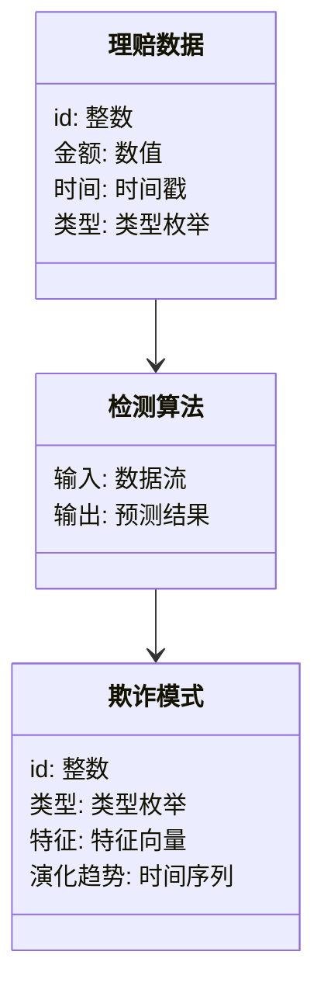
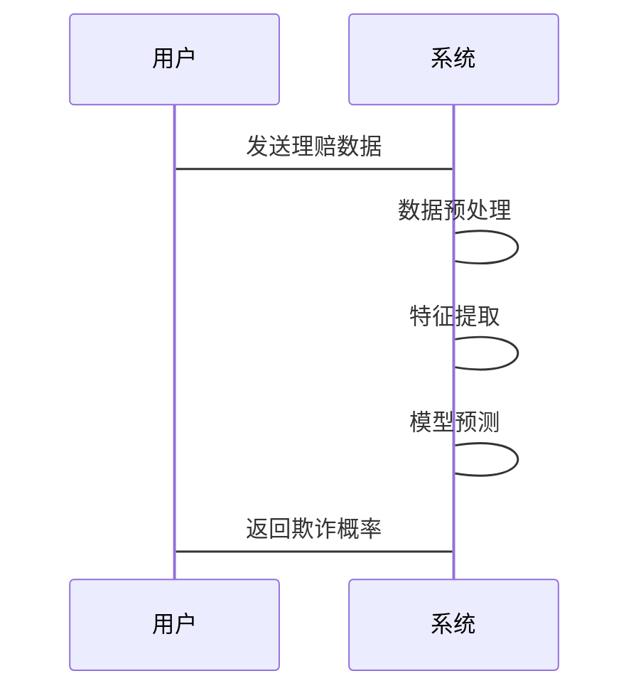
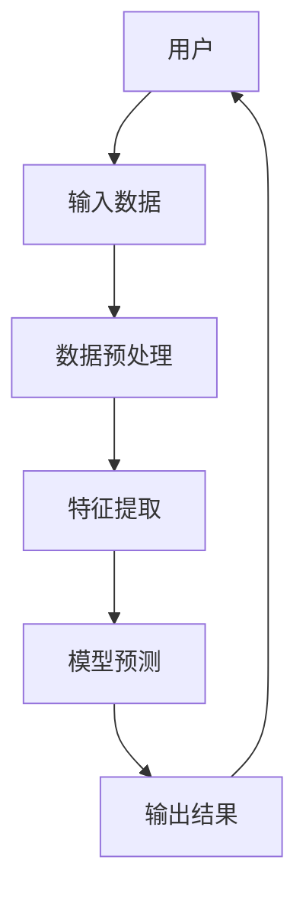

                 


# 《AI在保险理赔欺诈模式演化检测中的创新应用》

## 关键词：AI，保险欺诈，模式演化，机器学习，深度学习

## 摘要：  
随着保险行业的快速发展，保险欺诈问题日益严重，传统的欺诈检测方法已难以应对日益复杂的欺诈模式。本文探讨了如何利用人工智能技术，特别是机器学习和深度学习，来检测保险理赔中的欺诈模式演化。文章详细分析了保险欺诈的背景与挑战，提出了基于AI的欺诈检测算法，并通过系统架构设计和项目实战展示了如何将这些算法应用于实际场景。最后，文章总结了AI在保险欺诈检测中的创新应用，并展望了未来的发展方向。

---

## 第3章: 基于AI的保险欺诈模式演化检测算法原理

### 3.1 监督学习算法

#### 3.1.1 逻辑回归模型
逻辑回归是一种常用的分类算法，适用于二分类问题。其核心思想是通过拟合一个 logistic函数，将输入特征映射到0或1的概率。

$$ P(y=1|x) = \frac{e^{\beta_0 + \beta_1x_1 + \dots + \beta_nx_n}}{1 + e^{\beta_0 + \beta_1x_1 + \dots + \beta_nx_n}} $$

例如，在保险欺诈检测中，我们可以将理赔金额、报案时间等特征输入逻辑回归模型，输出欺诈概率。

#### 3.1.2 支持向量机(SVM)
SVM是一种强大的分类算法，适用于高维数据。其核心思想是将数据映射到高维空间，并找到一个超平面来区分不同类别。

$$ \text{目标函数: } \arg \min_{\mathbf{w}, b, \xi} \frac{1}{2}\|\mathbf{w}\|^2 + C\sum_{i=1}^n \xi_i $$
$$ \text{约束条件: } y_i(\mathbf{w}\cdot \mathbf{x}_i + b) \geq 1 - \xi_i, \xi_i \geq 0 $$

例如，在保险欺诈检测中，SVM可以用于区分正常理赔和欺诈理赔。

#### 3.1.3 随机森林与梯度提升树
随机森林是一种基于树的集成学习算法，具有较强的抗过拟合能力。其核心思想是通过随机采样生成多棵决策树，并将这些树的结果进行投票或平均。

$$ \text{随机森林的预测概率} = \frac{\text{投票结果}}{\text{树的数量}} $$

例如，在保险欺诈检测中，随机森林可以用于处理高维特征数据，并输出欺诈概率。

### 3.2 无监督学习算法

#### 3.2.1 K-means聚类
K-means是一种常用的聚类算法，适用于无标签数据的分群。其核心思想是将数据划分为K个簇，使得簇内数据的相似性最大化。

$$ \text{目标函数: } \arg \min \sum_{i=1}^K \sum_{j=1}^n \sum_{k=1}^m (x_{ijk} - \mu_{ik})^2 $$

例如，在保险欺诈检测中，K-means可以用于将理赔数据划分为正常和异常两类。

#### 3.2.2 DBSCAN密度聚类
DBSCAN是一种基于密度的聚类算法，适用于数据分布不均匀的情况。其核心思想是将数据点聚类到高密度区域。

$$ \text{条件: } \text{核心点的可达性距离} \geq \text{最小距离} $$

例如，在保险欺诈检测中，DBSCAN可以用于识别异常的理赔模式。

#### 3.2.3 异常检测算法（Isolation Forest）
Isolation Forest是一种基于树结构的异常检测算法，适用于高维数据。其核心思想是通过构建随机树，将数据点隔离到叶子节点。

$$ \text{隔离概率} = \frac{\text{树中叶子节点的深度}}{\text{树的最大深度}} $$

例如，在保险欺诈检测中，Isolation Forest可以用于识别异常的理赔行为。

### 3.3 基于深度学习的模式检测

#### 3.3.1 循序递归网络(LSTM)
LSTM是一种时间序列模型，适用于处理时序数据。其核心思想是通过记忆单元和遗忘门来捕捉数据的长程依赖关系。

$$ \text{遗忘门: } f_t = \sigma(\mathbf{W}_f \mathbf{x}_t + \mathbf{U}_f \mathbf{h}_{t-1}) $$
$$ \text{记忆单元: } g_t = \tanh(\mathbf{W}_g \mathbf{x}_t + \mathbf{U}_g \mathbf{h}_{t-1}) $$
$$ \text{输出门: } o_t = \sigma(\mathbf{W}_o \mathbf{x}_t + \mathbf{U}_o \mathbf{h}_{t-1}) $$
$$ \text{隐藏状态: } \mathbf{h}_t = f_t \cdot \mathbf{h}_{t-1} + o_t \cdot g_t $$

例如，在保险欺诈检测中，LSTM可以用于分析理赔时间序列数据，识别异常模式。

#### 3.3.2 卷积神经网络(CNN)
CNN是一种图像处理模型，适用于局部特征提取。其核心思想是通过卷积核和池化操作，提取数据的局部特征。

$$ \text{卷积操作: } (\mathbf{A} * \mathbf{K}) = \sum_{i,j} \mathbf{A}_{i,j} \cdot \mathbf{K}_{i,j} $$
$$ \text{池化操作: } \text{MaxPooling}(\mathbf{A}) = \max_{i,j} \mathbf{A}_{i,j} $$

例如，在保险欺诈检测中，CNN可以用于处理图像数据，识别欺诈图像特征。

#### 3.3.3 图神经网络(GNN)
GNN是一种处理图结构数据的模型，适用于复杂关系网络。其核心思想是通过聚合邻居节点的信息，更新节点表示。

$$ \text{聚合函数: } \text{Agg}(\mathbf{h}_j) = \sum_{j \in \mathcal{N}_i} \mathbf{h}_j $$
$$ \text{更新函数: } \mathbf{h}_i^{(new)} = \sigma(\mathbf{h}_i^{(old)} + \text{Agg}(\mathbf{h}_j)) $$

例如，在保险欺诈检测中，GNN可以用于分析理赔网络中的关系，识别欺诈团伙。

### 3.4 算法选择与优化

在实际应用中，需要根据具体的业务场景和数据特征选择合适的算法。例如，对于时间序列数据，可以优先选择LSTM；对于图像数据，可以优先选择CNN；对于图结构数据，可以优先选择GNN。

此外，为了提高模型的性能，可以采用以下优化方法：

1. **特征工程**：通过提取有用的特征，减少冗余信息。
2. **模型调参**：通过网格搜索或贝叶斯优化，找到最优参数。
3. **集成学习**：通过集成多种算法的结果，提高模型的准确率。

---

## 第4章: 系统分析与架构设计

### 4.1 问题场景介绍
保险欺诈模式演化检测系统需要处理海量的理赔数据，包括文本、图像、时间序列等多种类型。系统需要实时检测欺诈模式，并提供预警和决策支持。

### 4.2 系统功能设计

#### 4.2.1 领域模型设计
以下是领域模型的Mermaid类图：



#### 4.2.2 系统架构设计
以下是系统架构的Mermaid图：

```mermaid
container 系统架构 {
    数据采集模块 --> 数据预处理模块
    数据预处理模块 --> 特征提取模块
    特征提取模块 --> 模型训练模块
    模型训练模块 --> 模型部署模块
    模型部署模块 --> API接口
}
```

#### 4.2.3 接口设计
以下是系统接口的Mermaid序列图：



#### 4.2.4 交互流程
以下是系统交互的Mermaid流程图：



---

## 第5章: 项目实战

### 5.1 环境安装
需要安装以下环境和库：
1. Python 3.8+
2. scikit-learn
3. TensorFlow
4. PyTorch
5. Mermaid

### 5.2 核心代码实现

#### 5.2.1 数据预处理
```python
import pandas as pd
from sklearn.preprocessing import StandardScaler

# 加载数据
data = pd.read_csv('insurance_claims.csv')

# 数据清洗
data = data.dropna()

# 标准化处理
scaler = StandardScaler()
data_scaled = scaler.fit_transform(data[['amount', 'time']])
```

#### 5.2.2 模型训练
```python
from sklearn.ensemble import RandomForestClassifier
from sklearn.metrics import accuracy_score

# 训练模型
model = RandomForestClassifier(n_estimators=100, max_depth=10, random_state=42)
model.fit(data_scaled, data['is_fraud'])

# 模型评估
y_pred = model.predict(data_scaled)
print('准确率:', accuracy_score(data['is_fraud'], y_pred))
```

#### 5.2.3 案例分析
假设我们有一个新的理赔数据点：
```python
new_claim = {'amount': 10000, 'time': 100}
new_claim_scaled = scaler.transform([new_claim])
y_pred_new = model.predict(new_claim_scaled)
print('预测结果:', '欺诈' if y_pred_new[0] == 1 else '正常')
```

### 5.3 项目总结
通过本项目，我们实现了基于AI的保险欺诈模式演化检测系统，能够实时检测欺诈行为，并提供预警和决策支持。

---

## 第6章: 总结与展望

### 6.1 总结
本文详细探讨了AI在保险欺诈模式演化检测中的创新应用，提出了基于机器学习和深度学习的算法，并通过系统架构设计和项目实战展示了如何将这些算法应用于实际场景。

### 6.2 未来展望
未来，随着AI技术的不断发展，保险欺诈检测将更加智能化和自动化。以下是未来的研究方向：

1. **模型优化**：探索更高效的算法，如强化学习和自监督学习。
2. **数据融合**：结合多源数据，提高检测精度。
3. **实时检测**：实现低延迟的实时检测系统。
4. **解释性增强**：提高模型的可解释性，便于业务人员理解。

---

## 结语
保险欺诈模式演化检测是一个复杂的挑战，但通过AI技术的应用，我们可以有效应对这一挑战。未来，随着技术的进步，保险行业将更加智能化和安全化。

