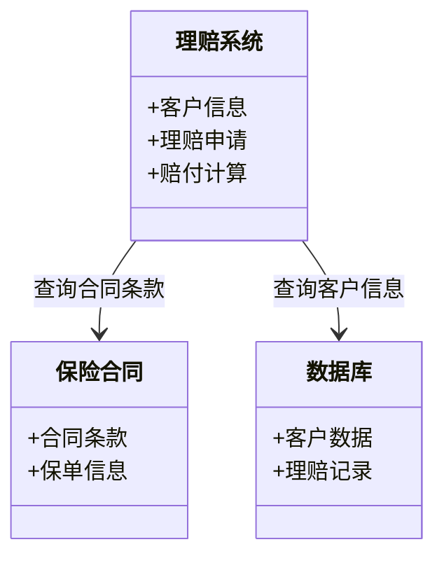
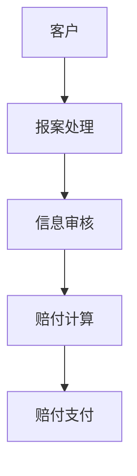
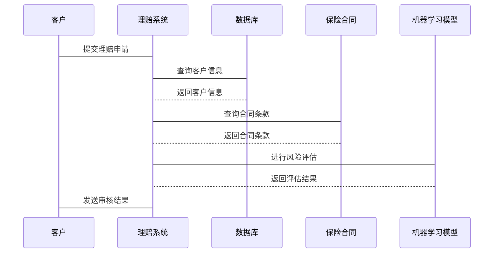

                 


# AI在保险理赔流程优化中的深度应用

> 关键词：保险，AI，机器学习，NLP，图像识别，流程优化

> 摘要：本文将深入探讨人工智能技术在保险理赔流程优化中的应用，从背景分析、技术原理到系统设计和实际案例，全面解析AI如何提升保险理赔的效率和准确性。

---

# 第一部分: 保险理赔流程优化的背景与挑战

## 第1章: 保险行业的现状与痛点

### 1.1 保险行业的数字化转型

#### 1.1.1 保险行业的传统模式与挑战
传统的保险行业主要依赖人工操作，理赔流程繁琐且效率低下。保险公司在理赔过程中面临以下挑战：
- **流程复杂**：理赔流程涉及多个环节，包括报案、审核、赔付等，人工处理效率低。
- **数据分散**：保险数据来源多样，难以统一管理和分析。
- **成本高昂**：人工审核需要大量时间和资源，增加了企业的运营成本。

#### 1.1.2 数字化转型的必要性
随着科技的发展，保险行业逐渐向数字化转型。通过引入AI技术，保险公司可以实现自动化、智能化的理赔流程，提升效率和客户体验。

#### 1.1.3 AI技术在保险行业的应用前景
AI技术在保险行业的应用前景广阔，尤其是在理赔流程优化、风险评估和客户服务等方面。

### 1.2 保险理赔流程的痛点分析

#### 1.2.1 理赔流程的复杂性
传统的理赔流程涉及多个环节，每个环节都需要人工处理，容易出错且耗时较长。

#### 1.2.2 传统理赔中的效率问题
人工审核的效率低下，导致理赔周期长，客户满意度低。

#### 1.2.3 人工审核的局限性与成本问题
人工审核不仅效率低，还容易受到主观因素的影响，导致审核结果不准确。此外，人工审核的成本也较高。

### 1.3 AI技术如何解决保险理赔问题

#### 1.3.1 AI在保险理赔中的潜在应用场景
- **自动化报案处理**：通过自然语言处理技术，自动解析客户的报案信息。
- **智能审核**：利用机器学习技术，自动审核理赔申请，减少人工干预。
- **风险预测**：通过分析历史数据，预测潜在的风险，提前采取措施。

#### 1.3.2 AI技术对理赔效率的提升
AI技术可以自动化处理理赔流程中的各个环节，大幅缩短理赔周期，提升效率。

#### 1.3.3 AI在风险控制中的作用
通过分析大量的历史数据，AI技术可以帮助保险公司识别潜在的风险，优化风险控制策略。

### 1.4 本章小结
本章介绍了保险行业的现状与痛点，分析了传统理赔流程中的问题，并探讨了AI技术在保险理赔中的应用前景。

---

# 第二部分: AI在保险理赔中的核心概念与技术

## 第2章: AI技术的核心概念与原理

### 2.1 机器学习在保险中的应用

#### 2.1.1 机器学习的定义与特点
机器学习是一种人工智能技术，通过数据训练模型，使其能够从数据中学习并做出预测或决策。

#### 2.1.2 监督学习、无监督学习与强化学习在保险中的应用
- **监督学习**：用于分类任务，如欺诈检测。
- **无监督学习**：用于聚类任务，如客户分群。
- **强化学习**：用于优化策略，如动态定价。

#### 2.1.3 常见机器学习算法在保险理赔中的应用案例
- **逻辑回归**：用于欺诈检测。
- **随机森林**：用于风险评估。
- **支持向量机**：用于分类任务。

### 2.2 自然语言处理在保险文本分析中的应用

#### 2.2.1 NLP技术的基本原理
自然语言处理（NLP）是一种人工智能技术，用于理解和处理人类语言。

#### 2.2.2 文本分类在保险理赔中的应用
- **欺诈检测**：通过文本分类技术，识别欺诈性理赔。
- **合同条款分析**：自动解析保险合同中的条款，简化审核流程。

#### 2.2.3 基于NLP的合同条款分析
通过NLP技术，可以自动提取合同中的关键信息，如理赔范围和责任免除条款。

### 2.3 图像识别在保险理赔中的应用

#### 2.3.1 图像识别技术的基本原理
图像识别是一种人工智能技术，用于从图像中提取有用的信息。

#### 2.3.2 基于OCR的单据识别
通过OCR技术，可以自动识别和提取保险理赔单据中的文字信息，如发票和保单号。

#### 2.3.3 图像识别在理赔中的实际案例
- **车辆理赔**：通过OCR识别车牌号和事故报告，简化理赔流程。
- **医疗理赔**：通过OCR识别医疗单据中的信息，提高审核效率。

### 2.4 本章小结
本章介绍了机器学习、自然语言处理和图像识别在保险理赔中的应用，重点分析了这些技术的基本原理和实际案例。

---

# 第三部分: AI在保险理赔流程优化中的算法原理

## 第3章: 常见AI算法在保险理赔中的应用

### 3.1 逻辑回归在风险评估中的应用

#### 3.1.1 逻辑回归算法原理
逻辑回归是一种用于分类任务的算法，通过构建损失函数，优化模型参数。

#### 3.1.2 保险风险评估的数学模型
$$ \text{损失函数} = -\frac{1}{m}\sum_{i=1}^{m} [y_i \cdot \ln(h(x_i)) + (1-y_i) \cdot \ln(1-h(x_i))] $$
其中，$h(x_i)$ 是sigmoid函数输出的结果。

#### 3.1.3 实际案例分析
通过逻辑回归算法，可以对客户的理赔风险进行评估，帮助保险公司制定合理的保险费率。

### 3.2 支持向量机在理赔分类中的应用

#### 3.2.1 支持向量机算法原理
支持向量机是一种用于分类和回归的算法，通过构建超平面，将数据分成不同的类别。

#### 3.2.2 理赔分类的数学模型
$$ \text{目标函数} = \sum_{i=1}^{n} \alpha_i y_i \cdot \text{ SVM 分类器} $$

#### 3.2.3 实际案例分析
通过支持向量机算法，可以对理赔申请进行分类，识别潜在的欺诈行为。

### 3.3 随机森林在保险理赔中的应用

#### 3.3.1 随机森林算法原理
随机森林是一种基于决策树的集成算法，通过随机选择特征和样本，构建多个决策树，最终通过投票或加权的方式得出结果。

#### 3.3.2 理赔预测的数学模型
$$ \text{预测结果} = \sum_{i=1}^{n} \text{决策树权重} \cdot \text{决策树预测结果} $$

#### 3.3.3 实际案例分析
通过随机森林算法，可以对理赔申请进行预测，识别高风险客户，降低欺诈风险。

### 3.4 本章小结
本章详细介绍了逻辑回归、支持向量机和随机森林在保险理赔中的应用，通过数学公式和实际案例，展示了这些算法在风险评估和欺诈检测中的作用。

---

# 第四部分: 保险理赔系统的系统分析与架构设计

## 第4章: 保险理赔系统的系统分析与设计

### 4.1 理赔系统的功能需求分析

#### 4.1.1 理赔流程的模块划分
- **报案处理**：接收客户的理赔申请。
- **信息审核**：对理赔申请进行初步审核。
- **赔付计算**：根据保险条款计算赔付金额。
- **赔付支付**：将赔付金额支付给客户。

#### 4.1.2 系统功能的领域模型


#### 4.1.3 理赔系统的功能设计
- **自动化报案处理**：通过NLP技术，自动解析客户的报案信息。
- **智能审核**：利用机器学习算法，自动审核理赔申请。
- **赔付计算**：根据保险条款，自动计算赔付金额。

### 4.2 理赔系统的架构设计

#### 4.2.1 系统架构的分层设计
- **数据层**：存储客户信息、理赔记录等数据。
- **业务逻辑层**：实现理赔流程的逻辑处理，如报案、审核、赔付计算。
- **用户界面层**：提供用户友好的界面，供客户提交理赔申请。

#### 4.2.2 系统架构的流程图


#### 4.2.3 系统接口设计
- **报案接口**：接收客户的报案信息。
- **审核接口**：返回理赔申请的审核结果。
- **赔付接口**：返回赔付金额。

#### 4.2.4 系统交互流程图


### 4.3 本章小结
本章分析了保险理赔系统的功能需求，设计了系统的架构和接口，展示了系统各部分的协作流程。

---

# 第五部分: 项目实战与优化建议

## 第5章: 保险理赔流程优化的项目实战

### 5.1 项目背景与目标

#### 5.1.1 项目背景
本项目旨在通过引入AI技术，优化保险理赔流程，提升效率和准确性。

#### 5.1.2 项目目标
- 实现理赔流程的自动化。
- 提高理赔效率和客户满意度。
- 降低人工成本和欺诈风险。

### 5.2 环境配置与代码实现

#### 5.2.1 环境配置
- **Python**：3.8+
- **机器学习库**：scikit-learn、xgboost
- **NLP库**：spaCy、NLTK
- **图像处理库**：OpenCV、Tesseract

#### 5.2.2 核心代码实现
```python
import pandas as pd
from sklearn.model import SVC
from sklearn.model import RandomForestClassifier

# 加载数据
data = pd.read_csv('claims.csv')

# 特征工程
features = data[['age', 'gender', 'claim_amount', 'policy_type']]
labels = data['is_fraud']

# 训练模型
model = SVC()
model.fit(features, labels)

# 预测结果
predictions = model.predict(features)
```

### 5.3 代码应用解读与分析

#### 5.3.1 代码功能解读
上述代码展示了如何使用支持向量机算法训练欺诈检测模型，并对理赔申请进行预测。

#### 5.3.2 代码优化建议
- **特征选择**：选择更有区分度的特征。
- **模型调优**：通过网格搜索优化模型参数。
- **集成学习**：结合多种算法提升模型性能。

### 5.4 实际案例分析

#### 5.4.1 案例背景
某保险公司引入AI技术优化车险理赔流程，通过OCR识别车牌号和事故报告，结合机器学习算法进行风险评估。

#### 5.4.2 案例分析
- **数据采集**：收集车险理赔的相关数据，包括事故原因、损失金额等。
- **数据处理**：清洗和预处理数据，提取关键特征。
- **模型训练**：使用随机森林算法训练风险评估模型。
- **模型部署**：将模型部署到理赔系统中，实现自动化审核。

### 5.5 项目小结
本章通过一个实际案例，展示了AI技术在保险理赔流程优化中的应用，详细讲解了项目背景、环境配置、代码实现和案例分析。

---

# 第六部分: 最佳实践与未来展望

## 第6章: 保险理赔流程优化的最佳实践

### 6.1 本章小结

#### 6.1.1 AI技术在保险理赔中的优势
- **提高效率**：自动化处理理赔流程，缩短理赔周期。
- **降低成本**：减少人工干预，降低运营成本。
- **提升准确性**：通过AI技术提高审核的准确性，降低欺诈风险。

### 6.2 注意事项与优化建议

#### 6.2.1 数据隐私与安全
在处理客户数据时，需要注意数据隐私和安全，确保符合相关法律法规。

#### 6.2.2 模型泛化能力
在训练模型时，需要注意模型的泛化能力，避免过拟合。

#### 6.2.3 系统可扩展性
在设计系统时，需要考虑系统的可扩展性，方便未来的功能扩展和性能优化。

### 6.3 未来展望

#### 6.3.1 AI技术的进一步发展
随着AI技术的不断发展，未来的保险理赔流程将更加智能化和自动化。

#### 6.3.2 新技术的应用
- **区块链**：用于保险理赔的透明化和去中心化。
- **物联网**：通过物联网技术实时监控保险标的，提前预警潜在风险。

#### 6.3.3 行业趋势
未来的保险行业将更加注重技术创新，AI技术将在保险理赔、客户服务和风险控制等方面发挥更大的作用。

### 6.4 本章小结
本章总结了AI技术在保险理赔中的优势，提出了注意事项和优化建议，并展望了未来的发展趋势。

---

# 结语

人工智能技术正在深刻改变保险行业的理赔流程，通过自动化、智能化的处理方式，显著提升了理赔效率和准确性。本文从背景分析、技术原理到系统设计和实际案例，全面解析了AI在保险理赔流程优化中的深度应用。未来，随着技术的进一步发展，AI将在保险行业发挥更大的作用，推动行业的数字化转型。

---

通过以上内容，您可以开始撰写具体的章节内容，每个部分都详细展开，结合实际案例和代码示例，深入剖析AI在保险理赔中的应用。

