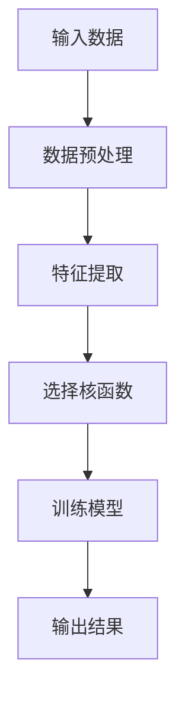
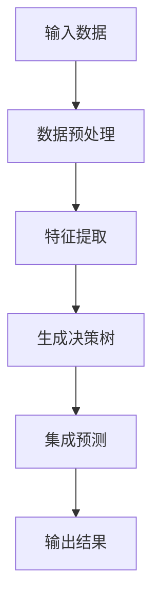
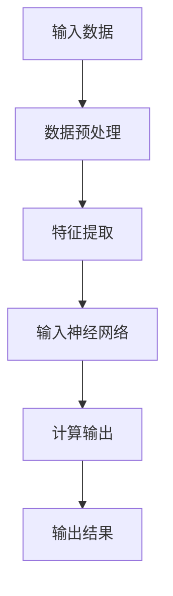
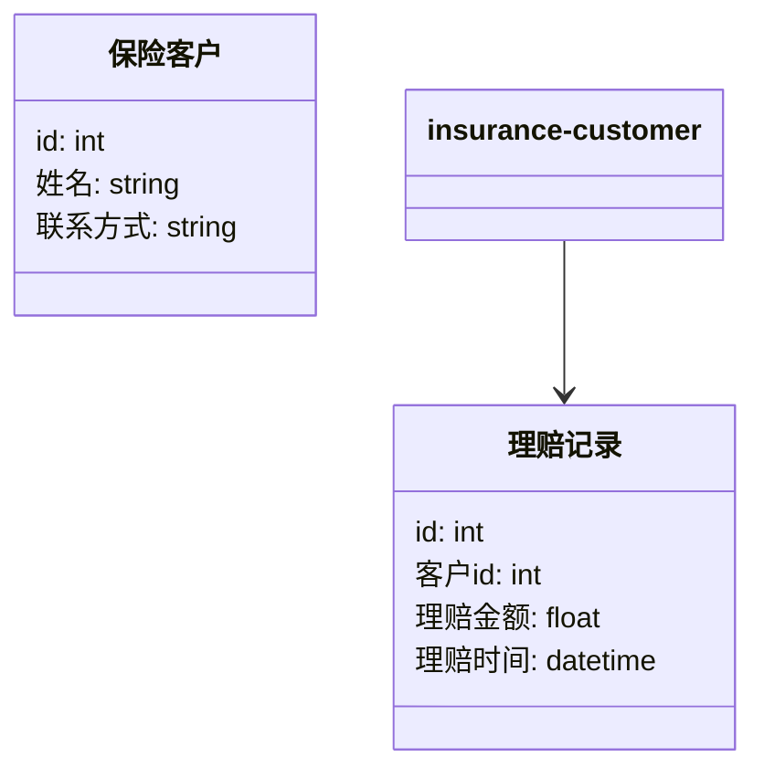
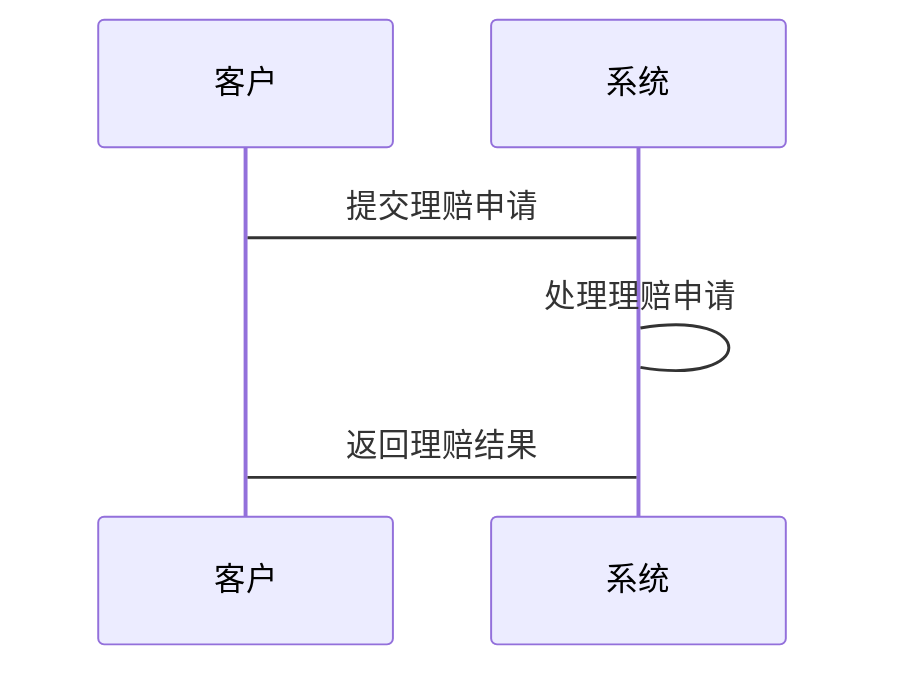

                 


# AI在保险理赔满意度预测与优化中的创新应用

> 关键词：AI技术、保险理赔、满意度预测、优化创新、机器学习、深度学习、NLP技术

> 摘要：本文探讨了人工智能技术在保险理赔满意度预测与优化中的创新应用，通过分析保险行业的现状与挑战，结合AI技术的核心概念、算法原理、系统架构设计、项目实战及最佳实践，深入剖析了AI技术在保险理赔满意度预测中的作用及实现路径，为保险行业数字化转型提供了新的视角和解决方案。

---

## 第1章 保险行业的现状与挑战

### 1.1 保险行业的现状分析

#### 1.1.1 保险行业的基本概念
保险是一种通过分散风险来提供经济保障的机制，是金融体系的重要组成部分。保险行业涵盖寿险、产险、健康险等多种业务类型，其中产险包括车险、责任险、信用险等。

#### 1.1.2 保险行业的痛点与挑战
1. **理赔流程复杂**：传统保险理赔流程繁琐，涉及多方沟通，容易产生纠纷。
2. **理赔效率低**：人工审核耗时长，容易延误客户理赔时间。
3. **数据孤岛问题**：保险公司之间数据共享困难，影响理赔效率和客户体验。
4. **客户满意度低**：传统理赔流程中，客户需要多次提供重复信息，体验较差。

#### 1.1.3 保险行业的未来发展趋势
随着科技的发展，保险行业正朝着数字化、智能化方向转型。AI技术的应用将重塑保险业务流程，提升理赔效率和客户满意度。

---

### 1.2 保险理赔的流程与问题

#### 1.2.1 保险理赔的基本流程
1. **报案**：客户发生保险事故后，通过电话、APP等方式向保险公司报案。
2. **审核**：保险公司审核报案信息，确定是否符合赔付条件。
3. **调查**：针对复杂案件，保险公司进行现场调查。
4. **赔付**：审核通过后，保险公司向客户支付理赔款。

#### 1.2.2 保险理赔中的常见问题
1. **理赔信息不透明**：客户不清楚理赔进度，容易产生不满。
2. **理赔标准不统一**：不同地区、不同保险公司理赔标准可能存在差异。
3. **理赔效率低**：人工审核耗时长，影响客户体验。

#### 1.2.3 保险理赔满意度的定义与重要性
保险理赔满意度是客户对保险公司理赔服务的综合评价，包括理赔速度、赔付金额、服务态度等多个维度。提升理赔满意度有助于增强客户忠诚度，提升品牌形象。

---

### 1.3 AI技术在保险行业的创新应用

#### 1.3.1 AI技术的基本概念
人工智能（AI）是指模拟人类智能的技术，包括机器学习、深度学习、自然语言处理（NLP）等。

#### 1.3.2 AI技术在保险行业中的应用场景
1. **保险产品设计**：利用AI技术分析客户需求，设计个性化保险产品。
2. **风险评估**：通过AI技术预测客户风险，优化保险定价。
3. **理赔自动化**：AI技术可以自动处理理赔申请，提升效率。

#### 1.3.3 AI技术对保险行业的潜在影响
AI技术将改变保险行业的传统模式，推动保险业务流程的智能化和数字化转型。

---

## 第2章 AI技术在保险理赔中的核心概念

### 2.1 保险理赔满意度预测的核心概念

#### 2.1.1 保险理赔满意度预测的定义
保险理赔满意度预测是通过AI技术对客户对保险理赔服务的满意度进行预测，帮助保险公司优化服务流程。

#### 2.1.2 保险理赔满意度预测的输入与输出
- **输入**：客户信息、理赔金额、理赔速度、服务态度等。
- **输出**：客户满意度评分（如1-5分）。

#### 2.1.3 保险理赔满意度预测的评价指标
1. **准确率**：模型预测准确的比例。
2. **召回率**：模型预测出的正例中真实为正例的比例。
3. **F1分数**：综合准确率和召回率的指标。

---

### 2.2 AI技术在保险理赔满意度预测中的作用

#### 2.2.1 数据驱动的保险理赔预测
通过收集和分析大量客户数据，利用AI技术进行预测和优化。

#### 2.2.2 AI算法在保险理赔预测中的优势
1. **高效性**：AI算法可以快速处理大量数据，提升预测效率。
2. **准确性**：通过机器学习算法，提升预测准确性。

#### 2.2.3 保险理赔满意度预测的边界与外延
保险理赔满意度预测的边界是仅预测客户满意度，而不涉及具体理赔金额的计算。其外延包括客户行为分析、保险产品优化等。

---

### 2.3 保险理赔满意度预测的核心要素

#### 2.3.1 数据特征分析
- **客户特征**：年龄、性别、职业等。
- **理赔特征**：理赔金额、理赔速度等。

#### 2.3.2 算法选择与优化
根据数据特征选择合适的算法，并通过调参优化模型性能。

#### 2.3.3 模型评估与调优
通过交叉验证等方法评估模型性能，并进行模型调优。

---

## 第3章 AI技术在保险理赔满意度预测中的算法原理

### 3.1 常见的保险理赔满意度预测算法

#### 3.1.1 线性回归
线性回归是一种简单的回归算法，适用于线性关系的数据。

**数学公式**：
$$ y = \beta_0 + \beta_1x + \epsilon $$

#### 3.1.2 支持向量机
支持向量机（SVM）适用于分类问题，通过构建超平面实现分类。

**mermaid流程图**：


#### 3.1.3 随机森林
随机森林是一种基于树的集成算法，适用于分类和回归问题。

**mermaid流程图**：


#### 3.1.4 神经网络
神经网络是一种模仿人脑结构的深度学习算法，适用于复杂数据的处理。

**mermaid流程图**：


---

### 3.2 算法原理与数学模型

#### 3.2.1 线性回归的数学模型
$$ y = \beta_0 + \beta_1x + \epsilon $$

#### 3.2.2 支持向量机的数学模型
$$ y = \text{sign}(w \cdot x + b) $$

#### 3.2.3 随机森林的数学模型
随机森林通过集成多个决策树的结果，提升模型的准确性和鲁棒性。

---

## 第4章 系统分析与架构设计方案

### 4.1 项目背景

#### 4.1.1 项目目标
提升保险理赔满意度，优化保险服务流程。

#### 4.1.2 项目范围
涵盖保险理赔满意度预测的算法开发、系统实现和优化。

#### 4.1.3 项目交付成果
开发一个基于AI技术的保险理赔满意度预测系统。

---

### 4.2 系统功能设计

#### 4.2.1 领域模型设计


#### 4.2.2 系统架构设计


#### 4.2.3 系统接口设计
1. **API接口**：提供RESTful API，供前端调用。
2. **数据接口**：与保险公司内部系统对接，获取理赔数据。

#### 4.2.4 系统交互流程图


---

## 第5章 项目实战

### 5.1 环境安装

#### 5.1.1 安装Python
```bash
# 安装Python
sudo apt-get install python3
```

#### 5.1.2 安装相关库
```bash
pip install numpy
pip install scikit-learn
pip install pandas
```

---

### 5.2 系统核心实现源代码

#### 5.2.1 数据预处理
```python
import pandas as pd
import numpy as np

data = pd.read_csv('insurance_claims.csv')
data = data.dropna()
```

#### 5.2.2 特征提取
```python
X = data[['年龄', '性别', '理赔金额', '理赔时间']]
y = data['满意度评分']
```

#### 5.2.3 模型训练
```python
from sklearn.model_selection import train_test_split
from sklearn.linear_model import LinearRegression

X_train, X_test, y_train, y_test = train_test_split(X, y, test_size=0.2)
model = LinearRegression()
model.fit(X_train, y_train)
```

#### 5.2.4 模型预测
```python
y_pred = model.predict(X_test)
print('预测结果:', y_pred)
```

---

### 5.3 代码应用解读与分析

#### 5.3.1 数据预处理
通过删除缺失值，确保数据完整性。

#### 5.3.2 特征提取
选择与客户满意度相关的特征，如年龄、性别、理赔金额、理赔时间等。

#### 5.3.3 模型训练
使用线性回归算法训练模型，优化模型参数，提升预测准确率。

#### 5.3.4 模型预测
利用训练好的模型，对测试数据进行预测，评估模型性能。

---

## 第6章 总结与最佳实践

### 6.1 小结
本文详细介绍了AI技术在保险理赔满意度预测中的创新应用，从理论到实践，全面分析了AI技术在保险行业的应用价值和实现路径。

### 6.2 注意事项
1. **数据隐私**：在处理客户数据时，需注意数据隐私保护。
2. **模型优化**：根据实际需求，不断优化模型性能。

### 6.3 拓展阅读
1. 《机器学习实战》
2. 《深度学习入门》
3. 《自然语言处理入门》

---

## 附录

### 附录1 数据集

```python
import pandas as pd
data = pd.read_csv('insurance_claims.csv')
```

### 附录2 代码仓库

```bash
git clone https://github.com/yourusername/insurance_claims_prediction.git
```

---

# 结语
通过本文的探讨，我们可以看到，AI技术正在深刻改变保险行业的业务流程和客户服务模式。未来，随着技术的不断进步，AI在保险理赔满意度预测中的应用将更加广泛和深入，为保险行业带来更多的创新和变革。

