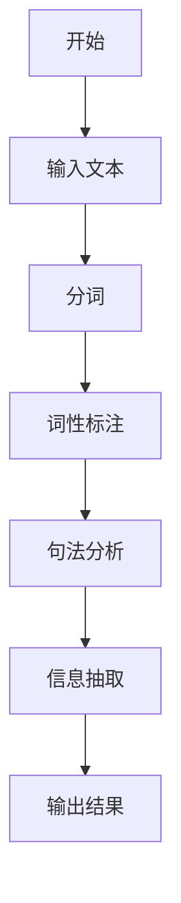
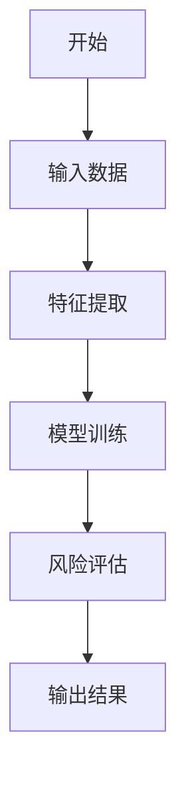
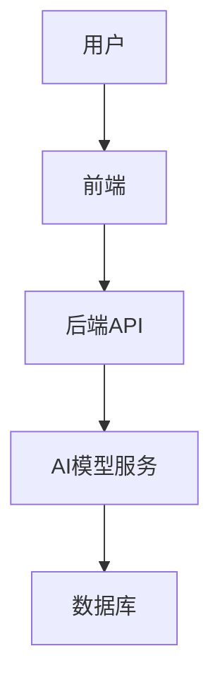
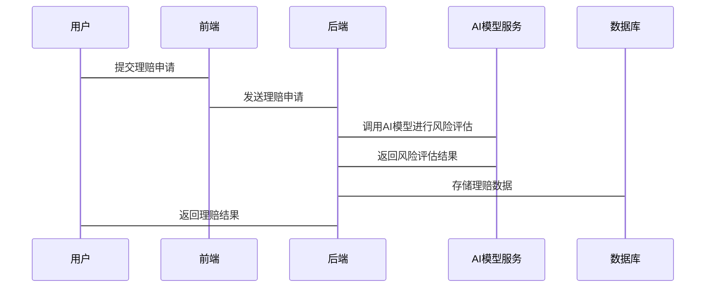

                 


# AI在保险理赔自动化中的创新应用

> 关键词：AI, 保险, 理赔自动化, 自然语言处理, 机器学习, 深度学习, 图像识别

> 摘要：随着人工智能技术的迅速发展，AI在保险行业的应用越来越广泛。本文探讨了AI在保险理赔自动化中的创新应用，分析了保险行业的现状、AI技术的核心概念、关键算法以及系统架构设计。通过实际案例分析和项目实战，展示了AI如何提升保险理赔的效率和准确性。文章最后总结了AI在保险理赔自动化中的优势与挑战，并展望了未来的发展方向。

---

## 第1章: 保险行业的现状与AI的发展

### 1.1 保险行业的现状

#### 1.1.1 保险行业的传统模式
保险行业传统的理赔流程通常包括以下步骤：
1. **客户提交理赔申请**：客户通过纸质或电子方式提交理赔申请。
2. **资料审核**：人工审核理赔资料，包括保单、医疗记录、事故报告等。
3. **风险评估**：根据历史数据和经验进行风险评估。
4. **理赔计算**：根据保险条款和损失情况进行理赔金额计算。
5. **理赔支付**：完成审核后支付理赔金额。

#### 1.1.2 保险行业的痛点与挑战
- **效率低下**：传统理赔流程依赖人工操作，耗时长，容易出错。
- **成本高昂**：人工审核和处理需要大量人力资源，增加了企业的运营成本。
- **数据孤岛**：不同部门和系统之间的数据难以共享，导致信息不一致。
- **客户体验差**：客户在理赔过程中需要多次提交资料，等待时间长，体验不佳。

#### 1.1.3 保险行业的未来趋势
随着科技的进步，保险行业正朝着数字化、智能化方向发展。AI技术的应用将显著提升理赔效率和准确性，优化客户体验，降低运营成本。

### 1.2 AI技术的发展与应用

#### 1.2.1 AI技术的定义与特点
人工智能（AI）是指计算机系统能够执行类似人类智能的任务，如视觉识别、语音识别、决策判断等。AI的核心特点包括：
- **数据驱动**：依赖大量数据进行训练和优化。
- **自动化**：能够自动完成任务，减少人工干预。
- **可扩展性**：能够处理海量数据，适用于各种规模的应用场景。

#### 1.2.2 AI技术在各行业的应用现状
AI技术已经在多个行业得到广泛应用，包括金融、医疗、教育、交通等。在保险行业，AI主要应用于风险评估、客户画像、 fraud detection 等领域。

#### 1.2.3 AI技术在保险行业的潜力
AI技术在保险行业的潜力巨大，尤其是在理赔自动化方面。通过AI技术，可以实现理赔流程的智能化和自动化，显著提升效率和准确性。

### 1.3 保险理赔自动化的核心概念

#### 1.3.1 保险理赔的基本流程
保险理赔的基本流程包括：
1. **客户提交理赔申请**：客户通过线上或线下渠道提交理赔申请。
2. **资料收集与审核**：系统自动收集和审核理赔资料。
3. **风险评估**：系统根据历史数据和AI模型进行风险评估。
4. **理赔计算**：系统根据保险条款和损失情况计算理赔金额。
5. **理赔支付**：系统自动完成理赔支付。

#### 1.3.2 保险理赔自动化的定义
保险理赔自动化是指通过AI技术实现理赔流程的自动化，减少人工干预，提高效率和准确性。

#### 1.3.3 保险理赔自动化的核心要素
- **AI算法**：包括自然语言处理、机器学习、图像识别等技术。
- **数据平台**：支持海量数据的存储、处理和分析。
- **系统架构**：包括前端用户界面、后端服务、数据库等。

## 第2章: AI在保险理赔自动化中的应用

### 2.1 保险理赔自动化的主要场景

#### 2.1.1 理赔申请的自动受理
通过AI技术，客户可以通过语音或文字方式提交理赔申请，系统自动解析并生成理赔申请表。

#### 2.1.2 理赔资料的自动审核
AI技术可以自动识别和验证理赔资料的真实性，减少人工审核的工作量。

#### 2.1.3 理赔金额的自动计算
通过AI模型，系统可以根据历史数据和当前情况自动计算理赔金额。

### 2.2 AI技术在保险理赔中的关键应用

#### 2.2.1 自然语言处理在保单解析中的应用
通过自然语言处理技术，系统可以自动解析保单内容，提取关键信息。

#### 2.2.2 机器学习在风险评估中的应用
通过机器学习模型，系统可以对客户进行风险评估，预测潜在的理赔风险。

#### 2.2.3 图像识别在理赔单据处理中的应用
通过图像识别技术，系统可以自动识别和提取理赔单据中的文字信息。

### 2.3 保险理赔自动化的优势与挑战

#### 2.3.1 自动化理赔的优势
- **提高效率**：减少人工干预，缩短理赔时间。
- **降低成本**：降低人工审核和处理的成本。
- **提升准确性**：通过AI技术提高理赔的准确性。

#### 2.3.2 自动化理赔的挑战
- **数据隐私**：需要保护客户数据的隐私和安全。
- **技术复杂性**：AI技术的实现和优化需要较高的技术水平。
- **法规合规**：需要符合相关法律法规，确保理赔过程的合规性。

#### 2.3.3 自动化理赔的未来发展方向
- **智能化**：进一步提升AI技术的智能化水平，实现更复杂的理赔流程。
- **个性化服务**：通过AI技术提供个性化的理赔服务，提升客户体验。
- **多模态数据处理**：整合文本、图像、语音等多种数据源，提升理赔的全面性。

## 第3章: AI在保险理赔自动化中的关键算法

### 3.1 保险理赔自动化的核心算法

#### 3.1.1 文本分类算法
文本分类算法用于自动分类理赔资料的类型，如保单、医疗记录等。

#### 3.1.2 信息抽取算法
信息抽取算法用于从理赔资料中提取关键信息，如客户姓名、理赔金额等。

#### 3.1.3 风险评估算法
风险评估算法用于评估客户的理赔风险，预测潜在的理赔情况。

### 3.2 算法原理与流程图

#### 3.2.1 文本分类算法的原理
文本分类算法通常采用机器学习方法，如支持向量机（SVM）、随机森林（Random Forest）等。通过训练数据，模型可以自动分类新的文本数据。

#### 3.2.2 信息抽取算法的流程图


#### 3.2.3 风险评估算法的流程图


### 3.3 算法实现与代码示例

#### 3.3.1 文本分类的Python实现
```python
from sklearn.feature_extraction.text import TfidfVectorizer
from sklearn.svm import SVC
from sklearn.pipeline import Pipeline

# 训练数据
train_data = [
    ("理赔申请", 0),
    ("保单信息", 1),
    ("医疗记录", 2),
    ("事故报告", 3)
]

# 模型训练
vectorizer = TfidfVectorizer()
model = SVC()
pipeline = Pipeline([('tfidf', vectorizer), ('svm', model)])
pipeline.fit([text for text, label in train_data], [label for text, label in train_data])

# 预测
test_text = "这是理赔申请"
predicted_label = pipeline.predict([test_text])
print(predicted_label)
```

#### 3.3.2 信息抽取的Python实现
```python
import spacy

# 加载模型
nlp = spacy.load("en_core_web_sm")

# 处理文本
text = "客户张三，理赔金额为10000元"
doc = nlp(text)

# 提取信息
for token in doc:
    if token.pos_ == "PROPN":
        print("姓名：", token.text)
    if token.pos_ == "NUM":
        print("理赔金额：", token.text)
```

#### 3.3.3 风险评估的Python实现
```python
import pandas as pd
from sklearn.ensemble import RandomForestClassifier

# 训练数据
data = pd.DataFrame({
    '理赔金额': [1000, 2000, 3000, 4000],
    '历史理赔次数': [1, 2, 3, 4],
    '风险等级': [0, 1, 2, 3]
})

# 模型训练
model = RandomForestClassifier()
model.fit(data[['理赔金额', '历史理赔次数']], data['风险等级'])

# 预测
test_data = pd.DataFrame({
    '理赔金额': [2500],
    '历史理赔次数': [2]
})

predicted_risk = model.predict(test_data)
print(predicted_risk)
```

### 3.4 本章小结
本章介绍了AI在保险理赔自动化中的关键算法，包括文本分类、信息抽取和风险评估。通过Python代码示例，展示了这些算法的具体实现和应用。

## 第4章: 保险理赔自动化系统的架构设计

### 4.1 保险理赔自动化系统的架构设计

#### 4.1.1 系统功能设计
- **用户界面**：包括理赔申请、资料上传、进度查询等功能。
- **数据处理模块**：包括文本分类、信息抽取、图像识别等功能。
- **AI模型服务**：包括风险评估、理赔计算等AI模型服务。

#### 4.1.2 系统架构设计


#### 4.1.3 系统接口设计
- **前端接口**：包括网页和移动端接口。
- **后端接口**：包括RESTful API，用于与AI模型服务和数据库交互。

#### 4.1.4 系统交互设计


### 4.2 项目实战

#### 4.2.1 项目环境安装
```bash
pip install spacy sklearn tensorflow
python -m spacy download en_core_web_sm
```

#### 4.2.2 系统核心实现源代码
```python
# 后端API实现
from flask import Flask, request, jsonify
import spacy
import sklearn
import tensorflow

app = Flask(__name__)

@app.route('/classify', methods=['POST'])
def classify():
    data = request.json
    text = data['text']
    # 文本分类逻辑
    return jsonify({'label': model.predict([text])[0]})

if __name__ == '__main__':
    app.run()
```

#### 4.2.3 代码应用解读与分析
- **后端API实现**：通过Flask框架实现RESTful API，接收文本数据并调用AI模型进行分类。
- **前端实现**：通过网页或移动端应用提交理赔申请，展示分类结果。

#### 4.2.4 实际案例分析
- **案例背景**：客户提交理赔申请，系统自动分类并提取关键信息。
- **分类结果**：系统识别理赔类型并进行风险评估，生成理赔金额。
- **结果展示**：用户通过界面查看理赔结果。

### 4.3 本章小结
本章通过实际案例分析和项目实战，展示了保险理赔自动化系统的架构设计和实现过程。通过代码示例和系统交互图，详细介绍了系统的功能设计和实现细节。

---

## 第5章: 总结与展望

### 5.1 总结
本文详细探讨了AI在保险理赔自动化中的创新应用，分析了保险行业的现状、AI技术的核心概念、关键算法以及系统架构设计。通过实际案例分析和项目实战，展示了AI如何提升保险理赔的效率和准确性。

### 5.2 未来展望
随着AI技术的不断发展，保险理赔自动化将更加智能化和个性化。未来的研究方向包括：
- **多模态数据处理**：整合文本、图像、语音等多种数据源，提升理赔的全面性。
- **自适应学习**：通过自适应学习算法，提升AI模型的泛化能力和准确性。
- **智能交互**：通过自然语言处理技术，实现更智能的用户交互。

---

以上是《AI在保险理赔自动化中的创新应用》的完整目录和文章内容。希望这篇文章能为您提供有价值的信息和启发。如果您有任何问题或需要进一步的解释，请随时联系我。

