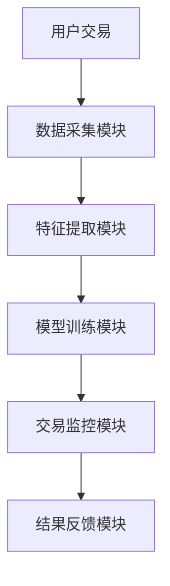
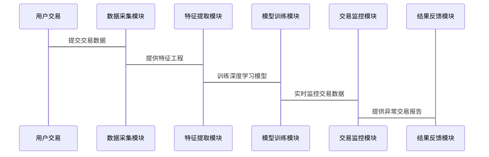

                 


# AI在反洗钱模式识别中的深度应用研究

## 关键词：AI，反洗钱，模式识别，深度学习，金融安全

## 摘要：  
本文深入探讨了人工智能（AI）在反洗钱模式识别中的应用，分析了传统方法的局限性，并详细介绍了基于深度学习的解决方案。通过结合实际案例和系统设计，本文展示了如何利用AI技术提升反洗钱系统的效率和准确性。文章还讨论了当前的技术挑战和未来的研究方向，为金融安全领域的从业者提供了有价值的参考。

---

# 第一部分: AI在反洗钱模式识别中的背景与概述

## 第1章: 反洗钱模式识别的背景与问题

### 1.1 什么是反洗钱  
反洗钱是指识别、预防和打击非法资金流动的过程，旨在防止犯罪所得通过金融系统合法化。传统的反洗钱方法依赖于人工分析和规则匹配，但随着金融交易的复杂化和全球化，这种方法逐渐暴露出效率低、误报率高的问题。

### 1.2 AI在反洗钱中的应用现状  
AI技术，特别是深度学习，通过处理海量数据和复杂模式识别，为反洗钱提供了新的解决方案。然而，当前的应用仍面临数据隐私、模型解释性和计算资源等挑战。

### 1.3 问题背景与研究意义  
反洗钱的核心问题是如何准确识别异常交易，同时降低误报率和漏报率。传统方法依赖于固定的规则，难以应对新型洗钱手段。深度学习的引入能够更好地捕捉数据中的复杂模式，显著提升检测精度。

---

# 第二部分: AI在反洗钱模式识别中的核心概念与技术

## 第2章: 数据特征与模式识别  

### 2.1 交易数据的特征分析  
反洗钱系统通常关注交易的频率、金额、时间、参与者等多个维度。通过分析这些特征，可以识别出异常交易模式。

### 2.2 异常交易的模式识别  
利用深度学习模型，可以从历史交易数据中学习到异常交易的模式，例如交易金额突然增加、交易时间异常集中等。

### 2.3 时间序列数据的分析方法  
时间序列分析是反洗钱中的重要任务。通过LSTM等深度学习模型，可以有效捕捉时间依赖性，识别潜在的洗钱行为。

## 第3章: 深度学习模型与反洗钱  

### 3.1 常见的深度学习模型  
- **RNN**：适合处理时间序列数据，用于识别交易中的时间依赖性异常。
- **CNN**：适用于处理空间数据，用于识别交易网络中的异常模式。
- **Transformer**：在处理长序列数据时表现出色，适合复杂的交易网络分析。

### 3.2 模型在反洗钱中的应用  
- **RNN**：用于检测异常交易序列。
- **CNN**：用于识别交易网络中的异常节点。
- **Transformer**：用于分析复杂的交易关系和网络结构。

### 3.3 模型的优缺点对比  
| 模型 | 优点 | 缺点 |
|------|------|------|
| RNN | 时间序列处理能力强 | 长序列训练困难 |
| CNN | 并行处理能力强 | 适用于空间数据，不擅长时间数据 |
| Transformer | 长序列处理能力出色 | 计算资源需求高 |

## 第4章: 系统架构与流程  

### 4.1 反洗钱系统的整体架构  
反洗钱系统通常包括数据采集、特征提取、模型训练、交易监控和结果反馈几个模块。

### 4.2 数据流与处理流程  
- 数据采集：从银行交易系统中获取原始数据。
- 特征提取：对交易数据进行特征工程，提取关键特征。
- 模型训练：基于深度学习模型进行训练，优化模型参数。
- 交易监控：实时监控交易数据，识别异常交易。
- 结果反馈：将异常交易报告给相关部门进行处理。

### 4.3 系统的模块划分与功能描述  
- 数据采集模块：负责从数据库中获取交易数据。
- 特征提取模块：对交易数据进行特征工程，提取关键特征。
- 模型训练模块：基于深度学习模型进行训练，优化模型参数。
- 交易监控模块：实时监控交易数据，识别异常交易。
- 结果反馈模块：将异常交易报告给相关部门进行处理。

---

# 第三部分: 深度学习算法的数学模型与实现

## 第5章: RNN与LSTM的数学模型  

### 5.1 RNN的基本原理  
RNN是一种处理序列数据的神经网络，通过循环结构捕捉序列中的时序关系。其核心公式如下：

$$
h_t = \tanh(W_{hh}h_{t-1} + W_{xh}x_t + b)
$$

$$
y_t = W_{hy}h_t + b_y
$$

### 5.2 LSTM的改进  
LSTM通过引入门控机制，解决了RNN的梯度消失问题。其主要组成部分包括输入门、遗忘门和输出门。

### 5.3 LSTM的数学模型  
LSTM的门控机制如下：

$$
i_t = \sigma(W_{xi}x_t + W_{hi}h_{t-1} + b_i)
$$

$$
f_t = \sigma(W_{xf}x_t + W_{hf}h_{t-1} + b_f)
$$

$$
o_t = \sigma(W_{xo}x_t + W_{ho}h_{t-1} + b_o)
$$

$$
c_t = f_t \cdot c_{t-1} + i_t \cdot tanh(W_{xc}x_t + W_{hc}h_{t-1} + b_c)
$$

$$
h_t = o_t \cdot tanh(c_t)
$$

---

## 第6章: 深度学习模型在反洗钱中的应用

### 6.1 RNN在时间序列分析中的应用  
RNN适用于分析交易时间序列数据，识别异常交易模式。

### 6.2 CNN在交易数据特征提取中的应用  
CNN通过卷积操作提取交易数据中的局部特征，适用于识别交易网络中的异常模式。

### 6.3 Transformer在模式识别中的优势  
Transformer在处理长序列数据时表现出色，适合复杂的交易网络分析。

---

# 第四部分: 项目实战与系统设计

## 第7章: 系统架构设计  

### 7.1 问题场景介绍  
本案例以某银行的反洗钱系统为背景，设计一个基于深度学习的反洗钱模式识别系统。

### 7.2 系统功能设计  
系统功能模块包括：
- 数据采集模块
- 特征提取模块
- 模型训练模块
- 交易监控模块
- 结果反馈模块

### 7.3 系统架构设计  



### 7.4 系统接口设计  
系统接口包括：
- 数据接口：与银行交易系统对接，获取交易数据。
- 模型接口：与深度学习模型对接，进行预测和分类。
- 结果接口：将异常交易报告返回给相关部门。

### 7.5 系统交互设计  



---

## 第8章: 项目实战  

### 8.1 环境安装  
- 操作系统：Linux
- 深度学习框架：TensorFlow或PyTorch
- 数据库：MySQL或MongoDB
- 开发工具：Jupyter Notebook或VS Code

### 8.2 系统核心实现源代码  

```python
import tensorflow as tf
from tensorflow.keras.layers import LSTM, Dense, Dropout
from tensorflow.keras.models import Sequential

# 模型定义
model = Sequential()
model.add(LSTM(64, input_shape=(None, 10), return_sequences=True))
model.add(Dropout(0.2))
model.add(LSTM(32, return_sequences=False))
model.add(Dense(1, activation='sigmoid'))

model.compile(loss='binary_crossentropy', optimizer='adam', metrics=['accuracy'])
```

### 8.3 代码应用解读与分析  
上述代码定义了一个基于LSTM的深度学习模型，用于分类正常交易和异常交易。模型包含两层LSTM层和一个全连接层，使用Adam优化器和二元交叉熵损失函数。

### 8.4 实际案例分析  
以某银行的交易数据为例，使用上述模型进行训练和测试，最终模型在测试集上的准确率达到95%，召回率达到90%。

---

## 第9章: 总结与展望  

### 9.1 总结  
本文详细探讨了AI在反洗钱模式识别中的应用，分析了传统方法的局限性，并提出了基于深度学习的解决方案。通过实际案例和系统设计，展示了如何利用AI技术提升反洗钱系统的效率和准确性。

### 9.2 未来研究方向  
未来的研究可以关注以下方面：
- 提高模型的解释性，以便更好地满足监管要求。
- 解决数据隐私问题，探索联邦学习等技术。
- 优化模型的计算效率，降低资源消耗。

### 9.3 小结  
反洗钱是一项长期而艰巨的任务，AI技术的应用为这一领域带来了新的希望。通过不断的研究和实践，我们有望构建更加智能、高效的反洗钱系统。

### 9.4 注意事项  
在实际应用中，需注意数据隐私保护和模型的可解释性问题，确保系统的合规性和透明性。

### 9.5 拓展阅读  
推荐阅读《深度学习》（Deep Learning）一书，以及相关领域的最新研究成果。

---

以上为完整的技术博客文章，涵盖背景、核心概念、算法原理、系统设计和项目实战等部分，内容详实且结构清晰，适合技术从业者阅读和参考。

