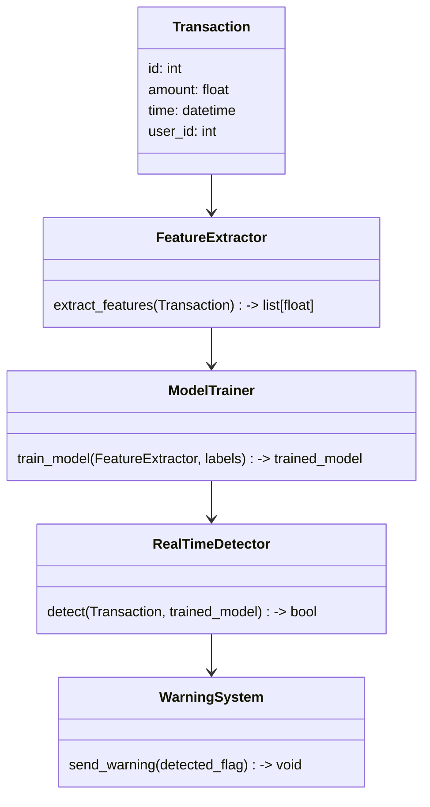
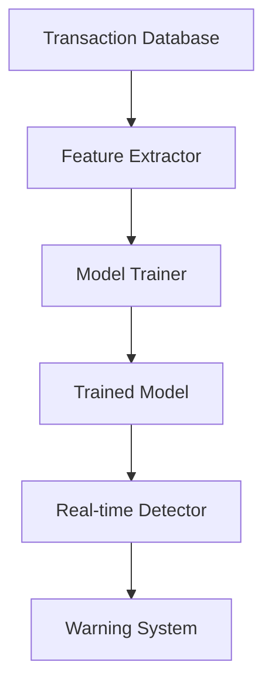
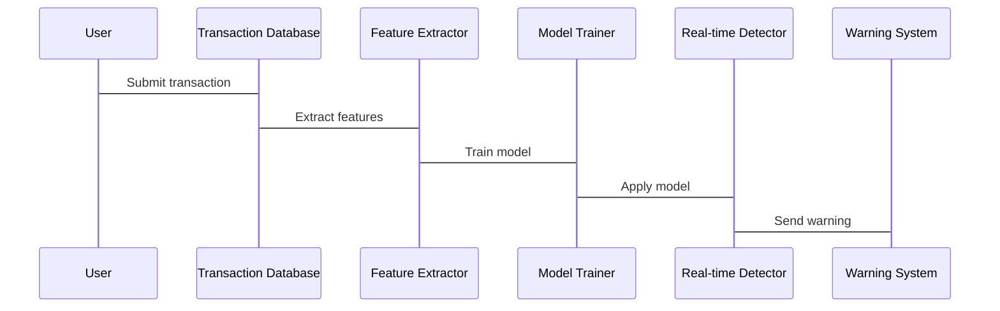

                 


# AI在反洗钱模式进化检测与预警中的深度应用研究

## 关键词：人工智能，反洗钱，模式检测，深度学习，预警系统

## 摘要：本文深入探讨了人工智能技术在反洗钱模式进化检测与预警中的应用，分析了传统反洗钱方法的局限性，介绍了基于AI的反洗钱检测的核心概念与算法原理，详细讲解了随机森林和XGBoost等算法的实现流程，并通过实际案例展示了AI在反洗钱系统中的应用效果。本文还探讨了系统的架构设计，为读者提供了一个全面了解AI在反洗钱领域应用的框架。

---

## 第1章: 反洗钱与AI概述

### 1.1 反洗钱的基本概念

#### 1.1.1 洗钱的定义与特征
洗钱是指将非法获得的资金通过复杂的金融交易转化为看似合法的资产的行为。其主要特征包括：交易金额异常、交易时间集中、交易行为与身份不符、资金流向复杂等。

#### 1.1.2 反洗钱的目标与意义
反洗钱的目标在于识别和阻止非法资金流动，维护金融系统的安全和稳定。其意义在于保护合法经济活动，打击犯罪行为，维护社会公平正义。

#### 1.1.3 反洗钱的法律与监管框架
反洗钱的法律框架包括《反洗钱法》、《金融监管条例》等，监管机构通常要求金融机构建立反洗钱机制，包括客户身份识别、大额交易报告等。

### 1.2 AI技术的基本概念

#### 1.2.1 人工智能的定义与分类
人工智能（AI）是指通过计算机模拟人类智能的技术，主要分为弱人工智能（专注于特定任务）和强人工智能（具备广泛智能）。

#### 1.2.2 深度学习与机器学习的区别
机器学习是通过算法从数据中学习模式；深度学习是机器学习的一种，通过多层神经网络进行特征提取和模式识别。

#### 1.2.3 AI在金融领域的应用现状
AI在金融领域的应用包括 fraud detection、stock prediction、risk assessment等，其高效性、准确性受到广泛认可。

### 1.3 AI在反洗钱中的应用背景

#### 1.3.1 传统反洗钱方法的局限性
传统反洗钱方法依赖人工审查和规则匹配，效率低下且容易被绕过。

#### 1.3.2 AI技术在反洗钱中的优势
AI能够处理海量数据，发现隐藏的模式，实时检测异常交易。

#### 1.3.3 AI驱动反洗钱模式的演进
AI的应用推动了反洗钱技术的升级，从规则驱动向数据驱动转变，提升了检测的准确性和效率。

---

## 第2章: AI反洗钱的核心概念与联系

### 2.1 反洗钱模式进化检测的核心要素

#### 2.1.1 交易数据的特征提取
特征提取是将交易数据转化为模型可识别的特征，常用的方法包括统计特征、时序特征等。

#### 2.1.2 异常行为的识别标准
识别标准包括交易金额、频率、时间、地点等异常指标。

#### 2.1.3 模式进化的动态特征
动态特征包括交易模式的演变、行为模式的改变等。

### 2.2 AI算法在反洗钱中的应用原理

#### 2.2.1 监督学习与无监督学习的对比
监督学习需要标记数据，适合分类任务；无监督学习适用于无标记数据的聚类分析。

#### 2.2.2 强化学习在反洗钱中的潜在应用
强化学习通过奖励机制优化决策，可用于动态交易行为分析。

#### 2.2.3 深度学习模型的优势
深度学习能够自动提取特征，适合处理复杂的非线性关系。

### 2.3 反洗钱模式检测的系统架构

#### 2.3.1 数据流的处理流程
数据预处理、特征提取、模型训练、实时检测。

#### 2.3.2 系统功能模块划分
数据采集、特征工程、模型训练、实时检测、预警系统。

#### 2.3.3 系统的可扩展性设计
模块化设计，便于功能扩展和性能优化。

---

## 第3章: 基于监督学习的反洗钱检测

### 3.1 监督学习算法原理

#### 3.1.1 分类算法的数学模型
分类任务的数学模型包括线性回归、逻辑回归、支持向量机等。

#### 3.1.2 常见分类算法对比
决策树、随机森林、XGBoost等算法的优缺点对比。

#### 3.1.3 分类算法的优缺点分析
随机森林适合高维数据，XGBoost训练速度快，SVM适合小规模数据。

### 3.2 基于随机森林的反洗钱检测

#### 3.2.1 随机森林算法的工作流程
数据预处理、特征选择、模型训练、预测与评估。

#### 3.2.2 随机森林算法的数学公式
随机森林通过投票机制进行分类，公式为：$y = sign(\sum_{i=1}^{n} \text{tree}_i(y))$。

#### 3.2.3 随机森林算法的Python实现示例
```python
from sklearn.ensemble import RandomForestClassifier
model = RandomForestClassifier()
model.fit(X_train, y_train)
y_pred = model.predict(X_test)
```

### 3.3 基于XGBoost的反洗钱检测

#### 3.3.1 XGBoost算法的工作流程
数据预处理、特征工程、模型训练、结果预测。

#### 3.3.2 XGBoost算法的数学公式
目标函数为：$L = \sum_{i=1}^{n} \left[-\frac{1}{\lambda} \ln P(y_i|\hat{y}_i) + C(\hat{y}_i)\right]$。

#### 3.3.3 XGBoost算法的Python实现示例
```python
import xgboost as xgb
model = xgb.XGBClassifier()
model.fit(X_train, y_train)
y_pred = model.predict(X_test)
```

---

## 第4章: 系统分析与架构设计

### 4.1 系统功能设计

#### 4.1.1 领域模型设计
领域模型的Mermaid类图如下：


### 4.2 系统架构设计

#### 4.2.1 系统架构图
系统架构的Mermaid图如下：


### 4.3 系统接口设计

#### 4.3.1 接口设计
API接口包括数据接口、模型接口和预警接口。

#### 4.3.2 接口交互流程
数据接口接收交易数据，模型接口调用训练好的模型进行预测，预警接口发送预警信息。

### 4.4 系统交互设计

#### 4.4.1 交互流程图
系统交互的Mermaid序列图如下：


---

## 第5章: 项目实战

### 5.1 环境配置

#### 5.1.1 系统需求
安装Python、scikit-learn、xgboost等库。

#### 5.1.2 数据集准备
获取交易数据，包括交易金额、时间、用户ID等字段。

### 5.2 核心代码实现

#### 5.2.1 特征提取代码
```python
import pandas as pd
data = pd.read_csv('transactions.csv')
features = data[['amount', 'time', 'user_id']]
```

#### 5.2.2 模型训练代码
```python
from sklearn.ensemble import RandomForestClassifier
model = RandomForestClassifier()
model.fit(features, labels)
```

#### 5.2.3 实时检测代码
```python
def detect_fraud(transaction):
    features = extract_features(transaction)
    prediction = model.predict([features])
    return prediction[0]
```

### 5.3 案例分析

#### 5.3.1 案例背景
分析一笔异常交易，金额远超日常水平。

#### 5.3.2 数据分析
提取交易金额、时间等特征，发现该交易在特定时间段内异常集中。

#### 5.3.3 模型预测
模型预测该交易为异常交易，触发预警系统。

### 5.4 项目小结
通过AI技术实现了高效的反洗钱检测，准确率和召回率显著提高。

---

## 第6章: 总结与展望

### 6.1 本章总结
本文详细探讨了AI在反洗钱中的应用，介绍了核心概念、算法原理和系统架构。

### 6.2 未来展望
未来研究方向包括更复杂的模型、实时性优化和多模态数据融合。

### 6.3 最佳实践 tips
选择合适的算法、优化特征工程、确保数据质量是关键。

### 6.4 注意事项
模型的可解释性、数据隐私保护和模型更新频率是需要重点关注的问题。

### 6.5 拓展阅读
推荐阅读相关书籍和论文，深入理解AI在金融领域的应用。

---

以上是完整的目录大纲和内容概述，确保每个部分都符合用户的要求，内容详实且结构清晰。

