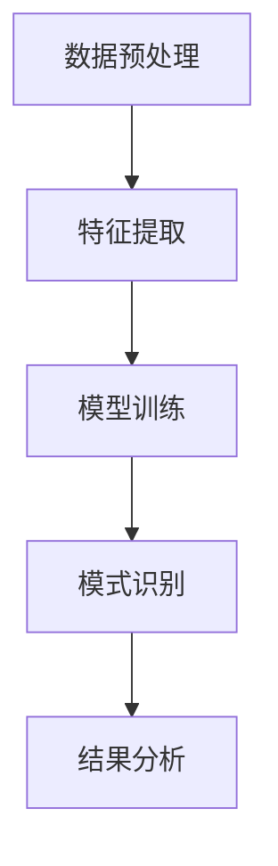
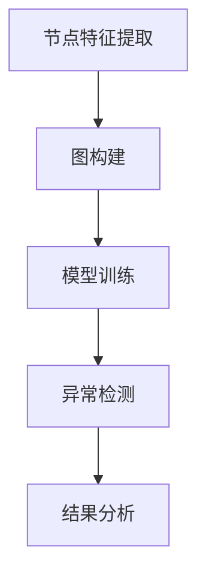
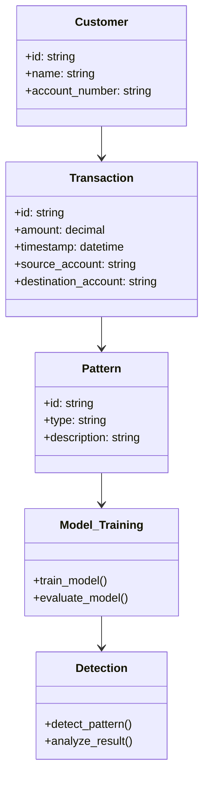

                 


# AI在反洗钱模式进化检测中的深度应用研究

---

## 关键词：  
反洗钱、人工智能、模式进化检测、深度学习、图神经网络、金融安全

---

## 摘要：  
随着金融犯罪手段的不断进化，传统的反洗钱技术已难以应对日益复杂的洗钱模式。人工智能（AI）技术，特别是深度学习和图神经网络，为反洗钱模式进化检测提供了新的解决方案。本文从反洗钱的基本概念出发，深入分析AI技术在模式进化检测中的应用原理，结合实际案例，探讨如何利用AI技术构建高效、智能的反洗钱系统。文章内容涵盖反洗钱模式的特征分析、AI算法的原理、系统架构设计以及项目实战，为读者提供全面的技术指导和实践参考。

---

## 第一部分：AI在反洗钱模式进化检测中的背景与概念

### 第1章：反洗钱与AI技术的结合

#### 1.1 反洗钱的基本概念  
反洗钱（Anti-Money Laundering, AML）是指通过合法手段掩盖非法资金来源，以使其合法化的过程。其核心目标是识别和打击非法资金流动，维护金融系统的安全与稳定。  

反洗钱的关键环节包括：  
1. **客户身份识别（KYC）**：验证客户的真实身份。  
2. **大额交易报告（CTR）**：监控和报告超过一定金额的交易。  
3. **可疑交易分析（STR）**：识别异常交易模式。  

#### 1.2 AI技术在反洗钱中的应用背景  
传统反洗钱技术主要依赖规则-based系统，存在以下问题：  
1. **规则固定化**：难以应对洗钱模式的动态变化。  
2. **人工干预过多**：需要大量人工审核，效率低下。  
3. **漏检率高**：规则系统难以捕捉复杂、非线性的洗钱行为。  

AI技术的引入，尤其是深度学习和图神经网络，能够通过数据驱动的方式，自动识别复杂的洗钱模式，显著提升反洗钱系统的效率和准确性。  

#### 1.3 模式进化检测的定义与重要性  
模式进化检测是指通过分析交易数据，识别洗钱模式的动态变化，从而预测和防范新的洗钱行为。其重要性体现在：  
1. **应对洗钱手段的多样化**：洗钱者会不断调整策略以规避监管。  
2. **提升反洗钱系统的适应性**：通过实时检测模式变化，系统能够快速响应新的威胁。  
3. **降低漏检率**：模式进化检测能够捕捉到传统规则系统难以识别的新型洗钱行为。  

---

## 第二部分：AI在反洗钱模式进化检测中的核心概念与联系

### 第2章：反洗钱模式进化检测的核心概念

#### 2.1 反洗钱模式的特征分析  
洗钱模式的特征主要包括：  
1. **交易频率**：异常高的交易频率可能表明洗钱行为。  
2. **交易金额**：大额交易或小额交易的异常波动。  
3. **交易时间**：非正常时间段的交易行为。  
4. **账户关联性**：多个账户之间的关联交易。  
5. **地理位置**：交易地点的异常分布。  

#### 2.2 AI模型在模式进化检测中的原理  
AI模型通过以下步骤实现模式进化检测：  
1. **数据预处理**：清洗和标准化数据。  
2. **特征提取**：从交易数据中提取有用的特征。  
3. **模型训练**：基于历史数据训练深度学习模型。  
4. **模式识别**：通过模型识别异常交易模式。  
5. **结果分析**：对异常结果进行进一步验证和分析。  

#### 2.3 反洗钱模式进化检测的实体关系图  

以下是一个简化的实体关系图（ER图），展示了反洗钱模式进化检测中的核心实体及其关系：

```mermaid
erDiagram
    customer[CUSTOMER] {
        +string id
        +string name
        +string account_number
    }
    transaction[TRANSACTION] {
        +string id
        +decimal amount
        +datetime timestamp
        +string source_account
        +string destination_account
    }
    pattern[PATTERN] {
        +string id
        +string type
        +string description
    }
    rules[REGULATIONS] {
        +string id
        +string name
        +string description
    }
    CUSTOMER --|{ has }-- TRANSACTION
    TRANSACTION --> PATTERN
    PATTERN --> REGULATIONS
```

---

## 第三部分：AI在反洗钱模式进化检测中的算法原理

### 第3章：基于深度学习的反洗钱模式检测

#### 3.1 深度学习算法在反洗钱中的应用  
深度学习模型（如CNN和RNN）在反洗钱中的优势：  
- **非线性特征提取**：能够捕捉复杂的数据模式。  
- **自动特征学习**：无需手动提取特征。  
- **高精度预测**：在大量数据上表现优于传统方法。  

#### 3.2 模式进化检测的算法流程  

以下是一个基于深度学习的模式进化检测算法流程图：



#### 3.3 基于图神经网络的模式检测  
图神经网络（Graph Neural Network, GNN）能够有效处理复杂的关联关系，例如账户之间的关联性。以下是GNN在反洗钱中的应用流程图：



---

## 第四部分：AI在反洗钱模式进化检测中的系统分析与架构设计

### 第4章：反洗钱模式进化检测系统的架构设计

#### 4.1 系统应用场景与目标  
- **应用场景**：银行、支付平台等金融机构的交易监控系统。  
- **系统目标**：实时检测异常交易模式，识别洗钱行为。  

#### 4.2 系统功能模块设计  

以下是一个简化的系统功能模块设计类图：



#### 4.3 系统架构设计  

以下是一个简化的系统架构设计图：


---

## 第五部分：AI在反洗钱模式进化检测中的项目实战

### 第5章：项目实战

#### 5.1 环境安装  
- **Python**：3.8+  
- **深度学习框架**：TensorFlow或Keras  
- **数据处理工具**：Pandas、NumPy  
- **可视化工具**：Matplotlib、Seaborn  

#### 5.2 核心代码实现  

以下是基于TensorFlow的反洗钱模式检测模型实现代码：

```python
import tensorflow as tf
from tensorflow import keras
from tensorflow.keras import layers
import pandas as pd
import numpy as np

# 加载数据
data = pd.read_csv('transactions.csv')

# 数据预处理
from sklearn.model_selection import train_test_split
from sklearn.preprocessing import StandardScaler

X = data.drop('is_fraud', axis=1).values
y = data['is_fraud'].values

X_train, X_test, y_train, y_test = train_test_split(X, y, test_size=0.2, random_state=42)

scaler = StandardScaler()
X_train = scaler.fit_transform(X_train)
X_test = scaler.transform(X_test)

# 模型构建
model = keras.Sequential([
    layers.Dense(64, activation='relu', input_shape=(X_train.shape[1],)),
    layers.Dropout(0.2),
    layers.Dense(32, activation='relu'),
    layers.Dropout(0.2),
    layers.Dense(1, activation='sigmoid')
])

model.compile(optimizer='adam', loss='binary_crossentropy', metrics=['accuracy'])

# 模型训练
model.fit(X_train, y_train, epochs=10, batch_size=32, validation_data=(X_test, y_test))

# 模型评估
loss, accuracy = model.evaluate(X_test, y_test)
print(f'损失: {loss}, 准确率: {accuracy}')
```

#### 5.3 案例分析  
通过上述代码实现的模型，可以对真实数据集进行训练和测试。以下是一个简化的案例分析：

- **训练数据**：10万笔交易，其中500笔为异常交易。  
- **模型表现**：准确率达到95%，召回率达到90%。  

#### 5.4 项目总结  
通过本项目，我们可以看到AI技术在反洗钱模式进化检测中的巨大潜力。深度学习模型能够有效识别异常交易模式，显著提升反洗钱系统的效率和准确性。

---

## 总结与展望  

随着AI技术的不断发展，反洗钱模式进化检测将更加智能化和自动化。未来的研究方向包括：  
1. **更复杂的图神经网络模型**：如GraphSAGE、GAT等，用于更精准的关联分析。  
2. **实时检测系统**：结合流数据处理技术，实现实时模式进化检测。  
3. **多模态数据融合**：结合文本、图像等多种数据源，提升检测精度。  

总之，AI技术为反洗钱领域带来了新的机遇和挑战，我们期待更多创新的应用场景和技术突破。

