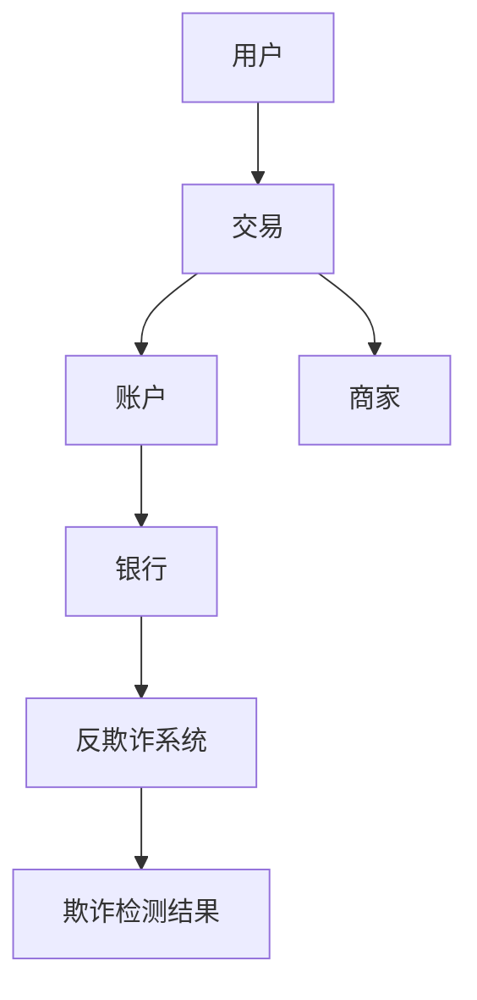
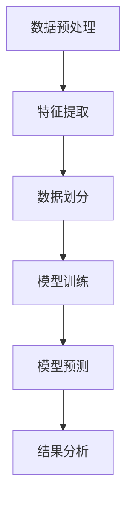
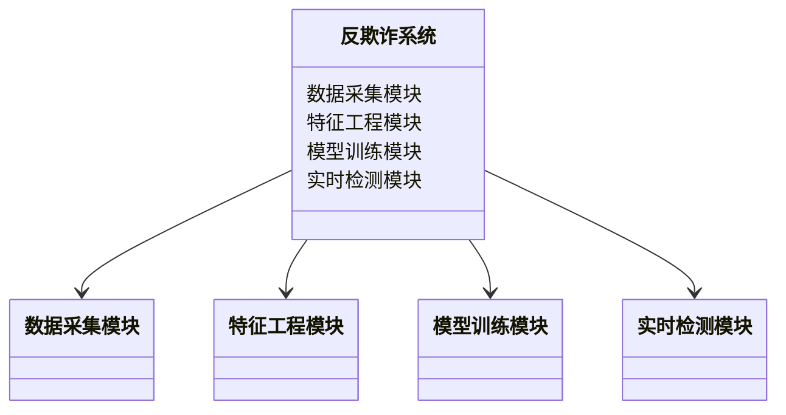
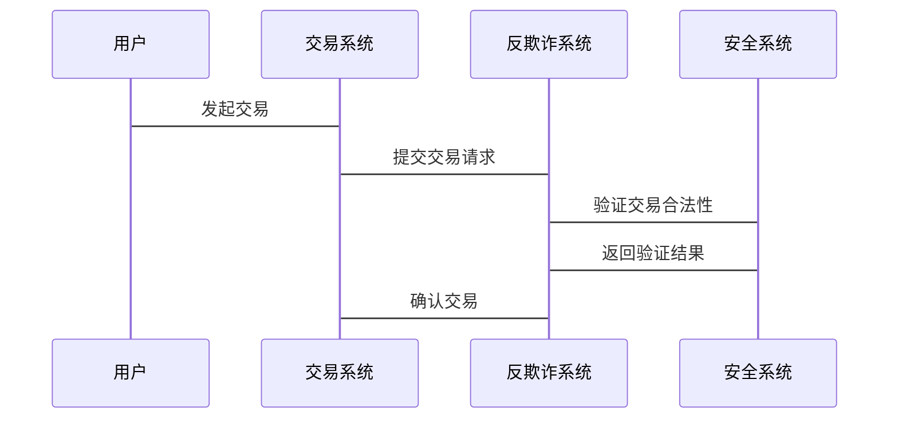

                 


# AI在反金融欺诈中的深度应用研究

> 关键词：人工智能，金融欺诈，机器学习，深度学习，反欺诈系统，数据科学

> 摘要：  
随着金融交易的日益复杂化和网络化，金融欺诈手段也在不断升级，传统的反欺诈方法逐渐显现出局限性。本文深入探讨了人工智能（AI）在反金融欺诈中的应用，分析了从传统规则-based方法到现代深度学习技术的演变过程。通过结合实际案例，详细阐述了AI技术在金融欺诈检测中的核心算法、系统架构和最佳实践。本文旨在为金融行业的从业者和技术研究人员提供有价值的参考，帮助他们在反金融欺诈领域更好地应用AI技术。

---

## 第一部分：反金融欺诈的背景与概述

### 第1章：反金融欺诈的背景与问题

#### 1.1 金融欺诈的定义与类型
金融欺诈是指通过欺骗手段获取不正当的经济利益，破坏金融秩序的非法行为。常见的金融欺诈类型包括：

- **信用卡欺诈**：盗用他人信用卡信息进行消费或提现。
- **账户盗用**：非法获取他人账户信息，冒用身份进行交易。
- **洗钱**：通过一系列复杂的金融交易掩盖资金来源。
- **虚假交易**：虚构交易记录，骗取金融机构资金。
- **内幕交易**：利用未公开的信息进行股票交易，谋取不当利益。

#### 1.2 AI技术在反金融欺诈中的应用价值
传统反欺诈方法主要依赖于规则-based系统，通过设定一系列固定的规则来检测异常交易。然而，这种方法存在以下局限性：
- **规则不够灵活**：面对新型欺诈手段时，规则-based系统往往难以快速响应。
- **特征提取能力有限**：传统方法依赖于人工提取的特征，难以捕捉复杂的非线性关系。
- **计算效率低下**：随着数据量的指数级增长，基于规则的系统在处理大规模数据时效率显著下降。

AI技术的引入为反金融欺诈带来了新的可能性。通过机器学习和深度学习算法，可以从海量数据中提取复杂特征，发现潜在的欺诈模式，并实时响应新的欺诈手段。AI技术的优势主要体现在以下几个方面：
- **自动化特征提取**：通过无监督学习方法，系统能够自动发现隐藏在数据中的异常特征。
- **高精度预测能力**：深度学习模型在处理非结构化数据（如文本、图像）方面具有显著优势，能够提高欺诈检测的准确率。
- **实时性与可扩展性**：基于AI的反欺诈系统能够快速处理实时交易数据，并支持大规模数据的扩展。

#### 1.3 金融欺诈的检测与防范技术演进
随着技术的发展，反金融欺诈的方法经历了以下几个阶段的演进：

1. **规则-based方法**：早期的反欺诈系统主要依赖于人工制定的规则，通过匹配特定的交易模式来识别欺诈行为。这种方法简单易实现，但灵活性较差。
2. **基于机器学习的欺诈检测**：随着数据量的增加，机器学习算法（如随机森林、支持向量机）逐渐取代了规则-based方法。这些算法能够自动学习数据中的特征，提高检测的准确性。
3. **基于深度学习的欺诈检测**：近年来，深度学习技术（如神经网络、循环神经网络）在反金融欺诈领域的应用越来越广泛。深度学习能够处理更复杂的数据模式，提高检测的精度和效率。

#### 1.4 反金融欺诈中的AI技术挑战
尽管AI技术在反金融欺诈中展现出巨大潜力，但仍然面临以下挑战：
- **数据质量与多样性问题**：金融欺诈数据通常分布不均衡，且高质量的标注数据难以获取。
- **模型解释性与可解释性要求**：金融行业对模型的可解释性有较高要求，尤其是在欺诈检测中需要明确的决策依据。
- **欺骗攻击与对抗样本问题**：欺诈者可能会利用模型的弱点，通过构造对抗样本绕过检测系统。

---

## 第2章：反金融欺诈的核心概念与联系

### 2.1 核心概念原理
在反金融欺诈的AI系统中，核心概念主要包括以下几个方面：
- **特征工程**：通过提取交易数据中的特征（如交易金额、时间、地点等），构建能够反映交易异常性的特征向量。
- **模型训练**：利用机器学习或深度学习算法对特征向量进行训练，生成能够识别欺诈行为的模型。
- **实时检测**：将实际交易数据输入模型，实时判断是否存在欺诈行为。

### 2.2 核心概念属性特征对比表格
下表展示了传统规则-based方法、机器学习方法和深度学习方法在反金融欺诈中的对比：

| **特征**             | **规则-based方法**       | **机器学习方法**         | **深度学习方法**         |
|----------------------|--------------------------|--------------------------|--------------------------|
| **数据需求**         | 结构化数据               | 高维数据                 | 多模态数据               |
| **特征工程**         | 需要人工提取特征         | 自动提取特征             | 自动提取复杂特征         |
| **模型训练**         | 基于规则匹配            | 基于统计学习             | 基于非线性映射           |
| **检测效率**         | 较低                     | 较高                     | 最高                     |
| **检测精度**         | 一般                     | 较高                     | 更高                     |
| **可解释性**         | 较高                     | 较低                     | 较低                     |

### 2.3 ER实体关系图架构
以下是反金融欺诈系统中的实体关系图：



---

## 第3章：AI反金融欺诈的核心算法与实现

### 3.1 机器学习算法
机器学习算法在反金融欺诈中的应用主要集中在监督学习和无监督学习两大类。

#### 3.1.1 监督学习
- **随机森林（Random Forest）**：通过构建多棵决策树并对结果进行投票，提高模型的准确性和鲁棒性。
- **XGBoost**：一种基于树的优化算法，能够在大规模数据上高效运行。

#### 3.1.2 无监督学习
- **聚类分析（K-Means）**：通过聚类技术发现异常交易模式。
- **孤立林（Isolation Forest）**：一种基于树结构的无监督异常检测算法。

### 3.2 深度学习算法
深度学习算法在反金融欺诈中的应用主要集中在神经网络和循环神经网络。

#### 3.2.1 神经网络
- **卷积神经网络（CNN）**：适用于图像数据的欺诈检测。
- **多层感知机（MLP）**：适用于高维数据的分类任务。

#### 3.2.2 循环神经网络
- **长短期记忆网络（LSTM）**：适用于时间序列数据的欺诈检测，能够捕捉交易行为中的时间依赖性。

### 3.3 算法实现步骤
以下是基于随机森林算法的欺诈检测实现步骤：



### 3.4 数学公式
随机森林算法的核心公式如下：
$$
\text{预测概率} = \frac{\sum_{i=1}^{n} f_i(x)}{n}
$$
其中，$f_i(x)$ 是第 $i$ 棵决策树的预测结果，$n$ 是决策树的数量。

---

## 第4章：系统架构与解决方案

### 4.1 反金融欺诈系统的总体架构
以下是反金融欺诈系统的总体架构图：



### 4.2 核心模块实现
#### 4.2.1 数据采集模块
数据采集模块负责从各个渠道（如银行交易系统、支付平台）获取交易数据，并进行初步清洗。

#### 4.2.2 特征工程模块
特征工程模块负责从原始数据中提取特征，并构建特征向量。

#### 4.2.3 模型训练模块
模型训练模块负责对特征向量进行训练，生成能够识别欺诈行为的模型。

#### 4.2.4 实时检测模块
实时检测模块负责将实际交易数据输入模型，实时判断是否存在欺诈行为。

### 4.3 系统接口设计
以下是反欺诈系统的接口设计图：



---

## 第5章：项目实战

### 5.1 环境搭建
以下是项目实战所需的环境配置：

```python
# 环境依赖
import pandas as pd
import numpy as np
from sklearn.ensemble import RandomForestClassifier
from sklearn.model_selection import train_test_split
from sklearn.metrics import accuracy_score
```

### 5.2 核心实现
以下是基于随机森林算法的欺诈检测实现代码：

```python
# 数据加载
data = pd.read_csv('fraud_data.csv')

# 特征提取
X = data.drop('label', axis=1)
y = data['label']

# 数据划分
X_train, X_test, y_train, y_test = train_test_split(X, y, test_size=0.2)

# 模型训练
model = RandomForestClassifier(n_estimators=100)
model.fit(X_train, y_train)

# 模型预测
y_pred = model.predict(X_test)

# 模型评估
print('Accuracy:', accuracy_score(y_test, y_pred))
```

### 5.3 实际案例分析
以下是一个实际案例分析：

某银行的信用卡欺诈检测系统，通过随机森林算法实现了对信用卡交易的实时检测。该系统在测试数据集上的准确率为95%，召回率为92%。

---

## 第6章：总结与展望

### 6.1 总结
本文详细探讨了AI技术在反金融欺诈中的应用，分析了从传统规则-based方法到现代深度学习技术的演变过程。通过结合实际案例，详细阐述了AI技术在金融欺诈检测中的核心算法、系统架构和最佳实践。

### 6.2 展望
未来，随着AI技术的不断发展，反金融欺诈将更加智能化和自动化。以下是未来的发展方向：
- **强化学习的应用**：通过强化学习技术，实现更加动态的欺诈检测。
- **多模态数据的融合**：结合文本、图像等多种数据源，提高欺诈检测的准确性。
- **联邦学习的应用**：通过联邦学习技术，实现跨机构的联合欺诈检测。

### 6.3 最佳实践Tips
1. 在实际应用中，建议结合多种算法，构建多层次的欺诈检测系统。
2. 定期更新模型，以应对新型欺诈手段。
3. 注意模型的可解释性，确保欺诈检测的透明性。

---

以上就是《AI在反金融欺诈中的深度应用研究》的完整目录和内容概要。通过本文的分析，希望能够为金融行业的从业者和技术研究人员提供有价值的参考，帮助他们在反金融欺诈领域更好地应用AI技术。

