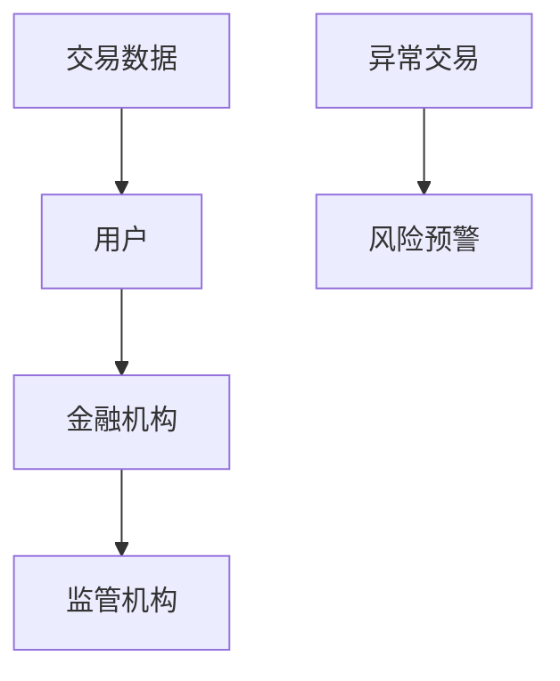
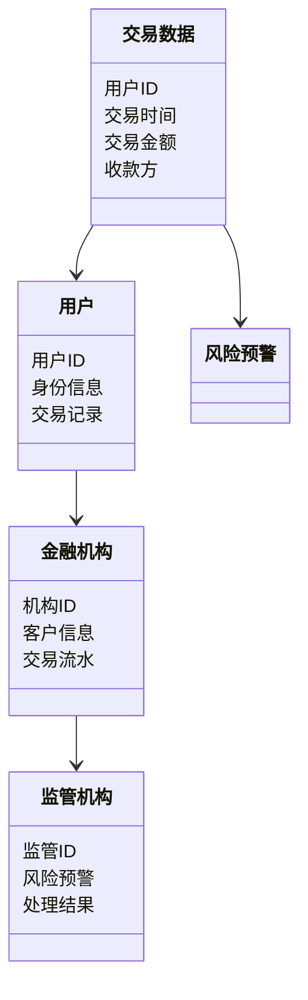
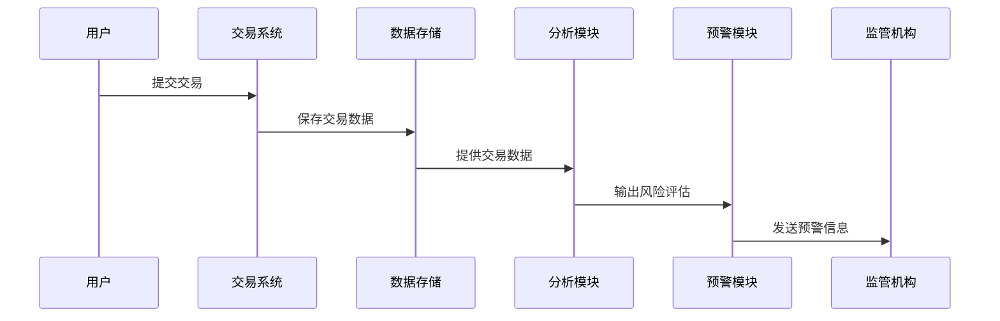

                 


# AI在反金融犯罪模式识别中的深度应用研究

> 关键词：人工智能，反金融犯罪，模式识别，深度学习，金融安全，异常检测，风险控制

> 摘要：本文深入探讨了人工智能技术在反金融犯罪模式识别中的应用，重点分析了深度学习算法在金融犯罪检测中的优势与挑战。通过构建金融交易数据的模式识别模型，结合系统架构设计与实际案例分析，本文旨在为金融安全领域的技术研究提供理论依据和实践指导。

---

# 第1章: AI与反金融犯罪概述

## 1.1 人工智能与金融犯罪的基本概念

### 1.1.1 人工智能的定义与技术特点
人工智能（AI）是指通过计算机模拟人类智能的技术，涵盖学习、推理、自适应等能力。其核心包括机器学习、深度学习、自然语言处理等技术。AI的优势在于数据处理能力强大，能够从海量数据中提取规律，发现潜在模式。

### 1.1.2 金融犯罪的定义与分类
金融犯罪是指通过欺骗、欺诈等手段，破坏金融秩序的行为。常见的金融犯罪包括洗钱、欺诈交易、内幕交易等。根据犯罪手段的不同，金融犯罪可以分为操作型犯罪（如虚假交易）、技术型犯罪（如网络攻击）和复合型犯罪（结合多种手段）。

### 1.1.3 AI在反金融犯罪中的应用背景
随着金融交易的数字化，金融犯罪手段日益复杂。传统的基于规则的检测方法逐渐失效，而AI技术能够通过数据分析发现异常模式，为反金融犯罪提供了新的技术手段。

---

## 1.2 反金融犯罪模式识别的核心问题

### 1.2.1 金融犯罪的模式识别问题
模式识别是指通过数据分析，识别特定模式的过程。在反金融犯罪中，模式识别的目标是通过分析交易数据、用户行为等，发现异常交易模式，从而识别潜在的金融犯罪行为。

### 1.2.2 深度学习在模式识别中的作用
深度学习能够从非结构化数据中提取高维特征，适用于金融交易数据的模式识别。其优势在于能够处理复杂的非线性关系，发现传统方法难以察觉的异常模式。

### 1.2.3 反金融犯罪的边界与外延
反金融犯罪模式识别的边界在于合法与非法交易的区分，其外延包括从单点检测到全局网络分析的多层次应用。

---

## 1.3 本章小结
本章介绍了人工智能与金融犯罪的基本概念，分析了反金融犯罪模式识别的核心问题，强调了深度学习在该领域的重要作用。

---

# 第2章: AI模式识别的核心概念与联系

## 2.1 模式识别的基本原理

### 2.1.1 模式识别的定义与核心要素
模式识别是通过数据特征提取和分类器训练，识别数据所属模式的过程。其核心要素包括数据采集、特征提取、模型训练和结果判别。

### 2.1.2 深度学习在模式识别中的优势
深度学习能够自动提取数据特征，适用于复杂模式识别任务。其优势体现在非线性特征提取和高维数据处理能力上。

### 2.1.3 模式识别的数学模型概述
模式识别涉及概率论、线性代数和优化理论等数学基础。其数学模型包括特征向量、分类函数和损失函数等。

---

## 2.2 深度学习与传统机器学习的对比分析

### 2.2.1 传统机器学习算法的特点
传统机器学习算法依赖人工特征提取，适用于数据量较小的任务。其特点包括规则明确、计算效率高，但对复杂数据的处理能力有限。

### 2.2.2 深度学习算法的特点
深度学习算法通过多层神经网络自动提取特征，适用于复杂数据处理。其特点是计算能力要求高、特征提取能力强，但需要大量数据支持。

### 2.2.3 深度学习与传统机器学习的对比表格
| 特性                | 传统机器学习          | 深度学习             |
|---------------------|-----------------------|----------------------|
| 数据需求           | 较小                  | 较大                 |
| 特征提取           | 人工提取              | 自动提取             |
| 计算能力           | 低                    | 高                   |
| 适用场景           | 简单任务              | 复杂任务             |

---

## 2.3 实体关系图与模式识别的关联

### 2.3.1 实体关系图（ER图）在模式识别中的应用
ER图用于描述系统中各实体之间的关系。在反金融犯罪模式识别中，实体关系图可以帮助理解交易数据的结构，发现潜在的异常模式。

### 2.3.2 模式识别的ER实体关系图示例


---

## 2.4 本章小结
本章分析了模式识别的基本原理，对比了深度学习与传统机器学习的特点，并通过ER图展示了模式识别在反金融犯罪中的应用。

---

# 第3章: 深度学习算法原理与数学模型

## 3.1 深度学习算法的基本原理

### 3.1.1 神经网络的基本结构
神经网络由输入层、隐藏层和输出层组成，通过多层网络结构模拟人脑的神经网络。

### 3.1.2 深度学习的训练过程
深度学习的训练过程包括数据预处理、模型构建、损失函数优化和模型验证等步骤。

### 3.1.3 深度学习的数学基础
深度学习涉及线性代数、概率论和优化理论等数学知识，其中矩阵运算和梯度下降是核心。

---

## 3.2 常见深度学习算法的实现原理

### 3.2.1 随机森林算法
随机森林是一种基于决策树的集成学习算法，通过随机采样和投票机制进行分类。

### 3.2.2 支持向量机（SVM）
SVM是一种监督学习算法，通过构建超平面实现数据分类。

### 3.2.3 卷积神经网络（CNN）
CNN是一种适用于图像识别的深度学习算法，通过卷积层和池化层提取特征。


---

## 3.3 数学模型与公式

### 3.3.1 神经网络的激活函数
激活函数用于引入非线性因素，常用激活函数包括sigmoid和ReLU。

$$f(x) = \sigma(x) = \frac{1}{1 + e^{-x}}$$

### 3.3.2 损失函数
损失函数用于衡量模型预测值与真实值的差异，常用损失函数包括交叉熵损失和均方误差。

$$L = -\frac{1}{N}\sum_{i=1}^{N} y_i \log p_i + (1 - y_i) \log (1 - p_i)$$

---

## 3.4 本章小结
本章详细介绍了深度学习算法的基本原理，分析了常见算法的实现原理，并通过公式和图表展示了数学模型。

---

# 第4章: 系统分析与架构设计

## 4.1 问题场景介绍
反金融犯罪模式识别系统的目标是通过分析交易数据，识别异常交易模式，预警金融犯罪行为。

## 4.2 系统功能设计

### 4.2.1 领域模型
领域模型描述了系统的主要实体及其关系。



---

## 4.3 系统架构设计

### 4.3.1 系统架构图
系统架构图展示了系统的各个模块及其交互关系。


---

## 4.4 系统接口设计
系统接口包括数据输入接口、模型训练接口和预警输出接口。

---

## 4.5 系统交互序列图



---

## 4.6 本章小结
本章通过系统分析与架构设计，明确了反金融犯罪模式识别系统的功能模块和交互流程。

---

# 第5章: 项目实战

## 5.1 环境安装
项目实战需要安装Python、TensorFlow和Scikit-learn等工具。

## 5.2 核心代码实现

### 5.2.1 数据预处理
```python
import pandas as pd
data = pd.read_csv('交易数据.csv')
data.dropna(inplace=True)
```

### 5.2.2 模型训练
```python
from tensorflow.keras import layers
model = layers.Sequential()
model.add(layers.Dense(64, activation='relu', input_shape=(input_dim,)))
model.add(layers.Dense(1, activation='sigmoid'))
model.compile(optimizer='adam', loss='binary_crossentropy', metrics=['accuracy'])
model.fit(X_train, y_train, epochs=10, batch_size=32)
```

### 5.2.3 模型评估
```python
loss, accuracy = model.evaluate(X_test, y_test)
print(f'Loss: {loss}, Accuracy: {accuracy}')
```

---

## 5.3 实际案例分析
通过分析某金融机构的交易数据，发现异常交易模式，生成风险预警。

---

## 5.4 本章小结
本章通过项目实战，展示了反金融犯罪模式识别系统的实现过程。

---

# 第6章: 总结与展望

## 6.1 本章总结
本文深入探讨了人工智能在反金融犯罪模式识别中的应用，分析了深度学习算法的优势与挑战。

## 6.2 未来展望
未来，随着AI技术的发展，反金融犯罪模式识别将更加智能化和精准化。

## 6.3 最佳实践 tips
- 数据质量是模型性能的关键，需重视数据清洗与特征工程。
- 模型部署需考虑实时性与可扩展性，推荐使用分布式架构。
- 风险控制需结合业务规则，实现模型与人工审核的有机结合。

---

# 附录

## 附录A: 相关术语解释
- 深度学习：一种人工智能技术，通过多层神经网络进行特征提取。
- 模式识别：通过数据分析，识别特定模式的过程。

## 附录B: 参考文献
- [1] LeCun Y, Bengio Y, Hinton G. Deep learning: An introduction to fundamentals[J]. Nature, 2015.
- [2] Bishop C M. Pattern recognition and machine learning[M]. Springer, 2006.

---

# 结语

通过本文的系统分析与实践，读者可以深入了解AI在反金融犯罪模式识别中的深度应用，并为实际应用提供参考。

