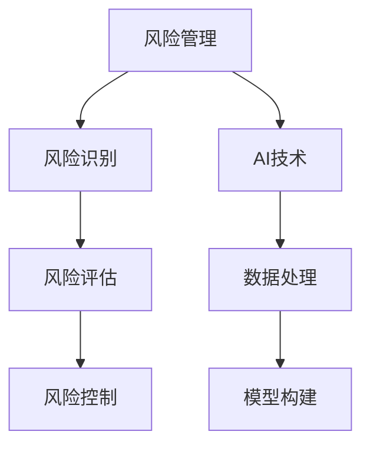
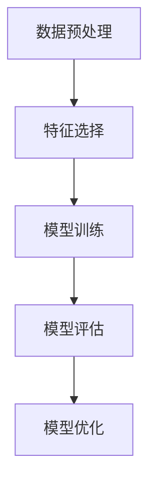
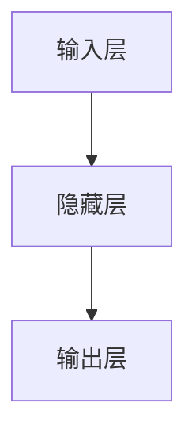
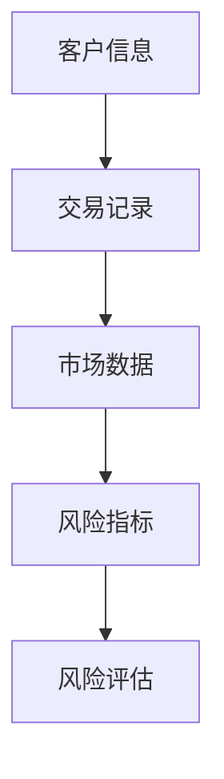
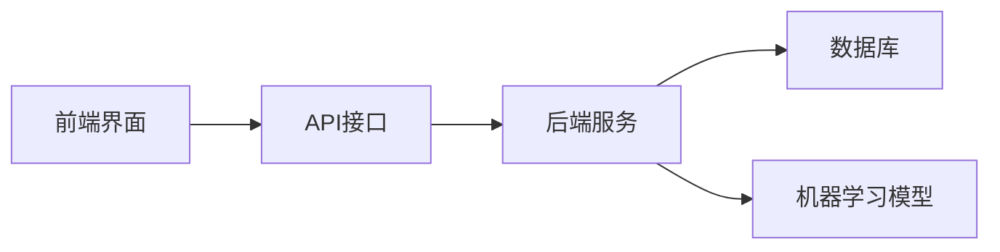

                 


# AI在商业银行风险管理中的应用

> 关键词：AI技术、风险管理、商业银行、机器学习、深度学习

> 摘要：随着人工智能技术的飞速发展，商业银行在风险管理领域面临着前所未有的机遇与挑战。本文将深入探讨AI技术在商业银行风险管理中的应用场景、技术原理以及实际案例，帮助读者全面理解AI如何提升风险管理的效率和准确性。

---

## 第一部分: AI在商业银行风险管理中的应用概述

### 第1章: 背景介绍

#### 1.1 问题背景

##### 1.1.1 商业银行风险管理的现状与挑战

商业银行作为金融体系的核心组成部分，承担着防范金融风险、保障客户资产安全的重要责任。然而，随着经济全球化和金融市场的复杂化，商业银行面临的风险类型和复杂性也在不断增加。传统的人工管理模式难以应对日益复杂的市场环境，尤其是在大数据时代，商业银行风险管理需要更加智能化、自动化和精准化。

##### 1.1.2 AI技术在金融领域的应用前景

人工智能（AI）技术的快速发展为商业银行风险管理带来了新的可能性。AI技术能够处理海量数据，发现潜在风险，并通过机器学习模型进行预测和评估。通过AI技术，商业银行可以实时监控市场动态，识别潜在风险，从而在风险发生前采取预防措施。

##### 1.1.3 AI在风险管理中的问题解决路径

AI技术在风险管理中的应用路径主要包括以下几个方面：
1. **数据收集与处理**：通过大数据技术收集市场、客户和交易数据。
2. **风险识别**：利用自然语言处理（NLP）和机器学习算法识别潜在风险。
3. **风险评估与预测**：通过深度学习模型预测风险的发生概率和影响程度。
4. **风险控制**：根据预测结果制定风险应对策略。

#### 1.2 问题描述

##### 1.2.1 风险管理的核心概念与目标

风险管理的核心目标是通过识别、评估和控制风险，降低潜在损失，确保商业银行的稳健运行。风险管理包括信用风险、市场风险、操作风险等多种类型，每种风险都有其独特的评估和管理方法。

##### 1.2.2 商业银行面临的典型风险类型

商业银行面临的主要风险类型包括：
1. **信用风险**：客户违约导致的损失。
2. **市场风险**：市场价格波动导致的损失。
3. **操作风险**：内部操作失误或欺诈行为导致的损失。
4. **流动性风险**：资产流动性不足导致的无法及时履行债务的风险。
5. **声誉风险**：声誉受损导致的客户流失和业务损失。

##### 1.2.3 AI在风险管理中的应用边界与外延

AI技术在风险管理中的应用边界主要集中在数据处理、风险识别和预测方面。然而，AI技术的应用也存在一定的局限性，例如模型的可解释性、数据的质量和完整性等。因此，在实际应用中，商业银行需要结合AI技术和传统的风险管理方法，形成互补和协同。

#### 1.3 核心概念与联系

##### 1.3.1 风险管理的核心要素组成

风险管理的核心要素包括：
1. **风险识别**：识别潜在风险。
2. **风险评估**：评估风险的影响程度和发生概率。
3. **风险控制**：制定和实施风险控制措施。
4. **风险监控**：实时监控风险变化，及时调整风险管理策略。

##### 1.3.2 AI技术在风险管理中的关键作用

AI技术在风险管理中的关键作用体现在以下几个方面：
1. **数据处理能力**：AI能够处理海量的结构化和非结构化数据，提取有价值的信息。
2. **风险识别能力**：通过机器学习算法，AI能够识别潜在风险，提前预警。
3. **风险预测能力**：利用深度学习模型，AI可以预测风险的发生概率和影响程度。
4. **自动化决策能力**：AI可以辅助制定风险控制策略，优化风险管理流程。

##### 1.3.3 核心概念原理与联系的 Mermaid 图



---

### 第2章: AI技术的核心概念与原理

#### 2.1 AI技术的基本原理

##### 2.1.1 机器学习算法的基本原理

机器学习是一种人工智能技术，通过数据训练模型，使其能够从数据中学习并做出预测。机器学习算法主要包括监督学习、无监督学习和强化学习。

- **监督学习**：通过标记数据训练模型，使其能够对新数据进行分类或回归预测。
- **无监督学习**：通过未标记数据训练模型，发现数据中的隐藏结构。
- **强化学习**：通过与环境交互，学习最优策略。

##### 2.1.2 深度学习算法的基本原理

深度学习是一种机器学习技术，通过多层神经网络模型学习数据的高层次特征。深度学习算法在图像识别、自然语言处理等领域表现出色。

##### 2.1.3 自然语言处理的基本原理

自然语言处理（NLP）是一种人工智能技术，用于理解和处理人类语言。NLP在风险预警中可以用于分析新闻、社交媒体等文本数据，提取潜在风险信息。

#### 2.2 AI技术在风险管理中的应用原理

##### 2.2.1 数据驱动的风险管理模型

数据驱动的风险管理模型通过收集和分析大量数据，构建风险评估模型。模型可以基于历史数据预测未来风险，帮助商业银行制定风险管理策略。

##### 2.2.2 AI算法在风险预测中的应用

AI算法在风险预测中的应用主要体现在信用评分模型、市场风险预测等方面。通过机器学习算法，AI能够从数据中学习风险特征，预测风险的发生概率。

##### 2.2.3 AI技术的风险评估与控制机制

AI技术的风险评估与控制机制包括以下几个步骤：
1. **数据收集与预处理**：收集相关数据并进行清洗和特征提取。
2. **模型训练**：利用机器学习算法训练风险评估模型。
3. **风险预测**：通过模型预测潜在风险。
4. **风险控制**：根据预测结果制定风险控制措施。

#### 2.3 核心概念属性特征对比表格

| 特性                | 传统风险管理       | AI驱动风险管理       |
|---------------------|------------------|--------------------|
| 数据来源            | 结构化数据为主     | 结构化+非结构化数据   |
| 分析速度            | 人工分析为主       | 自动化实时分析       |
| 模型复杂度          | 简单线性模型       | 复杂非线性模型       |
| 可扩展性            | 受限              | 高                  |
| 可解释性            | 高                | 较低（取决于模型）    |

---

## 第3章: AI技术在商业银行风险管理中的应用

### 3.1 信用风险管理中的AI应用

#### 3.1.1 信用风险的基本概念与传统方法

信用风险是指客户违约导致的损失。传统信用风险管理方法包括信用评分模型、违约概率模型等。

#### 3.1.2 AI在信用风险管理中的应用

AI技术在信用风险管理中的应用主要体现在以下几个方面：
1. **信用评分模型**：通过机器学习算法构建信用评分模型，评估客户的信用风险。
2. **违约预测模型**：利用深度学习算法预测客户违约概率。
3. **欺诈检测**：通过自然语言处理技术识别欺诈行为。

#### 3.1.3 应用案例分析

某商业银行通过AI技术构建信用评分模型，显著提高了信用风险的预测准确率。通过分析客户的还款记录、消费行为等数据，模型能够识别潜在的违约客户，提前采取风险控制措施。

### 3.2 市场风险管理中的AI应用

#### 3.2.1 市场风险的基本概念与传统方法

市场风险是指市场价格波动导致的损失。传统市场风险管理方法包括VaR（Value at Risk）模型、压力测试等。

#### 3.2.2 AI在市场风险管理中的应用

AI技术在市场风险管理中的应用主要体现在以下几个方面：
1. **市场趋势预测**：通过时间序列分析预测市场走势。
2. **风险因子识别**：利用无监督学习算法识别市场风险因子。
3. **实时监控**：通过实时数据分析监控市场风险变化。

#### 3.2.3 应用案例分析

某商业银行利用AI技术构建市场风险预警系统，通过实时监控市场价格波动，及时发现潜在风险。系统能够自动识别市场趋势变化，提前发出预警信号，帮助商业银行采取应对措施。

### 3.3 操作风险管理中的AI应用

#### 3.3.1 操作风险的基本概念与传统方法

操作风险是指由于内部操作失误或欺诈行为导致的损失。传统操作风险管理方法包括风险评估、内部控制等。

#### 3.3.2 AI在操作风险管理中的应用

AI技术在操作风险管理中的应用主要体现在以下几个方面：
1. **操作流程优化**：通过机器学习算法优化业务流程，减少操作风险。
2. **欺诈检测**：通过自然语言处理技术识别欺诈行为。
3. **风险事件分析**：利用深度学习算法分析历史风险事件，发现潜在风险点。

#### 3.3.3 应用案例分析

某商业银行通过AI技术构建操作风险预警系统，通过分析历史操作数据，识别潜在的操作风险点。系统能够自动发出预警信号，帮助商业银行及时采取风险控制措施，有效降低了操作风险。

---

## 第4章: AI技术在风险管理中的算法原理

### 4.1 机器学习算法在风险管理中的应用

#### 4.1.1 逻辑回归模型

逻辑回归是一种常用的分类算法，适用于二分类问题。在风险管理中，逻辑回归可以用于信用评分模型，预测客户违约概率。

##### 4.1.1.1 算法原理

逻辑回归模型的损失函数为对数损失函数，通过求解优化问题得到模型参数。

$$ \text{损失函数} = -\frac{1}{n} \sum_{i=1}^{n} [y_i \ln p_i + (1 - y_i) \ln (1 - p_i)] $$

其中，$p_i$ 是第i个样本的预测概率，$y_i$ 是标签。

##### 4.1.1.2 算法流程图



##### 4.1.1.3 Python代码实现

```python
import pandas as pd
from sklearn.linear_model import LogisticRegression
from sklearn.metrics import accuracy_score

# 数据加载与预处理
data = pd.read_csv('credit_data.csv')
X = data.drop('default', axis=1)
y = data['default']

# 模型训练
model = LogisticRegression()
model.fit(X, y)

# 模型预测
y_pred = model.predict(X)

# 模型评估
print("准确率:", accuracy_score(y, y_pred))
```

---

### 4.2 深度学习算法在风险管理中的应用

#### 4.2.1 神经网络模型

神经网络是一种常用的深度学习模型，适用于复杂数据的处理。在风险管理中，神经网络可以用于信用评分、市场风险预测等。

##### 4.2.1.1 算法原理

神经网络模型通过多层神经元模拟人脑神经网络，通过反向传播算法优化模型参数。

##### 4.2.1.2 算法流程图



##### 4.2.1.3 Python代码实现

```python
import numpy as np
import tensorflow as tf

# 数据加载与预处理
data = np.load('market_data.npy')
X = data[:, :-1]
y = data[:, -1]

# 模型构建
model = tf.keras.Sequential([
    tf.keras.layers.Dense(64, activation='relu'),
    tf.keras.layers.Dense(1, activation='sigmoid')
])

model.compile(optimizer='adam', loss='binary_crossentropy', metrics=['accuracy'])

# 模型训练
model.fit(X, y, epochs=10, batch_size=32)

# 模型预测
y_pred = model.predict(X)
```

---

## 第5章: AI技术在风险管理中的系统架构设计

### 5.1 问题场景介绍

商业银行风险管理系统的建设需要解决数据处理、风险预测、风险控制等多个问题。系统需要处理海量数据，实时监控市场动态，预测潜在风险。

### 5.2 系统功能设计

#### 5.2.1 领域模型



#### 5.2.2 系统架构设计



#### 5.2.3 系统接口设计

系统接口设计包括数据接口、模型接口和用户接口。数据接口用于与外部数据源交互，模型接口用于调用机器学习模型，用户接口用于与用户交互。

#### 5.2.4 系统交互流程图


---

## 第6章: 项目实战

### 6.1 环境安装与配置

安装Python、TensorFlow、Pandas等依赖库，配置开发环境。

### 6.2 核心代码实现

#### 6.2.1 数据预处理

```python
import pandas as pd

data = pd.read_csv('credit_data.csv')
X = data.drop('default', axis=1)
y = data['default']
```

#### 6.2.2 模型训练

```python
from sklearn.linear_model import LogisticRegression

model = LogisticRegression()
model.fit(X, y)
```

#### 6.2.3 模型预测与评估

```python
from sklearn.metrics import accuracy_score

y_pred = model.predict(X)
print("准确率:", accuracy_score(y, y_pred))
```

### 6.3 代码解读与分析

代码主要用于数据加载、模型训练和预测评估。通过逻辑回归模型进行信用评分预测，评估模型的准确率。

### 6.4 案例分析与总结

通过实际案例分析，验证AI技术在风险管理中的应用效果，总结经验教训，提出改进建议。

---

## 第7章: 最佳实践与展望

### 7.1 最佳实践

在实际应用中，商业银行需要结合AI技术和传统风险管理方法，形成互补和协同。同时，需要注意数据质量和模型的可解释性。

### 7.2 小结

本文系统介绍了AI技术在商业银行风险管理中的应用场景、技术原理和实际案例，展示了AI技术在风险管理中的巨大潜力。

### 7.3 注意事项

在实际应用中，需要注意数据隐私保护、模型的可解释性和算法的鲁棒性。

### 7.4 拓展阅读

建议读者进一步学习机器学习、深度学习和自然语言处理的相关知识，深入了解AI技术在风险管理中的具体应用。

---

## 参考文献

（此处列出相关文献和资料）

---

通过以上结构，您可以撰写一篇详细的技术博客文章，涵盖AI在商业银行风险管理中的各个方面，帮助读者深入了解这一领域的最新进展和实际应用。

