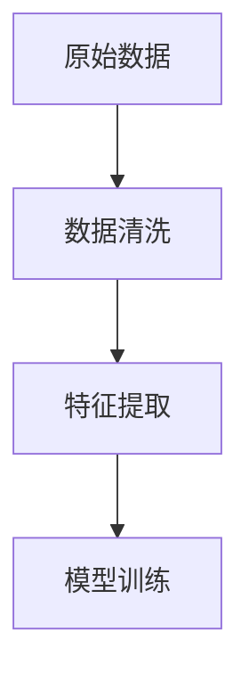

                 

# AI在资产管理绩效归因中的应用

## 关键词：人工智能、绩效归因、资产管理、机器学习、算法优化

## 摘要：
本文详细探讨了人工智能在资产管理绩效归因中的应用，从基本概念到核心算法，再到系统设计和项目实战，全面分析了AI如何提升绩效归因的效率和准确性。文章结合数学公式、算法流程图和实际案例，深入剖析了AI在资产管理中的潜力和应用前景。

---

# 第一部分: 资产管理与绩效归因基础

## 第1章: 绩效归因的基本概念

### 1.1 绩效归因的定义与背景
#### 1.1.1 资产管理的基本概念
资产管理是指通过投资、管理资产组合以实现资产增值的过程。其核心目标是通过科学的投资策略和风险控制，为投资者创造超额收益。

#### 1.1.2 绩效归因的定义与重要性
绩效归因是指将投资组合的收益分解为各个因素（如市场风险、选股能力、行业选择等）贡献的过程。它帮助投资者理解收益的来源，从而优化投资策略。

#### 1.1.3 绩效归因的边界与外延
绩效归因的边界包括时间范围、资产类别和市场环境等。其外延涉及风险调整后的收益、超额收益和风格暴露等。

### 1.2 绩效归因的核心要素
#### 1.2.1 绩效归因的主体与客体
主体是投资者或投资机构，客体是投资组合的收益。

#### 1.2.2 绩效归因的指标体系
包括夏普比率、特雷纳比率、最大回撤等指标。

#### 1.2.3 绩效归因的实现方法
包括因子分解法、回归分析法和情景分析法。

### 1.3 AI技术的基本概念
#### 1.3.1 人工智能的定义与特点
人工智能是模拟人类智能的技术，具有学习、推理和自适应等特点。

#### 1.3.2 机器学习的核心原理
机器学习通过数据训练模型，实现对未知数据的预测和分类。

#### 1.3.3 深度学习的基本概念
深度学习是机器学习的一种，通过多层神经网络提取数据特征。

### 1.4 绩效归因与AI的结合背景
#### 1.4.1 传统绩效归因方法的局限性
传统方法依赖人工经验，难以处理复杂数据和高维问题。

#### 1.4.2 AI技术在金融领域的应用前景
AI技术在金融领域的应用包括量化交易、风险管理和智能投顾。

#### 1.4.3 绩效归因AI化的必要性与可行性
AI技术能够提高绩效归因的效率和准确性，是未来的重要发展方向。

### 1.5 本章小结
本章介绍了绩效归因的基本概念、核心要素和AI技术的基本原理，为后续内容奠定了基础。

---

# 第二部分: AI在绩效归因中的核心概念与原理

## 第2章: 绩效归因的AI技术基础

### 2.1 绩效归因的AI技术框架
#### 2.1.1 数据驱动的绩效归因
基于历史数据，利用AI算法分析收益来源。

#### 2.1.2 模型驱动的绩效归因
通过构建数学模型，分解收益来源。

#### 2.1.3 综合驱动的绩效归因
结合数据和模型，实现更准确的归因分析。

### 2.2 AI在绩效归因中的核心算法
#### 2.2.1 回归分析与因子分解
回归分析用于确定因子对收益的贡献，因子分解用于提取关键因子。

#### 2.2.2 聚类分析与风险分组
聚类分析用于将资产分成不同的风险类别。

#### 2.2.3 时间序列分析与预测
时间序列分析用于预测未来的收益趋势。

### 2.3 绩效归因的AI模型构建
#### 2.3.1 数据预处理与特征提取
数据清洗、标准化和特征选择是关键步骤。

#### 2.3.2 模型训练与优化
通过交叉验证和超参数调整优化模型性能。

#### 2.3.3 模型验证与评估
使用测试数据评估模型的准确性和稳定性。

### 2.4 本章小结
本章详细介绍了AI技术在绩效归因中的核心算法和模型构建方法，为后续实现提供了理论基础。

---

# 第三部分: 绩效归因的AI算法实现

## 第3章: 绩效归因的数学模型与公式

### 3.1 绩效归因的数学模型
#### 3.1.1 绩效归因的基本公式
$$ R_i = \alpha + \beta R_m + \epsilon $$
其中，\( R_i \) 是资产收益，\( R_m \) 是市场收益，\( \beta \) 是beta系数，\( \epsilon \) 是误差项。

#### 3.1.2 多因子模型的构建
$$ R_i = \sum_{k=1}^n \beta_k F_k + \epsilon $$
其中，\( F_k \) 是第k个因子，\( \beta_k \) 是对应的因子暴露。

### 3.2 AI算法的数学基础
#### 3.2.1 线性回归的数学公式
$$ y = \theta x + \beta $$
其中，\( \theta \) 是回归系数，\( \beta \) 是截距。

#### 3.2.2 逻辑回归的数学公式
$$ P(y=1|x) = \frac{1}{1 + e^{-\theta x}} $$
其中，\( \theta \) 是回归系数。

#### 3.2.3 神经网络的数学基础
$$ y = \sigma(W x + b) $$
其中，\( W \) 是权重矩阵，\( b \) 是偏置，\( \sigma \) 是激活函数。

### 3.3 绩效归因的算法流程
#### 3.3.1 数据预处理流程图

---

通过以上内容，我们详细分析了AI在资产管理绩效归因中的应用，从理论到实践，为读者提供了全面的视角。

