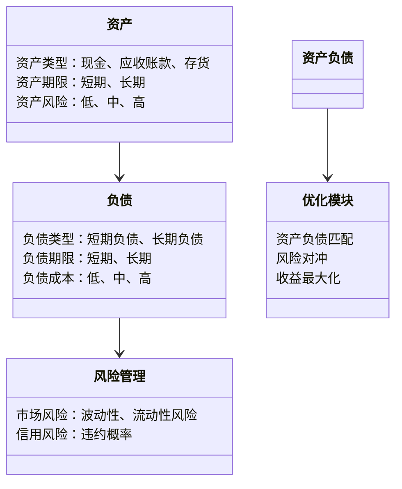
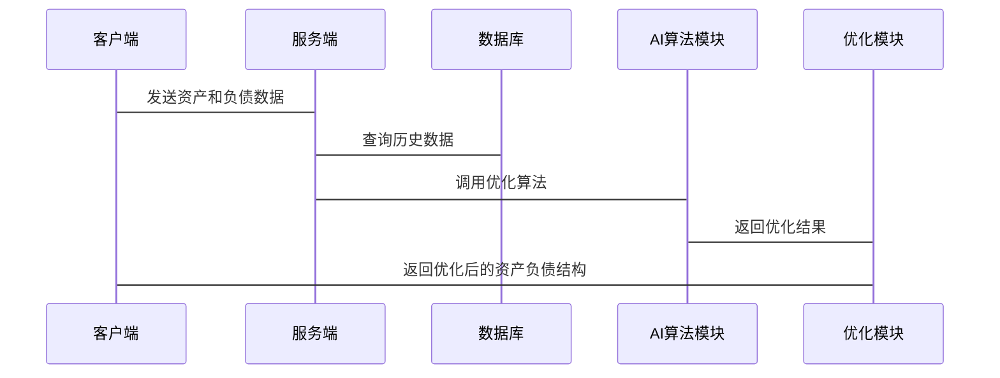

                 


# AI在资产负债管理优化中的应用

---

## 关键词：人工智能、资产负债管理、机器学习、深度学习、金融优化、风险管理

---

## 摘要：  
本文探讨了人工智能（AI）在资产负债管理优化中的应用。通过分析传统资产负债管理的局限性，结合AI技术的特点，提出了一种基于机器学习和深度学习的优化方法。文章详细介绍了AI在资产负债管理中的核心概念、算法原理、系统架构设计以及实际案例，展示了AI如何提升资产负债管理的效率和准确性。通过本文，读者可以深入了解AI在金融领域的潜力和实际应用价值。

---

# 第一部分：AI在资产负债管理中的背景与概念

# 第1章：AI与资产负债管理概述

## 1.1 资产负债管理的基本概念

### 1.1.1 资产负债管理的定义

资产负债管理是企业或金融机构对资产和负债的组合、结构和风险进行管理和优化的过程，旨在实现资产与负债在期限、流动性、风险和收益等方面的匹配，以达到企业价值最大化的目标。

### 1.1.2 资产负债管理的核心目标

1. **风险控制**：通过优化资产负债结构，降低流动性风险、信用风险和市场风险。
2. **收益最大化**：在风险可控的前提下，实现资产回报的最大化。
3. **战略匹配**：确保资产负债结构与企业战略目标一致。

### 1.1.3 资产负债管理的边界与外延

- **边界**：主要关注资产和负债的期限结构、流动性管理和风险控制。
- **外延**：涉及资金调度、投资决策、资本结构优化等更广泛的财务管理领域。

## 1.2 AI技术的基本概念

### 1.2.1 人工智能的定义与特点

人工智能（AI）是指通过计算机技术模拟人类智能的技术，具有学习、推理、自我优化等特点。

### 1.2.2 机器学习与深度学习的区别

1. **机器学习**：通过数据训练模型，预测新数据的模式和关系。
2. **深度学习**：基于人工神经网络的机器学习方法，能够处理复杂的非线性关系。

### 1.2.3 AI在金融领域的应用现状

- **信用评分**：利用机器学习算法评估客户的信用风险。
- **股票预测**：通过深度学习模型预测股票价格走势。
- **欺诈检测**：利用AI技术识别交易中的异常行为。

## 1.3 AI与资产负债管理的结合背景

### 1.3.1 传统资产负债管理的局限性

1. **数据处理能力有限**：传统方法难以处理海量数据。
2. **决策效率低**：依赖人工经验，决策速度较慢。
3. **风险预测能力不足**：难以准确预测市场波动和风险事件。

### 1.3.2 AI技术如何解决资产负债管理中的问题

- **数据处理能力**：AI能够高效处理和分析海量数据，提供更精准的决策支持。
- **决策效率**：AI算法可以在短时间内完成复杂的优化计算。
- **风险预测能力**：AI技术能够通过历史数据预测未来的市场风险。

### 1.3.3 AI在资产负债管理中的潜在价值

1. **提高决策效率**：通过自动化分析和优化，缩短决策时间。
2. **增强风险控制能力**：利用AI技术预测和管理各种风险。
3. **实现智能化管理**：通过智能系统实时监控和调整资产负债结构。

## 1.4 本章小结

本章介绍了资产负债管理的基本概念、核心目标以及AI技术的基本特点。通过分析传统资产负债管理的局限性和AI技术的优势，提出了将AI应用于资产负债管理的必要性和潜在价值。

---

# 第二部分：AI在资产负债管理中的核心概念与联系

# 第2章：AI与资产负债管理的核心概念

## 2.1 资产负债管理的核心要素

### 2.1.1 资产与负债的分类

1. **资产**：包括现金、应收账款、存货、投资等。
2. **负债**：包括短期负债、长期负债、应付账款、债券等。

### 2.1.2 资产负债的期限结构

- **短期资产**：如现金、应收账款。
- **长期资产**：如固定资产、投资。
- **短期负债**：如应付账款、短期贷款。
- **长期负债**：如债券、长期贷款。

### 2.1.3 资产负债的流动性与风险

- **流动性**：资产和负债的变现能力和债务偿还能力。
- **风险**：包括市场风险、流动性风险和信用风险。

## 2.2 AI在资产负债管理中的应用领域

### 2.2.1 资产负债组合优化

- **资产配置**：通过AI算法优化资产组合，提高收益和降低风险。
- **负债管理**：通过AI技术预测负债需求，优化负债结构。

### 2.2.2 风险管理与控制

- **风险预测**：利用AI技术预测市场风险、信用风险等。
- **风险对冲**：通过AI算法寻找最优的风险对冲策略。

### 2.2.3 资产负债匹配管理

- **期限匹配**：通过AI技术匹配资产和负债的期限结构。
- **流动性匹配**：通过AI算法优化资产和负债的流动性匹配。

## 2.3 AI与资产负债管理的核心联系

### 2.3.1 数据驱动的资产负债管理

- **数据来源**：包括市场数据、历史数据、实时数据等。
- **数据分析**：通过AI技术对数据进行清洗、建模和分析。

### 2.3.2 AI算法在资产负债优化中的应用

- **机器学习**：用于风险预测和资产配置。
- **深度学习**：用于处理复杂的非线性关系。

### 2.3.3 资产负债管理的智能化转型

- **智能化决策**：通过AI技术实现自动化决策。
- **实时监控**：通过AI系统实时监控资产负债结构。

## 2.4 资产负债管理与AI的对比分析

### 2.4.1 传统资产负债管理的特点

- **依赖经验**：主要依赖人工经验和规则。
- **决策效率低**：需要大量人工计算和分析。

### 2.4.2 AI驱动的资产负债管理的特点

- **数据驱动**：依赖大数据分析和机器学习模型。
- **决策效率高**：通过自动化算法快速完成优化。
- **实时性强**：能够实时监控和调整资产负债结构。

## 2.5 本章小结

本章分析了资产负债管理的核心要素和AI技术在其中的应用领域，探讨了AI与资产负债管理的核心联系，并通过对比分析突出了AI驱动的资产负债管理的优势。

---

# 第三部分：AI在资产负债管理中的算法原理与数学模型

# 第3章：常见AI算法在资产负债管理中的应用

## 3.1 机器学习算法

### 3.1.1 线性回归

- **定义**：一种统计学方法，用于建立因变量和自变量之间的线性关系。
- **公式**：$$ y = \beta_0 + \beta_1x + \epsilon $$
- **应用**：用于预测资产回报率和负债需求。

### 3.1.2 支持向量机（SVM）

- **定义**：一种监督学习算法，用于分类和回归。
- **优点**：适用于高维数据和小样本数据。
- **应用**：用于信用评分和市场风险预测。

### 3.1.3 随机森林

- **定义**：一种基于决策树的集成学习算法。
- **优点**：具有较强的抗过拟合能力和鲁棒性。
- **应用**：用于资产配置和风险评估。

## 3.2 深度学习算法

### 3.2.1 神经网络

- **定义**：一种模拟人脑神经网络的算法。
- **优点**：能够处理复杂的非线性关系。
- **应用**：用于股票价格预测和市场趋势分析。

### 3.2.2 长短期记忆网络（LSTM）

- **定义**：一种时间序列模型，能够记忆长期信息。
- **优点**：适用于时间序列数据。
- **应用**：用于预测资产价格波动和风险事件。

### 3.2.3 图神经网络

- **定义**：一种基于图结构的深度学习算法。
- **优点**：能够处理复杂的网络关系。
- **应用**：用于信用网络分析和风险传播预测。

## 3.3 算法选择与优化

### 3.3.1 算法选择的依据

1. **数据类型**：根据数据类型选择适合的算法。
2. **问题复杂性**：根据问题复杂性选择算法。
3. **计算资源**：根据计算资源选择算法。

### 3.3.2 算法优化的方法

1. **参数调优**：通过网格搜索和随机搜索优化模型参数。
2. **特征选择**：通过特征重要性分析选择关键特征。
3. **模型集成**：通过集成学习方法提高模型性能。

## 3.4 本章小结

本章介绍了几种常用的AI算法，包括机器学习算法和深度学习算法，并探讨了算法选择与优化的方法，为实际应用提供了理论基础。

---

# 第四部分：AI在资产负债管理中的系统架构设计

# 第4章：系统分析与架构设计

## 4.1 问题场景介绍

- **目标**：优化资产负债结构，降低风险，提高收益。
- **挑战**：数据量大、关系复杂、决策时间要求高。

## 4.2 项目介绍

- **项目名称**：基于AI的资产负债管理优化系统。
- **项目目标**：通过AI技术实现资产负债的智能化管理。

## 4.3 系统功能设计

### 4.3.1 领域模型设计



### 4.3.2 系统架构设计


### 4.3.3 系统接口设计

- **输入接口**：接收资产和负债数据。
- **输出接口**：输出优化后的资产负债结构。
- **API接口**：提供给前端和后端的交互接口。

### 4.3.4 系统交互设计



## 4.4 本章小结

本章通过系统分析和架构设计，展示了基于AI的资产负债管理优化系统的整体结构和功能模块，为后续的实现提供了框架支持。

---

# 第五部分：AI在资产负债管理中的项目实战

# 第5章：项目实战

## 5.1 环境安装

### 5.1.1 安装Python

- **命令**：`python --version`
- **说明**：确保Python版本在3.6以上。

### 5.1.2 安装TensorFlow

- **命令**：`pip install tensorflow`
- **说明**：用于深度学习模型的训练和部署。

### 5.1.3 安装Scikit-learn

- **命令**：`pip install scikit-learn`
- **说明**：用于机器学习算法的实现。

## 5.2 系统核心实现源代码

### 5.2.1 线性回归模型实现

```python
import numpy as np
from sklearn.linear_model import LinearRegression

# 示例数据
X = np.array([[1], [2], [3], [4], [5]])
y = np.array([2, 4, 5, 4, 6])

# 训练模型
model = LinearRegression()
model.fit(X, y)

# 预测结果
print(model.predict(X))
```

### 5.2.2 LSTM模型实现

```python
import tensorflow as tf
from tensorflow.keras import layers

# 示例数据
X_train = ...  # 形状为 (batch_size, timesteps, features)
y_train = ...  # 形状为 (batch_size, output_dim)

# 模型定义
model = tf.keras.Sequential()
model.add(layers.LSTM(128, input_shape=(timesteps, features)))
model.add(layers.Dense(output_dim))
model.compile(loss='mean_squared_error', optimizer='adam')

# 训练模型
model.fit(X_train, y_train, epochs=10, batch_size=32)
```

## 5.3 代码应用解读与分析

### 5.3.1 线性回归模型解读

- **输入数据**：X为自变量，y为因变量。
- **训练过程**：通过最小二乘法找到最佳拟合直线。
- **预测结果**：根据拟合直线预测新数据的值。

### 5.3.2 LSTM模型解读

- **输入数据**：时间序列数据，形状为(batch_size, timesteps, features)。
- **模型结构**：包含一个LSTM层和一个全连接层。
- **训练过程**：通过反向传播算法优化模型参数。

## 5.4 实际案例分析

### 5.4.1 资产负债优化案例

- **案例背景**：某公司需要优化其资产和负债结构，降低市场风险。
- **数据准备**：收集资产和负债的历史数据，包括资产类型、负债类型、市场利率等。
- **模型训练**：使用历史数据训练机器学习模型。
- **优化结果**：输出优化后的资产负债结构，包括资产配置和负债管理策略。

## 5.5 项目小结

本章通过实际案例展示了AI在资产负债管理中的应用，详细介绍了项目环境的搭建和核心代码的实现，为读者提供了从理论到实践的完整指导。

---

# 第六部分：总结与展望

# 第6章：总结与展望

## 6.1 最佳实践 tips

1. **数据质量**：确保数据的准确性和完整性。
2. **算法选择**：根据具体问题选择合适的算法。
3. **模型评估**：通过交叉验证等方法评估模型性能。

## 6.2 本章小结

本文详细探讨了AI在资产负债管理中的应用，从背景介绍到核心概念，从算法原理到系统架构设计，再到实际案例分析，为读者提供了全面的知识体系。

## 6.3 注意事项

- **数据隐私**：注意保护用户数据隐私。
- **模型解释性**：确保模型的可解释性，便于实际应用。
- **持续优化**：定期更新模型，适应市场变化。

## 6.4 拓展阅读

- **推荐书籍**：《机器学习实战》、《深度学习入门》。
- **推荐论文**：关于AI在金融领域的最新研究。

---

# 结语

通过本文的学习，读者可以深入了解AI在资产负债管理中的应用，掌握相关算法和系统设计方法，并能够通过实际案例理解如何将AI技术应用于金融管理领域。未来，随着AI技术的不断发展，资产负债管理将更加智能化和高效化。

--- 

**注：以上内容仅为目录大纲，实际文章将包含每个章节的详细内容和代码实现。**

