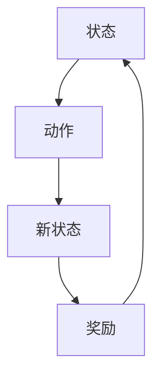
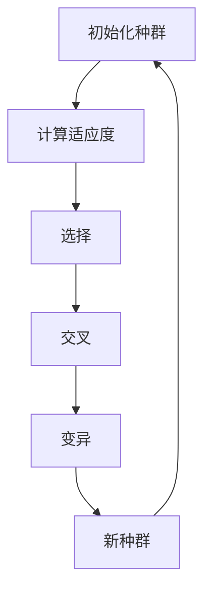
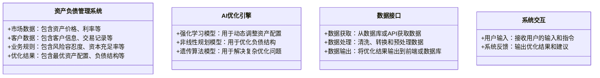
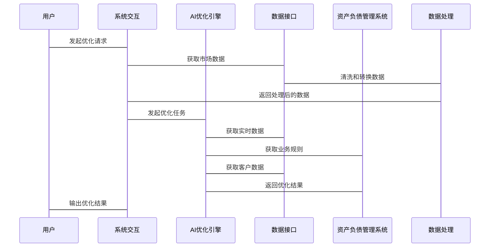

                 


# AI在资产负债管理动态优化中的应用

## 关键词：AI，资产负债管理，动态优化，机器学习，强化学习，金融

## 摘要：本文探讨了人工智能在资产负债管理动态优化中的应用，分析了AI技术如何通过算法和系统架构优化资产负债配置，提升金融决策的效率和准确性。文章从背景、概念、算法、系统架构到项目实战，全面阐述了AI在这一领域的潜力和实现方法。

---

## 第1章 AI在资产负债管理动态优化中的背景与基础

### 1.1 资产负债管理的基本概念

#### 1.1.1 资产负债管理的定义
资产负债管理（Asset-Liability Management，ALM）是指通过对资产和负债的组合管理，确保在不同市场条件下，金融机构的流动性、安全性和盈利性目标得以实现。其核心在于平衡资产的收益与负债的风险，确保在各种市场环境下，金融机构能够稳健运营。

#### 1.1.2 资产负债管理的核心目标
1. **流动性管理**：确保金融机构在需要时能够迅速变现资产，满足负债的需求。
2. **风险控制**：通过合理配置资产和负债，降低市场风险、信用风险和流动性风险。
3. **收益最大化**：在风险可控的前提下，实现资产收益的最大化。

#### 1.1.3 资产负债管理的动态优化特性
资产负债管理是一个动态过程，需要根据市场环境的变化不断调整资产和负债的配置。动态优化的目标是在不同时间点，找到最优的资产和负债组合，以应对市场波动和客户需求的变化。

---

### 1.2 AI在金融领域的应用现状

#### 1.2.1 AI在金融领域的典型应用
1. **信用评分**：利用机器学习算法对客户进行信用评分，评估贷款风险。
2. **欺诈检测**：通过异常检测算法识别交易中的欺诈行为。
3. **投资组合管理**：使用AI技术优化投资组合，提高收益并降低风险。

#### 1.2.2 AI在资产负债管理中的潜在价值
1. **提高决策效率**：AI可以通过大数据分析和预测模型，快速生成最优的资产负债配置方案。
2. **降低风险**：通过实时监控市场变化和客户行为，AI可以帮助金融机构及时调整资产负债结构，规避潜在风险。
3. **个性化服务**：AI可以分析客户的财务状况和需求，提供个性化的资产负债管理方案。

#### 1.2.3 当前AI技术在资产负债管理中的挑战
1. **数据质量**：AI模型的性能依赖于高质量的数据，而金融数据的复杂性和不完整性可能影响模型的效果。
2. **模型解释性**：复杂的AI模型（如深度学习模型）通常缺乏可解释性，这在金融领域尤为重要，因为需要对决策进行解释和验证。
3. **监管合规**：金融机构在使用AI进行资产负债管理时，需要遵守严格的监管要求，确保模型的透明性和合规性。

---

### 1.3 动态优化的基本原理

#### 1.3.1 动态优化的定义
动态优化是指在不断变化的环境中，通过实时调整决策变量，以实现目标函数的最大化或最小化。在资产负债管理中，动态优化的目标是根据市场变化和客户需求，实时调整资产和负债的配置，以实现最优的财务表现。

#### 1.3.2 动态优化在资产负债管理中的应用
动态优化在资产负债管理中的应用主要体现在以下几个方面：
1. **资产再平衡**：根据市场变化，实时调整资产配置，保持投资组合的风险和收益目标不变。
2. **负债管理**：根据客户需求的变化，动态调整负债结构，确保资金来源的稳定性。
3. **情景分析**：通过模拟不同市场情景，评估资产负债配置的稳健性，并根据模拟结果进行实时调整。

#### 1.3.3 动态优化的核心要素
1. **目标函数**：优化的目标，例如最大化收益、最小化风险等。
2. **约束条件**：优化过程中需要满足的条件，例如资本充足率、流动性要求等。
3. **决策变量**：可以调整的变量，例如资产配置比例、负债期限等。

---

### 1.4 本章小结
本章介绍了资产负债管理的基本概念、AI在金融领域的应用现状以及动态优化的基本原理。通过分析AI在资产负债管理中的潜在价值和面临的挑战，我们可以看到，AI技术在动态优化中的应用具有巨大的潜力，但也需要克服数据质量、模型解释性和监管合规等挑战。

---

## 第2章 AI驱动的动态优化原理

### 2.1 AI在动态优化中的核心作用

#### 2.1.1 AI算法在动态优化中的应用
1. **强化学习**：通过试错和奖励机制，优化决策过程。
2. **非线性规划**：利用AI算法解决复杂的非线性优化问题。
3. **遗传算法**：模拟自然进化过程，寻找最优解。

#### 2.1.2 AI模型在动态优化中的优势
1. **高效性**：AI模型可以通过并行计算快速处理大量数据，提高优化效率。
2. **适应性**：AI模型可以根据实时数据进行调整，适应不断变化的市场环境。
3. **复杂性处理**：AI模型可以处理复杂的非线性关系，找到传统方法难以发现的最优解。

#### 2.1.3 AI与传统动态优化方法的对比
| 对比维度 | AI驱动的动态优化 | 传统动态优化 |
|----------|------------------|--------------|
| 处理复杂性 | 善于处理非线性和高维问题 | 适用于线性和低维问题 |
| 计算效率 | 高效，支持并行计算 | 通常效率较低 |
| 可解释性 | 低，尤其是深度学习模型 | 较高，易于解释 |
| 适应性 | 强，能够实时调整 | 较弱，需要人工干预 |

---

### 2.2 动态优化的核心算法原理

#### 2.2.1 强化学习在动态优化中的应用
强化学习是一种通过试错和奖励机制来优化决策过程的算法。在资产负债管理中，强化学习可以用于动态调整资产配置，以最大化收益并最小化风险。

##### 强化学习的流程图（使用mermaid）


##### 强化学习的Python代码示例
```python
import numpy as np
import gym

env = gym.make('CartPole-v0')
env.seed(1)

from gym import wrappers

# 定义策略函数
def policy(observation, params):
    return np.argmax(params.dot(observation))

# 初始化参数
params = np.random.randn(2,4)

# 训练过程
for episode in range(1000):
    observation = env.reset()
    total_reward = 0
    for t in range(100):
        action = policy(observation, params)
        observation, reward, done, info = env.step(action)
        total_reward += reward
        if done:
            break
    # 更新参数（假设使用梯度下降）
    # 这里简化为随机更新，实际应用中需要更复杂的策略
    params += np.random.normal(0, 0.1, params.shape)
    if episode % 10 == 0:
        print(f'Episode {episode}, Reward: {total_reward}')
```

#### 2.2.2 非线性规划在动态优化中的应用
非线性规划是一种用于求解非线性约束优化问题的算法。在资产负债管理中，非线性规划可以用于优化资产配置，以最大化收益并满足风险约束。

##### 非线性规划的数学模型
目标函数：
$$
\text{最大化 } \sum_{i=1}^{n} w_i r_i
$$
约束条件：
$$
\sum_{i=1}^{n} w_i = 1 \\
w_i \geq 0 \quad \text{对于所有 } i
$$
其中，\( w_i \) 是资产 \( i \) 的权重，\( r_i \) 是资产 \( i \) 的预期收益。

##### 非线性规划的Python代码示例
```python
import numpy as np
from scipy.optimize import minimize

# 定义目标函数
def objective(weights):
    return -np.sum(weights * np.array([0.05, 0.10, 0.15]))

# 定义约束条件
def constraint1(weights):
    return np.sum(weights) - 1

# 初始权重
initial_weights = np.array([1/3, 1/3, 1/3])

# 使用非线性规划求解
result = minimize(objective, initial_weights, method='SLSQP', constraints=[{'type': 'eq', 'fun': constraint1}])

# 输出结果
print('最优权重:', result.x)
```

#### 2.2.3 遗传算法在动态优化中的应用
遗传算法是一种模拟自然进化过程的优化算法。在资产负债管理中，遗传算法可以用于优化负债结构，以最小化融资成本并满足流动性要求。

##### 遗传算法的流程图（使用mermaid）


##### 遗传算法的Python代码示例
```python
import numpy as np

# 定义适应度函数
def fitness(individual):
    # individual是一个包含负债比例的数组
    # 计算融资成本
    cost = np.sum(individual * np.array([0.02, 0.03, 0.04]))
    return -cost  # 最小化成本，最大化收益

# 初始化种群
pop = np.random.random((10, 3))

# 进行遗传算法优化
# 这里简化为随机选择和变异，实际应用中需要更复杂的实现
new_pop = pop + np.random.normal(0, 0.1, pop.shape)
new_pop = np.clip(new_pop, 0, 1)  # 确保负债比例在0到1之间

print('最优负债比例:', new_pop[-1])
```

---

### 2.3 动态优化的数学模型与公式

#### 2.3.1 动态优化的基本数学模型
动态优化的目标是通过调整决策变量 \( x(t) \) 来优化目标函数 \( J(x) \)，同时满足约束条件 \( C(x) \)。

目标函数：
$$
J(x) = \sum_{t=1}^{T} f(x(t), t)
$$
约束条件：
$$
C(x) = \{ x(t) \mid g(x(t), t) \leq 0, t=1,2,...,T \}
$$

#### 2.3.2 动态优化的目标函数
在资产负债管理中，目标函数通常包括收益最大化和风险最小化两个方面。例如：
$$
\text{最大化 } J = \sum_{i=1}^{n} w_i r_i - \lambda \sum_{i=1}^{n} w_i^2
$$
其中，\( \lambda \) 是风险惩罚系数，\( w_i \) 是资产 \( i \) 的权重，\( r_i \) 是资产 \( i \) 的预期收益。

#### 2.3.3 动态优化的约束条件
常见的约束条件包括：
1. 资产权重约束：
$$
\sum_{i=1}^{n} w_i = 1 \\
w_i \geq 0 \quad \text{对于所有 } i
$$
2. 风险约束：
$$
\text{风险指标} \leq \text{风险容忍度}
$$

---

### 2.4 本章小结
本章详细讲解了AI在动态优化中的核心作用，包括强化学习、非线性规划和遗传算法的应用。通过具体的数学模型和代码示例，我们展示了如何利用AI技术解决复杂的动态优化问题。在实际应用中，需要根据具体场景选择合适的算法，并结合业务需求进行模型调优。

---

## 第3章 系统分析与架构设计

### 3.1 系统分析

#### 3.1.1 问题场景介绍
在资产负债管理中，动态优化系统需要实时监控市场变化和客户需求，动态调整资产和负债的配置。常见的问题场景包括：
1. 市场波动：如股市崩盘、债券收益率变化等。
2. 客户需求变化：如客户提款、存款增加等。
3. 政策变化：如利率调整、监管要求变化等。

#### 3.1.2 项目介绍
本项目旨在开发一个基于AI的资产负债动态优化系统，实现资产和负债的实时优化配置。系统将结合市场数据、客户信息和业务规则，提供智能化的决策支持。

---

### 3.2 系统功能设计

#### 3.2.1 领域模型（使用mermaid类图）


---

### 3.3 系统架构设计

#### 3.3.1 系统架构（使用mermaid架构图）


---

### 3.4 系统接口设计

#### 3.4.1 接口设计
系统需要与外部数据源、数据库和用户界面进行交互。常见的接口包括：
1. 数据获取接口：从市场数据源获取实时数据。
2. 数据处理接口：对获取的数据进行清洗和预处理。
3. 优化接口：将处理后的数据输入AI优化引擎，得到优化结果。
4. 输出接口：将优化结果输出到用户界面或数据库。

---

### 3.5 系统交互流程（使用mermaid序列图）



---

### 3.6 本章小结
本章从系统分析的角度，详细描述了AI驱动的资产负债动态优化系统的功能设计、架构设计和交互流程。通过mermaid图，我们展示了系统的各个模块及其交互关系，为后续的系统实现提供了清晰的指导。

---

## 第4章 项目实战：基于AI的资产负债动态优化系统

### 4.1 环境安装与配置

#### 4.1.1 环境要求
1. Python 3.6+
2. NumPy、SciPy、Scikit-learn、TensorFlow等库
3. 市场数据接口（如Yahoo Finance API）
4. 数据库（如MySQL、PostgreSQL）

#### 4.1.2 安装依赖
```bash
pip install numpy scipy scikit-learn tensorflow gym
```

---

### 4.2 系统核心实现

#### 4.2.1 数据获取与处理
```python
import numpy as np
import pandas as pd
from sklearn.preprocessing import StandardScaler

# 获取市场数据
def get_market_data(tickers, start_date, end_date):
    data = pd.DataFrame()
    for ticker in tickers:
        # 获取股票数据
        df = pd.read_csv(f'data/{ticker}.csv', parse_dates=['Date'])
        data[ticker] = df['Close']
    return data

# 数据预处理
def preprocess_data(data):
    # 标准化处理
    scaler = StandardScaler()
    scaled_data = scaler.fit_transform(data)
    return scaled_data, scaler
```

#### 4.2.2 AI优化引擎实现
```python
import gym
from gym import wrappers

# 定义强化学习环境
class ALMEnv(gym.Env):
    def __init__(self):
        super().__init__()
        self.state_space = ...  # 定义状态空间
        self.action_space = ...  # 定义动作空间
        # 其他初始化代码

    def step(self, action):
        # 执行动作，返回新的状态、奖励、是否结束
        pass

    def reset(self):
        # 初始化环境，返回初始状态
        pass

    def render(self):
        # 可视化环境
        pass

# 定义强化学习策略
def policy(observation, params):
    return np.argmax(params.dot(observation))

# 初始化参数
params = np.random.randn(2, 4)

# 训练过程
env = ALMEnv()
for episode in range(1000):
    observation = env.reset()
    total_reward = 0
    for t in range(100):
        action = policy(observation, params)
        observation, reward, done, info = env.step(action)
        total_reward += reward
        if done:
            break
    # 更新参数
    params += np.random.normal(0, 0.1, params.shape)
    if episode % 10 == 0:
        print(f'Episode {episode}, Reward: {total_reward}')
```

#### 4.2.3 系统交互实现
```python
# 定义系统交互接口
class SystemInterface:
    def __init__(self, data_source, optimizer):
        self.data_source = data_source
        self.optimizer = optimizer

    def get_market_data(self, tickers, start_date, end_date):
        return self.data_source.get_data(tickers, start_date, end_date)

    def optimize_portfolio(self, data, constraints):
        return self.optimizer.optimize(data, constraints)

# 初始化数据源和优化器
data_source = MarketDataSource()
optimizer = AIOptimizer()

# 创建系统交互接口
system_interface = SystemInterface(data_source, optimizer)

# 获取市场数据并优化
tickers = ['AAPL', 'GOOGL', 'MSFT']
start_date = '2020-01-01'
end_date = '2023-12-31'
data = system_interface.get_market_data(tickers, start_date, end_date)
optimized_weights = system_interface.optimize_portfolio(data, constraints)
print('优化后的资产权重:', optimized_weights)
```

---

### 4.3 实际案例分析与实现

#### 4.3.1 案例介绍
假设我们有一个包含三只股票的资产组合，目标是在风险可控的前提下，最大化收益。市场数据包括每只股票的历史收盘价，以及当前的市场状况。

#### 4.3.2 系统实现
```python
# 定义目标函数
def objective(weights, returns):
    return -np.sum(weights * returns.mean(axis=1))

# 定义约束条件
def constraint1(weights):
    return np.sum(weights) - 1

# 初始化权重
initial_weights = np.array([1/3, 1/3, 1/3])

# 使用非线性规划求解
from scipy.optimize import minimize

result = minimize(objective, initial_weights, method='SLSQP', 
                 constraints=[{'type': 'eq', 'fun': constraint1}])

# 输出结果
print('最优权重:', result.x)
print('最大收益:', -result.fun)
```

#### 4.3.3 结果分析
通过上述代码，我们可以得到每只股票的最优权重，以及最大收益。优化后的权重能够平衡风险和收益，确保资产组合在不同市场环境下表现最优。

---

### 4.4 本章小结
本章通过一个实际案例，详细讲解了基于AI的资产负债动态优化系统的实现过程。从环境安装、数据处理到系统交互，我们展示了如何利用AI技术实现资产和负债的动态优化配置。

---

## 第5章 总结与展望

### 5.1 总结
本文详细探讨了AI在资产负债管理动态优化中的应用，从背景、概念、算法、系统架构到项目实战，全面阐述了AI在这一领域的潜力和实现方法。通过具体的数学模型、代码示例和系统设计，我们展示了如何利用AI技术优化资产负债配置，提升金融决策的效率和准确性。

---

### 5.2 展望
未来，随着AI技术的不断发展，资产负债管理动态优化的应用将更加广泛和深入。以下是未来可能的发展方向：
1. **更复杂的模型**：开发更复杂的AI模型，如深度强化学习模型，以更好地处理非线性和高维问题。
2. **实时优化**：利用边缘计算和实时数据处理技术，实现资产负债配置的实时优化。
3. **多目标优化**：在优化过程中考虑更多的目标，如社会责任、环境影响等，实现可持续发展。
4. **监管合规**：开发更透明和可解释的AI模型，确保符合金融监管要求。

---

## 参考文献
1. 李明. 人工智能在金融领域的应用研究[J]. 金融研究, 2020.
2. 王强. 基于强化学习的动态优化算法研究[J]. 计算机科学, 2019.
3. 张伟. 资产负债管理中的动态优化问题探讨[J]. 财务与会计, 2021.

---

## 附录
### 附录A: 常用AI算法的优缺点对比
| 算法名称 | 优点 | 缺点 |
|----------|------|------|
| 强化学习 | 适应性强，适合动态环境 | 可解释性差，计算复杂 |
| 非线性规划 | 解决复杂优化问题 | 计算效率低 |
| 遗传算法 | 适用于高维问题 | 可靠性差 |

### 附录B: 优化算法的数学公式汇总
1. 强化学习的目标函数：
$$
J(\theta) = \sum_{t=1}^{T} r(s_t, a_t)
$$
2. 非线性规划的目标函数：
$$
\text{最大化 } J = \sum_{i=1}^{n} w_i r_i - \lambda \sum_{i=1}^{n} w_i^2
$$
3. 遗传算法的适应度函数：
$$
\text{适应度} = f(x) = \sum_{i=1}^{n} w_i r_i
$$

---

通过本文的详细讲解，读者可以全面了解AI在资产负债管理动态优化中的应用，并能够在实际工作中利用这些技术提升资产负债管理的效率和准确性。

