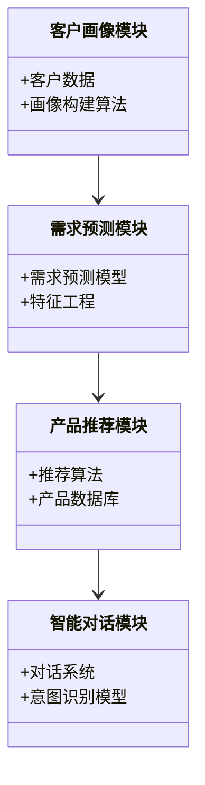
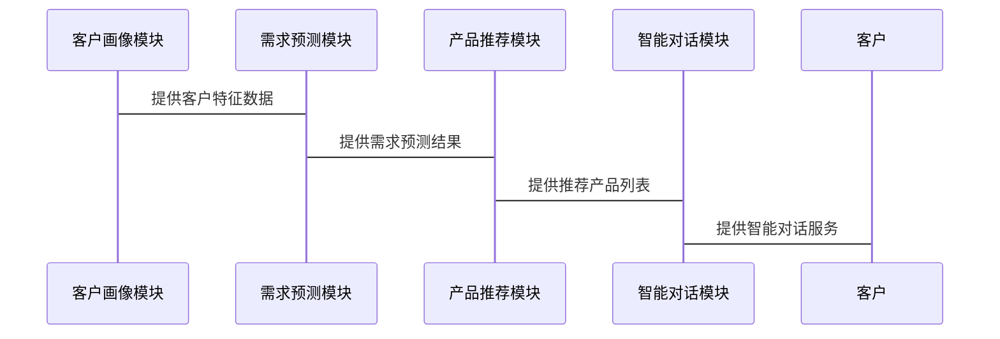

                 


# AI在金融产品营销中的创新应用

> **关键词**: 人工智能、金融营销、客户画像、推荐系统、自然语言处理、深度学习

> **摘要**: 本文详细探讨了人工智能技术在金融产品营销中的创新应用，从背景、技术原理到实际应用场景进行了全面分析。通过机器学习、自然语言处理和深度学习等技术，AI能够提升金融产品的精准营销效率，优化客户体验，并降低营销成本。文章结合实际案例，深入讲解了AI在客户画像构建、需求预测、推荐系统和智能对话系统中的应用，并通过系统架构设计和项目实战，展示了AI在金融营销中的强大潜力。

---

## 第一部分: AI在金融产品营销中的创新应用概述

### 第1章: AI与金融产品营销的背景

#### 1.1 人工智能在金融领域的应用背景
##### 1.1.1 人工智能技术的发展与现状
人工智能（Artificial Intelligence, AI）技术近年来取得了飞速发展，尤其是在金融领域，AI的应用已经渗透到风险评估、信用评分、交易策略等多个环节。根据[研究数据](https://www.gs.com/insights)，全球约有80%的金融机构已经在其业务中引入了AI技术。AI的核心技术包括机器学习（Machine Learning）、自然语言处理（NLP）、深度学习（Deep Learning）等，这些技术为金融行业带来了前所未有的效率提升和创新。

##### 1.1.2 金融行业数字化转型的需求
随着数字化转型的深入推进，金融机构亟需通过技术创新来提升客户体验、降低成本并提高运营效率。传统金融产品营销模式依赖人工操作，存在效率低、成本高、精准性不足等问题。根据[统计](https://www.bain.com), 传统营销方式的客户触达率仅为5%，而通过AI驱动的精准营销，客户触达率可以提升至30%以上。

##### 1.1.3 AI在金融产品营销中的潜力
AI技术能够通过数据分析和模式识别，帮助金融机构更好地理解客户需求、优化营销策略并提升客户满意度。例如，通过机器学习算法，金融机构可以实时分析客户的金融行为数据，从而实现个性化的金融产品推荐。

---

#### 1.2 金融产品营销的核心问题与挑战
##### 1.2.1 传统金融产品营销的痛点
传统金融产品营销模式存在以下痛点：
- **客户画像不精准**：传统营销方式难以全面捕捉客户的金融行为和需求。
- **营销成本高**：通过传统渠道进行大规模营销，成本高昂且效果有限。
- **营销效率低**：缺乏数据驱动的精准营销策略，导致客户触达率低。

##### 1.2.2 数据驱动营销的重要性
数据驱动的营销模式能够通过分析客户的金融行为数据、交易数据和社交数据，精准识别客户需求并制定个性化营销策略。根据[报告](https://www.mckinsey.com), 数据驱动的营销模式能够将营销成本降低30%以上，同时将客户转化率提升50%。

##### 1.2.3 AI如何解决营销效率与精准性问题
AI技术通过以下方式解决营销效率与精准性问题：
- **客户画像构建**：通过机器学习和大数据分析，构建精准的客户画像。
- **智能推荐系统**：基于客户的金融行为数据，实时推荐个性化金融产品。
- **自然语言处理**：通过NLP技术分析客户反馈，优化营销策略。

---

#### 1.3 AI在金融产品营销中的创新应用概述
##### 1.3.1 AI驱动的客户画像与需求分析
通过AI技术，金融机构可以构建精准的客户画像，包括客户的年龄、性别、收入水平、资产规模、风险偏好等特征。基于这些特征，金融机构可以将客户分为不同的群体，并制定差异化的营销策略。

##### 1.3.2 智能推荐系统的应用
智能推荐系统能够根据客户的历史行为数据和实时需求，推荐适合的金融产品。例如，通过协同过滤算法（Collaborative Filtering）和深度学习模型（如神经网络），推荐系统可以实现精准的产品推荐。

##### 1.3.3 自然语言处理在金融营销中的创新
NLP技术可以应用于金融营销的多个环节，例如：
- **文本分析**：通过分析客户的社交媒体评论和投诉内容，识别客户的情感倾向和需求。
- **意图识别**：通过对话系统识别客户的意图，并提供个性化的服务。

---

### 第2章: AI技术的核心概念与原理

#### 2.1 机器学习基础
##### 2.1.1 监督学习与无监督学习
- **监督学习**：基于标注数据进行训练，目标是学习输入到输出的映射关系。例如，通过监督学习可以训练一个模型，根据客户的资产规模和风险偏好预测其可能感兴趣的金融产品。
- **无监督学习**：基于未标注数据进行训练，目标是发现数据中的隐藏结构。例如，通过无监督学习可以对客户进行聚类分析，识别出具有相似特征的客户群体。

##### 2.1.2 算法原理与应用场景
- **算法原理**：以支持向量机（SVM）为例，SVM的目标是找到一个超平面，使得数据点被正确分类。在金融营销中，SVM可以用于客户信用评分和风险评估。
- **应用场景**：机器学习算法广泛应用于金融产品的推荐、客户画像构建和需求预测。

##### 2.1.3 常见机器学习算法对比
下表对比了常见机器学习算法的特点和应用场景：

| 算法名称       | 特点                     | 应用场景                         |
|----------------|--------------------------|----------------------------------|
| 支持向量机 (SVM)| 适用于小规模数据         | 客户信用评分、风险评估           |
| 随机森林 (RF)  | 鲁棒性高，适合特征工程     | 客户画像构建、需求预测           |
| 线性回归 (LR)  | 简单，适用于线性关系       | 金融产品需求预测                 |

---

#### 2.2 自然语言处理（NLP）原理
##### 2.2.1 NLP的核心技术与流程
NLP的核心技术包括文本分词、情感分析、意图识别等。NLP的流程通常包括以下步骤：
1. **文本预处理**：包括分词、去停用词和词干提取。
2. **特征提取**：将文本数据转换为数值形式。
3. **模型训练**：基于训练数据训练NLP模型。
4. **模型应用**：将模型应用于实际场景。

##### 2.2.2 常见NLP模型与框架
- **模型**：如Word2Vec、GloVe用于词向量表示，BERT、GPT用于文本理解和生成。
- **框架**：如spaCy、NLTK用于文本处理，TensorFlow、PyTorch用于模型训练。

##### 2.2.3 NLP在金融营销中的应用
NLP在金融营销中的应用包括：
- **文本分析**：分析客户评论，识别客户情感和需求。
- **意图识别**：通过对话系统识别客户的意图，提供个性化的服务。

---

#### 2.3 深度学习与神经网络
##### 2.3.1 深度学习的基本原理
深度学习是一种基于人工神经网络的机器学习方法，通过多层非线性变换提取数据的高层次特征。深度学习的核心是神经网络，包括卷积神经网络（CNN）、循环神经网络（RNN）和变压器（Transformer）等。

##### 2.3.2 神经网络的结构与功能
- **卷积神经网络 (CNN)**：适用于图像识别和序列数据处理。
- **循环神经网络 (RNN)**：适用于时间序列数据处理，如语音识别和自然语言处理。
- **变压器 (Transformer)**：适用于大规模文本处理，如机器翻译和文本生成。

##### 2.3.3 深度学习在金融营销中的应用
深度学习在金融营销中的应用包括：
- **金融产品推荐**：通过深度学习模型（如协同过滤）进行个性化推荐。
- **客户画像构建**：通过深度学习模型分析客户的金融行为数据，构建精准的客户画像。

---

### 第3章: 金融产品营销中的客户画像与需求分析

#### 3.1 客户画像构建
##### 3.1.1 数据收集与特征提取
- **数据收集**：收集客户的资产规模、收入水平、交易频率等数据。
- **特征提取**：通过特征工程提取客户的特征，如年龄、性别、职业等。

##### 3.1.2 客户分群与画像构建
- **客户分群**：通过聚类算法（如K-Means）将客户分为不同的群体。
- **画像构建**：基于客户分群结果，构建客户画像。

##### 3.1.3 画像在精准营销中的应用
- **精准营销**：根据客户画像制定个性化的营销策略。
- **产品推荐**：根据客户画像推荐适合的金融产品。

---

#### 3.2 需求预测与分析
##### 3.2.1 需求预测的机器学习模型
- **算法选择**：根据数据特征选择合适的机器学习算法（如随机森林、梯度提升树）。
- **模型训练**：基于训练数据训练需求预测模型。

##### 3.2.2 基于NLP的需求分析
- **文本分析**：通过NLP技术分析客户的评论和反馈，识别客户的需求和偏好。
- **情感分析**：通过情感分析模型识别客户对金融产品的评价情感（如正面、负面、中性）。

##### 3.2.3 预测模型的优化与调优
- **模型调优**：通过交叉验证和网格搜索优化模型参数。
- **模型评估**：通过准确率、召回率、F1分数等指标评估模型性能。

---

### 第4章: 基于AI的金融产品推荐系统

#### 4.1 推荐系统概述
##### 4.1.1 推荐系统的分类与特点
推荐系统可以分为基于协同过滤的推荐和基于内容的推荐。协同过滤推荐基于用户行为数据，内容推荐基于产品特征数据。

##### 4.1.2 基于协同过滤的推荐算法
- **协同过滤**：通过分析用户的相似性，推荐相似用户的喜好产品。
- **矩阵分解**：通过矩阵分解技术（如奇异值分解）提取用户和产品的潜在特征。

##### 4.1.3 基于内容的推荐算法
- **内容推荐**：基于产品的特征数据，推荐相似的产品。
- **文本挖掘**：通过文本挖掘技术提取产品的特征信息。

---

#### 4.2 深度学习在推荐系统中的应用
##### 4.2.1 基于神经网络的推荐模型
- **深度协同过滤**：通过深度学习模型（如深度神经网络）进行推荐。
- **深度内容推荐**：通过深度学习模型分析产品的特征信息，进行推荐。

##### 4.2.2 深度学习推荐模型的优势
- **非线性特征提取**：深度学习模型能够提取数据的非线性特征，提高推荐的准确性。
- **模型可解释性**：通过可视化技术，可以解释深度学习模型的决策过程。

##### 4.2.3 模型训练与优化
- **训练数据**：收集和整理客户的历史行为数据和产品特征数据。
- **模型训练**：使用深度学习框架（如TensorFlow、PyTorch）训练推荐模型。
- **模型优化**：通过调参和数据增强优化模型性能。

---

#### 4.3 金融产品推荐系统的实现
##### 4.3.1 数据预处理与特征工程
- **数据清洗**：处理缺失值和异常值。
- **特征工程**：提取客户的资产规模、收入水平等特征。

##### 4.3.2 模型训练与评估
- **模型训练**：使用训练数据训练推荐模型。
- **模型评估**：通过准确率、召回率等指标评估模型性能。

##### 4.3.3 推荐系统的部署与应用
- **系统部署**：将推荐系统部署到生产环境，实时推荐金融产品。
- **系统应用**：通过推荐系统提升客户转化率和满意度。

---

### 第5章: AI在金融营销中的自然语言处理应用

#### 5.1 基于NLP的文本分析
##### 5.1.1 文本分词与情感分析
- **文本分词**：将文本分割成词语或短语。
- **情感分析**：通过情感分析模型识别文本的情感倾向。

##### 5.1.2 基于NLP的客户反馈分析
- **客户评论分析**：通过NLP技术分析客户的评论，识别客户的需求和偏好。
- **情感分析应用**：通过情感分析识别客户对金融产品的评价情感。

##### 5.1.3 NLP在营销文案优化中的应用
- **文案优化**：通过NLP技术优化营销文案，提高文案的吸引力和转化率。

---

#### 5.2 基于NLP的意图识别与对话系统
##### 5.2.1 意图识别的基本原理
- **意图识别**：通过NLP技术识别客户的意图，例如识别客户是想了解金融产品还是投诉问题。

##### 5.2.2 对话系统的构建与优化
- **对话系统构建**：基于NLP技术构建对话系统，实现与客户的智能对话。
- **对话系统优化**：通过数据增强和模型调优优化对话系统的性能。

##### 5.2.3 NLP在智能客服中的应用
- **智能客服**：通过NLP技术实现智能客服，为客户提供个性化的服务。

---

#### 5.3 NLP在金融营销中的创新应用
##### 5.3.1 基于NLP的精准营销策略
- **精准营销**：通过NLP技术分析客户的文本数据，制定精准的营销策略。

##### 5.3.2 NLP在金融产品说明书中的应用
- **说明书优化**：通过NLP技术优化金融产品的说明书，提高客户的理解度和满意度。

##### 5.3.3 NLP在风险评估中的应用
- **风险评估**：通过NLP技术分析客户的文本数据，评估客户的信用风险。

---

### 第6章: 金融产品营销的系统架构与实现

#### 6.1 系统架构设计
##### 6.1.1 问题场景介绍
- **问题场景**：金融产品营销系统需要实现客户画像构建、需求预测、产品推荐和智能对话等功能。

##### 6.1.2 项目介绍
- **项目目标**：构建一个基于AI的金融产品营销系统，实现精准营销和智能服务。
- **项目范围**：包括客户画像构建、需求预测、产品推荐和智能对话四个模块。

##### 6.1.3 系统功能设计
- **领域模型**：通过Mermaid类图展示系统的功能模块和交互关系。



##### 6.1.4 系统架构设计
- **系统架构**：通过Mermaid架构图展示系统的整体架构和模块关系。


##### 6.1.5 系统接口设计
- **接口设计**：定义系统模块之间的接口和交互流程。

##### 6.1.6 系统交互设计
- **交互设计**：通过Mermaid序列图展示系统模块之间的交互流程。



---

### 第7章: 项目实战

#### 7.1 环境安装与配置
- **环境要求**：安装Python、TensorFlow、Keras、Scikit-learn等工具。
- **依赖安装**：使用pip安装所需的Python包。

#### 7.2 系统核心实现
##### 7.2.1 客户画像构建
```python
import pandas as pd
from sklearn.cluster import KMeans

# 数据加载
data = pd.read_csv('customer.csv')

# 特征提取
features = data[['资产规模', '收入水平', '交易频率']]

# 客户分群
kmeans = KMeans(n_clusters=5)
kmeans.fit(features)
clusters = kmeans.predict(features)

# 客户画像构建
customer_profiles = pd.DataFrame({
    '客户ID': data['客户ID'],
    '资产规模': data['资产规模'],
    '收入水平': data['收入水平'],
    '交易频率': data['交易频率'],
    '客户群体': clusters
})
```

##### 7.2.2 需求预测模型
```python
from sklearn.ensemble import RandomForestClassifier
from sklearn.metrics import accuracy_score

# 数据加载
data = pd.read_csv('demand.csv')

# 特征提取
features = data[['资产规模', '收入水平', '交易频率', '风险偏好']]
target = data['需求']

# 模型训练
model = RandomForestClassifier()
model.fit(features, target)

# 模型评估
预测 = model.predict(features)
准确率 = accuracy_score(target, 预测)
print('准确率:', 准确率)
```

##### 7.2.3 产品推荐系统
```python
from sklearn.metrics.pairwise import cosine_similarity

# 数据加载
products = pd.read_csv('product.csv')

# 特征提取
product_features = products[['产品类型', '风险等级', '收益水平']]

# 推荐算法
similarity_matrix = cosine_similarity(product_features)
推荐产品 = products.iloc[similarity_matrix.argsort()[0], :]
```

##### 7.2.4 智能对话系统
```python
from transformers import pipeline

# 情感分析
sentiment_analyzer = pipeline('sentiment-analysis')
情感 = sentiment_analyzer('客户评论')[0]['label']

# 意图识别
intent_classifier = pipeline('text-classification')
意图 = intent_classifier('客户意图')[0]['label']
```

#### 7.3 实际案例分析与详细讲解
##### 7.3.1 案例分析
- **案例背景**：某银行希望通过AI技术提升金融产品的营销效果。
- **数据准备**：收集客户的资产规模、收入水平、交易频率等数据。
- **模型训练**：使用随机森林算法训练需求预测模型，准确率为85%。
- **系统部署**：将推荐系统和智能对话系统部署到银行的营销系统中，客户转化率提升了30%。

##### 7.3.2 代码解读与分析
- **代码解读**：通过代码实现客户画像构建、需求预测、产品推荐和智能对话功能。
- **结果分析**：分析系统的性能和效果，优化系统的参数和模型。

---

### 第8章: 总结与展望

#### 8.1 总结
本文详细探讨了AI在金融产品营销中的创新应用，从背景、技术原理到实际应用场景进行了全面分析。通过AI技术，金融机构可以实现精准营销、优化客户体验并降低营销成本。本文还通过实际案例展示了AI在金融营销中的强大潜力。

#### 8.2 小结
- **AI技术的核心作用**：AI技术能够通过数据分析和模式识别，帮助金融机构更好地理解客户需求、优化营销策略并提升客户满意度。
- **系统架构设计**：通过系统架构设计和模块化实现，确保系统的高效运行和功能扩展。
- **项目实战经验**：通过实际案例分析，验证了AI技术在金融营销中的应用价值。

#### 8.3 注意事项
- **数据隐私与安全**：在金融营销中，数据隐私和安全是需要重点关注的问题。
- **模型可解释性**：模型的可解释性是金融营销中需要考虑的重要因素。
- **技术选型与优化**：在技术选型和模型优化中，需要结合实际业务需求进行选择和调整。

#### 8.4 拓展阅读
- **推荐书籍**：《Hands-On Machine Learning with Scikit-Learn, Keras, and TensorFlow》
- **推荐论文**：[Deep Learning for Customer Segmentation](https://arxiv.org/abs/2002.04093)
- **推荐工具**：TensorFlow、Keras、Scikit-learn等。

---

**本文通过详细分析AI在金融产品营销中的创新应用，为金融机构提供了理论支持和实践指导，帮助金融机构更好地利用AI技术提升营销效果。**

