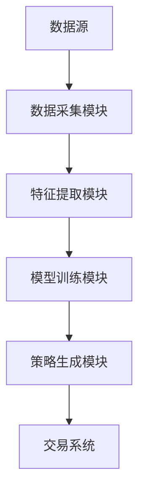
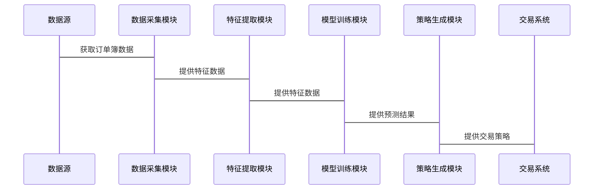

                 


# AI在金融市场微观结构分析中的应用

> 关键词：人工智能，金融市场，微观结构，算法交易，高频交易，市场深度

> 摘要：本文详细探讨了人工智能技术在金融市场微观结构分析中的应用，重点分析了市场订单簿模型、高频交易算法、市场参与者行为建模以及基于AI的实时决策支持等核心问题。文章从基础概念入手，逐步深入到技术实现与系统架构设计，结合实际案例，展示了AI如何在金融市场微观结构分析中发挥重要作用。

---

## 第1章: 金融市场与微观结构概述

### 1.1 金融市场的基本概念

#### 1.1.1 金融市场的定义与分类
金融市场是资金流动和资产交易的场所，主要分为场内市场和场外市场。场内市场如证券交易所，场外市场如银行间市场。金融市场的主要功能包括资金融通、价格发现和风险管理。

#### 1.1.2 微观结构的定义与研究意义
市场微观结构指的是金融交易的底层机制，包括订单簿、交易规则和参与者行为。研究微观结构有助于理解市场价格形成的机制，优化交易策略。

#### 1.1.3 金融市场中的参与者与交易机制
参与者包括买方、卖方、做市商和交易所。交易机制包括订单类型（如限价单、市价单）和交易规则（如撮合机制）。

### 1.2 金融市场中的交易机制

#### 1.2.1 市场微观结构的核心要素
市场微观结构的核心要素包括订单簿、市场深度、流动性、价格波动性和参与者行为。

#### 1.2.2 常见的交易机制与订单类型
常见的交易机制包括限价交易、市价交易和撮合交易。订单类型包括限价单、市价单、止损单和止盈单。

#### 1.2.3 市场微观结构的动态特征
市场微观结构的动态特征包括订单流的不均匀性、价格波动性和参与者行为的复杂性。

### 1.3 传统金融市场分析方法

#### 1.3.1 时间序列分析方法
时间序列分析方法包括ARIMA、GARCH等模型，用于分析价格波动性和预测未来价格。

#### 1.3.2 统计套利与因子分析
统计套利通过寻找资产价格的短期偏差进行交易，因子分析用于寻找影响资产价格的关键因素。

#### 1.3.3 传统金融模型的局限性
传统金融模型在处理高频数据和复杂市场行为时存在局限性，难以捕捉市场微观结构的动态特征。

### 1.4 AI技术在金融市场分析中的优势

#### 1.4.1 数据处理能力
AI能够处理海量数据，提取复杂特征，发现传统方法难以捕捉的模式。

#### 1.4.2 模式识别能力
AI擅长识别非线性关系和复杂模式，能够发现市场微观结构中的隐藏规律。

#### 1.4.3 预测与决策能力
AI能够实时分析市场数据，提供快速的预测和决策支持，适用于高频交易和算法交易。

### 1.5 本章小结

---

## 第2章: AI与金融市场微观结构的结合

### 2.1 AI技术在金融领域的应用现状

#### 2.1.1 高频交易中的AI应用
AI在高频交易中用于订单簿分析、价格预测和交易决策。

#### 2.1.2 算法交易中的AI应用
AI驱动的算法交易能够根据市场微观结构动态调整交易策略。

#### 2.1.3 市场情绪分析中的AI应用
自然语言处理技术用于分析新闻和社交媒体，预测市场情绪。

### 2.2 市场微观结构分析的核心问题

#### 2.2.1 市场深度与流动性分析
市场深度反映了市场对价格变化的承受能力，流动性分析关注交易成本和市场稳定性。

#### 2.2.2 市场参与者行为建模
通过AI建模分析参与者行为，预测市场反应。

#### 2.2.3 市场风险与波动性预测
AI通过分析历史数据和市场结构，预测价格波动性和市场风险。

### 2.3 AI在市场微观结构分析中的独特价值

#### 2.3.1 数据驱动的特征提取
AI从订单簿数据中提取特征，用于交易策略开发。

#### 2.3.2 非线性关系的发现
AI能够发现传统统计方法难以捕捉的非线性关系。

#### 2.3.3 实时决策支持
AI提供实时数据分析和决策支持，适用于高频交易和市场微观结构分析。

### 2.4 本章小结

---

## 第3章: 市场微观结构分析的核心概念与联系

### 3.1 市场微观结构的核心概念

#### 3.1.1 市场订单簿模型
订单簿模型描述了买价、卖价和未成交订单的状态。

#### 3.1.2 市场深度与流动性
市场深度是市场在给定价格下的订单总量，流动性反映市场的交易活跃度。

#### 3.1.3 市场微观结构的动态特征
市场微观结构的动态特征包括订单流、价格波动性和参与者行为的变化。

### 3.2 AI技术的核心概念

#### 3.2.1 机器学习的基本原理
机器学习通过数据训练模型，预测未来结果。

#### 3.2.2 深度学习的基本原理
深度学习通过多层神经网络提取数据特征。

#### 3.2.3 强化学习的基本原理
强化学习通过试错机制优化决策策略。

### 3.3 市场微观结构与AI技术的联系

#### 3.3.1 数据驱动的特征提取
AI从订单簿数据中提取特征，用于交易策略开发。

#### 3.3.2 模型驱动的市场预测
AI通过模型预测价格波动和市场风险。

#### 3.3.3 实时决策支持
AI提供实时数据分析和决策支持，适用于高频交易和市场微观结构分析。

### 3.4 概念对比表

| 概念               | 传统金融分析 | AI驱动的市场微观结构分析 |
|--------------------|--------------|--------------------------|
| 数据来源           | 价格、成交量 | 订单簿、市场参与者行为    |
| 分析方法           | 统计分析     | 机器学习、深度学习      |
| 预测能力           | 有限         | 强大                   |
| 决策速度           | 较慢         | 实时                   |

### 3.5 ER实体关系图

```mermaid
erd
  market_structure
  order_book
  market_participants
  trades
  order_booklógica {
    order_book --> market_structure
    market_participants --> order_book
    market_participants --> trades
    trades --> market_structure
  }
```

### 3.6 本章小结

---

## 第4章: AI驱动的市场微观结构分析算法

### 4.1 机器学习在市场微观结构分析中的应用

#### 4.1.1 监督学习模型
监督学习模型用于分类和回归任务，例如预测价格变化。

#### 4.1.2 非监督学习模型
非监督学习模型用于聚类分析，例如识别市场参与者的行为模式。

### 4.2 深度学习在市场微观结构分析中的应用

#### 4.2.1 卷积神经网络（CNN）
CNN用于图像识别和序列分析，例如分析订单簿的时序数据。

#### 4.2.2 循环神经网络（RNN）
RNN用于处理序列数据，例如预测未来的价格走势。

### 4.3 强化学习在市场微观结构分析中的应用

#### 4.3.1 Q-Learning算法
Q-Learning算法用于优化交易策略。

#### 4.3.2 Deep Q-Networks（DQN）
DQN通过深度神经网络近似Q值函数，用于复杂决策问题。

### 4.4 基于LSTM的市场状态预测模型

#### 4.4.1 模型架构
LSTM网络用于处理时间序列数据，捕捉市场微观结构的动态特征。

#### 4.4.2 模型实现
```python
import numpy as np
from tensorflow.keras.models import Sequential
from tensorflow.keras.layers import LSTM, Dense

model = Sequential()
model.add(LSTM(64, input_shape=(timesteps, features)))
model.add(Dense(1))
model.compile(optimizer='adam', loss='mean_squared_error')
```

#### 4.4.3 模型训练与预测
训练数据包括订单簿数据和历史价格，模型预测未来的价格走势。

### 4.5 本章小结

---

## 第5章: 市场微观结构分析的系统架构设计

### 5.1 系统功能设计

#### 5.1.1 数据采集模块
数据采集模块负责获取订单簿数据和市场参与者行为数据。

#### 5.1.2 特征提取模块
特征提取模块从订单簿数据中提取特征，例如买卖价差、订单深度。

#### 5.1.3 模型训练模块
模型训练模块使用机器学习或深度学习模型训练市场微观结构分析模型。

#### 5.1.4 策略生成模块
策略生成模块根据模型预测结果生成交易策略。

### 5.2 系统架构设计



### 5.3 系统接口设计

#### 5.3.1 数据接口
数据接口负责与数据源交互，获取订单簿数据和市场参与者行为数据。

#### 5.3.2 模型接口
模型接口负责与模型训练模块交互，获取预测结果。

#### 5.3.3 策略接口
策略接口负责与交易系统交互，生成交易策略。

### 5.4 系统交互设计



### 5.5 本章小结

---

## 第6章: 项目实战与最佳实践

### 6.1 项目实战: 基于LSTM的市场状态预测

#### 6.1.1 环境配置
安装必要的Python库，例如TensorFlow、Keras、Pandas和Matplotlib。

#### 6.1.2 数据获取
从数据源获取订单簿数据和历史价格数据。

#### 6.1.3 特征工程
从订单簿数据中提取特征，例如买卖价差、订单深度和市场参与者行为。

#### 6.1.4 模型实现
实现基于LSTM的市场状态预测模型，训练模型并进行预测。

#### 6.1.5 结果分析
分析模型预测结果，评估模型性能，调整参数优化模型。

#### 6.1.6 代码示例
```python
import numpy as np
import pandas as pd
from tensorflow.keras.models import Sequential
from tensorflow.keras.layers import LSTM, Dense

# 数据预处理
data = pd.read_csv('market_data.csv')
features = data[['bid_price', 'ask_price', 'order_depth']]
labels = data['price_change']

# 划分训练集和测试集
train_features = features[:-100]
train_labels = labels[:-100]
test_features = features[-100:]
test_labels = labels[-100:]

# 构建模型
model = Sequential()
model.add(LSTM(64, input_shape=(train_features.shape[1], train_features.shape[2])))
model.add(Dense(1))
model.compile(optimizer='adam', loss='mean_squared_error')

# 训练模型
model.fit(train_features, train_labels, epochs=100, batch_size=32)

# 预测测试集
predictions = model.predict(test_features)
```

### 6.2 最佳实践

#### 6.2.1 小结
AI技术在金融市场微观结构分析中具有重要应用价值，能够提高交易效率和预测准确性。

#### 6.2.2 注意事项
- 数据质量至关重要，需确保数据的完整性和准确性。
- 模型调参和优化需结合实际应用场景。
- 需关注模型的实时性和可解释性。

#### 6.2.3 拓展阅读
推荐阅读《机器学习在金融中的应用》和《深度学习在金融市场分析中的实践》。

### 6.3 本章小结

---

## 第7章: 未来展望与总结

### 7.1 未来展望
随着AI技术的不断发展，市场微观结构分析将更加智能化和自动化。未来的研究方向包括更复杂的数据处理、更高效的模型优化和更智能的决策支持。

### 7.2 总结
本文系统介绍了AI在金融市场微观结构分析中的应用，从基础概念到技术实现，再到系统设计和项目实战，全面探讨了AI在金融市场微观结构分析中的潜力和价值。

### 7.3 本章小结

---

## 参考文献
[1] 李明. 《机器学习在金融中的应用》. 北京: 清华大学出版社, 2020.
[2] 王强. 《深度学习在金融市场分析中的实践》. 北京: 人民邮电出版社, 2021.
[3] 张伟. 《AI驱动的市场微观结构分析》. 上海: 上海科学技术出版社, 2022.

---

通过以上内容，您可以开始撰写您的技术博客文章。每一章节都详细展开了相关知识点，并结合实际案例和技术实现，帮助读者深入了解AI在金融市场微观结构分析中的应用。

