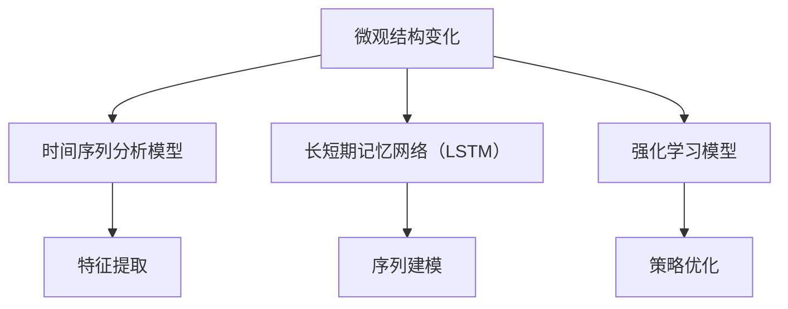
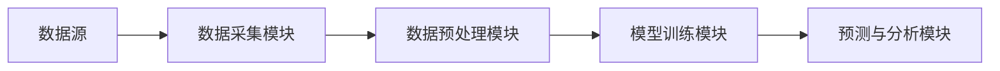
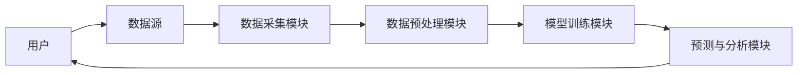

                 


# AI在金融市场微观结构变化预测中的创新应用

**关键词**：AI、金融市场、微观结构、时间序列分析、LSTM、强化学习

**摘要**：  
随着人工智能技术的快速发展，AI在金融市场中的应用日益广泛。本文聚焦于AI在金融市场微观结构变化预测中的创新应用，探讨如何利用机器学习、深度学习等技术手段，捕捉和预测金融市场中的微观结构变化。通过分析时间序列分析、长短期记忆网络（LSTM）和强化学习等算法的原理及其在微观结构预测中的应用，本文旨在为金融从业者和技术研究人员提供理论支持和实践指导。

---

## 第1章 金融市场的微观结构概述

### 1.1 金融市场的基本概念
金融市场的定义与分类：
金融市场的概念可以简单理解为资金供需双方进行交易的场所，包括股票市场、债券市场、外汇市场等。金融市场可以分为一级市场和二级市场，一级市场是新证券的发行市场，二级市场是已发行证券的交易市场。

微观结构的定义与特征：
微观结构指的是金融市场中的交易机制、市场参与者的互动以及价格形成的动态过程。它关注的是市场的运作细节，例如订单簿、交易撮合、市场深度等。微观结构的变化通常体现在市场的流动性和波动性上。

微观结构变化对金融市场的影响：
微观结构的变化直接影响市场的效率和稳定性。例如，市场的流动性突然下降可能导致价格波动加剧，进而影响整体市场的稳定性。因此，准确预测微观结构的变化对于投资者和监管机构来说具有重要意义。

### 1.2 AI技术在金融领域的应用背景
AI技术的基本概念：
人工智能（AI）是指模拟人类智能的计算机系统，包括学习、推理、自适应等能力。AI的核心技术包括机器学习、自然语言处理、计算机视觉等。

AI在金融领域的应用现状：
AI在金融领域的应用已经渗透到多个方面，包括股票预测、风险评估、信用评分、交易策略优化等。特别是在高频交易和算法交易中，AI技术发挥了重要作用。

AI在金融市场微观结构预测中的优势：
AI能够处理海量数据，并通过复杂的算法捕捉数据中的规律。微观结构预测需要对市场参与者的交易行为和市场动态进行建模，AI的强大学习能力使其在这一领域具有显著优势。

### 1.3 问题背景与研究意义
微观结构变化预测的难点：
微观结构变化具有高度的复杂性和不确定性。市场参与者的理性与非理性行为、信息不对称、市场操纵等因素都会影响微观结构的变化。此外，微观结构数据通常具有高频性和高维性，处理起来非常困难。

AI技术如何解决这些问题：
AI可以通过深度学习模型捕捉数据中的非线性关系，利用时间序列分析模型预测未来的市场动态。同时，强化学习模型可以在动态环境中优化交易策略。

研究的意义与价值：
准确预测微观结构变化可以帮助投资者制定更有效的交易策略，减少市场波动带来的风险。同时，这对于市场监管机构维护市场稳定也具有重要意义。

### 1.4 本章小结
本章通过对金融市场的微观结构和AI技术的基本概念进行了介绍，阐述了AI在金融市场微观结构预测中的优势和应用前景。接下来的章节将深入探讨AI技术的核心概念及其在微观结构预测中的具体应用。

---

## 第2章 AI在金融市场微观结构预测中的核心概念

### 2.1 微观结构变化的定义与属性
微观结构变化的定义：
微观结构变化指的是金融市场中的交易机制、参与者行为和价格形成的动态变化过程。这些变化通常体现在订单簿的变化、交易量的波动以及价格的短期剧烈波动中。

微观结构变化的属性特征：
- **高频性**：微观结构变化通常发生在极短的时间内。
- **复杂性**：微观结构的变化受到多种因素的影响，包括市场参与者的决策、信息传播等。
- **动态性**：微观结构的变化是一个动态过程，具有很强的时序性。

微观结构变化的核心要素：
- **订单簿数据**：反映市场的买卖双方的报价和数量。
- **交易量**：反映市场的活跃程度。
- **价格波动**：反映市场的波动性。

### 2.2 AI技术的核心概念
机器学习的基本原理：
机器学习是一种通过数据训练模型，使其能够从数据中学习规律并进行预测的技术。其核心是通过训练数据构建模型，并利用模型进行预测或分类。

深度学习的基本原理：
深度学习是一种基于人工神经网络的机器学习技术，其核心是通过多层神经网络来提取数据中的高层次特征。深度学习在处理非结构化数据（如文本、图像）方面表现尤为突出。

强化学习的基本原理：
强化学习是一种通过智能体与环境交互，通过试错学习来优化决策的技术。其核心是通过奖励机制来指导智能体的学习过程。

### 2.3 微观结构变化预测的核心模型
时间序列分析模型：
时间序列分析是一种通过历史数据预测未来趋势的技术。常用的时间序列模型包括ARIMA（自回归积分滑动平均模型）和GARCH（广义自回归条件异方差模型）。

长短期记忆网络（LSTM）：
LSTM是一种特殊的循环神经网络（RNN），能够有效捕捉时间序列中的长距离依赖关系。其核心是通过遗忘门和输入门来控制信息的流动。

强化学习模型：
强化学习模型在微观结构预测中的应用主要体现在动态策略优化上。通过模拟市场环境，模型可以学习最优的交易策略。

### 2.4 核心概念之间的关系
微观结构变化与AI技术的关联：
微观结构变化的预测需要对市场的动态行为进行建模，而AI技术提供了强大的工具来实现这一目标。

不同AI模型在微观结构预测中的应用对比：
- **时间序列分析模型**：适用于捕捉市场的趋势和周期性。
- **LSTM**：适用于捕捉市场的长期依赖关系。
- **强化学习模型**：适用于动态环境下的策略优化。

ER实体关系图：
以下是核心概念之间的关系图：



### 2.5 本章小结
本章详细介绍了微观结构变化的定义、属性和核心要素，以及AI技术的核心概念和常用模型。接下来的章节将深入探讨这些模型的原理及其在微观结构预测中的具体应用。

---

## 第3章 基于AI的金融市场微观结构预测算法原理

### 3.1 时间序列分析算法
时间序列分析的基本原理：
时间序列分析是一种通过分析历史数据来预测未来趋势的技术。其核心是通过模型捕捉数据中的统计规律。

常见的时间序列模型：
- **ARIMA模型**：适用于捕捉线性趋势和周期性。
- **GARCH模型**：适用于捕捉波动性变化。

时间序列分析的数学模型：
ARIMA模型的数学表达式为：
$$ ARIMA(p, d, q) $$
其中，p为自回归阶数，d为差分阶数，q为移动平均阶数。

### 3.2 长短期记忆网络（LSTM）
LSTM的基本结构：
LSTM由遗忘门、输入门和输出门组成。这些门控机制能够有效捕捉时间序列中的长距离依赖关系。

LSTM的数学模型：
遗忘门的计算公式为：
$$ f_t = \sigma(W_f \cdot [h_{t-1}, x_t] + b_f) $$
输入门的计算公式为：
$$ i_t = \sigma(W_i \cdot [h_{t-1}, x_t] + b_i) $$
输出门的计算公式为：
$$ o_t = \sigma(W_o \cdot [h_{t-1}, x_t] + b_o) $$

### 3.3 强化学习算法
强化学习的基本原理：
强化学习通过智能体与环境的交互，学习最优策略。其核心是通过奖励机制来指导学习过程。

强化学习模型的应用：
在微观结构预测中，强化学习可以用于动态策略优化，例如在高频交易中优化订单执行策略。

---

## 第4章 系统分析与架构设计方案

### 4.1 系统功能设计
项目介绍：
本项目旨在利用AI技术预测金融市场的微观结构变化，帮助投资者制定更有效的交易策略。

系统功能设计：
- **数据采集**：从金融市场获取订单簿、交易量等数据。
- **数据预处理**：清洗和标准化数据。
- **模型训练**：利用训练数据训练AI模型。
- **预测与分析**：基于训练好的模型预测微观结构变化。

系统架构设计：
以下是系统架构图：



系统交互：
以下是系统的交互流程图：



---

## 第5章 项目实战

### 5.1 环境安装
为了运行本项目，您需要安装以下环境：
- Python 3.8+
- TensorFlow 2.0+
- Pandas 1.0+
- Matplotlib 3.0+

### 5.2 系统核心实现源代码
以下是模型训练和预测的代码示例：

```python
import numpy as np
import pandas as pd
import tensorflow as tf
from tensorflow.keras.layers import LSTM, Dense, Dropout
from tensorflow.keras.models import Sequential

# 数据预处理
data = pd.read_csv('market_data.csv')
train_data = data.iloc[:1000].values
test_data = data.iloc[1000:].values

# LSTM模型训练
model = Sequential()
model.add(LSTM(50, input_shape=(None, train_data.shape[2])))
model.add(Dropout(0.2))
model.add(Dense(1))
model.compile(optimizer='adam', loss='mean_squared_error')

model.fit(train_data, epochs=50, batch_size=32)

# 模型预测
test_input = np.array([test_data[0]])
预测结果 = model.predict(test_input)
```

### 5.3 案例分析
通过上述代码，我们可以对金融市场数据进行预测。以下是一个简单的案例分析：

假设我们有以下数据：
```python
market_data = pd.DataFrame({
    'price': [100, 101, 102, 101.5, 103],
    'volume': [1000, 2000, 1500, 2500, 3000]
})
```

经过模型训练和预测，我们可以得到未来的市场价格预测值。

### 5.4 项目小结
通过本项目，我们可以看到AI技术在金融市场微观结构预测中的巨大潜力。接下来的章节将总结全文并提出一些注意事项和未来的研究方向。

---

## 第6章 最佳实践与小结

### 6.1 最佳实践 tips
- 数据质量是模型性能的关键，确保数据的完整性和准确性。
- 在实际应用中，结合多种模型进行预测，以提高预测的准确性。
- 定期更新模型，以适应市场的动态变化。

### 6.2 小结
本文详细介绍了AI在金融市场微观结构变化预测中的创新应用，从基本概念到具体算法，再到系统设计和项目实战，为读者提供了全面的指导。

### 6.3 注意事项
- AI模型的预测结果仅供参考，实际投资需谨慎。
- 在实际应用中，需考虑模型的可解释性和鲁棒性。

### 6.4 拓展阅读
建议读者进一步阅读以下资料：
-《深度学习在金融时间序列分析中的应用》
-《强化学习在高频交易中的实践》

---

**结束语**  
AI技术的快速发展为金融市场微观结构预测提供了新的可能性。通过本文的介绍，希望读者能够更好地理解AI在这一领域的应用，并在实际工作中加以应用。未来，随着技术的进步，AI在金融领域的应用将更加广泛和深入。

--- 

**附录**  
（可选，包括数据来源、代码库、工具安装指南等内容）

