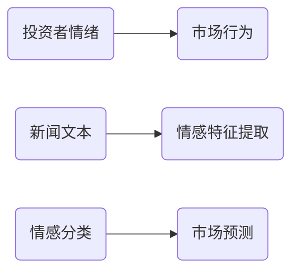
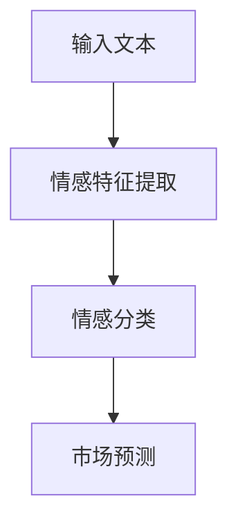
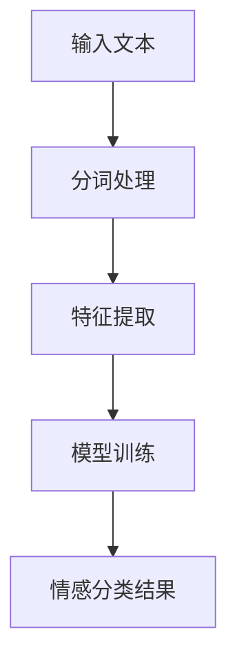
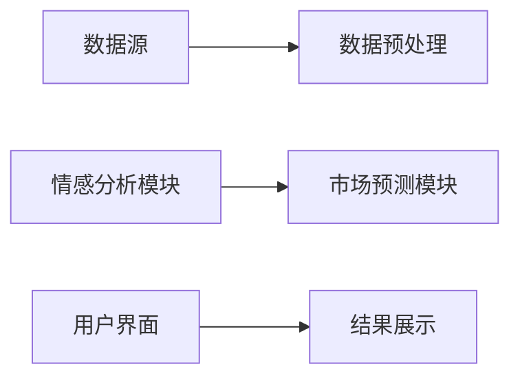

                 


# AI在金融市场情绪分析中的创新应用

> 关键词：AI技术、金融市场、情绪分析、深度学习、自然语言处理

> 摘要：本文探讨了人工智能技术在金融市场情绪分析中的创新应用。首先介绍了情绪分析的基本概念和在金融领域的背景，然后详细分析了基于AI的情绪分析算法，包括文本预处理、特征提取和模型训练等环节。接着设计了一个完整的金融市场情绪分析系统架构，并通过实际案例展示了系统实现和应用效果。最后，总结了当前技术的优势与不足，并展望了未来的发展方向。

---

# 第一部分: 金融市场情绪分析的背景与挑战

## 第1章: 金融市场情绪分析的背景与挑战

### 1.1 情绪分析的定义与背景

#### 1.1.1 情绪分析的基本概念
情绪分析（Sentiment Analysis），又称情感分析，是自然语言处理（NLP）领域的重要任务之一。它旨在通过分析文本内容，判断说话者或作者的情感倾向，通常分为正面、负面和中性三类。

在金融市场中，情绪分析被广泛应用于股票市场预测、新闻分析等领域。投资者的情绪往往会影响市场行为，例如恐慌性抛售或乐观性买入。因此，准确捕捉市场参与者的心理状态，对于投资决策具有重要意义。

#### 1.1.2 金融市场中的情绪分析需求
金融市场是一个高度动态且不确定的环境。投资者的情绪受多种因素影响，包括市场新闻、公司公告、经济指标等。情绪分析可以帮助投资者理解市场参与者的心理变化，从而做出更明智的投资决策。

#### 1.1.3 情绪分析在金融决策中的作用
情绪分析在金融领域的作用可以归纳为以下几个方面：
- **市场预测**：通过分析新闻、社交媒体等文本数据，预测市场走势。
- **风险管理**：识别市场中的负面情绪，提前规避潜在风险。
- **投资策略优化**：根据市场情绪调整投资组合。

### 1.2 AI技术在金融领域的应用现状

#### 1.2.1 AI在金融领域的核心应用
AI技术在金融领域的应用广泛，主要包括：
- **智能投顾**：通过算法为投资者提供个性化的投资建议。
- **风险控制**：利用机器学习模型预测和管理金融风险。
- **高频交易**：通过算法进行快速买卖决策。

#### 1.2.2 情绪分析在金融中的创新应用
情绪分析在金融中的创新应用主要体现在以下几个方面：
- **社交媒体情绪分析**：分析Twitter、Reddit等社交平台上的用户情绪，预测市场走势。
- **新闻情绪分析**：对财经新闻进行情绪分类，辅助投资决策。
- **财报电话会议分析**：分析公司高管的情绪，评估公司前景。

#### 1.2.3 当前技术的局限性与挑战
尽管情绪分析在金融领域的应用取得了显著进展，但仍面临一些挑战：
- **数据质量**：金融市场数据复杂多变，噪声较多，影响模型准确性。
- **模型解释性**：深度学习模型的黑箱特性使得结果难以解释。
- **实时性要求**：金融市场对实时分析有较高要求，这对模型的计算效率提出了挑战。

### 1.3 本章小结

---

# 第二部分: 金融市场情绪分析的核心概念与联系

## 第2章: 金融市场情绪分析的核心概念与联系

### 2.1 情绪分析的核心概念

#### 2.1.1 情感极性分析
情感极性分析是情绪分析的基础任务，旨在判断文本的情感倾向。在金融市场中，情感极性分析常用于分析新闻标题、公司公告等文本的情感倾向。

#### 2.1.2 情感强度分析
情感强度分析是对情感极性强度的量化。例如，将情感强度分为0（完全负面）到1（完全正面）之间。情感强度分析在投资决策中具有重要意义，可以帮助投资者判断市场的热情程度。

#### 2.1.3 情感分类与主题分析
情感分类是将文本分为不同情感类别，如正面、负面和中性。主题分析则是识别文本中的主要主题，帮助投资者理解市场讨论的核心内容。

### 2.2 核心概念的属性特征对比

#### 2.2.1 情感极性与情感强度的对比分析
| 特性    | 情感极性分析            | 情感强度分析            |
|---------|------------------------|------------------------|
| 目标    | 判断情感倾向            | 度量情感强度            |
| 输出    | 正面、负面、中性        | 0到1之间的数值         |
| 应用场景 | 判断整体市场情绪        | 量化市场热情程度        |

#### 2.2.2 情感分类与主题分析的关联性
情感分类和主题分析是互补的。情感分类帮助确定文本的情感倾向，而主题分析则帮助确定文本的主要内容。两者结合可以更全面地理解市场情绪。

#### 2.2.3 情感分析与市场行为的关系
市场行为受多种因素影响，但情绪分析可以帮助识别情绪驱动的市场行为。例如，投资者的乐观情绪可能导致股价上涨，而悲观情绪可能导致股价下跌。

### 2.3 ER实体关系图与Mermaid流程图

#### 2.3.1 实体关系图


#### 2.3.2 流程图


### 2.4 本章小结

---

# 第三部分: 基于AI的情绪分析算法原理

## 第3章: 基于AI的情绪分析算法原理

### 3.1 文本预处理与特征提取

#### 3.1.1 文本清洗与分词
文本清洗包括去除停用词、标点符号等。分词则是将文本分解为有意义的词汇或短语。

#### 3.1.2 词袋模型与词嵌入
词袋模型是一种简单有效的文本表示方法，它将文本表示为词汇的集合。词嵌入（如Word2Vec）则是将词汇表示为低维向量，捕捉词义信息。

#### 3.1.3 情感特征的提取方法
情感特征提取可以通过多种方式实现，例如基于词袋模型、TF-IDF或词嵌入的方法。

### 3.2 情感分类算法

#### 3.2.1 基于传统机器学习的分类算法
传统机器学习算法（如SVM、随机森林）常用于情感分类，尤其是当特征工程较为复杂时。

#### 3.2.2 基于深度学习的分类算法
深度学习模型（如LSTM、Transformer）在情感分类中表现优异，尤其是在处理长文本时。

#### 3.2.3 混合模型的优势与挑战
混合模型结合了传统机器学习和深度学习的优点，但实现复杂度较高。

### 3.3 情感强度预测模型

#### 3.3.1 模型输入与输出
输入：文本内容  
输出：情感强度分数（0到1之间）

#### 3.3.2 情感强度预测的数学模型
情感强度预测可以通过回归模型实现，例如：
$$ y = \beta_0 + \beta_1 x_1 + \beta_2 x_2 + ... + \beta_n x_n $$

#### 3.3.3 模型训练与优化
模型训练可以通过监督学习完成，使用交叉验证优化模型参数。

### 3.4 算法流程图



### 3.5 本章小结

---

# 第四部分: 金融市场情绪分析系统的架构设计

## 第4章: 金融市场情绪分析系统的架构设计

### 4.1 系统功能设计

#### 4.1.1 数据采集模块
负责采集新闻、社交媒体等数据。

#### 4.1.2 情感分析模块
对采集的数据进行情感分析。

#### 4.1.3 市场预测模块
根据情感分析结果，预测市场走势。

### 4.2 系统架构设计

#### 4.2.1 系统架构图


#### 4.2.2 接口设计与交互流程
接口设计包括API接口和用户交互界面。用户可以通过界面输入数据，系统返回分析结果。

### 4.3 本章小结

---

# 第五部分: 项目实战与总结

## 第5章: 项目实战与总结

### 5.1 环境安装与配置
需要安装Python、TensorFlow、自然语言处理库（如NLTK、spaCy）等。

### 5.2 系统核心实现源代码

#### 5.2.1 数据预处理
```python
import nltk
from nltk.corpus import stopwords

def preprocess(text):
    words = nltk.word_tokenize(text.lower())
    words = [word for word in words if word.isalpha()]
    words = [word for word in words if word not in stopwords.words('english')]
    return ' '.join(words)
```

#### 5.2.2 情感分类模型
```python
import tensorflow as tf
from tensorflow.keras import layers

model = tf.keras.Sequential()
model.add(layers.Embedding(input_dim=10000, output_dim=16))
model.add(layers.LSTM(64))
model.add(layers.Dense(3, activation='softmax'))
model.compile(optimizer='adam', loss='sparse_categorical_crossentropy', metrics=['accuracy'])
```

#### 5.2.3 情感强度预测模型
```python
import tensorflow as tf
from tensorflow.keras import layers

model = tf.keras.Sequential()
model.add(layers.Embedding(input_dim=10000, output_dim=16))
model.add(layers.LSTM(64))
model.add(layers.Dense(1))
model.compile(optimizer='adam', loss='mean_squared_error')
```

### 5.3 实际案例分析
通过分析某公司财报电话会议的文本，预测市场情绪，并评估模型的准确性。

### 5.4 项目总结与优化建议
总结项目成果，分析模型的优缺点，并提出优化建议，如引入更复杂的模型或更多的数据。

### 5.5 本章小结

---

# 总结与展望

## 第6章: 总结与展望

### 6.1 本章总结
本文系统地介绍了AI在金融市场情绪分析中的创新应用，涵盖了从算法原理到系统架构设计的全过程。

### 6.2 未来展望
未来，随着AI技术的不断发展，金融市场情绪分析将更加智能化和精准化。深度学习模型的优化、多模态数据的引入以及实时分析能力的提升将是研究的重点。

### 6.3 本章小结

---

通过以上章节的详细讲解，我们全面探讨了AI在金融市场情绪分析中的创新应用。希望本文能够为相关领域的研究者和实践者提供有价值的参考。

