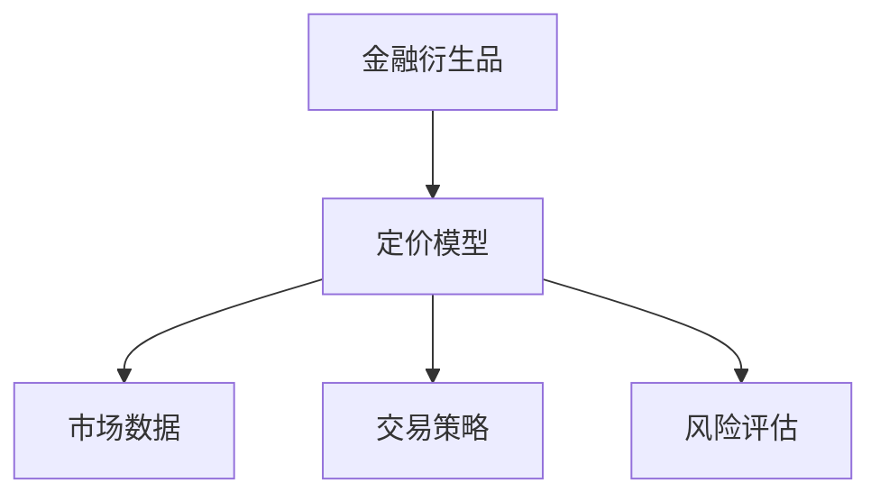
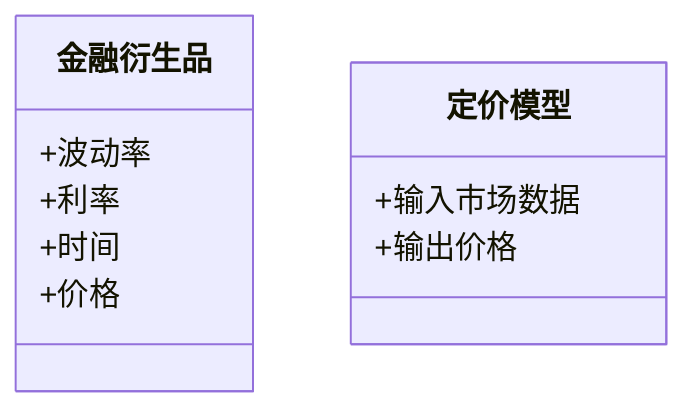
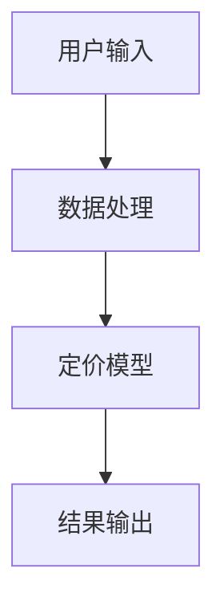

                 


# AI在金融衍生品定价中的创新应用

## 关键词：人工智能、金融衍生品、定价模型、蒙特卡洛模拟、神经网络、深度学习

## 摘要

本文深入探讨了人工智能技术在金融衍生品定价中的创新应用。首先，我们介绍了金融衍生品的基本概念和传统定价方法的局限性。然后，我们分析了AI技术的核心原理及其在金融领域的潜力。接着，我们详细讲解了AI驱动的定价模型，包括机器学习、深度学习和强化学习的应用，并通过实例展示了这些模型如何克服传统方法的不足。我们还探讨了定价算法的实现，包括蒙特卡洛模拟和神经网络模型，并提供了详细的Python代码和数学公式。最后，我们通过一个实战项目，展示了AI在金融衍生品定价中的实际应用，并总结了最佳实践和未来发展方向。

---

# 第1章: AI与金融衍生品定价概述

## 1.1 金融衍生品的基本概念

### 1.1.1 金融衍生品的定义与分类

金融衍生品是一种以金融资产或指数为基础的金融工具，其价值依赖于基础资产的价格波动。常见的金融衍生品包括期权、期货、掉期和远期合约。这些工具可以用于对冲风险、投机或套利。

### 1.1.2 金融衍生品的定价方法

传统金融衍生品的定价方法主要基于随机过程理论和无套利定价原理。例如，Black-Scholes模型是期权定价的经典模型，其假设包括无摩擦市场、连续价格变化和恒定波动率。

### 1.1.3 传统定价模型的局限性

传统定价模型在处理复杂金融工具时存在局限性，例如波动率的非线性特征、参数估计的不准确性以及对市场深度和流动性变化的敏感性。

## 1.2 AI技术的基本概念与特点

### 1.2.1 人工智能的定义与核心算法

人工智能（AI）是指模拟人类智能的计算机系统，核心算法包括机器学习、深度学习和强化学习。机器学习通过训练数据学习模式，深度学习利用多层神经网络提取特征，强化学习通过奖励机制优化决策。

### 1.2.2 深度学习与强化学习的简介

深度学习使用多层神经网络处理复杂数据，强化学习通过与环境交互学习最优策略。这两种技术在金融衍生品定价中的应用潜力巨大。

### 1.2.3 AI在金融领域的应用潜力

AI技术可以提高金融衍生品定价的准确性、效率和鲁棒性，特别是在处理大数据和非线性关系方面具有显著优势。

## 1.3 AI在金融衍生品定价中的创新应用

### 1.3.1 AI驱动的金融衍生品定价优势

AI能够捕捉复杂的市场模式，适应动态市场环境，并提供实时定价支持。

### 1.3.2 当前AI在金融衍生品定价中的应用现状

AI技术在金融衍生品定价中的应用逐步增加，尤其是在高频交易和风险管理领域。

### 1.3.3 未来AI在金融衍生品定价中的发展趋势

未来，AI技术将更加广泛应用于金融衍生品定价，推动金融行业数字化转型。

---

# 第2章: 金融衍生品定价的核心问题与挑战

## 2.1 金融衍生品定价的基本原理

### 2.1.1 无套利定价原理

无套利定价通过构建对冲组合消除风险，确定衍生品的理论价格。

### 2.1.2 随机过程与蒙特卡洛模拟

蒙特卡洛模拟通过随机采样估计概率分布，常用于衍生品定价中的路径模拟。

### 2.1.3 Black-Scholes模型的数学推导

Black-Scholes模型通过偏微分方程求解期权价格，假设无交易成本、无分红和恒定波动率。

## 2.2 传统定价模型的局限性

### 2.2.1 参数估计的不准确性

传统模型依赖于假设参数的准确性，实际市场中参数可能变化较大。

### 2.2.2 市场波动性的非线性特征

传统模型假设波动率为常数，而实际市场波动率可能随价格变化。

### 2.2.3 传统模型对复杂金融工具的处理能力不足

复杂衍生品（如嵌入式期权）的传统定价模型难以准确捕捉其内在价值。

## 2.3 AI在解决定价问题中的优势

### 2.3.1 非线性关系的捕捉能力

AI技术能够捕捉复杂的非线性关系，提高定价模型的准确性。

### 2.3.2 大数据处理能力

AI可以处理大量市场数据，提取潜在特征，优化定价模型。

### 2.3.3 自适应学习能力

AI模型能够实时更新，适应市场变化，提供动态定价支持。

---

# 第3章: AI技术在金融衍生品定价中的核心概念与联系

## 3.1 AI驱动的定价模型原理

### 3.1.1 机器学习模型的输入输出关系

机器学习模型通过输入市场数据，输出预测的衍生品价格。

### 3.1.2 深度学习模型的特征提取能力

深度学习模型自动提取高维特征，捕捉复杂市场模式。

### 3.1.3 强化学习在动态定价中的应用

强化学习通过与市场环境交互，学习最优定价策略。

## 3.2 核心概念对比分析

| 对比维度       | 传统定价模型                     | AI驱动定价模型                     |
|----------------|----------------------------------|------------------------------------|
| 处理能力       | 线性关系                        | 非线性关系                        |
| 参数估计       | 依赖假设参数                   | 自适应学习                        |
| 数据处理能力   | 有限数据                        | 大数据支持                        |

### 3.3 ER实体关系图与流程图



---

# 第4章: 定价算法的实现与优化

## 4.1 蒙特卡洛模拟的实现

### 4.1.1 算法步骤

1. 生成随机数模拟价格路径。
2. 计算每条路径的衍生品价值。
3. 计算期望值作为定价依据。

### 4.1.2 Python代码示例

```python
import numpy as np

def monte_carlo_option pricing(S, K, T, r, sigma, steps=10000):
    np.random.seed(42)
    prices = S * np.exp((r - 0.5 * sigma**2) * T + sigma * np.sqrt(T) * np.random.randn(steps))
    payoff = np.mean(np.maximum(prices - K, 0))
    return payoff
```

### 4.1.3 数学公式

$$ S_T = S_0 \exp\left( (r - \frac{1}{2}\sigma^2)T + \sigma \sqrt{T} Z \right) $$

其中，$Z$为标准正态分布随机数。

## 4.2 神经网络模型的实现

### 4.2.1 网络结构

- 输入层：市场数据（如波动率、利率、时间）
- 隐藏层：多层感知机提取特征
- 输出层：预测价格

### 4.2.2 算法流程

1. 数据预处理：归一化市场数据。
2. 模型训练：使用历史数据训练神经网络。
3. 模型预测：输入当前市场数据，输出预测价格。

### 4.2.3 优缺点对比

| 参数         | 蒙特卡洛模拟                 | 神经网络模型                 |
|--------------|-----------------------------|-----------------------------|
| 优点         | 方法简单，易于实现           | 高精度，捕捉复杂模式         |
| 缺点         | 方差较大，收敛较慢           | 对数据敏感，易过拟合         |

---

# 第5章: 系统架构设计与实现

## 5.1 问题场景介绍

构建一个基于AI的金融衍生品定价系统，实现实时定价和风险评估。

## 5.2 系统功能设计

### 5.2.1 领域模型



### 5.2.2 系统架构图



## 5.3 系统接口设计

### 5.3.1 API接口

- 输入：市场数据（JSON格式）
- 输出：定价结果（JSON格式）

### 5.3.2 交互流程

1. 用户输入市场数据。
2. 系统处理数据并调用定价模型。
3. 系统返回定价结果。

---

# 第6章: 项目实战与案例分析

## 6.1 环境安装

安装Python、TensorFlow和Keras库，配置开发环境。

## 6.2 系统核心实现

### 6.2.1 核心代码

```python
import tensorflow as tf
from tensorflow.keras import layers

model = tf.keras.Sequential([
    layers.Dense(64, activation='relu'),
    layers.Dense(1, activation='linear')
])
model.compile(optimizer='adam', loss='mean_squared_error')
```

### 6.2.2 代码解读

- 使用神经网络模型进行定价，输入市场数据，输出预测价格。

## 6.3 实际案例分析

通过实际市场数据训练模型，验证其定价准确性。

## 6.4 项目小结

AI技术能够显著提高金融衍生品定价的准确性和效率，值得进一步研究和应用。

---

# 第7章: 最佳实践与未来展望

## 7.1 小结

AI技术为金融衍生品定价带来了新的可能性，能够处理复杂问题和提高效率。

## 7.2 建议

在实际应用中，结合传统方法和AI技术，优化定价模型。

## 7.3 注意事项

确保数据质量和模型的可解释性，避免过拟合和黑箱问题。

## 7.4 未来展望

随着AI技术的发展，金融衍生品定价将更加智能化和自动化。

---

# 结语

AI技术正在深刻改变金融衍生品定价的方式，未来将有更多创新应用，推动金融行业的进步。

