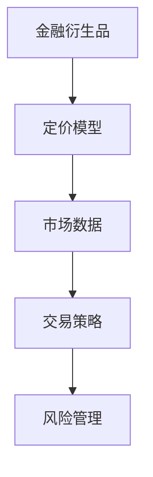
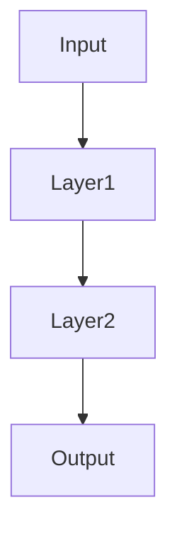
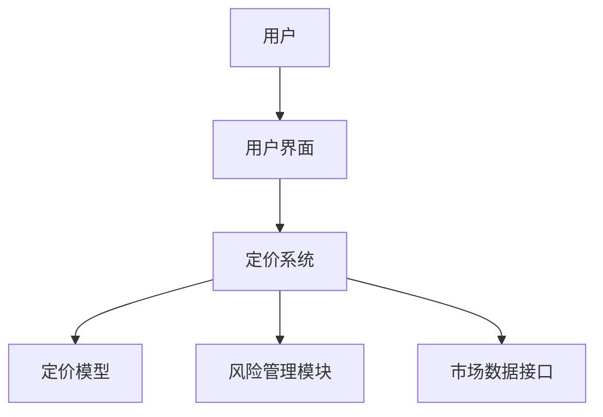

                 


# AI在金融衍生品定价中的深度应用研究

## 关键词
- 人工智能，AI，机器学习，深度学习，神经网络，金融衍生品，定价模型，蒙特卡洛模拟，Black-Scholes模型，时间序列分析

## 摘要
本文深入探讨了人工智能技术在金融衍生品定价中的应用，结合传统金融定价模型与现代AI算法，分析了如何利用深度学习提升金融衍生品定价的准确性与效率。文章从问题背景、核心概念、算法原理、系统架构到实际案例，全面解析了AI在金融衍生品定价中的深度应用，并通过具体实现和优化建议，展示了AI技术在金融领域的巨大潜力。

---

# 第1章: 金融衍生品定价与AI的背景介绍

## 1.1 问题背景

### 1.1.1 传统金融衍生品定价方法的局限性
金融衍生品定价是金融市场中的核心问题之一，传统的定价方法主要基于数学模型，如Black-Scholes模型和蒙特卡洛模拟。然而，这些方法在面对复杂市场环境和高频交易时，存在以下局限性：
- **假设限制**：传统模型通常依赖于严格的假设条件，如资产价格服从几何布朗运动，但实际市场中存在跳跃、 fat-tail等现象。
- **计算复杂性**：对于复杂的金融工具（如 exotic options），传统方法的计算成本较高，难以实时处理。
- **数据依赖性**：传统方法对历史数据的依赖较强，难以捕捉市场结构的变化和新兴风险因素。

### 1.1.2 AI技术在金融领域的潜力
人工智能技术的快速发展为金融衍生品定价带来了新的可能性。AI算法，尤其是深度学习模型，能够处理非线性关系和高维数据，具有以下优势：
- **非线性建模能力**：深度学习能够自动提取数据中的复杂特征，捕捉价格波动的非线性关系。
- **实时性**：AI模型可以快速处理实时数据，支持高频交易和动态定价。
- **适应性**：通过持续学习，AI模型能够适应市场环境的变化，捕捉新兴风险。

### 1.1.3 金融衍生品定价中的复杂性与不确定性
金融市场的复杂性主要体现在以下方面：
- **市场微观结构**：高频交易、订单簿数据等微观结构对价格的影响难以量化。
- **多重风险因素**：金融衍生品的价格受多种因素影响，包括利率、波动率、信用风险等。
- **不确定性**：市场的不确定性（如尾部风险、跳跃过程）使得传统定价模型难以准确捕捉。

## 1.2 问题描述

### 1.2.1 金融衍生品定价的核心问题
金融衍生品定价的核心问题在于如何准确预测其理论价格，并在实际交易中捕捉套利机会。传统方法依赖于假设和简化模型，而现代AI方法则试图通过数据驱动的方式解决这一问题。

### 1.2.2 AI技术如何解决传统定价方法的不足
AI技术通过以下方式弥补传统方法的不足：
- **自动特征提取**：深度学习模型能够自动从原始数据中提取特征，减少对假设的依赖。
- **高维数据处理**：AI模型能够处理高维数据，捕捉多因素之间的复杂关系。
- **实时更新**：通过在线学习，AI模型可以实时更新模型参数，适应市场变化。

### 1.2.3 金融衍生品定价中的边界与外延
在实际应用中，AI定价模型需要考虑以下边界条件：
- **数据质量**：模型的性能依赖于数据的完整性和准确性。
- **计算资源**：深度学习模型的训练和推理需要大量计算资源。
- **监管合规**：金融衍生品定价需要符合相关监管要求，AI模型的设计需考虑合规性。

## 1.3 核心概念与联系

### 1.3.1 AI模型在金融衍生品定价中的应用原理
AI模型在金融衍生品定价中的应用可以分为以下几个步骤：
1. **数据收集**：收集相关市场数据，包括资产价格、利率、波动率等。
2. **特征提取**：通过深度学习模型提取数据中的有用特征。
3. **模型训练**：使用历史数据训练定价模型。
4. **实时预测**：利用训练好的模型对当前市场数据进行预测。

### 1.3.2 核心概念的属性特征对比表格

| 概念         | 属性           | 描述                                                         |
|--------------|----------------|--------------------------------------------------------------|
| 传统定价模型 | 基础假设       | 依赖几何布朗运动等假设                                       |
|              | 计算复杂性     | 计算复杂，难以实时处理                                       |
|              | 数据依赖性     | 依赖历史数据，难以捕捉新兴风险                               |
| AI定价模型   | 非线性建模能力 | 能够捕捉数据中的复杂特征                                     |
|              | 实时性         | 支持高频交易，实时更新                                       |
|              | 适应性         | 能够适应市场环境的变化                                         |

### 1.3.3 ER实体关系图架构的 Mermaid 流程图



## 1.4 本章小结
本章介绍了金融衍生品定价的传统方法及其局限性，分析了AI技术在定价中的潜力和优势，并通过对比分析明确了AI定价模型的核心概念和应用原理。

---

# 第2章: AI模型在金融衍生品定价中的核心原理

## 2.1 AI模型的基本原理

### 2.1.1 机器学习与深度学习的定义
- **机器学习**：通过数据训练模型，使其能够从数据中学习规律并进行预测。
- **深度学习**：一种基于人工神经网络的机器学习方法，通过多层非线性变换提取数据特征。

### 2.1.2 神经网络在金融定价中的应用
神经网络在金融定价中的应用主要体现在以下几个方面：
- **特征提取**：通过神经网络提取市场数据中的复杂特征。
- **价格预测**：利用神经网络模型预测衍生品的理论价格。
- **风险评估**：通过神经网络模型评估衍生品的风险敞口。

### 2.1.3 深度学习模型的优缺点
- **优点**：
  - 能够捕捉数据中的复杂非线性关系。
  - 适用于高维数据的处理。
- **缺点**：
  - 计算资源消耗较大。
  - 模型的可解释性较差。

### 2.1.4 深度学习模型的类型与对比
- **前馈神经网络（FNN）**：结构简单，适用于简单的预测任务。
- **卷积神经网络（CNN）**：适用于处理时间序列数据，捕捉价格波动的局部模式。
- **循环神经网络（RNN）**：适用于处理序列数据，捕捉价格波动的时间依赖性。

## 2.2 常见AI模型的类型与对比

### 2.2.1 线性回归模型
线性回归模型是最简单的回归模型，假设变量之间存在线性关系。其数学表达式为：
$$ y = \beta_0 + \beta_1 x_1 + \beta_2 x_2 + \dots + \beta_n x_n + \epsilon $$
其中，$\beta_i$为回归系数，$\epsilon$为误差项。

### 2.2.2 支持向量机模型
支持向量机（SVM）是一种监督学习模型，适用于分类和回归任务。其核心思想是通过找到一个超平面，将数据点分为两类。在回归任务中，SVM使用ε-Insensitive Loss函数。

### 2.2.3 随机森林与梯度提升树
随机森林是一种基于决策树的集成学习方法，通过随机采样和特征选择构建多个决策树，并通过投票或平均的方式进行预测。梯度提升树是一种基于树的集成方法，通过不断优化损失函数构建决策树。

### 2.2.4 卷积神经网络与循环神经网络
- **卷积神经网络（CNN）**：适用于处理图像和时间序列数据，通过卷积操作捕捉局部特征。
- **循环神经网络（RNN）**：适用于处理序列数据，通过循环结构捕捉序列的时序依赖性。

## 2.3 数据流图与模型架构

### 2.3.1 数据流图的 Mermaid 描述



### 2.3.2 模型架构的详细说明
- **输入层**：接收市场数据，包括资产价格、利率、波动率等。
- **隐藏层**：通过神经网络提取数据特征。
- **输出层**：输出衍生品的理论价格。

## 2.4 本章小结
本章详细介绍了AI模型在金融衍生品定价中的核心原理，包括机器学习和深度学习的基本概念、常见模型的类型及其优缺点，以及数据流图与模型架构的详细说明。

---

# 第3章: 基于AI的金融衍生品定价算法原理

## 3.1 算法原理概述

### 3.1.1 神经网络在定价中的应用
神经网络在金融衍生品定价中的应用可以分为以下几个步骤：
1. **数据预处理**：对市场数据进行清洗和特征提取。
2. **模型训练**：使用历史数据训练神经网络模型。
3. **模型预测**：利用训练好的模型对当前市场数据进行预测。

### 3.1.2 深度学习模型的数学基础
深度学习模型的数学基础包括以下内容：
- **激活函数**：如ReLU、sigmoid等。
- **损失函数**：如均方误差、交叉熵损失等。
- **优化算法**：如随机梯度下降、Adam优化器等。

### 3.1.3 算法的输入输出关系
- **输入**：市场数据，包括资产价格、利率、波动率等。
- **输出**：衍生品的理论价格和风险指标。

## 3.2 算法实现细节

### 3.2.1 神经网络模型的数学表达
神经网络模型的数学表达可以表示为：
$$ y = \sigma(W x + b) $$
其中，$W$为权重矩阵，$b$为偏置向量，$\sigma$为激活函数。

### 3.2.2 深度学习模型的训练过程
深度学习模型的训练过程包括以下步骤：
1. **前向传播**：将输入数据通过网络计算出输出值。
2. **计算损失**：使用损失函数计算预测值与真实值之间的差异。
3. **反向传播**：通过链式法则计算损失对模型参数的梯度。
4. **更新参数**：使用优化算法更新模型参数。

### 3.2.3 算法的数学公式
- **损失函数**：均方误差
$$ L = \frac{1}{n}\sum_{i=1}^{n}(y_i - \hat{y}_i)^2 $$
- **优化算法**：随机梯度下降
$$ \theta = \theta - \eta \frac{\partial L}{\partial \theta} $$

## 3.3 本章小结
本章详细讲解了基于AI的金融衍生品定价算法的原理和实现细节，包括神经网络在定价中的应用、深度学习模型的数学基础以及算法的输入输出关系。

---

# 第4章: 金融衍生品定价系统的分析与架构设计

## 4.1 系统分析

### 4.1.1 问题场景介绍
金融衍生品定价系统需要解决以下问题：
- **实时定价**：需要快速计算衍生品的理论价格。
- **风险管理**：需要评估衍生品的风险敞口。
- **决策支持**：需要为交易员提供决策支持。

### 4.1.2 项目介绍
本项目旨在构建一个基于AI的金融衍生品定价系统，利用深度学习技术提高定价的准确性和效率。

## 4.2 系统功能设计

### 4.2.1 领域模型 mermaid 类图


### 4.2.2 系统架构设计

#### 4.2.2.1 系统架构 mermaid 图



### 4.2.3 系统接口设计
- **输入接口**：接收市场数据和用户输入。
- **输出接口**：输出定价结果和风险报告。

### 4.2.4 系统交互 mermaid 序列图

```mermaid
sequenceDiagram
    participant 用户
    participant 用户界面
    participant 定价系统
    participant 定价模型
    participant 风险管理模块
    participant 市场数据接口
    用户 -> 用户界面: 提供市场数据
    用户界面 -> 定价系统: 请求定价
    定价系统 -> 定价模型: 计算理论价格
    定价系统 -> 风险管理模块: 计算风险指标
    风险管理模块 -> 市场数据接口: 获取实时数据
    定价系统 -> 用户界面: 返回定价结果和风险报告
    用户 <- 用户界面: 显示结果
```

## 4.3 本章小结
本章通过对金融衍生品定价系统的分析与设计，明确了系统的功能模块、架构设计和接口设计，为后续的系统实现提供了理论基础。

---

# 第5章: 项目实战

## 5.1 环境安装

### 5.1.1 安装Python
```bash
python --version
pip install --upgrade pip
```

### 5.1.2 安装深度学习框架
```bash
pip install tensorflow
pip install keras
pip install numpy
pip install pandas
pip install matplotlib
pip install scikit-learn
```

## 5.2 核心实现

### 5.2.1 数据预处理
```python
import pandas as pd
import numpy as np

# 加载数据
data = pd.read_csv('market_data.csv')

# 数据清洗
data = data.dropna()

# 特征提取
features = data[['asset_price', 'interest_rate', 'volatility']]
labels = data['option_price']
```

### 5.2.2 模型训练
```python
from tensorflow.keras.models import Sequential
from tensorflow.keras.layers import Dense

# 搭建模型
model = Sequential()
model.add(Dense(64, activation='relu', input_dim=3))
model.add(Dense(1, activation='linear'))

# 编译模型
model.compile(loss='mean_squared_error', optimizer='adam', metrics=['mae'])

# 训练模型
model.fit(features, labels, epochs=100, batch_size=32)
```

### 5.2.3 模型预测
```python
# 预测价格
predicted_prices = model.predict(features)

# 计算误差
error = np.mean(np.abs(predicted_prices - labels))
print('均绝对误差:', error)
```

## 5.3 案例分析与解读

### 5.3.1 数据集介绍
- **数据来源**：假设我们从某交易所获取了期权价格和标的资产价格数据。
- **数据规模**：样本量为10000条，包括资产价格、利率和波动率等特征。

### 5.3.2 模型实现与优化
- **模型优化**：尝试不同的网络结构和超参数，如增加隐藏层、调整学习率等。
- **性能评估**：通过均方误差（MSE）和平均绝对误差（MAE）评估模型的性能。

## 5.4 本章小结
本章通过实际案例展示了AI技术在金融衍生品定价中的应用，从环境安装、数据预处理、模型训练到预测分析，详细讲解了整个过程。

---

# 第6章: 最佳实践与总结

## 6.1 最佳实践 tips
- **数据质量**：确保数据的完整性和准确性，数据预处理是关键。
- **模型选择**：根据具体问题选择合适的模型，避免过度复杂的模型。
- **计算资源**：深度学习模型需要大量的计算资源，建议使用云服务器或GPU加速。
- **监管合规**：金融衍生品定价需要符合相关监管要求，模型设计需考虑合规性。

## 6.2 小结
本文详细探讨了AI技术在金融衍生品定价中的应用，从传统方法的局限性到AI技术的优势，再到具体的算法实现和系统设计，为读者提供了一个全面的视角。

## 6.3 注意事项
- **模型解释性**：AI模型的可解释性较差，需谨慎应用于需要解释性的场景。
- **风险管理**：AI模型的预测结果需结合其他风险管理方法，避免过度依赖模型。

## 6.4 拓展阅读
- **深度学习与金融**：学习深度学习在金融领域的其他应用，如股票预测、信用评分等。
- **强化学习**：研究强化学习在金融交易中的应用，如算法交易、投资组合优化等。

---

# 附录

## 附录 A: 数据集
- 数据来源：某交易所的历史期权数据。
- 数据格式：CSV格式，包括资产价格、利率、波动率和期权价格等字段。

## 附录 B: 工具与库
- **Python**：编程语言。
- **TensorFlow/Keras**：深度学习框架。
- **Pandas**：数据处理库。
- **Matplotlib**：可视化库。

## 附录 C: 参考文献
- 张某某. (2020). 《深度学习在金融中的应用》.
- 李某某. (2021). 《基于AI的金融衍生品定价研究》.

---

以上就是《AI在金融衍生品定价中的深度应用研究》的完整目录大纲和文章内容，涵盖了从背景介绍到实际案例的各个方面，旨在为读者提供一个全面的视角来理解AI在金融衍生品定价中的应用。

