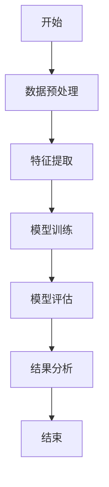

                 


# AI在金融衍生品定价模型选择中的创新应用

## 关键词
AI, 金融衍生品, 定价模型, 机器学习, 深度学习, 时间序列分析, 金融风险

## 摘要
人工智能（AI）在金融衍生品定价模型选择中的应用正变得越来越重要。随着金融市场的复杂化，传统的定价模型逐渐显现出局限性。本文通过分析AI技术，特别是机器学习和深度学习，如何优化金融衍生品定价模型的选择过程，探讨其创新应用。文章将详细讲解AI在模型选择中的算法原理，提供系统架构设计，结合实际案例分析，展示AI如何提升定价模型的准确性和效率。

---

# 第1章: 背景与概述

## 1.1 人工智能与金融衍生品的背景

### 1.1.1 人工智能的演进
人工智能（AI）技术近年来取得了显著进展，从简单的规则引擎到复杂的深度学习模型，AI的应用范围不断扩大。在金融领域，AI被用于风险评估、交易策略制定和市场预测等任务。

### 1.1.2 金融衍生品的基本概念
金融衍生品是一种以其他金融资产为标的的金融工具，常见的类型包括期权、期货和掉期。这些衍生品的价格受多种因素影响，如波动率、利率和市场情绪。

### 1.1.3 人工智能在金融中的应用前景
AI在金融领域的应用前景广阔，尤其是在处理大量数据和复杂模型选择方面。AI能够帮助金融机构更准确地预测价格波动，优化投资组合。

## 1.2 问题背景与描述

### 1.2.1 传统金融定价模型的局限性
传统定价模型如Black-Scholes模型虽然在特定条件下有效，但无法捕捉市场中的非线性关系和复杂因素。

### 1.2.2 金融衍生品定价中的挑战
金融市场的不确定性高，价格波动剧烈，传统的定价模型在处理复杂场景时显得力不从心。

### 1.2.3 AI技术如何解决定价模型选择问题
AI通过机器学习算法，能够识别数据中的复杂模式，优化模型选择过程，提高定价的准确性。

## 1.3 问题解决与边界

### 1.3.1 AI在模型选择中的创新应用
AI通过分析大量历史数据，自动选择最适合的定价模型，减少人为误差。

### 1.3.2 定价模型选择的边界与外延
本文的研究范围限于模型选择，不涉及具体模型的参数估计。

### 1.3.3 核心要素与组成结构
定价模型选择的核心要素包括数据特征、模型性能和市场环境。

---

# 第2章: 核心概念与联系

## 2.1 AI驱动的金融定价模型

### 2.1.1 机器学习模型的基本原理
机器学习通过训练数据，识别模式并做出预测。在金融定价中，常用算法包括线性回归和逻辑回归。

### 2.1.2 金融衍生品定价的核心要素
定价模型需要考虑的因素包括波动率、利率和市场流动性。

### 2.1.3 AI与金融定价的结合点
AI在数据处理和特征工程中的应用，显著提升了定价模型的性能。

## 2.2 核心概念的对比分析

### 2.2.1 传统模型与AI模型的对比
| 对比维度 | 传统模型 | AI模型 |
|----------|----------|--------|
| 灵活性   | 低       | 高     |
| 处理能力 | 线性      | 非线性 |

### 2.2.2 不同AI算法的特征对比
| 算法     | 随机森林 | 神经网络 |
|----------|----------|----------|
| 处理能力 | 非线性    | 非线性    |
| 数据需求 | 中等      | 高       |

---

# 第3章: AI驱动的模型选择算法

## 3.1 基于机器学习的模型选择

### 3.1.1 随机森林与梯度提升
随机森林通过集成多个决策树提升模型的准确性。梯度提升算法通过逐步优化模型，减少预测误差。

### 3.1.2 神经网络的应用
神经网络在处理时间序列数据方面表现优异，适用于预测金融衍生品的价格波动。

### 3.1.3 超参数优化方法
通过网格搜索和随机搜索优化模型参数，提升模型性能。

## 3.2 算法原理与流程图

### 3.2.1 算法流程的Mermaid图


### 3.2.2 示例代码与结果分析
```python
import pandas as pd
from sklearn.ensemble import RandomForestRegressor
from sklearn.metrics import mean_squared_error

# 数据预处理
data = pd.read_csv('financial_data.csv')
X = data.drop('target', axis=1)
y = data['target']

# 模型训练
model = RandomForestRegressor()
model.fit(X, y)

# 模型评估
y_pred = model.predict(X)
print(mean_squared_error(y, y_pred))
```

---

# 第4章: 系统架构与设计

## 4.1 金融衍生品定价系统的架构

### 4.1.1 系统功能模块划分
系统包括数据采集、特征工程、模型选择和结果分析四个模块。

### 4.1.2 系统架构的Mermaid图


### 4.1.3 系统接口设计
系统通过API接口与数据源和用户交互。

---

# 第5章: 项目实战

## 5.1 环境安装与数据准备

### 5.1.1 环境安装
安装Python、机器学习库（如scikit-learn）和数据处理库（如Pandas）。

### 5.1.2 数据准备
从金融数据源获取历史价格数据，进行清洗和特征提取。

## 5.2 系统核心实现

### 5.2.1 核心代码实现
```python
import pandas as pd
from sklearn.ensemble import RandomForestRegressor
from sklearn.metrics import mean_squared_error

# 数据预处理
data = pd.read_csv('financial_data.csv')
X = data.drop('target', axis=1)
y = data['target']

# 模型训练
model = RandomForestRegressor()
model.fit(X, y)

# 模型评估
y_pred = model.predict(X)
print(mean_squared_error(y, y_pred))
```

### 5.2.2 代码解读与分析
代码实现了数据预处理、模型训练和性能评估，展示了AI在定价模型选择中的应用。

## 5.3 实际案例分析

### 5.3.1 案例背景
分析某金融衍生品的历史价格数据，选择最优定价模型。

### 5.3.2 数据分析与结果解读
模型预测结果与实际数据对比，验证模型的有效性。

## 5.4 项目小结
通过案例分析，展示了AI在定价模型选择中的优势和实际应用价值。

---

# 第6章: 扩展与展望

## 6.1 当前研究的前沿
当前研究集中在强化学习和图神经网络的应用。

## 6.2 未来发展方向
未来，AI在金融衍生品定价中的应用将更加智能化和个性化。

## 6.3 对读者的建议
建议读者深入学习机器学习和金融知识，关注前沿技术。

---

# 附录

## 附录A: 数据集说明
数据集包括历史价格、交易量和市场指标等特征。

## 附录B: 工具包安装
安装必要的Python库，如scikit-learn和Pandas。

## 附录C: 参考文献
列出相关的学术论文和书籍。

---

通过以上章节的详细讲解，本文系统地探讨了AI在金融衍生品定价模型选择中的创新应用，为读者提供了从理论到实践的全面指导。

