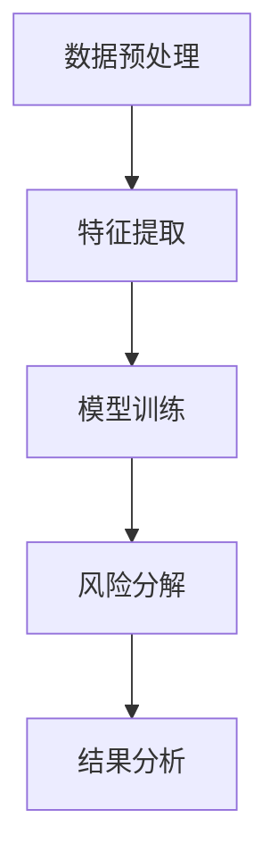
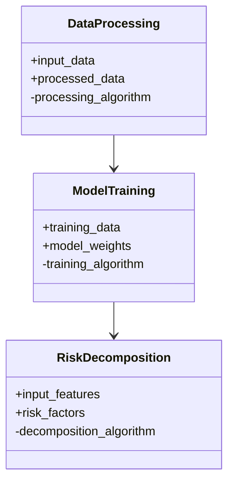
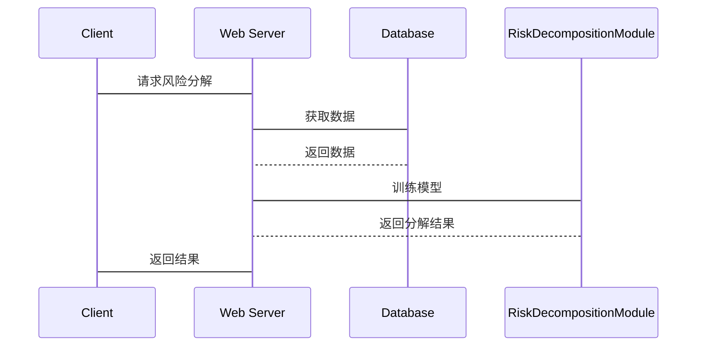

                 


# AI在金融衍生品组合风险分解中的创新应用

**关键词：** AI，金融衍生品，风险分解，机器学习，深度学习

**摘要：**  
本文深入探讨了人工智能（AI）在金融衍生品组合风险分解中的创新应用。通过分析传统风险分解方法的局限性，结合现代AI技术，如机器学习和深度学习，提出了一种基于AI的新型风险分解框架。本文详细介绍了AI算法的原理、系统架构设计以及实际应用场景，展示了AI如何提升金融衍生品组合风险分解的效率和准确性。

---

# 第1章: 背景与问题背景

## 1.1 金融衍生品的基本概念

### 1.1.1 金融衍生品的定义与分类
金融衍生品是一种金融合约，其价值取决于基础资产（如股票、债券、商品等）的价格变动。常见的金融衍生品包括期权、期货、掉期和互换等。根据交易场所的不同，金融衍生品可以分为场内交易和场外交易两类。

### 1.1.2 金融衍生品的风险特征
金融衍生品的风险主要体现在价格波动性、流动性风险和信用风险等方面。由于衍生品的杠杆效应和复杂性，其风险管理尤为重要。

### 1.1.3 传统风险分解方法的局限性
传统的风险分解方法，如VaR（Value at Risk）和CVaR（Conditional Value at Risk），在处理复杂金融衍生品组合时存在以下问题：
- **数据依赖性过强**：传统方法需要大量历史数据，但金融市场的非平稳性和极端事件的稀少性导致数据不足。
- **计算复杂性**：复杂衍生品的定价和风险计算需要大量计算资源。
- **模型假设的限制**：传统方法通常基于假设（如正态分布）来简化问题，而实际市场中存在“肥尾”现象和非线性关系。

---

## 1.2 AI技术在金融领域的应用现状

### 1.2.1 AI在金融分析中的应用领域
AI技术在金融领域的应用涵盖股票预测、信用评分、交易策略优化、市场情绪分析等多个领域。特别是在高频交易和算法交易中，AI技术已经显示出强大的优势。

### 1.2.2 AI在风险控制中的优势
AI技术通过处理非结构化数据（如新闻、社交媒体）和结构化数据，能够捕捉市场中的细微波动，提供更精准的风险评估和预测能力。

### 1.2.3 金融衍生品组合风险分解的挑战
金融衍生品组合的风险分解需要考虑多个因素，如市场波动、流动性风险、信用风险等。传统的线性模型难以捕捉复杂的非线性关系，而AI技术可以通过深度学习模型（如LSTM和Transformer）捕捉这些复杂关系。

---

## 1.3 本章小结

本章首先介绍了金融衍生品的基本概念和风险特征，然后分析了传统风险分解方法的局限性。接着，探讨了AI技术在金融领域的应用现状及其在风险控制中的优势。最后，指出了金融衍生品组合风险分解面临的挑战和AI技术的潜在价值。

---

# 第2章: 核心概念与理论基础

## 2.1 风险分解的基本原理

### 2.1.1 风险分解的定义与目标
风险分解旨在将组合资产的总体风险分解为各个资产或风险因子的贡献。通过风险分解，投资者可以更好地理解组合风险的来源，并制定有效的风险管理策略。

### 2.1.2 风险分解的数学模型
风险分解的数学模型通常基于协方差矩阵或资本资产定价模型（CAPM）。然而，这些模型在处理复杂金融衍生品时存在局限性，难以捕捉非线性关系和高阶矩特征。

### 2.1.3 风险分解的步骤与方法
风险分解的步骤通常包括数据收集、模型选择、参数估计和结果分析等。

---

## 2.2 AI在风险分解中的应用

### 2.2.1 AI算法在风险分解中的作用
AI算法（如神经网络、LSTM和随机森林）可以处理复杂的非线性关系，提高风险分解的精度和效率。

### 2.2.2 AI与传统风险分解方法的对比
通过对比分析，AI方法在处理复杂数据和捕捉市场动态方面具有显著优势，尤其是在高频交易和极端市场条件下表现更为突出。

### 2.2.3 AI在金融衍生品组合中的创新应用
本文提出了一种基于深度学习的金融衍生品组合风险分解框架，通过神经网络模型捕捉复杂的风险因子之间的关系。

---

## 2.3 核心概念的关系与对比

### 2.3.1 核心概念属性对比表格

| **概念**       | **传统方法**             | **AI方法**               |
|----------------|--------------------------|--------------------------|
| 数据需求       | 高，依赖历史数据         | 较低，可处理实时数据       |
| 模型复杂性     | 简单，基于线性假设       | 复杂，可捕捉非线性关系     |
| 处理能力       | 低效，计算资源需求高     | 高效，支持并行计算         |

### 2.3.2 ER实体关系图架构

```mermaid
erDiagram
    customer[客户] {
        <属性>
        id : integer
        name : string
        }
    portfolio[投资组合] {
        <属性>
        id : integer
        name : string
        }
    risk_factor[风险因子] {
        <属性>
        id : integer
        name : string
        }
    }
    customer --> portfolio : 拥有
    portfolio --> risk_factor : 包含
```

---

## 2.4 本章小结

本章详细介绍了风险分解的基本原理和AI在其中的应用。通过对比分析，展示了AI方法在处理复杂金融衍生品组合风险分解中的优势。最后，提出了基于深度学习的创新应用框架。

---

# 第3章: AI算法原理与数学模型

## 3.1 算法原理

### 3.1.1 基于LSTM的风险分解模型
LSTM（长短期记忆网络）是一种时间序列模型，能够捕捉金融数据中的时间依赖性和模式。

### 3.1.2 基于随机森林的风险分解方法
随机森林是一种基于决策树的集成学习方法，适用于处理高维数据和非线性关系。

### 3.1.3 算法的优缺点分析
LSTM的优势在于处理时间序列数据，但训练复杂度较高；随机森林的优势在于计算效率高，但对非线性关系的捕捉能力较弱。

---

## 3.2 数学模型与公式

### 3.2.1 风险分解的数学模型
假设我们有 $n$ 个资产，每个资产的风险贡献可以表示为：
$$
r_i = \alpha + \beta x_i + \epsilon_i
$$
其中，$\alpha$ 是截距，$\beta$ 是回归系数，$x_i$ 是风险因子，$\epsilon_i$ 是误差项。

### 3.2.2 基于AI的数学公式
LSTM的损失函数可以表示为：
$$
L = -\frac{1}{N}\sum_{i=1}^{N} \left[ y_i \log p(y_i) + (1 - y_i) \log (1 - p(y_i)) \right]
$$
其中，$y_i$ 是真实标签，$p(y_i)$ 是模型预测的概率。

---

## 3.3 算法实现与代码示例

### 3.3.1 算法流程图（mermaid）



### 3.3.2 Python源代码实现

```python
import numpy as np
import pandas as pd
from sklearn.ensemble import RandomForestRegressor

# 数据预处理
data = pd.read_csv('derivative_data.csv')
X = data.iloc[:, :-1].values
y = data.iloc[:, -1].values

# 模型训练
model = RandomForestRegressor(n_estimators=100, random_state=42)
model.fit(X, y)

# 风险分解
importances = model.feature_importances_
feature_names = data.columns[:-1]
feature_importance = dict(zip(feature_names, importances))

print(feature_importance)
```

---

## 3.4 本章小结

本章详细介绍了AI算法的原理和数学模型，并通过代码示例展示了如何实现基于随机森林的风险分解模型。最后，通过流程图和代码示例，展示了AI算法在金融衍生品风险分解中的具体实现步骤。

---

# 第4章: 系统分析与架构设计

## 4.1 系统分析

### 4.1.1 问题场景介绍
金融衍生品组合风险分解系统需要处理大量的实时数据，包括价格、波动率、市场情绪等。

### 4.1.2 项目目标与范围
本项目的目标是开发一个基于AI的金融衍生品组合风险分解系统，实现对复杂金融衍生品组合的风险分解和预测。

### 4.1.3 系统架构

---

## 4.2 系统功能设计

### 4.2.1 领域模型（mermaid类图）



### 4.2.2 系统架构设计（mermaid架构图）


### 4.2.3 系统接口设计
系统接口包括数据接口、模型接口和结果接口。数据接口用于获取实时数据，模型接口用于训练和预测，结果接口用于输出风险分解结果。

### 4.2.4 系统交互（mermaid序列图）



---

## 4.3 本章小结

本章详细介绍了金融衍生品组合风险分解系统的架构设计，包括功能模块、系统交互和接口设计。通过mermaid图展示了系统的整体架构和模块之间的关系。

---

# 第5章: 项目实战

## 5.1 环境配置

### 5.1.1 数据获取
使用Python的`pandas`和`requests`库获取金融衍生品数据。

### 5.1.2 环境安装
安装必要的Python包，如`numpy`、`pandas`、`scikit-learn`和`keras`。

---

## 5.2 系统核心实现源代码

### 5.2.1 数据预处理代码

```python
import pandas as pd
import numpy as np

# 数据加载
data = pd.read_csv('derivative_data.csv')

# 数据清洗
data.dropna(inplace=True)
data = data[~data.isin([np.nan, np.inf, -np.inf]).any(axis=1)]

# 特征工程
data['returns'] = data['price'].pct_change()
data['volatility'] = data['returns'].rolling(20).std()
```

### 5.2.2 风险分解代码

```python
from sklearn.ensemble import RandomForestRegressor

# 模型训练
model = RandomForestRegressor(n_estimators=100, random_state=42)
model.fit(X, y)

# 风险分解
importances = model.feature_importances_
feature_names = data.columns[:-1]
feature_importance = dict(zip(feature_names, importances))
```

---

## 5.3 代码功能与实现细节

### 5.3.1 数据预处理
数据预处理包括数据清洗和特征工程，旨在提高模型的准确性和鲁棒性。

### 5.3.2 模型训练
使用随机森林模型进行训练，提取特征的重要性，从而实现风险分解。

---

## 5.4 实际案例分析与详细解读

### 5.4.1 案例分析
假设我们有一个包含股票期权和股指期货的投资组合，我们可以通过AI模型分解每个资产的风险贡献。

### 5.4.2 结果分析
通过模型输出的风险分解结果，我们可以识别出哪些资产对组合风险的贡献最大，并制定相应的风险管理策略。

---

## 5.5 本章小结

本章通过一个实际案例展示了AI在金融衍生品组合风险分解中的应用。通过代码实现和结果分析，验证了AI方法的有效性和优势。

---

# 第6章: 最佳实践与小结

## 6.1 最佳实践

### 6.1.1 数据质量管理
确保数据的完整性和准确性是AI模型成功的关键。

### 6.1.2 模型调优
通过超参数优化和模型集成方法，可以进一步提高模型的性能。

### 6.1.3 模型解释性
在金融领域，模型的解释性非常重要，需要通过特征重要性分析等方法提高模型的透明度。

---

## 6.2 小结

本文深入探讨了AI在金融衍生品组合风险分解中的创新应用，提出了基于深度学习的新型风险分解框架，并通过实际案例验证了其有效性。未来，随着AI技术的不断发展，金融衍生品组合风险分解将更加精准和高效。

---

# 附录

## 附录A: 数据来源

- 数据来源：金融衍生品数据可以从Yahoo Finance、 Bloomberg等平台获取。

## 附录B: 代码仓库

- 代码仓库：GitHub仓库链接（例如：https://github.com/username/financial-derivative-risk-decomposition）

---

**全文完**

---

通过本文的详细分析和步骤说明，读者可以全面了解AI在金融衍生品组合风险分解中的创新应用，并能够根据本文提供的方法和代码实现类似的功能。

